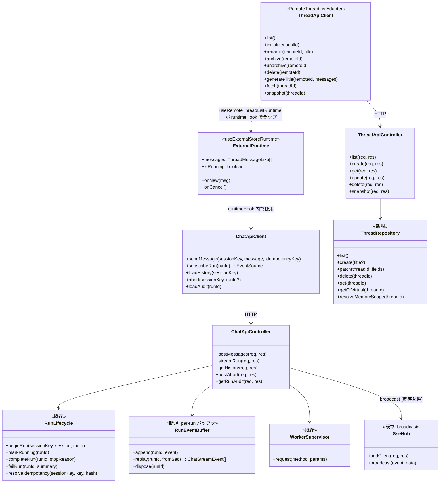
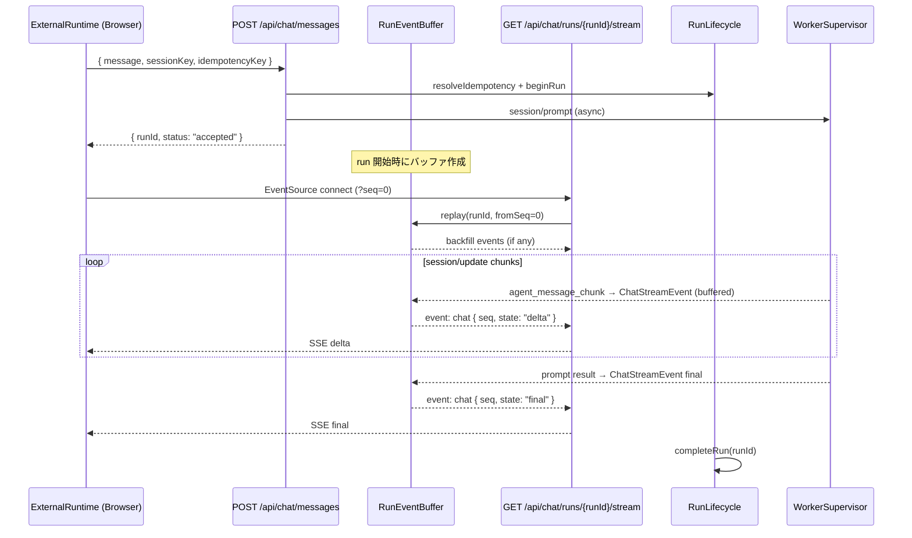

# 260301-s02: assistant-ui useExternalStoreRuntime スレッド対応チャット移行計画

## 0. Core Principles

以下の原則を今回の実装でどう適用するかを明記する（`doc/AI_PLANNINGAI_GUIDE.md` §1 準拠）。
各原則には **[タグ]** を付与し、プラン全体の設計判断箇所で参照する。

- **[ProtoFirst] Prototype First**
  後方互換性は考慮せず、現在に対し最適な構造を優先する。
  ただし既存 CI が落ちる変更・公開 API の破壊が発生する場合は、破壊点と最小の移行方針を明記する。
  - 最短経路: `pnpm start` で「スレッド選択 + チャット送受信 + ストリーミング表示」が成立することを優先する。
  - 破壊点なし: 既存 `/api/commands` + `/api/events/stream` 契約は壊さず、`/api/chat/*` を追加して段階移行する。
  - Vercel AI SDK 非依存: `@assistant-ui/react-ai-sdk` と `ai` は導入しない。バックエンドは ACP worker 経由であり、AI SDK Data Stream 形式の模倣コストが見合わない。
- **[SOLID] SOLID**
  オブジェクト指向設計の 5 原則を守る。
  - SRP: `src/ui`（表示と操作）、`src/control-plane/http`（API 契約）、`src/control-plane/acp`（worker 連携）の責務分離。
  - DIP: `ChatApiController` は `RunLifecycle` / `WorkerSupervisor` / `RunEventBuffer` に依存し、具象ストリーム実装を知らない。
- **[KISS] KISS**
  複雑さを避け、可能な限り単純な解決策を選ぶ。
  - `sessionKey = threadId` の 1:1 マッピング（複雑な thread merge は行わない）。
  - デフォルトスレッド `"main"` は canonical key + 遅延実体化 + 削除保護（OpenClaw 準拠）。
  - Legacy SSE パターン踏襲: `POST` → `{ runId }` → `GET SSE` の 2 ステップ方式。per-run バッファ + seq ベース replay。
- **[YAGNI] YAGNI**
  現在必要な機能のみを実装する。
  - Assistant Cloud、共有スレッド、添付ファイル、音声入力、LLM タイトル生成（v2）は今回スコープ外。
- **[DRY] DRY**
  ロジックの重複を避ける。
  - 既存 `RunLifecycle` / `UiRuntime` / `SessionRecoveryStore` / `PermissionGateway` を再利用し、実行経路を二重実装しない。
  - `ThreadRepository` は `SessionRecoveryStore` と同じ JournalStore / CursorStore インフラを再利用する。

## 1. 概要と目的 Overview and Purpose

- **What**
  - `@assistant-ui/react` の `useExternalStoreRuntime` + `useRemoteThreadListRuntime` を用いて、スレッド（= セッション）を切り替えて対話できるチャット UI を実装する。
  - フロントは legacy 実装（`legacy/impl-20260228/src/ui/`）の Pub/Sub + SSE パターンを踏襲し、バックエンドは独自 SSE プロトコルを使用する。
- **Why**
  - 現在の最小 UI はデバッグ用途に近く、実運用向けの UX（履歴・スレッド操作・ストリーミング表示・Composer 体験）が不足している。
  - assistant-ui の標準コンポーネントを採用することで、UI 開発コストを抑えつつ拡張可能な基盤にできる。
  - Vercel AI SDK に依存せず、既存 ACP パイプラインと直結することで変換コストを排除する。
- **How**
  - フロントは `useRemoteThreadListRuntime` で `useExternalStoreRuntime` をラップする構成とする。`useRemoteThreadListRuntime` の `runtimeHook` に `useExternalStoreRuntime` を渡し、Thread 管理と個別スレッドのランタイムを統合した単一の `runtime` を `AssistantRuntimeProvider` に渡す:
    ```tsx
    const runtime = useRemoteThreadListRuntime({
      runtimeHook: () => useExternalStoreRuntime({ messages, isRunning, onNew, onCancel }),
      adapter: threadApiClient, // RemoteThreadListAdapter 実装
    });
    <AssistantRuntimeProvider runtime={runtime}>...</AssistantRuntimeProvider>;
    ```
  - バックエンドは legacy パターンの `/api/chat/messages` + `/api/chat/runs/{runId}/stream` を実装し、既存 ACP 実行系に委譲する。
  - `@assistant-ui/react` latest のみ導入し、`react-ai-sdk` と `ai` は不要。

## 2. 仕様と受け入れ条件 Specification and Acceptance Criteria

### 2.1 スコープ Scope

- 今回やること
  - `@assistant-ui/react` latest のみを導入する。`@assistant-ui/react-ai-sdk` と `ai` は不要（削除対象）。
  - `npx assistant-ui@latest init` の生成物（`vendor/assistant-ui-init-ref/`）を UI レイアウトの起点として流用する（Thread, Composer, shadcn/ui コンポーネント, CSS 変数）。
  - `useExternalStoreRuntime` で独自ランタイムを構築し、`src/ui` に assistant-ui ベース画面を実装する。
  - `useRemoteThreadListRuntime` で Thread 一覧 API と接続する。
  - control-plane に `/api/chat/*` エンドポイント群を追加する（legacy SSE パターン）。
  - Thread API（`GET/POST/PATCH/DELETE /api/threads` + `/api/threads/:threadId/snapshot`）を追加し、`sessionKey` と 1:1 対応させる。
  - デフォルトスレッド `"main"` は canonical key として常に `GET /api/threads` に仮想エントリとして返す。実体（`ThreadRecord`）は初回メッセージ送信時に遅延作成する（OpenClaw 準拠）。`DELETE /api/threads/main` は拒否する（保護スレッド）。
  - `threadId === "main"` → `memoryScope: "main"`（フルメモリ・compaction 有効）、それ以外 → `memoryScope: "spoke"` のマッピングを維持する。
  - Pending permission UI を新規追加する（legacy にはなかった改善）。
  - 既存 `/api/commands` `/api/events/stream` `/api/snapshot` は互換維持する。
- 成果物
  - UI: assistant-ui ベースの Thread + Composer + Pending Permission 画面
  - API: `/api/chat/*` と `/api/threads*` の実装 + 契約テスト
  - テスト: Unit / Integration / Contract の追加
- 制約
  - Web UI は `control-plane (src/index.ts)` 同居プロセスを維持する。**[ProtoFirst]**
  - ACP 境界契約は維持する。**[ProtoFirst]** — 破壊点を作らない。
  - スレッド ID は v1 では `sessionKey` を正本とする（別 ID 層は導入しない）。**[KISS]**
  - `"main"` スレッドは既存 agent-runner の `memoryScope` / compaction / transcript パス解決の前提であり、削除不可。

### 2.2 非スコープ Non Scope **[YAGNI]**

- Assistant Cloud の導入
- マルチユーザー共有スレッド
- 既存 Slack collector / proactive pipeline の改修
- 添付ファイル、音声、Tool UI の高度カスタム描画
- `/api/commands` 経路の削除（今回は残す）**[ProtoFirst]** — 既存契約の破壊回避
- Vercel AI SDK / AI SDK Data Stream 形式の模倣 **[ProtoFirst]** — 模倣コスト不相応
- LLM によるスレッドタイトル自動生成（`generateTitle` v2 — 別計画の軽量 LLM ユーティリティに依存）

### 2.3 ユースケース Use Cases

- 正常系1: ユーザーが新規スレッドを作成し、メッセージ送信するとストリーミング応答が表示される。
- 正常系2: 既存スレッドを選択すると、そのスレッドの履歴（ツールイベント含む）が復元表示される。
- 正常系3: ページ再読込後もスレッド一覧と各スレッドの履歴が復元される。
- 正常系4: 実行中に tool permission が要求されると、Pending Permission UI に表示され、approve/deny できる。
- 異常系1: worker が途中でクラッシュした場合、該当スレッドの run は `failed` として UI 表示される。
- 異常系2: 不正な threadId/sessionKey の API 呼び出しは適切なエラーで拒否される。

### 2.4 受け入れ条件 Acceptance Criteria

1. Given `pnpm start` で control-plane が起動済み
   When ブラウザで `/` を開く
   Then assistant-ui ベースの Thread + Composer 画面が表示される。
2. Given スレッド A/B が存在する
   When A で送信した後に B に切り替えて送信する
   Then A/B それぞれ独立した履歴として表示され、run が混線しない。
3. Given `POST /api/chat/messages` に有効な `sessionKey` と `message` を送る
   When worker が応答を返す
   Then `{ runId, status }` が返り、`GET /api/chat/runs/{runId}/stream` で SSE ストリームが購読できる。
4. Given `GET /api/chat/runs/{runId}/stream` を購読中
   When worker がチャンクを返す
   Then `event: chat` で `ChatStreamEvent` が seq 順に配信される。
5. Given worker crash/timeout が発生する
   When 実行中 run が失敗する
   Then UI に失敗状態が表示され、`runId/sessionKey` 付きログが残る。
6. Given 既存 `/api/commands` クライアントが存在する
   When 更新後に同 API を呼び出す
   Then 既存契約どおり `accepted -> update -> completed|failed` が維持される。
7. Given tool permission が要求される
   When Pending Permission UI で approve する
   Then permission が解決され、run が続行される。
8. Given `PATCH /api/threads/:threadId` を呼び出す
   When `title` または `archived` を含む
   Then 指定フィールドのみ更新され、`threadId` は不変である。
9. Given control-plane が起動済み
   When `GET /api/threads` を呼び出す（`"main"` の実体が未作成でも）
   Then `threadId: "main"` が仮想エントリとして Thread 一覧の先頭に表示される。
10. Given `DELETE /api/threads/main` を呼び出す
    When `threadId` が `"main"` である
    Then `403 FORBIDDEN` を返し、スレッドは削除されない。

### 2.5 既知の制約 Known Limitations

- v1 は `sessionKey=threadId` 固定で、thread rename と key 分離は行わない。**[KISS]**
- `PATCH /api/threads/:threadId` は `title` と `archived` のみ許可し、`threadId` の変更は行わない。**[KISS]**
- `"main"` スレッドは削除不可。`memoryScope: "main"` による compaction・transcript パス・メモリ読み書きの特権を持つ。実体は遅延作成（OpenClaw 準拠）。
- `"main"` 以外のスレッドは `memoryScope: "spoke"` となり、compaction 無効・メモリ書込み不可。
- `generateTitle` は v1 では adapter 側で最初のユーザーメッセージを truncate する。adapter 型は `Promise<AssistantStream>` を要求するため、v1 フェイク実装では `assistant-stream` パッケージの `AssistantStream` でテキストチャンクをラップして返す。LLM によるタイトル生成は別計画（軽量 LLM ユーティリティ）に依存し、v2 で導入する。**[YAGNI]**
- Playwright E2E は `pnpm check` に含めず、別タスク/別ジョブで実行する。**[ProtoFirst]**

## 3. 前提技術スタック Context and Tech Stack

- **Language / Framework**
  - TypeScript (ESM), Node.js, React 19
- **Libraries**
  - `@assistant-ui/react`（latest）— `useExternalStoreRuntime` / `useRemoteThreadListRuntime` / `RemoteThreadListAdapter`
    > **注**: 実際のインポート名は `unstable_useRemoteThreadListRuntime` / `unstable_RemoteThreadListAdapter`（`unstable_` プレフィックス付き）。本計画書では可読性のためプレフィックスを省略して記載する。
  - 既存 `@mariozechner/pi-coding-agent` / ACP worker supervisor
- **削除対象** **[ProtoFirst]** — 最適な構造を優先し不要な依存を排除
  - `@assistant-ui/react-ai-sdk`（不要）
  - `ai`（AI SDK、不要）
- **Style Guide**
  - 既存 ESLint + Prettier に準拠
- **Runtime / Deployment**
  - 単一プロセス control-plane（HTTP API + UI 配信）
- **Testing**
  - Node.js built-in test runner (`node --import tsx --test`)

## 4. インターフェース契約 Interface Contracts

### 4.1 公開 API 一覧

#### Chat API（新規 — legacy SSE パターン）

| Method | Path                           | 成功           | エラー                                                                   | 説明                                               |
| ------ | ------------------------------ | -------------- | ------------------------------------------------------------------------ | -------------------------------------------------- |
| `POST` | `/api/chat/messages`           | `202 Accepted` | `400` validation / `409` idempotency conflict / `404` unknown sessionKey | メッセージ送信 → `{ runId, status }`               |
| `GET`  | `/api/chat/runs/:runId/stream` | `200 OK` (SSE) | `404` unknown runId                                                      | SSE ストリーム（`event: chat`）                    |
| `GET`  | `/api/chat/history`            | `200 OK`       | `400` missing sessionKey                                                 | 履歴取得（`?sessionKey={key}`）                    |
| `POST` | `/api/chat/abort`              | `200 OK`       | `400` validation / `404` no active run                                   | 実行中止（`{ sessionKey, runId? }`）               |
| `GET`  | `/api/chat/runs/:runId/audit`  | `200 OK`       | `404` unknown runId                                                      | ツール監査情報（既存 `src/index.ts:598` から移植） |

#### Thread API（新規）

| Method   | Path                              | 成功             | エラー                               | 説明                                      |
| -------- | --------------------------------- | ---------------- | ------------------------------------ | ----------------------------------------- |
| `GET`    | `/api/threads`                    | `200 OK`         | —                                    | スレッド一覧（`"main"` 仮想エントリ含む） |
| `POST`   | `/api/threads`                    | `201 Created`    | `400` validation                     | スレッド作成                              |
| `GET`    | `/api/threads/:threadId`          | `200 OK`         | `404` unknown threadId               | スレッド metadata 取得（単体）            |
| `PATCH`  | `/api/threads/:threadId`          | `200 OK`         | `400` 禁止フィールド / `404` unknown | スレッド更新（`title`, `archived`）       |
| `DELETE` | `/api/threads/:threadId`          | `204 No Content` | `403` main 保護 / `404` unknown      | スレッド削除（`"main"` は `403` 拒否）    |
| `GET`    | `/api/threads/:threadId/snapshot` | `200 OK`         | `404` unknown threadId               | スレッド単位の run/tool/permission 復元   |

#### Permission API（新規）

| Method | Path                       | 成功     | エラー                           | 説明                                      |
| ------ | -------------------------- | -------- | -------------------------------- | ----------------------------------------- |
| `POST` | `/api/permissions/resolve` | `200 OK` | `400` validation / `404` unknown | Pending Permission を approve/deny で解決 |

#### 既存 API（互換維持）

| Method | Path                 | 説明                   |
| ------ | -------------------- | ---------------------- |
| `POST` | `/api/commands`      | コマンド送信           |
| `GET`  | `/api/snapshot`      | 状態スナップショット   |
| `GET`  | `/api/events/stream` | SSE イベントストリーム |

### 4.2 データモデルとスキーマ

#### `POST /api/chat/messages` Request

```typescript
{
  message: string; // ユーザーメッセージテキスト
  sessionKey: string; // = threadId
  idempotencyKey: string; // 冪等性キー
}
```

#### `POST /api/chat/messages` Response

```typescript
{
  runId: string; // "session:<sessionId>:run:<n>"
  status: "accepted";
}
```

> **runId 正規形**: `session:{sessionId}:run:{sequentialNumber}`。`sessionId` は ACP worker が `session/new` で払い出す不透明 ID であり、`sessionKey`（= `threadId`）とは異なる。`session/new` fallback 時に `runSequence` が 0 にリセットされても、新しい `sessionId` が割り当てられるため衝突しない。既存の `RunLifecycle.toRunId()` (`run-lifecycle.ts:179`) が採番する。

#### `GET /api/chat/runs/:runId/stream` — SSE

- Query parameter: `?seq={n}`（省略時は `0`）。指定した seq 以降のイベントを返す。
- **取りこぼし防止（backfill）**: サーバーは per-run イベントバッファを保持する。クライアント接続時に `seq` 以降の未配信イベントをまとめて replay し、以降はリアルタイム配信する。
- **バッファライフサイクル**: run 開始時に作成、run 終了（final/error/aborted）後に一定時間（60 秒）保持してから破棄する。
- **再接続**: クライアントは切断時に最後に受信した `seq` を記録し、再接続時に `?seq={lastSeq+1}` で backfill を要求する。

```
event: chat
data: {"seq":1,"state":"delta","runId":"...","sessionKey":"...","message":"hello"}

event: chat
data: {"seq":2,"state":"delta","runId":"...","sessionKey":"...","message":" world"}

event: chat
data: {"seq":3,"state":"final","runId":"...","sessionKey":"...","message":"hello world"}
```

#### `ChatStreamEvent` 型

```typescript
interface ChatStreamEvent {
  seq: number;
  state: "delta" | "final" | "aborted" | "error";
  runId: string;
  sessionKey: string;
  message?: string; // delta/final 時のテキスト
  errorMessage?: string; // error 時のエラー詳細
  toolCallId?: string; // tool 関連 delta 時
  toolName?: string; // tool 関連 delta 時
  toolStatus?: "started" | "completed" | "failed"; // tool 関連 delta 時
  permissionRequest?: {
    // permission/requested 時
    requestId: string;
    title: string;
    toolCallId?: string;
  };
  permissionResolved?: {
    // permission/resolved 時
    requestId: string;
    outcome: "allow" | "deny" | "cancelled";
  };
}
```

#### イベント源別 `ChatStreamEvent` 変換マッピング

`ChatStreamEvent` は複数のイベント源を統合する。変換責務は `ChatApiController` が担い、各イベント源からのコールバックを受けて `RunEventBuffer.append()` に渡す。

**Source 1: ACP `session/update` ストリーム** — `WorkerSupervisor` 経由（ストリーミング中に逐次配信）

| ACP イベント          | ChatStreamEvent                                                                 |
| --------------------- | ------------------------------------------------------------------------------- |
| `agent_message_chunk` | `state: "delta"`, `message: chunk.text`                                         |
| `tool_call`           | `state: "delta"`, `toolCallId`, `toolName`, `toolStatus: "started"`             |
| `tool_call_update`    | `state: "delta"`, `toolCallId`, `toolName`, `toolStatus: "completed"\|"failed"` |

**Source 2: ACP `session/prompt` レスポンス** — `WorkerSupervisor.request()` の戻り値（request/response 方式）

| ACP イベント              | ChatStreamEvent                       |
| ------------------------- | ------------------------------------- |
| `session/prompt` 正常結果 | `state: "final"`, `message: fullText` |

**Source 3: `RunLifecycle`** — run 状態遷移

| RunLifecycle イベント | ChatStreamEvent                  |
| --------------------- | -------------------------------- |
| `failRun()`           | `state: "error"`, `errorMessage` |

**Source 4: `PermissionGateway`** — permission 要求/解決

| PermissionGateway イベント | ChatStreamEvent                                                         |
| -------------------------- | ----------------------------------------------------------------------- |
| `permission/requested`     | `state: "delta"`, `permissionRequest: { requestId, title, toolCallId }` |
| `permission/resolved`      | `state: "delta"`, `permissionResolved: { requestId, outcome }`          |

**Source 5: ユーザー操作** — abort

| ユーザー操作           | ChatStreamEvent    |
| ---------------------- | ------------------ |
| `POST /api/chat/abort` | `state: "aborted"` |

#### `POST /api/chat/abort` Request

```typescript
{
  sessionKey: string;
  runId?: string;           // 省略時は sessionKey の最新 run
}
```

#### `GET /api/chat/history` Response

```typescript
{
  messages: Array<{
    role: "user" | "assistant";
    content: string;
    runId?: string;
    toolCount?: number;
    timestamp: string;
  }>;
}
```

#### `ThreadRecord`

```typescript
{
  threadId: string; // 不変（v1 は threadId=sessionKey 固定）
  title: string;
  archived: boolean;
  isDefault: boolean; // true = "main" スレッド（削除不可）
  createdAt: string; // ISO 8601
  updatedAt: string; // ISO 8601
}
```

#### デフォルト "main" スレッド規約（OpenClaw 準拠）

- **canonical key**: `"main"` は常に解決可能な canonical key として扱う。実体（`ThreadRecord`）の有無に関わらず、`GET /api/threads` は `"main"` を仮想エントリとして返す。
- **遅延実体化**: `ThreadRecord` 実体は初回メッセージ送信（`POST /api/chat/messages { sessionKey: "main" }`）時に作成する。未存在時は仮想エントリ（デフォルト値）を返す。
- **削除保護**: `DELETE /api/threads/main` は `403 FORBIDDEN` で拒否する。
- **一覧順序**: `GET /api/threads` は `"main"` を常に先頭に返す。
- **memoryScope マッピング**: `threadId === "main"` → `memoryScope: "main"`（フルメモリ・compaction 有効）。それ以外 → `memoryScope: "spoke"`（メモリ書込み不可・compaction 無効）。
- **既存互換**: 既存の `sessionKey === "main"` 判定（`agent-runner.ts`, `agent-session-factory.ts`, `src/index.ts`）はそのまま維持される。

#### `POST /api/threads` Request / Response

- Request: `{ title?: string }`（`title` 省略時はデフォルト空文字。`useRemoteThreadListRuntime` の `initialize(localId)` から呼ばれる想定）
- Response: `ThreadRecord`（`threadId` はサーバー採番）
- **adapter マッピング**: `initialize()` の返り値型は `Promise<{ remoteId: string; externalId: string | undefined }>` であるため、adapter 側で `{ remoteId: record.threadId, externalId: undefined }` に変換する。`externalId` は外部システム連携用であり、v1 では使用しない。
- **threadId 採番**: `thr_` + nanoid(12)（例: `thr_a1b2c3d4e5f6`）。`"main"` は予約済みで採番対象外。`nanoid` は既存の依存関係にない場合 `node:crypto.randomBytes` ベースの簡易生成で代替可。

#### `PATCH /api/threads/:threadId` Request

- `{ title?: string; archived?: boolean }` を受理。`threadId` / `sessionKey` / `createdAt` / `isDefault` 等の禁止フィールドを含む場合は `400 INVALID_REQUEST`。
- `useRemoteThreadListRuntime` の `archive(remoteId)` / `unarchive(remoteId)` は `PATCH { archived: true/false }` で実現する。

#### `GET /api/threads/:threadId/snapshot` Response

```typescript
{
  thread: ThreadRecord;
  runs: RunSummary[];
  toolEventsByRun: Record<string, ToolEventRecord[]>;
  pendingPermissions: PermissionSummary[];
}
```

> `RunSummary`, `ToolEventRecord`, `PermissionSummary` は既存の `src/control-plane/contracts/http-api.ts` で定義済み。`GET /api/snapshot`（既存）と同じ型を使い、`thread` フィールドと threadId スコープフィルタを追加する形式。

> **thread スコープフィルタ規則**: `RunLifecycle.runs()` を `sessionKey === threadId` でフィルタし、該当する `runId` セットと `sessionId` セットを取得する。`runs` と `toolEventsByRun` はこの `runId` セットでフィルタする。`pendingPermissions` は `PermissionRegistry.listPending()` のエントリのうち、`sessionId` セットに `permission.sessionId` が含まれるもののみを返す（`PendingPermission` は `sessionId` フィールドを持つ — `permission-registry.ts:5`）。`SessionRecoveryStore` は最新 1 件しか保持しない（`sessionKey → SessionRecoveryState`）ため、過去の `sessionId` を含む run 列挙には使用しない。

#### Idempotency 規約 **[DRY]**

- 既存 `RunLifecycle` の `resolveIdempotency()` を利用する。
- 同一 `sessionKey + idempotencyKey + requestHash` → no-op（重複吸収）。
- 同一 `sessionKey + idempotencyKey` で `requestHash` 差分 → `409 CONFLICT`。

#### Thread metadata 永続化

- 正本: `<stateDir>/journal/control-plane/threads.jsonl`（append-only）
- 高速復元: `<stateDir>/cursor/control-plane.threads.snapshot.json`（materialized snapshot）
- replay cursor: `<stateDir>/cursor/control-plane.threads.replay-cursor.json`
- **基盤** **[DRY]**: 既存 `SessionRecoveryStore` と同じ JournalStore / CursorStore インフラを再利用する。独自実装しない。
- **journal エントリ形式**: 各行は `{ op: "upsert" | "delete", threadId, ...fields }` の op ログ形式とする。`op: "upsert"` は `ThreadRecord` の全フィールドを持つ。`op: "delete"` は `{ op: "delete", threadId, deletedAt }` の 3 フィールドのみを持つ tombstone エントリ（`deletedAt` は ISO 8601、必須）。
- **削除の永続化**: `DELETE /api/threads/:threadId` は journal に tombstone エントリを append する。replay 時に `op: "delete"` が出現したら対応する `threadId` を Map から削除する。これにより snapshot 破損→journal 全件 replay でも削除済み thread が復活しない。
- **更新順序**: `journal.append()` → `byThreadId.set()` or `byThreadId.delete()` → `writeSnapshot()` → `replayCursor.commit()`（`SessionRecoveryStore.upsert()` と同一パターン）
- **起動時復元**: `loadSnapshot()` → `replayWithRepair(cursor.offset)` で journal 差分を追いかける。replay 中に `op: "delete"` を検出したら Map から該当エントリを除去する。
- **破損修復**: journal の最初のパース不正行で truncate 修復する（不正行以降を切り捨て、`onWarn` で報告）。`SessionRecoveryStore.replayWithRepair()` と同一ポリシー。snapshot が壊れている場合は journal 全件 replay にフォールバック。
- **重複排除**: 同一 `threadId` の journal エントリは最新が勝つ（Map 上書き）。ただし `op: "delete"` は Map 削除。`updatedAt` の時刻逆行は `SessionRecoveryStore.clampUpdatedAt()` と同様にクランプする。

### 4.3 エラーと例外 Error Handling

- エラー分類
  - `INVALID_REQUEST`, `UNSUPPORTED_CAPABILITY`, `WORKER_TIMEOUT`, `WORKER_CRASHED`, `DOWNSTREAM_ERROR`
- リトライ方針
  - `/api/chat/*` の自動再試行は行わず、UI で手動再送とする
  - SSE 再接続は legacy パターンの指数バックオフを踏襲（initial: 2s, max: 30s, factor: 1.8, jitter: ±25%, maxAttempts: 12）
- タイムアウト方針
  - 既存 `session/prompt` timeout（5 分）を踏襲
- ログ方針と個人情報
  - 既存 structured log 形式に準拠し `runId/sessionKey/toolCallId` を必須出力
  - prompt 生文は debug レベルでも既定マスクを維持

### 4.4 代表的な例 Examples

```bash
# main 仮想エントリ確認（実体未作成でも返る）
curl -sS http://127.0.0.1:3100/api/threads
```

```json
[
  {
    "threadId": "main",
    "title": "Main",
    "archived": false,
    "isDefault": true,
    "createdAt": "1970-01-01T00:00:00.000Z",
    "updatedAt": "1970-01-01T00:00:00.000Z"
  }
]
```

```bash
# スレッド作成（initialize から呼ばれる想定、title 省略可）
curl -sS -X POST http://127.0.0.1:3100/api/threads \
  -H 'content-type: application/json' \
  -d '{}'
```

```json
{
  "threadId": "thr_a1b2c3d4e5f6",
  "title": "",
  "archived": false,
  "isDefault": false,
  "createdAt": "2026-03-01T12:00:00.000Z",
  "updatedAt": "2026-03-01T12:00:00.000Z"
}
```

```bash
# メッセージ送信
curl -sS -X POST http://127.0.0.1:3100/api/chat/messages \
  -H 'content-type: application/json' \
  -d '{"message":"hello","sessionKey":"main","idempotencyKey":"idem_001"}'
```

```json
{
  "runId": "session:sess_x7k9m:run:1",
  "status": "accepted"
}
```

```bash
# SSE ストリーム購読
curl -N http://127.0.0.1:3100/api/chat/runs/session:sess_x7k9m:run:1/stream
```

```text
event: chat
data: {"seq":1,"state":"delta","runId":"session:sess_x7k9m:run:1","sessionKey":"main","message":"hello"}

event: chat
data: {"seq":2,"state":"delta","runId":"session:sess_x7k9m:run:1","sessionKey":"main","message":" world"}

event: chat
data: {"seq":3,"state":"final","runId":"session:sess_x7k9m:run:1","sessionKey":"main","message":"hello world"}
```

```bash
# 実行中止
curl -sS -X POST http://127.0.0.1:3100/api/chat/abort \
  -H 'content-type: application/json' \
  -d '{"sessionKey":"main"}'
```

```bash
# スレッド snapshot 取得
curl -sS http://127.0.0.1:3100/api/threads/thr_a1b2c3d4e5f6/snapshot
```

## 5. アーキテクチャと設計図 Architecture and Diagrams

### 5.1 図の選択方針

- UI / HTTP / ACP を跨ぐためクラス図を必須とする。
- ストリーミング連携の整合確認のためシーケンス図を追加する。

### 5.2 クラス図 Class Diagram



> **注**: 現在 `src/index.ts` にインライン実装されているオーケストレーションロジック（`RunLifecycle` + `WorkerSupervisor` + `SessionRecoveryStore` の協調）は `Task-AUI-S2-GREEN-000`（ルート抽出）で `ChatApiController` に集約する。独立した `CommandOrchestrator` クラスは新設せず、既存の協調パターンを `ChatApiController` 内メソッドとして抽出する。

### 5.3 シーケンス図 Sequence Diagram



### 5.4 SSE 二重経路の共存方針 **[ProtoFirst]** — 既存契約を壊さず段階移行

- **`GET /api/events/stream`（既存 `SseHub`）**: 全クライアントへのブロードキャスト方式。`run/accepted`, `run/update`, `run/completed`, `run/failed`, `permission/requested`, `permission/resolved` を全セッション分配信する。既存 `/api/commands` クライアントが依存。**互換維持**。
- **`GET /api/chat/runs/{runId}/stream`（新規 `RunEventBuffer`）**: per-run スコープの SSE。`ChatStreamEvent` 形式で該当 run のみ配信。seq ベース backfill 付き。新 UI が使用。
- **関係**: 両方を維持する。新 UI は per-run SSE のみ使用し、既存ブロードキャスト SSE には依存しない。`SseHub` はラップせず完全に別系統として実装する。
- **データソース**: 同じ ACP `session/update` ストリームを二股に分岐する。`ChatApiController` がイベントを受け取り、`SseHub.broadcast()` と `RunEventBuffer.append()` の両方に配信する。

### 5.5 `assistant-ui init` 生成物の流用方針

`npx assistant-ui@latest init` を Vite プロジェクトで実行した生成物を `vendor/assistant-ui-init-ref/` に参照用として保持する。

#### 生成ファイル一覧と流用判定

| ファイル                                          | 流用             | 備考                                                                                                                            |
| ------------------------------------------------- | ---------------- | ------------------------------------------------------------------------------------------------------------------------------- |
| `components/assistant-ui/thread.tsx`              | **Copy & Adapt** | Thread/Composer/Message レイアウト。Primitive のみ使用（AI SDK 依存なし）。`ToolsBadge` + Pending Permission 表示をカスタム追加 |
| `components/assistant-ui/markdown-text.tsx`       | **Copy**         | `@assistant-ui/react-markdown` ベース。そのまま                                                                                 |
| `components/assistant-ui/tool-fallback.tsx`       | **Copy**         | ツール表示のフォールバック。そのまま                                                                                            |
| `components/assistant-ui/tooltip-icon-button.tsx` | **Copy**         | ボタン共通コンポーネント。そのまま                                                                                              |
| `components/assistant-ui/attachment.tsx`          | **Skip**         | 添付ファイルは非スコープ（§2.2）                                                                                                |
| `components/ui/button.tsx`                        | **Copy**         | shadcn/ui。そのまま                                                                                                             |
| `components/ui/tooltip.tsx`                       | **Copy**         | shadcn/ui。そのまま                                                                                                             |
| `components/ui/dialog.tsx`                        | **Copy**         | shadcn/ui。Permission UI ダイアログに利用可能                                                                                   |
| `components/ui/avatar.tsx`                        | **Copy**         | shadcn/ui。そのまま                                                                                                             |
| `components/ui/collapsible.tsx`                   | **Copy**         | shadcn/ui。Audit パネルに利用可能                                                                                               |
| `lib/utils.ts`                                    | **Copy**         | `cn()` ヘルパー。そのまま                                                                                                       |
| `index.css`                                       | **Copy & Adapt** | shadcn CSS 変数 + Tailwind v4。既存 `src/ui/styles.css` と統合                                                                  |
| `components.json`                                 | **Copy**         | shadcn CLI 設定。将来の `shadcn add` に必要                                                                                     |

#### 不要な依存（init が追加するが除外するもの）**[ProtoFirst]**

- `@assistant-ui/react-ai-sdk` — 不要（`useExternalStoreRuntime` を使用）
- `ai` — 不要（Vercel AI SDK 非依存）
- `@ai-sdk/openai` — 不要

#### 流用手順（Stage 2 で実施）

1. `vendor/assistant-ui-init-ref/src/components/` から上記ファイルを `src/ui/components/` にコピー
2. import alias を `@/` から本プロジェクトのパス規約に調整
3. `thread.tsx` にプロジェクト固有のカスタマイズを追加（`ToolsBadge`, `PendingPermissionBanner` 等）
4. `index.css` を既存スタイルと統合
5. `useRemoteThreadListRuntime({ runtimeHook: () => useExternalStoreRuntime(...), adapter: threadApiClient })` で統合 runtime を構築し、`AssistantRuntimeProvider` でラップする `App.tsx` を作成

### 5.6 既存 `src/ui` 存廃方針 **[DRY]** — 再利用可能な資産は維持

| ファイル                                      | 判定         | 備考                                                                                                                                                  |
| --------------------------------------------- | ------------ | ----------------------------------------------------------------------------------------------------------------------------------------------------- |
| `src/ui/runtime.ts`                           | **Keep**     | `UiRuntime` の集約パターン（`ToolEventBridge`（本体は `src/control-plane/acp/tool-event-bridge.ts`）+ pending permission の UI 投影ロジック）を再利用 |
| `src/ui/minimal-page.ts`                      | **暫定維持** | Stage 4 で削除可否を再判定                                                                                                                            |
| `src/ui/components/control-plane-console.tsx` | **Replace**  | 機能は assistant-ui の Thread/Composer + 補助パネルへ移植                                                                                             |
| `src/ui/components/AuditDetailTab.tsx`        | **Keep**     | assistant-ui 画面のサイドパネルへ統合                                                                                                                 |

## 6. テスト戦略 Test Strategy

### 6.1 テストの種類

- **Unit**
  - `ChatStreamEvent` 型の変換ロジック（`session/update` → `ChatStreamEvent`）
  - `/api/chat/messages` request validation（message, sessionKey, idempotencyKey 必須）
  - `/api/chat/abort` request validation
  - thread repository の CRUD / snapshot
  - `"main"` 仮想エントリ（実体未作成時にデフォルト値を返す）
  - `"main"` 遅延実体化（初回メッセージ送信で `ThreadRecord` 作成）
  - `DELETE /api/threads/main` の `403` 拒否
  - `GET /api/threads` の `"main"` 先頭ソート
  - `threadId` → `memoryScope` マッピング（`"main"` → `"main"`, それ以外 → `"spoke"`）
  - `PATCH /api/threads/:threadId` の `title` / `archived` 受理と禁止フィールド拒否
  - `POST /api/threads` の `title` optional（省略時デフォルト値）
- **Integration**
  - `POST /api/chat/messages` → `GET /api/chat/runs/{runId}/stream` で SSE ストリームが完了する
  - `/api/chat/messages` 重複再送で新規 run が作成されない
  - スレッド切替で履歴が分離される
  - permission request → approve → run 続行
- **Contract**
  - 既存 `/api/commands` 契約が非回帰
  - SSE `event: chat` の `ChatStreamEvent` 形式が契約準拠
  - ACP baseline method / capability gate の非回帰

### 6.2 テスト方針

- AI SDK serializer の golden fixture は**不要**（独自 SSE プロトコルのため）。**[YAGNI]**
- SSE プロトコル契約テストを中心に据える（`ChatStreamEvent` の seq 順序、state 遷移、backfill replay、再接続時の seq 指定）。
- legacy 実装の `computeBackoff` はユーティリティとして移植し、単体テストを付ける。**[DRY]**

### 6.3 カバレッジ対象

- 重要ロジック
  - 1 スレッド 1 セッションの整合
  - idempotency no-op（重複 run 防止）
  - `ChatStreamEvent` seq 単調増加
  - run terminal と thread metadata 更新
  - thread snapshot 経由の tool event 復元
- エラー分岐
  - 不正 sessionKey / runId
  - worker timeout / crash
  - SSE 再接続
- 境界条件
  - 空メッセージ
  - 長文入力
  - 同時送信（異なる thread）

## 7. 実装タスクリスト Implementation Plan

### Stage 1: 設計と準備（10 タスク）

- [x] `Task-AUI-001` ~~`@assistant-ui/react-ai-sdk` と `ai` パッケージを削除~~ → 完了済み（コミット b45279d）。`@assistant-ui/react` は `0.12.14`（latest）へ更新済み
- [x] `Task-AUI-002` `useExternalStoreRuntime` + `useRemoteThreadListRuntime` の API を調査し、接続パターンを確定
- [x] `Task-AUI-003` `/api/chat/*` 契約定義を `src/control-plane/contracts/http-api.ts` に追加（`ChatStreamEvent`, request/response 型）
- [x] `Task-AUI-004` `/api/threads*` 契約定義を `src/control-plane/contracts/http-api.ts` に追加（`ThreadRecord`, snapshot response 型）
- [x] `Task-AUI-005` `src/index.ts` 直書き API ルートを `src/control-plane/http/*` へ抽出する設計を確定
- [x] `Task-AUI-006` 既存 `src/ui` ファイルの存廃判定を実施（§5.6 表に基づく）
- [x] `Task-AUI-007` SSE `ChatStreamEvent` 型とテスト雛形を追加
- [x] `Task-AUI-008` 全 5 ソース（§4.2 Source 1〜5: session/update, session/prompt, RunLifecycle, PermissionGateway, abort）→ `ChatStreamEvent` 変換ロジックのテスト雛形を追加
- [x] `Task-AUI-009` `vendor/assistant-ui-init-ref/` の生成物を確認し、流用ファイル一覧を確定（§5.5 表に基づく）。不要パッケージ（`react-ai-sdk`, `ai`, `@ai-sdk/openai`）が本体 `package.json` に混入しないことを確認
- [x] `Task-AUI-010` `assistant-stream` パッケージを `devDependencies` に追加しバージョンを固定する（`generateTitle` v1 の `AssistantStream` ラッパーに必要）。`@assistant-ui/react` の peer dependency バージョンとの整合を確認

### Stage 2: useExternalStoreRuntime 基盤 + /api/chat/\* 実装（14 タスク）

- [x] `Task-AUI-S2-RED-001` Test: `POST /api/chat/messages` の request/response 契約失敗テスト
- [x] `Task-AUI-S2-RED-002` Test: `GET /api/chat/runs/{runId}/stream` SSE 契約失敗テスト（seq backfill / 再接続 replay を含む）
- [x] `Task-AUI-S2-RED-003` Test: 全 5 ソース → `ChatStreamEvent` 変換の失敗テスト（session/update delta, session/prompt final, RunLifecycle error, PermissionGateway request/resolved, abort）
- [x] `Task-AUI-S2-RED-004` Test: idempotency 重複吸収の失敗テスト
- [x] `Task-AUI-S2-GREEN-000` Impl: `src/index.ts` 既存ルートを `src/control-plane/http/*` へ抽出 **（他の GREEN タスクの前提。GREEN-001〜007 はこのタスク完了後に着手）**
- [x] `Task-AUI-S2-GREEN-001` Impl: `POST /api/chat/messages` を既存 run orchestrator へ接続
- [x] `Task-AUI-S2-GREEN-002` Impl: `GET /api/chat/runs/{runId}/stream` SSE エンドポイント + `RunEventBuffer`（per-run バッファ、seq backfill、TTL 破棄）実装
- [x] `Task-AUI-S2-GREEN-003` Impl: 全 5 ソース → `ChatStreamEvent` 変換ロジック実装（§4.2 Source 1〜5 のコールバックを `RunEventBuffer.append()` に統合）
- [x] `Task-AUI-S2-GREEN-004` Impl: `GET /api/chat/history` 実装
- [x] `Task-AUI-S2-GREEN-005` Impl: `POST /api/chat/abort` 実装
- [x] `Task-AUI-S2-GREEN-006` Impl: `useExternalStoreRuntime` ベースの UI ランタイム（legacy `runtime.ts` パターン移植）
- [x] `Task-AUI-S2-GREEN-007` Impl: `vendor/assistant-ui-init-ref/` から UI コンポーネントをコピー・適応（§5.5 手順）し、`useRemoteThreadListRuntime({ runtimeHook, adapter })` で統合 runtime を構築し `AssistantRuntimeProvider` でラップした `App.tsx` を作成。Thread + Composer 画面を表示
- [x] `Task-AUI-S2-REFACTOR-001` Refactor: `src/ui` 存廃方針に従って既存 UI 資産を整理
- [x] `Task-AUI-S2-INTEG-001` Integration: 送信 → SSE ストリーミング → 完了まで統合テスト

### Stage 3: Thread 管理 + Pending Permission UI（16 タスク）

- [x] `Task-AUI-S3-RED-000` Test: `"main"` 仮想エントリ・遅延実体化・削除拒否・先頭ソート・memoryScope マッピングの失敗テスト
- [x] `Task-AUI-S3-RED-001` Test: thread 作成/選択/削除の失敗テスト
- [x] `Task-AUI-S3-RED-002` Test: thread 切替で履歴分離される失敗テスト
- [x] `Task-AUI-S3-RED-003` Test: `PATCH /api/threads/:threadId` が `title`/`archived` 以外を拒否する失敗テスト
- [x] `Task-AUI-S3-RED-004` Test: `GET /api/threads/:threadId/snapshot` で run/tool history が thread 単位復元される失敗テスト
- [x] `Task-AUI-S3-GREEN-000` Impl: `ThreadRepository` に `"main"` 仮想エントリ（`getOrVirtual()`）、遅延実体化、削除保護、先頭ソート、`resolveMemoryScope()` を実装
- [x] `Task-AUI-S3-GREEN-001` Impl: `ThreadRepository` + `/api/threads*` API 実装
- [x] `Task-AUI-S3-GREEN-002` Impl: `useRemoteThreadListRuntime` + `RemoteThreadListAdapter`（list/initialize/rename/archive/unarchive/delete/generateTitle）で Thread 一覧 UI 実装。`generateTitle` は v1 ではユーザーメッセージ truncate フェイク
- [x] `Task-AUI-S3-GREEN-003` Impl: `GET /api/threads/:threadId/snapshot` 実装と UI hydrate 接続
- [x] `Task-AUI-S3-GREEN-004` Impl: `PATCH /api/threads/:threadId` を `title`/`archived` 更新で実装（archive/unarchive adapter 対応）
- [x] `Task-AUI-S3-GREEN-005` Impl: Pending Permission UI コンポーネント（permission/requested → approve/deny ボタン → permission/resolved）
- [x] `Task-AUI-S3-GREEN-006` Impl: Permission UI と `PermissionGateway` / `PermissionRegistry` の接続
- [x] `Task-AUI-S3-REFACTOR-001` Refactor: session recovery / thread metadata 更新責務を分離
- [x] `Task-AUI-S3-INTEG-001` Integration: マルチスレッド E2E（A/B 分離、再読込復元）
- [x] `Task-AUI-S3-CONTRACT-001` Contract: `/api/commands` 非回帰 + ACP 契約非回帰を確認
- [x] `Task-AUI-S3-CONTRACT-002` Contract: `PATCH /api/threads/:threadId` の禁止フィールドが `400 INVALID_REQUEST` になることを確認（`title`/`archived` 以外拒否）

### Stage 4: 統合と検証（7 タスク）

- [x] `Task-AUI-VERIFY-001` `pnpm check` を通す
- [x] `Task-AUI-VERIFY-002` `pnpm start` → ブラウザで `/` を開き、Thread + Composer 画面が表示されることを手動確認
- [x] `Task-AUI-VERIFY-003` worker crash/timeout 時の表示とログを確認
- [x] `Task-AUI-VERIFY-004` 既存 API クライアント互換性を確認
- [x] `Task-AUI-VERIFY-005` `src/ui/minimal-page.ts` の削除可否を最終判定（削除せず保持。`ADJUTANT_UI_VITE_MIDDLEWARE=false` のフォールバック画面として利用）
- [x] `Task-AUI-VERIFY-006` `$playwright-cli` スキルによる UI ウォークスルー確認（`pnpm check` 外で実施）。以下の確認項目を一通り実行する:
  1. `/` を開き Thread + Composer 画面が描画される
  2. Composer にメッセージを入力し送信 → SSE ストリーミングでアシスタント応答が表示される
  3. 応答完了後、メッセージ履歴に user + assistant が表示される
  4. 新規スレッドを作成し、別スレッドに切り替える → 履歴が分離されている
  5. 元のスレッドに戻る → 以前の履歴が復元表示される
  6. `"main"` スレッドが一覧の先頭に表示される
  7. Pending Permission UI: permission 要求時にバナー/ダイアログが表示され、approve/deny 操作ができる
  8. 実行中に Cancel ボタンを押す → run が中止される
  9. ページリロード後にスレッド一覧と履歴が復元される
  10. レスポンシブ: ビューポート幅 375px / 1280px で Composer とメッセージがはみ出さない
- [x] `Task-AUI-VERIFY-007` VERIFY-006 で発見した不具合を修正し、再確認する

## 8. 完了の定義 Definition of Done

### 8.1 機能 DoD

- [x] 受け入れ条件（§2.4）がすべて満たされていること
- [x] 既知の制約が明文化され、想定通りであること
- [x] 契約の例（§4.4）に対して期待通りの結果が得られること

### 8.2 品質 DoD

- [x] 全てのテストがパスしていること
- [x] Linter / Formatter のエラーがないこと
- [x] 不要なデバッグコードが削除されていること

## 9. 懸念事項と未確定事項 Concerns and Questions

- **assistant-ui latest 破壊変更**: `useExternalStoreRuntime` / `useRemoteThreadListRuntime` の API が latest で変更されている可能性がある。Stage 1 で調査・確定する。
- **SSE 再接続**: legacy の `computeBackoff` パターンを移植するが、ブラウザ EventSource の自動再接続との競合を確認する必要がある。
- **Pending Permission UI 配置**: Thread 内にインライン表示するか、サイドパネルに分離するかを Stage 3 開始時に確定する。
- **`@assistant-ui/react` の依存カテゴリ**: 現在 `devDependencies` に配置されている（Vite でバンドルするためランタイムには含まれない）。意図的であれば問題ないが、Stage 1 で `dependencies` vs `devDependencies` の配置を確認する。
- **`RemoteThreadListAdapter` の整合**: adapter interface（`list`, `initialize`, `rename`, `archive`, `unarchive`, `delete`, `generateTitle`）と `/api/threads` API の対応を Stage 1 で最終確認する。特に `initialize(localId)` → `POST /api/threads` の引数マッピングを確定する。
- **`generateTitle` の v2 昇格**: v1 は adapter 側で最初のユーザーメッセージを truncate し、`AssistantStream` でラップして返す（adapter 型が `Promise<AssistantStream>` を要求するため `assistant-stream` パッケージが必要）。v2 では **軽量 LLM ユーティリティ（別計画）** を用いた `POST /api/threads/:threadId/generate-title` エンドポイントを追加し、agent パイプラインを経由しない直接 LLM 呼び出しでタイトルを生成する。本計画のスコープ外であり、別途 `doc/plan/` に計画書を作成する。

## 10. リスクとロールバック Risk and Rollback

- **リスク**: assistant-ui latest の `useExternalStoreRuntime` API が legacy 実装時と非互換。
  - **緩和策**: Stage 1 で API 調査を完了し、非互換が重大な場合は assistant-ui バージョンを固定する。
- **リスク**: `RemoteThreadListAdapter` の要求と `/api/threads` API の不整合。
  - **緩和策**: API 側で `title` optional、`PATCH` に `archived` 許可、`generateTitle` は v1 adapter 側 truncate で対応済み。`initialize(localId)` → `POST /api/threads` の変換は adapter 層で吸収。最悪の場合 `useExternalStoreRuntime` のみで thread 選択を自前実装する。
- **ロールバック** **[ProtoFirst]**: 既存 `/api/commands` + `/api/events/stream` + `minimal-page.ts` は維持するため、新 UI が破綻しても既存経路で運用継続可能。

## 参考

- **Legacy 実装**
  - `legacy/impl-20260228/src/ui/runtime.ts` — createRuntime(), SSE 接続, Pub/Sub パターン
  - `legacy/impl-20260228/src/ui/hooks/useAdjutantThread.ts` — useExternalStoreRuntime 接続
  - `legacy/impl-20260228/src/ui/adapter.ts` — RuntimeMessage → ThreadMessageLike 変換
  - `legacy/impl-20260228/src/ui/App.tsx` — AssistantRuntimeProvider + コンポーネント構成
- **`assistant-ui init` 参照用生成物**
  - `vendor/assistant-ui-init-ref/` — Vite + React 19 + Tailwind v4 で `npx assistant-ui@latest init --yes` を実行した結果。thread.tsx, shadcn/ui, CSS 変数を流用元とする。
- **assistant-ui 公式ドキュメント**
  - External Store: https://www.assistant-ui.com/docs/runtimes/custom/external-store
  - Custom Thread List: https://www.assistant-ui.com/docs/runtimes/custom/custom-thread-list
