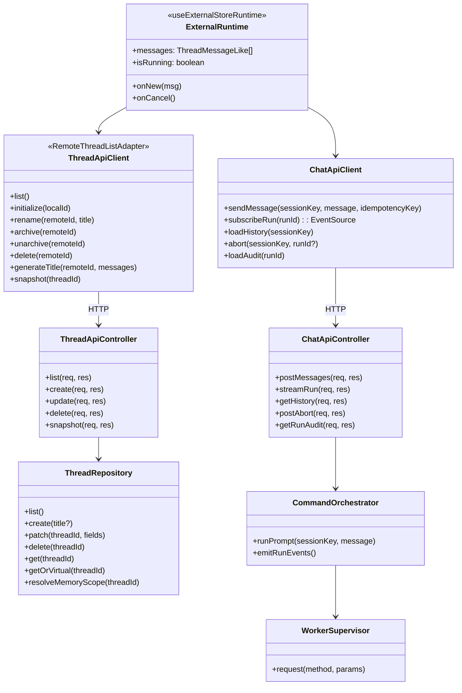
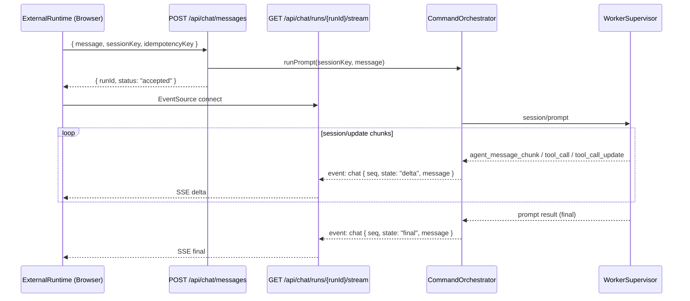

# 260301-s02: assistant-ui useExternalStoreRuntime スレッド対応チャット移行計画

## 0. Core Principles

- **Vercel AI SDK 非依存**
  - `@assistant-ui/react-ai-sdk` と `ai` パッケージは導入しない。
  - バックエンドは ACP worker / pi-coding-agent 経由であり、AI SDK Data Stream 形式を模倣するコストが無駄に高い。
- **Legacy SSE パターン踏襲**
  - `legacy/impl-20260228/src/ui/` が `useExternalStoreRuntime` + 独自 SSE プロトコルで動作実績があり、これを踏襲する。
  - `POST /api/chat/messages` + `GET /api/chat/runs/{runId}/stream` の 2 ステップ方式。
- **Prototype First**
  - まずは `pnpm start` で「スレッド選択 + チャット送受信 + ストリーミング表示」が成立する最短経路を優先する。
  - 既存 `/api/commands` + `/api/events/stream` 契約は壊さず、`/api/chat/*` を追加して段階移行する。
- **SOLID**
  - `src/ui`（表示と操作）、`src/control-plane/http`（API 契約）、`src/control-plane/acp`（worker 連携）を分離する。
- **KISS**
  - Stage 1 では「sessionKey = threadId」の 1:1 マッピングを採用し、複雑な thread merge は行わない。
  - デフォルトスレッド `"main"` は canonical key として常に解決可能とし、実体は遅延作成する。通常の削除 API では消せない保護スレッドとする（OpenClaw 準拠）。
- **YAGNI**
  - Assistant Cloud、共有スレッド、添付ファイル、音声入力は今回スコープ外。
- **DRY**
  - 既存 `RunLifecycle` / `UiRuntime` / `SessionRecoveryStore` / `PermissionGateway` を再利用し、実行経路を二重実装しない。

## 1. 概要と目的 Overview and Purpose

- **What**
  - `@assistant-ui/react` の `useExternalStoreRuntime` + `useRemoteThreadListRuntime` を用いて、スレッド（= セッション）を切り替えて対話できるチャット UI を実装する。
  - フロントは legacy 実装（`legacy/impl-20260228/src/ui/`）の Pub/Sub + SSE パターンを踏襲し、バックエンドは独自 SSE プロトコルを使用する。
- **Why**
  - 現在の最小 UI はデバッグ用途に近く、実運用向けの UX（履歴・スレッド操作・ストリーミング表示・Composer 体験）が不足している。
  - assistant-ui の標準コンポーネントを採用することで、UI 開発コストを抑えつつ拡張可能な基盤にできる。
  - Vercel AI SDK に依存せず、既存 ACP パイプラインと直結することで変換コストを排除する。
- **How**
  - フロントは `useExternalStoreRuntime`（`@assistant-ui/react`）で独自ランタイムを接続する。
  - Thread 管理は `useRemoteThreadListRuntime` で REST API ベースの CRUD を実現する。
  - バックエンドは legacy パターンの `/api/chat/messages` + `/api/chat/runs/{runId}/stream` を実装し、既存 ACP 実行系に委譲する。
  - `@assistant-ui/react` latest のみ導入し、`react-ai-sdk` と `ai` は不要。

## 2. 仕様と受け入れ条件 Specification and Acceptance Criteria

### 2.1 スコープ Scope

- 今回やること
  - `@assistant-ui/react` latest のみを導入する。`@assistant-ui/react-ai-sdk` と `ai` は不要（削除対象）。
  - `useExternalStoreRuntime` で独自ランタイムを構築し、`src/ui` に assistant-ui ベース画面を実装する。
  - `useRemoteThreadListRuntime` で Thread 一覧 API と接続する。
  - control-plane に `/api/chat/*` エンドポイント群を追加する（legacy SSE パターン）。
  - Thread API（`GET/POST/PATCH/DELETE /api/threads` + `/api/threads/:threadId/snapshot`）を追加し、`sessionKey` と 1:1 対応させる。
  - デフォルトスレッド `"main"` は canonical key として常に `GET /api/threads` に仮想エントリとして返す。実体（`ThreadRecord`）は初回メッセージ送信時に遅延作成する（OpenClaw 準拠）。`DELETE /api/threads/main` は拒否する（保護スレッド）。
  - `threadId === "main"` → `memoryScope: "main"`（フルメモリ・compaction 有効）、それ以外 → `memoryScope: "spoke"` のマッピングを維持する。
  - Pending permission UI を新規追加する（legacy にはなかった改善）。
  - 既存 `/api/commands` `/api/events/stream` `/api/snapshot` は互換維持する。
- 成果物
  - UI: assistant-ui ベースの Thread + Composer + Pending Permission 画面
  - API: `/api/chat/*` と `/api/threads*` の実装 + 契約テスト
  - テスト: Unit / Integration / Contract の追加
- 制約
  - Web UI は `control-plane (src/index.ts)` 同居プロセスを維持する。
  - ACP 境界契約は維持する。
  - スレッド ID は v1 では `sessionKey` を正本とする（別 ID 層は導入しない）。
  - `"main"` スレッドは既存 agent-runner の `memoryScope` / compaction / transcript パス解決の前提であり、削除不可。

### 2.2 非スコープ Non Scope

- Assistant Cloud の導入
- マルチユーザー共有スレッド
- 既存 Slack collector / proactive pipeline の改修
- 添付ファイル、音声、Tool UI の高度カスタム描画
- `/api/commands` 経路の削除（今回は残す）
- Vercel AI SDK / AI SDK Data Stream 形式の模倣
- LLM によるスレッドタイトル自動生成（`generateTitle` v2 — 別計画の軽量 LLM ユーティリティに依存）

### 2.3 ユースケース Use Cases

- 正常系1: ユーザーが新規スレッドを作成し、メッセージ送信するとストリーミング応答が表示される。
- 正常系2: 既存スレッドを選択すると、そのスレッドの履歴（ツールイベント含む）が復元表示される。
- 正常系3: ページ再読込後もスレッド一覧と各スレッドの履歴が復元される。
- 正常系4: 実行中に tool permission が要求されると、Pending Permission UI に表示され、approve/deny できる。
- 異常系1: worker が途中でクラッシュした場合、該当スレッドの run は `failed` として UI 表示される。
- 異常系2: 不正な threadId/sessionKey の API 呼び出しは適切なエラーで拒否される。

### 2.4 受け入れ条件 Acceptance Criteria

1. Given `pnpm start` で control-plane が起動済み
   When ブラウザで `/` を開く
   Then assistant-ui ベースの Thread + Composer 画面が表示される。
2. Given スレッド A/B が存在する
   When A で送信した後に B に切り替えて送信する
   Then A/B それぞれ独立した履歴として表示され、run が混線しない。
3. Given `POST /api/chat/messages` に有効な `sessionKey` と `message` を送る
   When worker が応答を返す
   Then `{ runId, status }` が返り、`GET /api/chat/runs/{runId}/stream` で SSE ストリームが購読できる。
4. Given `GET /api/chat/runs/{runId}/stream` を購読中
   When worker がチャンクを返す
   Then `event: chat` で `ChatStreamEvent` が seq 順に配信される。
5. Given worker crash/timeout が発生する
   When 実行中 run が失敗する
   Then UI に失敗状態が表示され、`runId/sessionKey` 付きログが残る。
6. Given 既存 `/api/commands` クライアントが存在する
   When 更新後に同 API を呼び出す
   Then 既存契約どおり `accepted -> update -> completed|failed` が維持される。
7. Given tool permission が要求される
   When Pending Permission UI で approve する
   Then permission が解決され、run が続行される。
8. Given `PATCH /api/threads/:threadId` を呼び出す
   When `title` または `archived` を含む
   Then 指定フィールドのみ更新され、`threadId` は不変である。
9. Given control-plane が起動済み
   When `GET /api/threads` を呼び出す（`"main"` の実体が未作成でも）
   Then `threadId: "main"` が仮想エントリとして Thread 一覧の先頭に表示される。
10. Given `DELETE /api/threads/main` を呼び出す
    When `threadId` が `"main"` である
    Then `403 FORBIDDEN` を返し、スレッドは削除されない。

### 2.5 既知の制約 Known Limitations

- v1 は `sessionKey=threadId` 固定で、thread rename と key 分離は行わない。
- `PATCH /api/threads/:threadId` は `title` と `archived` のみ許可し、`threadId` の変更は行わない。
- `"main"` スレッドは削除不可。`memoryScope: "main"` による compaction・transcript パス・メモリ読み書きの特権を持つ。実体は遅延作成（OpenClaw 準拠）。
- `"main"` 以外のスレッドは `memoryScope: "spoke"` となり、compaction 無効・メモリ書込み不可。
- `generateTitle` は v1 では adapter 側で最初のユーザーメッセージを truncate する。LLM によるタイトル生成は別計画（軽量 LLM ユーティリティ）に依存し、v2 で導入する。
- Playwright E2E は `pnpm check` に含めず、別タスク/別ジョブで実行する。

## 3. 前提技術スタック Context and Tech Stack

- **Language / Framework**
  - TypeScript (ESM), Node.js, React 19
- **Libraries**
  - `@assistant-ui/react`（latest）— `useExternalStoreRuntime` / `useRemoteThreadListRuntime`
  - 既存 `@mariozechner/pi-coding-agent` / ACP worker supervisor
- **削除対象**
  - `@assistant-ui/react-ai-sdk`（不要）
  - `ai`（AI SDK、不要）
- **Style Guide**
  - 既存 ESLint + Prettier に準拠
- **Runtime / Deployment**
  - 単一プロセス control-plane（HTTP API + UI 配信）
- **Testing**
  - Node.js built-in test runner (`node --import tsx --test`)

## 4. インターフェース契約 Interface Contracts

### 4.1 公開 API 一覧

#### Chat API（新規 — legacy SSE パターン）

| Method | Path | 説明 |
|--------|------|------|
| `POST` | `/api/chat/messages` | メッセージ送信 → `{ runId, status }` |
| `GET` | `/api/chat/runs/:runId/stream` | SSE ストリーム（`event: chat`） |
| `GET` | `/api/chat/history` | 履歴取得（`?sessionKey={key}`） |
| `POST` | `/api/chat/abort` | 実行中止（`{ sessionKey, runId? }`） |
| `GET` | `/api/chat/runs/:runId/audit` | ツール監査情報 |

#### Thread API（新規）

| Method | Path | 説明 |
|--------|------|------|
| `GET` | `/api/threads` | スレッド一覧 |
| `POST` | `/api/threads` | スレッド作成 |
| `PATCH` | `/api/threads/:threadId` | スレッド更新（`title`, `archived`） |
| `DELETE` | `/api/threads/:threadId` | スレッド削除（`"main"` は `403` 拒否） |
| `GET` | `/api/threads/:threadId/snapshot` | スレッド単位の run/tool/permission 復元 |

#### 既存 API（互換維持）

| Method | Path | 説明 |
|--------|------|------|
| `POST` | `/api/commands` | コマンド送信 |
| `GET` | `/api/snapshot` | 状態スナップショット |
| `GET` | `/api/events/stream` | SSE イベントストリーム |

### 4.2 データモデルとスキーマ

#### `POST /api/chat/messages` Request

```typescript
{
  message: string;          // ユーザーメッセージテキスト
  sessionKey: string;       // = threadId
  idempotencyKey: string;   // 冪等性キー
}
```

#### `POST /api/chat/messages` Response

```typescript
{
  runId: string;            // "session:<sessionId>:run:<n>"
  status: "accepted";
}
```

#### `GET /api/chat/runs/:runId/stream` — SSE

```
event: chat
data: {"seq":1,"state":"delta","runId":"...","sessionKey":"...","message":"hello"}

event: chat
data: {"seq":2,"state":"delta","runId":"...","sessionKey":"...","message":" world"}

event: chat
data: {"seq":3,"state":"final","runId":"...","sessionKey":"...","message":"hello world"}
```

#### `ChatStreamEvent` 型

```typescript
interface ChatStreamEvent {
  seq: number;
  state: "delta" | "final" | "aborted" | "error";
  runId: string;
  sessionKey: string;
  message?: string;         // delta/final 時のテキスト
  errorMessage?: string;    // error 時のエラー詳細
  toolCallId?: string;      // tool 関連 delta 時
  toolName?: string;        // tool 関連 delta 時
  toolStatus?: "started" | "completed" | "failed"; // tool 関連 delta 時
}
```

#### `session/update` → `ChatStreamEvent` 変換マッピング

| ACP イベント | ChatStreamEvent |
|---|---|
| `agent_message_chunk` | `state: "delta"`, `message: chunk.text` |
| `tool_call` | `state: "delta"`, `toolCallId`, `toolName`, `toolStatus: "started"` |
| `tool_call_update` | `state: "delta"`, `toolCallId`, `toolName`, `toolStatus: "completed"\|"failed"` |
| `session/prompt` 正常結果 | `state: "final"`, `message: fullText` |
| `run/failed` | `state: "error"`, `errorMessage` |
| abort 要求 | `state: "aborted"` |

#### `POST /api/chat/abort` Request

```typescript
{
  sessionKey: string;
  runId?: string;           // 省略時は sessionKey の最新 run
}
```

#### `GET /api/chat/history` Response

```typescript
{
  messages: Array<{
    role: "user" | "assistant";
    content: string;
    runId?: string;
    toolCount?: number;
    timestamp: string;
  }>;
}
```

#### `ThreadRecord`

```typescript
{
  threadId: string;         // 不変（v1 は threadId=sessionKey 固定）
  title: string;
  archived: boolean;
  isDefault: boolean;       // true = "main" スレッド（削除不可）
  createdAt: string;        // ISO 8601
  updatedAt: string;        // ISO 8601
}
```

#### デフォルト "main" スレッド規約（OpenClaw 準拠）

- **canonical key**: `"main"` は常に解決可能な canonical key として扱う。実体（`ThreadRecord`）の有無に関わらず、`GET /api/threads` は `"main"` を仮想エントリとして返す。
- **遅延実体化**: `ThreadRecord` 実体は初回メッセージ送信（`POST /api/chat/messages { sessionKey: "main" }`）時に作成する。未存在時は仮想エントリ（デフォルト値）を返す。
- **削除保護**: `DELETE /api/threads/main` は `403 FORBIDDEN` で拒否する。
- **一覧順序**: `GET /api/threads` は `"main"` を常に先頭に返す。
- **memoryScope マッピング**: `threadId === "main"` → `memoryScope: "main"`（フルメモリ・compaction 有効）。それ以外 → `memoryScope: "spoke"`（メモリ書込み不可・compaction 無効）。
- **既存互換**: 既存の `sessionKey === "main"` 判定（`agent-runner.ts`, `agent-session-factory.ts`, `src/index.ts`）はそのまま維持される。

#### `POST /api/threads` Request / Response

- Request: `{ title?: string }`（`title` 省略時はデフォルト空文字。`useRemoteThreadListRuntime` の `initialize(localId)` から呼ばれる想定）
- Response: `ThreadRecord`（`threadId` はサーバー採番）

#### `PATCH /api/threads/:threadId` Request

- `{ title?: string; archived?: boolean }` を受理。`threadId` / `sessionKey` / `createdAt` / `isDefault` 等の禁止フィールドを含む場合は `400 INVALID_REQUEST`。
- `useRemoteThreadListRuntime` の `archive(remoteId)` / `unarchive(remoteId)` は `PATCH { archived: true/false }` で実現する。

#### `GET /api/threads/:threadId/snapshot` Response

```typescript
{
  thread: ThreadRecord;
  runs: RunSummary[];
  toolEventsByRun: Record<string, ToolEventRecord[]>;
  pendingPermissions: PermissionSummary[];
}
```

#### Idempotency 規約

- 既存 `RunLifecycle` の `resolveIdempotency()` を利用する。
- 同一 `sessionKey + idempotencyKey + requestHash` → no-op（重複吸収）。
- 同一 `sessionKey + idempotencyKey` で `requestHash` 差分 → `409 CONFLICT`。

#### Thread metadata 永続化

- 正本: `<stateDir>/journal/control-plane/threads.jsonl`（append-only）
- 高速復元: `<stateDir>/cursor/control-plane.threads.snapshot.json`（materialized snapshot）

### 4.3 エラーと例外 Error Handling

- エラー分類
  - `INVALID_REQUEST`, `UNSUPPORTED_CAPABILITY`, `WORKER_TIMEOUT`, `WORKER_CRASHED`, `DOWNSTREAM_ERROR`
- リトライ方針
  - `/api/chat/*` の自動再試行は行わず、UI で手動再送とする
  - SSE 再接続は legacy パターンの指数バックオフを踏襲（initial: 2s, max: 30s, factor: 1.8, jitter: ±25%, maxAttempts: 12）
- タイムアウト方針
  - 既存 `session/prompt` timeout（5 分）を踏襲
- ログ方針と個人情報
  - 既存 structured log 形式に準拠し `runId/sessionKey/toolCallId` を必須出力
  - prompt 生文は debug レベルでも既定マスクを維持

### 4.4 代表的な例 Examples

```bash
# main 仮想エントリ確認（実体未作成でも返る）
curl -sS http://127.0.0.1:3100/api/threads
```

```json
[
  {
    "threadId": "main",
    "title": "Main",
    "archived": false,
    "isDefault": true,
    "createdAt": "1970-01-01T00:00:00.000Z",
    "updatedAt": "1970-01-01T00:00:00.000Z"
  }
]
```

```bash
# スレッド作成（initialize から呼ばれる想定、title 省略可）
curl -sS -X POST http://127.0.0.1:3100/api/threads \
  -H 'content-type: application/json' \
  -d '{}'
```

```json
{
  "threadId": "thr_0001",
  "title": "",
  "archived": false,
  "isDefault": false,
  "createdAt": "2026-03-01T12:00:00.000Z",
  "updatedAt": "2026-03-01T12:00:00.000Z"
}
```

```bash
# メッセージ送信
curl -sS -X POST http://127.0.0.1:3100/api/chat/messages \
  -H 'content-type: application/json' \
  -d '{"message":"hello","sessionKey":"thr_0001","idempotencyKey":"idem_001"}'
```

```json
{
  "runId": "session:thr_0001:run:1",
  "status": "accepted"
}
```

```bash
# SSE ストリーム購読
curl -N http://127.0.0.1:3100/api/chat/runs/session:thr_0001:run:1/stream
```

```text
event: chat
data: {"seq":1,"state":"delta","runId":"session:thr_0001:run:1","sessionKey":"thr_0001","message":"hello"}

event: chat
data: {"seq":2,"state":"delta","runId":"session:thr_0001:run:1","sessionKey":"thr_0001","message":" world"}

event: chat
data: {"seq":3,"state":"final","runId":"session:thr_0001:run:1","sessionKey":"thr_0001","message":"hello world"}
```

```bash
# 実行中止
curl -sS -X POST http://127.0.0.1:3100/api/chat/abort \
  -H 'content-type: application/json' \
  -d '{"sessionKey":"thr_0001"}'
```

```bash
# スレッド snapshot 取得
curl -sS http://127.0.0.1:3100/api/threads/thr_0001/snapshot
```

## 5. アーキテクチャと設計図 Architecture and Diagrams

### 5.1 図の選択方針

- UI / HTTP / ACP を跨ぐためクラス図を必須とする。
- ストリーミング連携の整合確認のためシーケンス図を追加する。

### 5.2 クラス図 Class Diagram



### 5.3 シーケンス図 Sequence Diagram



### 5.4 既存 `src/ui` 存廃方針

| ファイル | 判定 | 備考 |
|---|---|---|
| `src/ui/runtime.ts` | **Keep** | `ToolEventBridge` と pending permission 投影を再利用 |
| `src/ui/minimal-page.ts` | **暫定維持** | Stage 4 で削除可否を再判定 |
| `src/ui/components/control-plane-console.tsx` | **Replace** | 機能は assistant-ui の Thread/Composer + 補助パネルへ移植 |
| `src/ui/components/AuditDetailTab.tsx` | **Keep** | assistant-ui 画面のサイドパネルへ統合 |

## 6. テスト戦略 Test Strategy

### 6.1 テストの種類

- **Unit**
  - `ChatStreamEvent` 型の変換ロジック（`session/update` → `ChatStreamEvent`）
  - `/api/chat/messages` request validation（message, sessionKey, idempotencyKey 必須）
  - `/api/chat/abort` request validation
  - thread repository の CRUD / snapshot
  - `"main"` 仮想エントリ（実体未作成時にデフォルト値を返す）
  - `"main"` 遅延実体化（初回メッセージ送信で `ThreadRecord` 作成）
  - `DELETE /api/threads/main` の `403` 拒否
  - `GET /api/threads` の `"main"` 先頭ソート
  - `threadId` → `memoryScope` マッピング（`"main"` → `"main"`, それ以外 → `"spoke"`）
  - `PATCH /api/threads/:threadId` の `title` / `archived` 受理と禁止フィールド拒否
  - `POST /api/threads` の `title` optional（省略時デフォルト値）
- **Integration**
  - `POST /api/chat/messages` → `GET /api/chat/runs/{runId}/stream` で SSE ストリームが完了する
  - `/api/chat/messages` 重複再送で新規 run が作成されない
  - スレッド切替で履歴が分離される
  - permission request → approve → run 続行
- **Contract**
  - 既存 `/api/commands` 契約が非回帰
  - SSE `event: chat` の `ChatStreamEvent` 形式が契約準拠
  - ACP baseline method / capability gate の非回帰

### 6.2 テスト方針

- AI SDK serializer の golden fixture は**不要**（独自 SSE プロトコルのため）。
- SSE プロトコル契約テストを中心に据える（`ChatStreamEvent` の seq 順序、state 遷移）。
- legacy 実装の `computeBackoff` はユーティリティとして移植し、単体テストを付ける。

### 6.3 カバレッジ対象

- 重要ロジック
  - 1 スレッド 1 セッションの整合
  - idempotency no-op（重複 run 防止）
  - `ChatStreamEvent` seq 単調増加
  - run terminal と thread metadata 更新
  - thread snapshot 経由の tool event 復元
- エラー分岐
  - 不正 sessionKey / runId
  - worker timeout / crash
  - SSE 再接続
- 境界条件
  - 空メッセージ
  - 長文入力
  - 同時送信（異なる thread）

## 7. 実装タスクリスト Implementation Plan

### Stage 1: 設計と準備（8 タスク）

- [ ] `Task-AUI-001` `@assistant-ui/react-ai-sdk` と `ai` パッケージを `package.json` から削除し、`@assistant-ui/react` latest のみに整理
- [ ] `Task-AUI-002` `useExternalStoreRuntime` + `useRemoteThreadListRuntime` の API を調査し、接続パターンを確定
- [ ] `Task-AUI-003` `/api/chat/*` 契約定義を `src/control-plane/contracts/http-api.ts` に追加（`ChatStreamEvent`, request/response 型）
- [ ] `Task-AUI-004` `/api/threads*` 契約定義を `src/control-plane/contracts/http-api.ts` に追加（`ThreadRecord`, snapshot response 型）
- [ ] `Task-AUI-005` `src/index.ts` 直書き API ルートを `src/control-plane/http/*` へ抽出する設計を確定
- [ ] `Task-AUI-006` 既存 `src/ui` ファイルの存廃判定を実施（§5.4 表に基づく）
- [ ] `Task-AUI-007` SSE `ChatStreamEvent` 型とテスト雛形を追加
- [ ] `Task-AUI-008` `session/update` → `ChatStreamEvent` 変換ロジックのテスト雛形を追加

### Stage 2: useExternalStoreRuntime 基盤 + /api/chat/* 実装（14 タスク）

- [ ] `Task-AUI-S2-RED-001` Test: `POST /api/chat/messages` の request/response 契約失敗テスト
- [ ] `Task-AUI-S2-RED-002` Test: `GET /api/chat/runs/{runId}/stream` SSE 契約失敗テスト
- [ ] `Task-AUI-S2-RED-003` Test: `session/update` → `ChatStreamEvent` 変換の失敗テスト
- [ ] `Task-AUI-S2-RED-004` Test: idempotency 重複吸収の失敗テスト
- [ ] `Task-AUI-S2-GREEN-000` Impl: `src/index.ts` 既存ルートを `src/control-plane/http/*` へ抽出
- [ ] `Task-AUI-S2-GREEN-001` Impl: `POST /api/chat/messages` を既存 run orchestrator へ接続
- [ ] `Task-AUI-S2-GREEN-002` Impl: `GET /api/chat/runs/{runId}/stream` SSE エンドポイント実装
- [ ] `Task-AUI-S2-GREEN-003` Impl: `session/update` → `ChatStreamEvent` 変換ロジック実装
- [ ] `Task-AUI-S2-GREEN-004` Impl: `GET /api/chat/history` 実装
- [ ] `Task-AUI-S2-GREEN-005` Impl: `POST /api/chat/abort` 実装
- [ ] `Task-AUI-S2-GREEN-006` Impl: `useExternalStoreRuntime` ベースの UI ランタイム（legacy `runtime.ts` パターン移植）
- [ ] `Task-AUI-S2-GREEN-007` Impl: assistant-ui Thread + Composer 画面実装
- [ ] `Task-AUI-S2-REFACTOR-001` Refactor: `src/ui` 存廃方針に従って既存 UI 資産を整理
- [ ] `Task-AUI-S2-INTEG-001` Integration: 送信 → SSE ストリーミング → 完了まで統合テスト

### Stage 3: Thread 管理 + Pending Permission UI（16 タスク）

- [ ] `Task-AUI-S3-RED-000` Test: `"main"` 仮想エントリ・遅延実体化・削除拒否・先頭ソート・memoryScope マッピングの失敗テスト
- [ ] `Task-AUI-S3-RED-001` Test: thread 作成/選択/削除の失敗テスト
- [ ] `Task-AUI-S3-RED-002` Test: thread 切替で履歴分離される失敗テスト
- [ ] `Task-AUI-S3-RED-003` Test: `PATCH /api/threads/:threadId` が `title`/`archived` 以外を拒否する失敗テスト
- [ ] `Task-AUI-S3-RED-004` Test: `GET /api/threads/:threadId/snapshot` で run/tool history が thread 単位復元される失敗テスト
- [ ] `Task-AUI-S3-GREEN-000` Impl: `ThreadRepository` に `"main"` 仮想エントリ（`getOrVirtual()`）、遅延実体化、削除保護、先頭ソート、`resolveMemoryScope()` を実装
- [ ] `Task-AUI-S3-GREEN-001` Impl: `ThreadRepository` + `/api/threads*` API 実装
- [ ] `Task-AUI-S3-GREEN-002` Impl: `useRemoteThreadListRuntime` + `RemoteThreadListAdapter`（list/initialize/rename/archive/unarchive/delete/generateTitle）で Thread 一覧 UI 実装。`generateTitle` は v1 ではユーザーメッセージ truncate フェイク
- [ ] `Task-AUI-S3-GREEN-003` Impl: `GET /api/threads/:threadId/snapshot` 実装と UI hydrate 接続
- [ ] `Task-AUI-S3-GREEN-004` Impl: `PATCH /api/threads/:threadId` を `title`/`archived` 更新で実装（archive/unarchive adapter 対応）
- [ ] `Task-AUI-S3-GREEN-005` Impl: Pending Permission UI コンポーネント（permission/requested → approve/deny ボタン → permission/resolved）
- [ ] `Task-AUI-S3-GREEN-006` Impl: Permission UI と `PermissionGateway` / `PermissionRegistry` の接続
- [ ] `Task-AUI-S3-REFACTOR-001` Refactor: session recovery / thread metadata 更新責務を分離
- [ ] `Task-AUI-S3-INTEG-001` Integration: マルチスレッド E2E（A/B 分離、再読込復元）
- [ ] `Task-AUI-S3-CONTRACT-001` Contract: `/api/commands` 非回帰 + ACP 契約非回帰を確認
- [ ] `Task-AUI-S3-CONTRACT-002` Contract: `PATCH /api/threads/:threadId` の禁止フィールドが `400 INVALID_REQUEST` になることを確認（`title`/`archived` 以外拒否）

### Stage 4: 統合と検証（5 タスク）

- [ ] `Task-AUI-VERIFY-001` `pnpm check` を通す
- [ ] `Task-AUI-VERIFY-002` `pnpm start` → ブラウザで `/` を開き、Thread + Composer 画面が表示されることを手動確認
- [ ] `Task-AUI-VERIFY-003` worker crash/timeout 時の表示とログを確認
- [ ] `Task-AUI-VERIFY-004` 既存 API クライアント互換性を確認
- [ ] `Task-AUI-VERIFY-005` `src/ui/minimal-page.ts` の削除可否を最終判定

## 8. 完了の定義 Definition of Done

### 8.1 機能 DoD

- [ ] 受け入れ条件（§2.4）がすべて満たされていること
- [ ] 既知の制約が明文化され、想定通りであること
- [ ] 契約の例（§4.4）に対して期待通りの結果が得られること

### 8.2 品質 DoD

- [ ] 全てのテストがパスしていること
- [ ] Linter / Formatter のエラーがないこと
- [ ] 不要なデバッグコードが削除されていること

## 9. 懸念事項と未確定事項 Concerns and Questions

- **assistant-ui latest 破壊変更**: `useExternalStoreRuntime` / `useRemoteThreadListRuntime` の API が latest で変更されている可能性がある。Stage 1 で調査・確定する。
- **SSE 再接続**: legacy の `computeBackoff` パターンを移植するが、ブラウザ EventSource の自動再接続との競合を確認する必要がある。
- **Pending Permission UI 配置**: Thread 内にインライン表示するか、サイドパネルに分離するかを Stage 3 開始時に確定する。
- **`RemoteThreadListAdapter` の整合**: adapter interface（`list`, `initialize`, `rename`, `archive`, `unarchive`, `delete`, `generateTitle`）と `/api/threads` API の対応を Stage 1 で最終確認する。特に `initialize(localId)` → `POST /api/threads` の引数マッピングを確定する。
- **`generateTitle` の v2 昇格**: v1 は adapter 側で最初のユーザーメッセージを truncate する。v2 では **軽量 LLM ユーティリティ（別計画）** を用いた `POST /api/threads/:threadId/generate-title` エンドポイントを追加し、agent パイプラインを経由しない直接 LLM 呼び出しでタイトルを生成する。本計画のスコープ外であり、別途 `doc/plan/` に計画書を作成する。

## 10. リスクとロールバック Risk and Rollback

- **リスク**: assistant-ui latest の `useExternalStoreRuntime` API が legacy 実装時と非互換。
  - **緩和策**: Stage 1 で API 調査を完了し、非互換が重大な場合は assistant-ui バージョンを固定する。
- **リスク**: `RemoteThreadListAdapter` の要求と `/api/threads` API の不整合。
  - **緩和策**: API 側で `title` optional、`PATCH` に `archived` 許可、`generateTitle` は v1 adapter 側 truncate で対応済み。`initialize(localId)` → `POST /api/threads` の変換は adapter 層で吸収。最悪の場合 `useExternalStoreRuntime` のみで thread 選択を自前実装する。
- **ロールバック**: 既存 `/api/commands` + `/api/events/stream` + `minimal-page.ts` は維持するため、新 UI が破綻しても既存経路で運用継続可能。

## 参考

- **Legacy 実装**
  - `legacy/impl-20260228/src/ui/runtime.ts` — createRuntime(), SSE 接続, Pub/Sub パターン
  - `legacy/impl-20260228/src/ui/hooks/useAdjutantThread.ts` — useExternalStoreRuntime 接続
  - `legacy/impl-20260228/src/ui/adapter.ts` — RuntimeMessage → ThreadMessageLike 変換
  - `legacy/impl-20260228/src/ui/App.tsx` — AssistantRuntimeProvider + コンポーネント構成
- **assistant-ui 公式ドキュメント**
  - External Store: https://www.assistant-ui.com/docs/runtimes/custom/external-store
  - Custom Thread List: https://www.assistant-ui.com/docs/runtimes/custom/custom-thread-list
