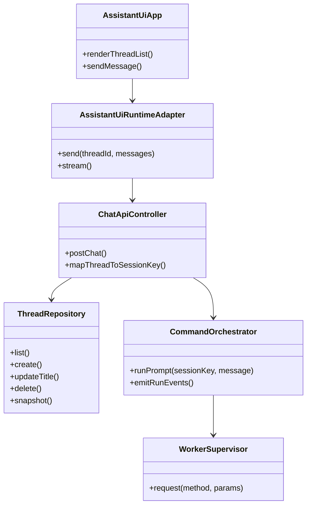
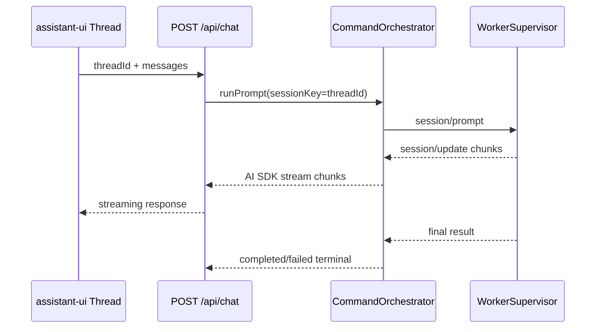

# 260301-s02: assistant-ui + AI SDK スレッド対応チャット移行計画

## 0. Core Principles

- Prototype First
  - まずは `pnpm start` で「スレッド選択 + チャット送受信 + ストリーミング表示」が成立する最短経路を優先する。
  - 既存 `/api/commands` + `/api/events/stream` 契約は壊さず、`/api/chat` を追加して段階移行する。
- SOLID
  - `src/ui`（表示と操作）、`src/control-plane/http`（API契約）、`src/control-plane/acp`（worker連携）を分離する。
- KISS
  - Stage 1 では「sessionKey = threadId」の 1:1 マッピングを採用し、複雑な thread merge は行わない。
- YAGNI
  - Assistant Cloud、共有スレッド、添付ファイル、音声入力は今回スコープ外。
- DRY
  - 既存 `RunLifecycle` / `UiRuntime` / `SessionRecoveryStore` / `PermissionGateway` を再利用し、実行経路を二重実装しない。

## 1. 概要と目的 Overview and Purpose

- What
  - `npx assistant-ui@latest init` を起点に `@assistant-ui/react-ai-sdk` ベースのチャットUIへ置換し、スレッド（= セッション）を切り替えて対話できるようにする。
- Why
  - 現在の最小UIはデバッグ用途に近く、実運用向けの UX（履歴・スレッド操作・ストリーミング表示・Composer 体験）が不足している。
  - assistant-ui の標準コンポーネントを採用することで、UI開発コストを抑えつつ拡張可能な基盤にできる。
- How
  - フロントは `useChatRuntime`（`@assistant-ui/react-ai-sdk`）へ移行する。
  - バックエンドは既存 ACP 実行を利用しつつ、AI SDK transport が期待する `/api/chat` を追加実装する。
  - スレッド一覧は「sessionKey ベース」で管理し、UI ThreadList と control-plane session を同一概念に揃える。
  - `@assistant-ui/react` v0.12 系は互換維持せず、latest を基準にクリーン導入する（必要な既存機能のみ移植）。

## 2. 仕様と受け入れ条件 Specification and Acceptance Criteria

### 2.1 スコープ Scope

- 今回やること
  - `assistant-ui` の `v0.12.10 -> latest` マイグレーション差分を棚卸しし、破壊変更を契約に反映する。
  - `npx assistant-ui@latest init` を既存プロジェクトへ適用し、生成物を本リポジトリ構成へ統合する。
  - `@assistant-ui/react-ai-sdk` と `ai` を導入し、`src/ui` に assistant-ui ベース画面を実装する。
  - control-plane に `POST /api/chat`（AI SDK transport 向け）を追加する。
  - スレッド一覧 API（`GET/POST/PATCH/DELETE /api/threads`）を追加し、`sessionKey` と 1:1 対応させる。
  - スレッド再水和 API（`GET /api/threads/:threadId/snapshot`）を追加し、run と tool event を thread 単位で復元する。
  - UI の Thread 切替時に `sessionKey` を切り替え、会話履歴をスレッド単位で復元する。
  - 既存 `/api/commands` `/api/events/stream` `/api/snapshot` は互換維持する。
- 成果物
  - UI: assistant-ui ベースのスレッド対応チャット画面
  - API: `/api/chat` と `/api/threads*` の実装 + 契約テスト
  - 仕様: `doc/spec.md` の API/UI セクション更新
  - テスト: Unit/Integration/Contract の追加
- 制約
  - Web UI は `control-plane (src/index.ts)` 同居プロセスを維持する。
  - ACP 境界契約（`doc/spec.md` 14.5/14.7/14.8）は維持する。
  - スレッドIDは v1 では `sessionKey` を正本とする（別ID層は導入しない）。
  - `POST /api/chat` は latest user message のみ prompt 化し、`messages[]` 全再構成は行わない。

### 2.2 非スコープ Non Scope

- Assistant Cloud の導入
- マルチユーザー共有スレッド
- 既存 Slack collector / proactive pipeline の改修
- 添付ファイル、音声、Tool UI の高度カスタム描画
- `/api/commands` 経路の削除（今回は残す）

### 2.3 ユースケース Use Cases

- 正常系1: ユーザーが新規スレッドを作成し、メッセージ送信するとストリーミング応答が表示される。
- 正常系2: 既存スレッドを選択すると、そのスレッドの履歴（ツールイベント含む）が復元表示される。
- 正常系3: ページ再読込後もスレッド一覧と各スレッドの履歴が復元される。
- 異常系1: worker が途中でクラッシュした場合、該当スレッドの run は `failed` としてUI表示される。
- 異常系2: 不正な threadId/sessionKey の `/api/chat` 呼び出しは `INVALID_REQUEST` で拒否される。

### 2.4 受け入れ条件 Acceptance Criteria

1. Given `pnpm start` で control-plane が起動済み
   When ブラウザで `/` を開く
   Then assistant-ui ベースの Thread + Composer 画面が表示される。
2. Given スレッド A/B が存在する
   When A で送信した後に B に切り替えて送信する
   Then A/B それぞれ独立した履歴として表示され、run が混線しない。
3. Given `POST /api/chat` に有効な `threadId` と `messages[]` を送る
   When worker が応答を返す
   Then `messages[]` の末尾 `role=user` のみが prompt 化され、idempotency 判定後に AI SDK 互換ストリームが返る。
4. Given 過去に tool call を含む run が存在する
   When そのスレッドを再選択する
   Then `GET /api/threads/:threadId/snapshot` からツール使用履歴が復元される。
5. Given worker crash/timeout が発生する
   When 実行中 run が失敗する
   Then UI に失敗状態が表示され、`runId/sessionKey` 付きログが残る。
6. Given 既存 `/api/commands` クライアントが存在する
   When 更新後に同APIを呼び出す
   Then 既存契約どおり `accepted -> update -> completed|failed` が維持される。
7. Given `PATCH /api/threads/:threadId` を呼び出す
   When リクエストが `title` のみを含む
   Then `title` のみ更新され、`threadId` は不変である。
8. Given `PATCH /api/threads/:threadId` を呼び出す
   When `threadId` や `sessionKey` など禁止フィールドを含む
   Then `400 INVALID_REQUEST` を返し、thread metadata は変更されない。

### 2.5 既知の制約 Known Limitations

- assistant-ui CLI は Next.js 前提の生成物を含む場合があるため、Vite/Node 構成への手動調整が必要。
- v1 は `sessionKey=threadId` 固定で、thread rename と key 分離は行わない。
- `PATCH /api/threads/:threadId` は `title` 更新のみ許可し、`threadId` の変更は行わない。
- AI SDK transport と既存 SSE 監査イベントの二重経路を持つため、初期段階は観測ログが増える。
- Playwright E2E は `pnpm check` に含めず、別タスク/別ジョブで実行する。

## 3. 前提技術スタック Context and Tech Stack

- Language Framework
  - TypeScript (ESM), Node.js, React 19
- Libraries
  - `@assistant-ui/react`（latest）
  - `@assistant-ui/react-ai-sdk`（latest）
  - `ai`（AI SDK, latest）
  - 既存 `@mariozechner/pi-coding-agent` / ACP worker supervisor
- Style Guide
  - 既存 ESLint + Prettier に準拠
- Runtime Deployment
  - 単一プロセス control-plane（HTTP API + UI配信）
- Testing
  - Node.js built-in test runner (`node --import tsx --test`)
  - 必要に応じて component smoke test（JSDOM + Testing Library）

## 4. インターフェース契約 Interface Contracts

### 4.1 公開APIまたは外部I O一覧

- HTTP API（新規）
  - `POST /api/chat`（AI SDK transport 用）
  - `GET /api/threads`
  - `POST /api/threads`
  - `GET /api/threads/:threadId/snapshot`（thread 単位の run/tool history 復元）
  - `PATCH /api/threads/:threadId`（`title` 更新のみ）
  - `DELETE /api/threads/:threadId`
- HTTP API（既存維持）
  - `POST /api/commands`
  - `GET /api/snapshot`
  - `GET /api/events/stream`
- 永続化
  - 既存 run/tool/recovery/audit の journal/cursor
  - thread metadata 正本: `<stateDir>/journal/control-plane/threads.jsonl`（append-only）
  - thread metadata 高速復元: `<stateDir>/cursor/control-plane.threads.snapshot.json`（materialized snapshot）
- 外部連携
  - ACP worker（`session/new`, `session/load`, `session/prompt`, `session/update`）
- 実装配置
  - `src/index.ts` 直書きルーティングを維持せず、`src/control-plane/http/*` へ抽出してから `/api/chat` と `/api/threads*` を追加する。

### 4.2 データモデルとスキーマ

- `ThreadRecord`
  - `{ threadId: string; title: string; archived: boolean; createdAt: string; updatedAt: string }`
  - `threadId` は不変（v1 は `threadId=sessionKey` 固定）
- `POST /api/threads` Request
  - `{ title: string }`（`threadId` 採番責務は Stage 1 で確定）
- `POST /api/threads` Response
  - `ThreadRecord`
  - `threadId` は「サーバー採番」または「クライアント指定」を Stage 1 で確定し、確定後に契約へ固定する
- `ChatInputMessage`（v1）
  - `{ id?: string; role: "system"|"user"|"assistant"|"tool"; content: string | Array<{ type: "text"; text: string }>; toolCallId?: string; name?: string }`
  - v1 で prompt 化対象は `role="user"` かつ text content を持つ message のみ
- `POST /api/chat` Request
  - `{ threadId: string; messages: ChatInputMessage[]; metadata?: { idempotencyKey?: string } }`
  - `messages[]` は空不可、末尾 `role=user` が必須
  - `idempotencyKey` 解決順: `metadata.idempotencyKey` -> 末尾 `user` message の `id`
  - 上記のどちらでも解決できない場合は `400 INVALID_REQUEST`
- `POST /api/chat` Response
  - AI SDK Data Stream 形式（assistant-ui transport 互換）
- `/api/chat` 実行入力の正契約（v1）
  - `prompt` は `messages[]` 全体再構成ではなく、末尾 `role=user` のテキストのみを使用する
  - `threadId` を `sessionKey` として既存 `POST /api/commands` 実行系へ委譲する
  - idempotency は既存 `RunLifecycle` の重複吸収を利用する
  - 同一 `threadId + idempotencyKey + prompt` は no-op（新規 run を作らない）
  - 同一 `threadId + idempotencyKey` で `prompt` 差分がある場合は `409 INVALID_REQUEST`
- `/api/chat` ストリーム契約（v1）
  - Wire format は AI SDK 公式 serializer 出力をそのまま使用し、自前で prefix 文字列を組み立てない。
  - アプリケーションレベルのイベント型は以下を必須とする。
    - `text-delta`（テキストチャンク）
    - `tool-call`（ツール開始）
    - `tool-result`（ツール終了、成功/失敗）
    - `finish`（最終 stopReason）
    - `error`（run 失敗）
  - 変換マッピングは以下とする。
    - `session/update` `agent_message_chunk` -> `text-delta`
    - `session/update` `tool_call` -> `tool-call`
    - `session/update` `tool_call_update` -> `tool-result`
    - `session/prompt` 結果 -> `finish`
    - `run/failed` -> `error`
  - Contract test で AI SDK serializer の生レスポンスを golden fixture 化し、prefix/行形式の互換を固定する。
- `GET /api/threads/:threadId/snapshot` Response
  - `{ thread: ThreadRecord; runs: RunSummary[]; toolEventsByRun: Record<string, ToolEventRecord[]>; pendingPermissions: PermissionSummary[] }`
  - `runs` と `toolEventsByRun` は `sessionKey===threadId` のみ返す
- `PATCH /api/threads/:threadId` Request
  - `{ title: string }` のみ受理（`threadId` 変更不可）
- マッピング規約
  - `threadId` を `sessionKey` として扱う
  - `runId` は既存 `session:<sessionId>:run:<n>` 形式を維持
  - `PATCH /api/threads/:threadId` は `title` のみ受け付ける
  - `threadId` / `sessionKey` / `createdAt` / `updatedAt` など禁止フィールドを含む場合は `400 INVALID_REQUEST` を返す

### 4.3 エラーと例外 Error Handling

- エラー分類
  - `INVALID_REQUEST`, `UNSUPPORTED_CAPABILITY`, `WORKER_TIMEOUT`, `WORKER_CRASHED`, `DOWNSTREAM_ERROR`
- リトライ方針
  - `/api/chat` の自動再試行は行わず、UIで手動再送とする
- タイムアウト方針
  - 既存 `session/prompt` timeout（5分）を踏襲
- ログ方針と個人情報
  - 既存 structured log 形式に準拠し `runId/sessionKey/toolCallId` を必須出力
  - prompt 生文は debug レベルでも既定マスクを維持
  - `/api/chat` でも `threadId(sessionKey)` と `idempotencyKey` を相関ログへ必須出力

### 4.4 代表的な例 Examples

```bash
curl -sS -X POST http://127.0.0.1:3100/api/threads \
  -H 'content-type: application/json' \
  -d '{"title":"main thread"}'
```

```json
{
  "threadId": "thr_0001",
  "title": "main thread",
  "archived": false,
  "createdAt": "2026-03-01T12:00:00.000Z",
  "updatedAt": "2026-03-01T12:00:00.000Z"
}
```

```bash
curl -N -X POST http://127.0.0.1:3100/api/chat \
  -H 'content-type: application/json' \
  -d '{"threadId":"main","messages":[{"id":"a1","role":"assistant","content":"prev"},{"id":"u1","role":"user","content":"hello"}]}'
```

```bash
curl -sS http://127.0.0.1:3100/api/threads/main/snapshot
```

## 5. アーキテクチャと設計図 Architecture and Diagrams

### 5.1 図の選択方針

- UI/HTTP/ACP を跨ぐためクラス図を必須とする。
- ストリーミング連携の整合確認のためシーケンス図を追加する。

### 5.2 クラス図 Class Diagram



### 5.3 その他の図 Optional



### 5.4 既存 `src/ui` 存廃方針

- `src/ui/runtime.ts`
  - Keep。`ToolEventBridge` と pending permission 投影を assistant-ui runtime adapter から再利用する。
- `src/ui/minimal-page.ts`
  - Stage 2 で fallback 用に暫定維持し、assistant-ui UI 安定後（Stage 4）に削除可否を再判定する。
- `src/ui/components/control-plane-console.tsx`
  - Replace。機能（送信、回復メッセージ、permission 表示）は assistant-ui の Thread/Composer + 補助パネルへ移植する。
- `src/ui/components/AuditDetailTab.tsx`
  - Keep with integration。assistant-ui 画面のサイドパネルへ統合する。

## 6. テスト戦略 Test Strategy

### 6.1 テストの種類

- Unit
  - `threadId <-> sessionKey` 変換
  - `/api/chat` request validation（latest user 抽出、idempotencyKey 解決）
  - thread repository の upsert/title更新/archive/delete/snapshot
  - `session/update` -> AI SDK stream part 変換
- Integration
  - `POST /api/chat` で worker 実行し、ストリームが完了する
  - `/api/chat` 重複再送で新規 run が作成されない
  - スレッド切替で履歴が分離される
  - ページ再読込で履歴復元
- Contract
  - 既存 `/api/commands` 契約が非回帰
  - `/api/chat` レスポンスが assistant-ui transport 互換
  - `/api/chat` serializer 出力の golden fixture が差分なし
  - ACP baseline method / capability gate の非回帰

### 6.2 カバレッジ対象

- 重要ロジック
  - 1スレッド1セッションの整合
  - latest user message 抽出規約
  - idempotency no-op（重複 run 防止）
  - run terminal と thread metadata 更新
  - thread snapshot 経由の tool event 復元
- エラー分岐
  - 不正 threadId
  - worker timeout/crash
  - session/load fallback
- 境界条件
  - 空メッセージ
  - 長文入力
  - 同時送信（異なる thread）

## 7. 実装タスクリスト Implementation Plan

### Stage 1 設計と準備

- [ ] `Task-AUI-001` `npx assistant-ui@latest init` を隔離環境で実行し、`v0.12.10 -> latest` の breaking change と移行差分を棚卸し
- [ ] `Task-AUI-002` latest クリーン導入方針を確定（既存 v0.12 UI 実装は互換維持せず必要機能のみ移植）
- [ ] `Task-AUI-003` `/api/chat`・`/api/threads*` 契約定義を `src/control-plane/contracts` に追加（latest user 抽出、idempotency、snapshot API を含む）
- [ ] `Task-AUI-003a` `POST /api/threads` の `threadId` 決定方式を確定（サーバー採番 / クライアント指定）し、request/response 契約へ固定
- [ ] `Task-AUI-004` `/api/chat` ストリーム契約を具体化（イベント種別、`session/update` マッピング、serializer golden fixture）
- [ ] `Task-AUI-005` 既存 `src/ui` ファイルの存廃判定表を作成（Keep/Replace/Delete と移行先責務）
- [ ] `Task-AUI-006` `src/index.ts` 直書き API ルートを `src/control-plane/http/*` へ抽出する設計を確定
- [ ] `Task-AUI-007` Mermaid 図と `doc/spec.md` 追記方針を確定
- [ ] `Task-AUI-008` テスト雛形追加（unit/integration/contract）

### Stage 2 機能名Aの実装（assistant-ui + react-ai-sdk 基盤）

- [ ] `Task-AUI-A-RED-001` Test: assistant-ui 画面が Thread + Composer を描画する失敗テストを作成
- [ ] `Task-AUI-A-RED-002` Test: `POST /api/chat` の request/response 契約失敗テストを作成
- [ ] `Task-AUI-A-RED-003` Test: `/api/chat` の latest user 抽出/idempotency 重複吸収の失敗テストを作成
- [ ] `Task-AUI-A-RED-004` Test: `session/update` -> AI SDK stream part 変換の失敗テストを作成
- [ ] `Task-AUI-A-GREEN-000` Impl: `src/index.ts` 既存ルートを `src/control-plane/http/*` へ抽出
- [ ] `Task-AUI-A-GREEN-001` Impl: `@assistant-ui/react-ai-sdk` runtime を `src/ui` に実装
- [ ] `Task-AUI-A-GREEN-002` Impl: control-plane の `/` 配信を assistant-ui ビルド成果物へ切替
- [ ] `Task-AUI-A-GREEN-003` Impl: `POST /api/chat` を既存 run orchestrator へ接続
- [ ] `Task-AUI-A-GREEN-004` Impl: `/api/chat` の latest user 抽出 + idempotencyKey 解決 + no-op 再送実装
- [ ] `Task-AUI-A-GREEN-005` Impl: AI SDK serializer を用いた stream response 実装（golden fixture 準拠）
- [ ] `Task-AUI-A-REFACTOR-001` Refactor: `src/ui` 存廃方針に従って既存 UI 資産を整理
- [ ] `Task-AUI-A-INTEG-001` Integration: 送信->ストリーミング->完了まで E2E テストを追加
- [ ] `Task-AUI-A-INTEG-002` Integration: `/api/chat` 重複再送で run が二重作成されないことを検証
- [ ] `Task-AUI-A-DOCS-001` Docs: 起動手順（`pnpm start` / UIビルド）を更新

### Stage 3 機能名Bの実装（スレッド/セッション対応）

- [ ] `Task-AUI-B-RED-001` Test: thread 作成/選択/削除の失敗テストを作成
- [ ] `Task-AUI-B-RED-002` Test: thread 切替で履歴分離される失敗テストを作成
- [ ] `Task-AUI-B-RED-003` Test: `PATCH /api/threads/:threadId` が `title` 以外を拒否する失敗テストを作成
- [ ] `Task-AUI-B-RED-004` Test: `GET /api/threads/:threadId/snapshot` で run/tool history が thread 単位復元される失敗テストを作成
- [ ] `Task-AUI-B-GREEN-001` Impl: `/api/threads*` と thread metadata 永続化実装
- [ ] `Task-AUI-B-GREEN-002` Impl: UI ThreadList と `threadId=sessionKey` マッピング実装
- [ ] `Task-AUI-B-GREEN-003` Impl: `GET /api/threads/:threadId/snapshot` 実装と UI hydrate 接続
- [ ] `Task-AUI-B-GREEN-004` Impl: `PATCH /api/threads/:threadId` を title 更新専用で実装（threadId 不変）
- [ ] `Task-AUI-B-REFACTOR-001` Refactor: session recovery / thread metadata 更新責務を分離
- [ ] `Task-AUI-B-INTEG-001` Integration: マルチスレッド E2E（A/B分離、再読込復元）
- [ ] `Task-AUI-B-CONTRACT-001` Contract: `/api/commands` 非回帰 + ACP 契約非回帰を確認
- [ ] `Task-AUI-B-CONTRACT-002` Contract: `PATCH /api/threads/:threadId` の禁止フィールドが `400 INVALID_REQUEST` になることを確認
- [ ] `Task-AUI-B-DOCS-001` Docs: `doc/spec.md` に thread/session 契約を反映

### Stage 4 統合と検証

- [ ] `Task-AUI-VERIFY-001` `pnpm check` を通す
- [ ] `Task-AUI-VERIFY-002` Playwright で UI E2E（新規thread/切替/復元）を実施（`$playwright-cli` 実行。`pnpm check` とは分離）
- [ ] `Task-AUI-VERIFY-003` worker crash/timeout 時の表示とログを確認
- [ ] `Task-AUI-VERIFY-004` 既存 API クライアント互換性を確認

## 8. 完了の定義 Definition of Done

### 8.1 機能DoD Functional DoD

- [ ] 受け入れ条件がすべて満たされていること
- [ ] 既知の制約が明文化され、想定通りであること
- [ ] 契約の例に対して期待通りの結果が得られること

### 8.2 品質DoD Quality DoD

- [ ] 全てのテストがパスしていること
- [ ] Linter Formatterのエラーがないこと
- [ ] 不要なデバッグコードが削除されていること
- [ ] 主要な変更点がドキュメントに反映されていること

## 9. 懸念事項と未確定事項 Concerns and Questions

- `npx assistant-ui@latest init` の生成物が Vite 構成にどこまで適合するか（Next.js 専用コード混入リスク）。
- assistant-ui / ai のバージョン固定ポリシー（minor 更新時の破壊的差分対策）。
- Playwright 検証を CI のどのジョブで回すか（手動/夜間/PR 時）を最終決定する必要がある。
- `POST /api/threads` の `threadId` 採番責務（サーバー採番かクライアント指定か）を Stage 1 で確定する必要がある。

## 参考

- DevelopersIO 記事（`npx assistant-ui@latest init` + AI SDK 構成）
  - https://dev.classmethod.jp/articles/assistant-ui-ai-chat-app/
- assistant-ui 公式（AI SDK v6 / CLI / Custom Thread List）
  - https://www.assistant-ui.com/docs/runtimes/ai-sdk/v6
  - https://www.assistant-ui.com/docs/cli
  - https://www.assistant-ui.com/docs/runtimes/custom/custom-thread-list
