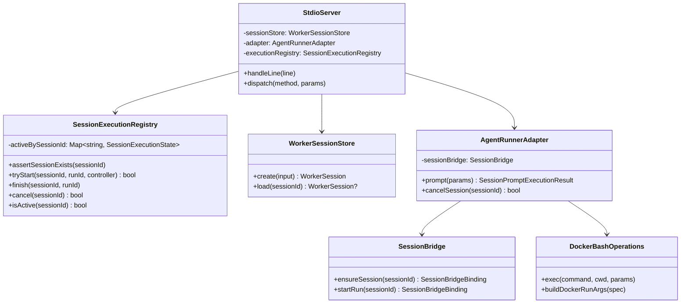
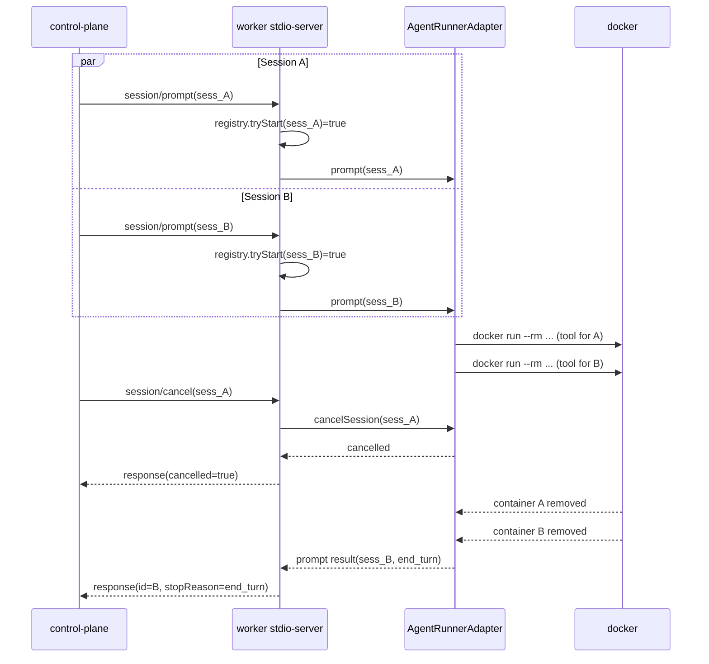

# 0. Core Principles

- Prototype First
  - 既存の最小 ACP プロファイルを維持しつつ、`agent-worker-acp` を「複数セッション同時稼働 + ツール実行ごとの ephemeral sandbox（`docker run --rm`）」へ最短で到達させる。互換性は必要最小限のみ保持し、破壊点は明示する。
- SOLID
  - セッション実行管理（同時実行制御）と sandbox 実行戦略（persistent/ephemeral）を分離し、責務を明確化する。
- KISS
  - まずは「セッション間並行 / セッション内直列」と「tool 呼び出し単位でコンテナ作成・削除」を明確な契約として実装する。
- YAGNI
  - `session/list` など unstable 拡張、worker プール化、session 単位コンテナ常駐管理は対象外。
- DRY
  - セッション存在確認・実行中判定・キャンセル解決と、docker 実行引数組み立てを共通化し重複を排除する。

# 1. 概要と目的 Overview and Purpose

- What
  - `agent-worker-acp` を、ACP が想定する複数独立セッションの同時実行に対応させる。
  - あわせて sandbox 実行方式を「起動時常駐コンテナ + docker exec」から「tool 実行時 `docker run --rm`」へ変更する。
- Why
  - 現在は同時実行契約の未明文化により、同一セッション競合や cancel 解決の曖昧さがある。
  - sandbox は単一コンテナ共有のため、並行セッション時の干渉（CPU/メモリ/プロセス枯渇、実行痕跡残留）リスクがある。
- How
  - `SessionExecutionRegistry`（仮称）を導入し、
    - セッション間: 並行実行許可
    - セッション内: 同時 prompt を拒否（`SESSION_BUSY`）
    - cancel: セッション単位で確実に abort
      を保証する。
  - `DockerBashOperations` を ephemeral 実行へ置換し、tool 実行ごとに独立コンテナを作成し終了時に削除する。

# 2. 仕様と受け入れ条件 Specification and Acceptance Criteria

## 2.1 スコープ Scope

- 今回やること
  - `agent-worker-acp` にセッション実行レジストリを導入し、複数セッション同時 `session/prompt` を正式サポートする。
  - `session/prompt` / `session/cancel` のセッション状態遷移を明文化する。
  - sandbox 実行を `docker exec` 方式から `docker run --rm` 方式へ変更する。
  - 並行実行と sandbox lifecycle のユニット・統合テストを追加する。
  - `doc/spec.md` と `README.md` の ACP / sandbox 実装プロファイルを更新する。
- 成果物
  - 実装コード: `src/agent-worker-acp/*`, `src/sandbox/*`, `src/assistant/agent-session-factory.ts`, `src/index.ts`
  - テスト: `tests/unit/agent-worker-acp/*`, `tests/unit/sandbox/*`, `tests/integration/acp-transport.test.ts`（必要に応じ分割）
  - ドキュメント: `doc/spec.md`, `README.md`
- 制約
  - stable method セット（`initialize`, `authenticate`, `session/new`, `session/load`, `session/prompt`, `session/cancel`, `session/update`）は維持する。
  - control-plane との接続契約（JSON-RPC over stdio）は維持する。

## 2.2 非スコープ Non Scope

- 今回やらないこと
  - 単一セッション内での複数 turn 並列実行（同一 `sessionId` への同時 `session/prompt`）。
  - worker プロセスの水平分散や複数 worker 管理。
  - unstable ACP methods（`session/list`, `session/resume`, `session/fork`, `session/set_model`）対応。
- 将来検討だが今回除外すること
  - 同一セッション同時 prompt の queueing（reject ではなく順次実行）。
  - session 単位の常駐コンテナ管理（`sess_x` ごとの long-lived container）。
  - `$/cancel_request` の protocol-level cancellation 連携拡張。

## 2.3 ユースケース Use Cases

- 正常系1: 異なる `sessionId` A/B へ同時に `session/prompt` を送ると、両方が独立して `session/update` を配信し、それぞれ応答を返す。
- 正常系2: A/B 同時実行中に A へ `session/cancel` を送ると、A は `cancelled` 終了し、B は継続する。
- 正常系3: `session/load` 済みセッションと `session/new` セッションを同時に実行しても互いに干渉しない。
- 正常系4: 並行実行中に各セッションが tool を呼び出しても、tool 実行単位で別コンテナが起動し終了後に自動削除される。
- 異常系1: 同一 `sessionId` に実行中の turn がある状態で再度 `session/prompt` を送ると `SESSION_BUSY` を返す。
- 異常系2: 未登録 `sessionId` への `session/prompt` / `session/cancel` は `INVALID_RECORD` を返す。
- 異常系3: `docker run` が失敗した場合、該当 turn はエラー終了し他セッションの実行は継続する。

## 2.4 受け入れ条件 Acceptance Criteria

1. Given 2つの異なるセッションが存在し
   When 同時に `session/prompt` を送信する
   Then 双方のレスポンスが timeout せず完了し、`sessionId` ごとに `session/update` が観測できる。
2. Given セッションA/Bが同時実行中で
   When Aに対して `session/cancel` を送信する
   Then Aの最終結果は `stopReason=cancelled` となり、Bは `end_turn` で完了する。
3. Given 同一セッションで turn 実行中に
   When 同一 `sessionId` へ別の `session/prompt` を送信する
   Then `SESSION_BUSY` エラーを返し、先行 turn は継続する。
4. Given tool 呼び出しが発生する turn で
   When bash tool が実行される
   Then worker は `docker run --rm` を使用し、完了後にコンテナが残存しない。
5. Given 不正な `sessionId` に対して
   When `session/prompt` または `session/cancel` を呼ぶ
   Then `INVALID_RECORD` を返し、worker はクラッシュしない。
6. Given 並行セッション + tool 実行シナリオ後に
   When `pnpm run test` の対象 ACP/sandbox テストを実行する
   Then 新規追加テストを含め全件パスする。

## 2.5 既知の制約 Known Limitations

- 同一 `sessionId` の turn は 1 本のみ（並列不可）。
- tool 実行ごとにコンテナを作成するため、常駐方式より起動オーバーヘッドが増える。
- `--rm` でコンテナは削除されるが、workspace bind mount を共有するためファイル競合は別途発生しうる。
- `session/cancel` は現行実装の request-style 応答を維持し、ACP protocol-level cancel とは別管理。

# 3. 前提技術スタック Context and Tech Stack

- Language Framework
  - TypeScript (ESM), Node.js runtime
- Libraries
  - 既存: `@mariozechner/pi-coding-agent`, `tsx`
  - 新規ライブラリ追加は原則なし
- Style Guide
  - 既存 ESLint / Prettier（2-space, double quote）に準拠
- Runtime Deployment
  - `src/index.ts`（control-plane）配下の `WorkerSupervisor` が `src/agent-worker-acp/stdio-server.ts` を子プロセス起動
  - sandbox は Docker Engine を利用し `docker run --rm` で実行
- Testing
  - Node test runner（既存 unit/integration）

# 4. インターフェース契約 Interface Contracts

## 4.1 公開APIまたは外部I O一覧

- JSON-RPC（stdio）
  - request: `initialize`, `authenticate`, `session/new`, `session/load`, `session/prompt`
  - request-style cancel: `session/cancel`
  - notification: `session/update`
- Docker CLI（sandbox 実行）
  - `docker run --rm --workdir <mapped> -v <workspace> ... <image> bash -lc <command>`
- 設定
  - 既存環境変数（`ACP_WORKER_SESSION_STORE_PATH`, `ACP_ENABLE_LOAD_SESSION` など）を維持
  - sandbox 環境変数は `image/workdir/envAllowlist/resource limit` を中心に利用し、`containerName` 依存を廃止
- 永続化
  - `WorkerSessionStore`（`session-store.json`）

## 4.2 データモデルとスキーマ

- 新規内部モデル（案）
  - `SessionExecutionState`
    - `sessionId: string`
    - `activeRunId?: string`
    - `controller?: AbortController`
    - `startedAt?: string`
  - `SandboxRunSpec`
    - `image: string`
    - `hostWorkspaceDir: string`
    - `containerWorkdir: string`
    - `envAllowlist: string[]`
    - `resourceLimits: { memory?: string; pidsLimit?: number; network?: string }`
- 既存スキーマ互換
  - `SessionPromptParams` / `SessionPromptResult` の wire 形式は変更しない
  - `session/update` の payload 形式は変更しない
- バリデーション
  - `sessionId` 存在確認は `session/prompt` / `session/cancel` 前に必須
  - 実行中判定は `SessionExecutionRegistry` 単一点で評価
  - docker 実行コマンドの引数は専用 builder で生成し shell 文字列連結を避ける

## 4.3 エラーと例外 Error Handling

- エラー分類
  - `INVALID_RECORD`: 未知セッション
  - `SESSION_BUSY`: 同一セッションで turn 実行中
  - `UNSUPPORTED_CAPABILITY`: loadSession gate
  - `ACP_PROTOCOL_ERROR`: 応答整合性違反
  - `DOWNSTREAM_ERROR`: docker 実行失敗・sandbox 実行失敗
- リトライ方針
  - `SESSION_BUSY` と docker 実行失敗はクライアント側で再送判断（worker 側自動リトライなし）
- タイムアウト方針
  - 既存 supervisor timeout に準拠
  - sandbox 実行 timeout は子プロセス kill 後に error 化
- ログ方針と個人情報の扱い
  - 既存 structured log ポリシー準拠
  - 実行コマンド全文や機密 env 値はログに出力しない

## 4.4 代表的な例 Examples

1. 異なるセッションの同時 prompt

```json
{"jsonrpc":"2.0","id":11,"method":"session/prompt","params":{"sessionId":"sess_A","prompt":"A"}}
{"jsonrpc":"2.0","id":12,"method":"session/prompt","params":{"sessionId":"sess_B","prompt":"B"}}
```

期待: `session/update(sessionId=sess_A/B)` が相互に混在して到着しても、最終レスポンス `id=11/12` はそれぞれ整合する。

2. 同一セッション重複 prompt

```json
{"jsonrpc":"2.0","id":21,"method":"session/prompt","params":{"sessionId":"sess_A","prompt":"first"}}
{"jsonrpc":"2.0","id":22,"method":"session/prompt","params":{"sessionId":"sess_A","prompt":"second"}}
```

期待: `id=22` は `SESSION_BUSY` を返す。

3. tool 実行時の sandbox 実行（概念例）

```bash
docker run --rm \
  --workdir /workspace \
  -v /host/workspace:/workspace \
  --read-only --tmpfs /tmp --tmpfs /var/tmp --tmpfs /run \
  --network none --cap-drop ALL --security-opt no-new-privileges \
  adjutant-sandbox:trixie-slim \
  bash -lc 'pnpm test'
```

期待: 実行完了後に該当コンテナは残存しない。

# 5. アーキテクチャと設計図 Architecture and Diagrams

## 5.1 図の選択方針

- `stdio-server` / `adapter` / `session store` / 実行レジストリ / sandbox 実行戦略が跨るためクラス図を必須とする。
- 非同期挙動（2セッション同時 prompt + 片側 cancel + tool 実行コンテナ分離）が重要なためシーケンス図を追加する。

## 5.2 クラス図 Class Diagram



## 5.3 その他の図 Optional



# 6. テスト戦略 Test Strategy

## 6.1 テストの種類

- Unit
  - `SessionExecutionRegistry` の状態遷移（start/finish/cancel/busy）
  - `DockerBashOperations` の `docker run --rm` 引数生成と timeout/abort 処理
  - `AgentRunnerAdapter` のセッション別同時実行時に cancel が混線しないこと
- Integration
  - `acp-transport` で 2セッション同時 prompt と片側 cancel を再現
  - 並行 tool 実行時にコンテナ残骸が残らないこと（モック runner で検証）
- Contract
  - `SESSION_BUSY` / `INVALID_RECORD` のエラーコード契約
  - `session/update` の `sessionId` 相関が保たれること

## 6.2 カバレッジ対象

- 重要ロジック
  - セッション存在確認
  - 同時実行判定
  - cancel 対象解決
  - `docker run --rm` 実行パス
- エラー分岐
  - busy, unknown session, aborted turn, docker 実行失敗
- 境界条件
  - 完了直前 cancel
  - ほぼ同時に到着する 2 prompt
  - timeout 発生時の subprocess cleanup

# 7. 実装タスクリスト Implementation Plan

### Phase 1 設計と準備

- [x] `Task-MSC-DESIGN-001` インターフェース契約確定（`SESSION_BUSY` / `INVALID_RECORD` / sandbox 実行契約の明文化）
- [x] `Task-MSC-DESIGN-002` Mermaid 図を `doc/spec.md` に反映
- [x] `Task-MSC-DESIGN-003` `SessionExecutionRegistry` と `SandboxRunSpec` の型定義を確定
- [x] `Task-MSC-DESIGN-004` テスト基盤確認（既存 `acp-transport` / sandbox unit 拡張方針）

### Phase 2 セッション実行レジストリの実装

- [x] `Task-MSC-REG-RED-001` Unit: start/finish/cancel/busy の失敗テスト追加 Red
- [x] `Task-MSC-REG-GREEN-001` Impl: `SessionExecutionRegistry` 実装 Green
- [x] `Task-MSC-REG-REFACTOR-001` Refactor: `stdio-server` から状態管理重複除去
- [x] `Task-MSC-REG-INTEG-001` Integration: 同一セッション重複 prompt で `SESSION_BUSY` 検証
- [x] `Task-MSC-REG-DOC-001` Docs: 契約とエラーコード記載更新

### Phase 3 複数セッション並行 prompt の実装

- [x] `Task-MSC-CONC-RED-001` Integration: 2セッション同時 prompt の失敗テスト追加 Red
- [x] `Task-MSC-CONC-GREEN-001` Impl: `stdio-server` dispatch と adapter 連携を並行対応 Green
- [x] `Task-MSC-CONC-REFACTOR-001` Refactor: cancel 経路と run cleanup の共通化
- [x] `Task-MSC-CONC-INTEG-001` Integration: 片側 cancel 時の非干渉を検証
- [x] `Task-MSC-CONC-DOC-001` Docs: README ACP 実装プロファイル更新

### Phase 4 sandbox ephemeral 化（`docker run --rm`）

- [x] `Task-MSC-SBX-RED-001` Unit: `docker run --rm` 引数生成・abort・timeout の失敗テスト追加 Red
- [x] `Task-MSC-SBX-GREEN-001` Impl: `DockerBashOperations` を `docker exec` から `docker run --rm` へ置換 Green
- [x] `Task-MSC-SBX-REFACTOR-001` Refactor: `sandbox/runtime` と worker bootstrap の `containerName` 依存を削除
- [x] `Task-MSC-SBX-INTEG-001` Integration: 並行 tool 実行時にコンテナ残存がないことを検証
- [x] `Task-MSC-SBX-DOC-001` Docs: sandbox lifecycle（per-tool）を `README.md` / `doc/spec.md` に追記

### Phase 5 統合と検証

- [x] `Task-MSC-VERIFY-001` 全体テスト実行（対象 unit/integration + `pnpm check`）
- [x] `Task-MSC-VERIFY-002` エッジケース確認（完了直前 cancel, unknown session, docker fail）
- [x] `Task-MSC-VERIFY-003` ログ確認（error code と sessionId 相関）
- [x] `Task-MSC-VERIFY-004` 最終ドキュメント同期（`doc/spec.md`, `README.md`）

# 8. 完了の定義 Definition of Done

## 8.1 機能DoD Functional DoD

- [x] 受け入れ条件 1-6 を満たす
- [x] 複数セッション同時実行が再現テストで安定して成功する
- [x] 同一セッション重複 prompt が `SESSION_BUSY` で一貫して拒否される
- [x] tool 実行時に `docker run --rm` が使用され、コンテナ残骸が残らない
- [x] エラー契約（`INVALID_RECORD`, `SESSION_BUSY`, `DOWNSTREAM_ERROR`）が明文化される

## 8.2 品質DoD Quality DoD

- [x] 追加/変更テストが全てパスする
- [x] `pnpm check` が成功する
- [x] デバッグ用コードや一時ログが残っていない
- [x] 主要変更が `README.md` と `doc/spec.md` に反映される

# 9. 懸念事項と未確定事項 Concerns and Questions

- 技術的な懸念点
  - `docker run --rm` は起動コストがあるため、tool 呼び出し頻度が高いタスクでスループットが低下する可能性がある。
- 仕様が曖昧で決定が必要な事項
  - `docker run` 失敗時の error code を `DOWNSTREAM_ERROR` で統一するか、sandbox 専用 code を追加するか。
  - sandbox の network デフォルト（`none` か既存設定維持か）を固定するか。
- プロトタイプとして許容するリスク
  - workspace bind mount は共有のため、同時編集競合そのものは防げない。
- 将来的な拡張に伴うリスク
  - 高負荷時に per-tool 起動コストが課題化した場合、session 単位常駐コンテナや軽量ランタイムへの再設計が必要。
