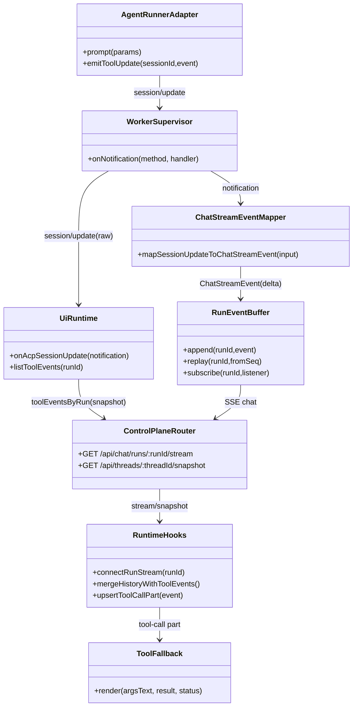
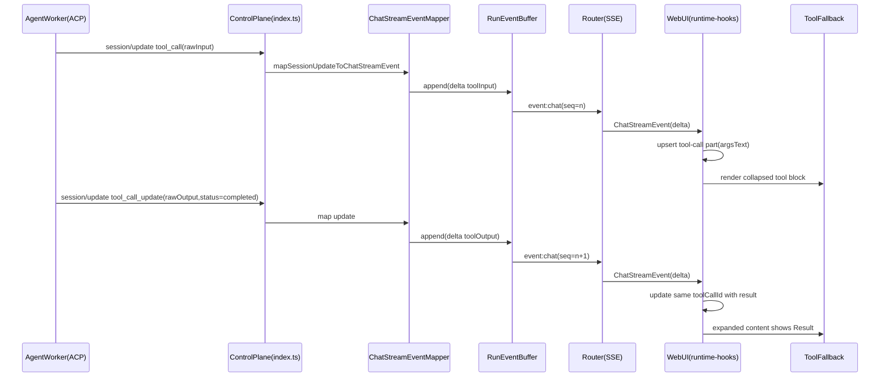

# 260302-s01: ACP tool実行I/OをWebUI折りたたみ表示へ接続する実装計画

## 0. Core Principles

- **[ProtoFirst] Prototype First**
  - 既存の `/api/chat/*` と ACP セッション更新経路を活かし、最短で「ツール実行入出力が UI で読める」状態を成立させる。
  - 破壊的変更は避け、`ChatStreamEvent` と `ToolEventRecord` への追加は optional フィールドの加算で実施する。
- **[SOLID] SOLID**
  - SRP: `chat-stream-event-mapper` は変換責務、`runtime-hooks` は UI 状態投影責務、`tool-fallback` は表示責務に限定する。
  - DIP: UI は `ChatStreamEvent` 契約に依存し、ACP 生通知の詳細構造に直接依存しない。
- **[KISS] KISS**
  - 既存の `tool_call` / `tool_call_update` をそのまま利用し、別イベント種別は増やさない。
  - 折りたたみ表示は既存 `ToolFallback` を再利用し、新規 UI コンポーネントを最小化する。
- **[YAGNI] YAGNI**
  - ツール I/O の高度整形（syntax highlight、diff viewer、ページング）は今回導入しない。
  - 永続ストレージへの長期保存や検索機能は対象外。
- **[DRY] DRY**
  - 既存 `ToolEventBridge` / `runEventBuffer` / `ToolFallback` を再利用し、同等ロジックの重複実装を避ける。

## 1. 概要と目的 Overview and Purpose

- **What**
  - ACP `session/update` の `tool_call` / `tool_call_update` に含まれる `rawInput` / `rawOutput` を control-plane から WebUI へ伝搬し、assistant-ui の tool-call part として折りたたみ表示する。
- **Why**
  - 現状はツール実行の開始/終了状態のみ UI に反映され、引数や結果がチャット文脈で確認しづらい。
  - デバッグ速度と説明可能性を上げるため、1つの assistant メッセージ内でツール実行詳細を読める必要がある。
- **How**
  - `ChatStreamEvent` と `ThreadSnapshotResponse.toolEventsByRun` の契約を拡張し、runtime で tool-call part へ変換する。
  - `ToolFallback` の既存折りたたみ UI に `argsText` と `result` を供給する。

## 2. 仕様と受け入れ条件 Specification and Acceptance Criteria

### 2.1 スコープ Scope

- 今回やること
  - ACP 由来 `rawInput` / `rawOutput` / tool error 情報を `ChatStreamEvent` にマップする。
  - `ToolEventRecord` を拡張して thread snapshot からも tool I/O を復元可能にする。
  - `src/ui/runtime-hooks.tsx` で tool delta を assistant-ui の `tool-call` part に変換し、`ToolFallback` で折りたたみ表示する。
  - メッセージ読み込み時（`/api/chat/history` + `/api/threads/:threadId/snapshot`）に過去 run の tool part を復元する。
  - payload 上限（文字列化時サイズ制限）を定義し、過大データで UI が固まらないようにする。
- 成果物
  - 契約型更新（`http-api.ts`）
  - mapper / router / runtime-hooks 実装更新
  - Unit / Integration / Contract テスト追加
  - 計画書と必要な仕様ドキュメントの更新
- 制約
  - 既存 API path は維持し、破壊的 rename はしない。
  - tool I/O は optional フィールドで提供し、未提供時も既存 UI は動作する。

### 2.2 非スコープ Non Scope

- ツール I/O の永続化基盤刷新（DB保存、全文検索）
- 添付ファイル/画像向け専用ビューア
- 権限制御 UI の刷新（pending permission バナー改善は対象外）
- `@assistant-ui/react` の内部実装差し替え

### 2.3 ユースケース Use Cases

- 正常系1: ユーザーがメッセージ送信し、run 中の `tool_call` が発生すると、assistant メッセージ内に「Used tool: <name>」が折りたたみ表示される。
- 正常系2: `tool_call_update(status=completed)` 到達後、同一 toolCallId の折りたたみ内に result が表示される。
- 正常系3: `tool_call_update(status=failed)` 到達後、折りたたみ内に error 表示が出る。
- 正常系4: ページ再読込後、過去 run の tool 引数/結果が thread snapshot から復元表示される。
- 異常系1: `rawInput` / `rawOutput` が巨大または非JSON値でも、UI は安全に省略表示（truncated）して継続する。
- 異常系2: `tool_call_update` が start より先に到着しても、placeholder tool part を作成して最終状態に収束する。

### 2.4 受け入れ条件 Acceptance Criteria

1. Given ACP `session/update` に `tool_call` が含まれる
   When `/api/chat/runs/:runId/stream` を購読する
   Then `event: chat` の `ChatStreamEvent` に `toolCallId`, `toolName`, `toolStatus`, `toolInput` が含まれる。
2. Given ACP `session/update` に `tool_call_update(status=completed)` と `rawOutput` が含まれる
   When chat SSE を受信する
   Then `ChatStreamEvent` に `toolOutput` が含まれ、同一 `toolCallId` の UI 表示へ反映される。
3. Given run 実行中に複数ツール呼び出しがある
   When WebUI を確認する
   Then assistant メッセージ内で各 tool call が個別の折りたたみセクションとして表示される。
4. Given `tool_call_update(status=failed)` が発生する
   When WebUI を確認する
   Then対象ツール折りたたみ内に失敗表示（error テキスト）が表示される。
5. Given run 完了後にページ再読込する
   When 対象 thread を開く
   Then thread snapshot から復元された tool input/output が折りたたみ表示される。
6. Given `rawInput` / `rawOutput` が上限を超える
   When mapper が ChatStreamEvent を生成する
   Then 省略済み文字列へ正規化し、`pnpm check` のテストは全て通る。
7. Given 既存クライアントが `toolInput/toolOutput` を読まない
   When 更新後の API を利用する
   Then 既存機能（メッセージ送信/ストリーミング）は後方互換で維持される。

### 2.5 既知の制約 Known Limitations

- v1 では binary 相当の tool output は文字列化して省略表示するため、完全再現しない。
- payload 制限を設けるため、大きな stdout/stderr は先頭/末尾のみ保持する。
- runEventBuffer 保持期間（既定60秒）を過ぎた run は SSE replay できず、復元は snapshot 依存となる。

## 3. 前提技術スタック Context and Tech Stack

- **Language / Framework**
  - TypeScript (ESM), Node.js, React 19
- **Libraries**
  - `@assistant-ui/react`（`ToolFallback` 利用）
  - `assistant-stream`（assistant-ui 依存）
- **Style Guide**
  - 既存 ESLint / Prettier 設定に準拠
- **Runtime / Deployment**
  - control-plane + agent-worker-acp の単一ホスト実行
- **Testing**
  - Node.js built-in test runner (`node --import tsx --test`)
  - 既存 `tests/unit`, `tests/integration`, `tests/contract`

## 4. インターフェース契約 Interface Contracts

### 4.1 公開APIまたは外部I/O一覧

- ACP (`session/update`)
  - `tool_call`: `toolCallId`, `title|kind`, `status`, `rawInput`
  - `tool_call_update`: `toolCallId`, `status`, `rawOutput`, `content[]`
- HTTP SSE (`GET /api/chat/runs/:runId/stream`, `event: chat`)
  - `ChatStreamEvent` に tool I/O フィールドを追加（optional）
- Thread Snapshot (`GET /api/threads/:threadId/snapshot`)
  - `toolEventsByRun[runId][]` に tool I/O を追加（optional）

### 4.2 データモデルとスキーマ

- `ChatStreamEvent` 追加項目（全て optional）

```typescript
interface ChatStreamEvent {
  // 既存
  seq: number;
  state: "delta" | "final" | "aborted" | "error";
  runId: string;
  sessionKey: string;
  toolCallId?: string;
  toolName?: string;
  toolStatus?: "started" | "completed" | "failed";

  // 追加
  toolInput?: unknown; // rawInput 正規化結果
  toolOutput?: unknown; // rawOutput 正規化結果
  toolError?: string; // failed時の補助情報
}
```

- `ToolEventRecord` 追加項目（snapshot 用）

```typescript
type ToolEventRecord = {
  runId: string;
  sessionId: string;
  toolCallId: string;
  status: "pending" | "in_progress" | "completed" | "failed";
  title?: string;
  kind?: string;
  updatedAt: string;
  rawInput?: unknown;
  rawOutput?: unknown;
  error?: string;
};
```

- UI 変換規約（runtime-hooks）

```typescript
// assistant message part (tool)
{
  type: "tool-call";
  toolCallId: string;
  toolName: string;
  args: Record<string, unknown>; // toolInput が object のとき
  argsText: string; // pretty-printed + truncated
  result?: unknown; // completed/failed 時
  isError?: boolean; // failed 時 true
}
```

### 4.3 エラーと例外 Error Handling

- エラー分類
  - `INVALID_REQUEST`（既存）
  - `ACP_PROTOCOL_ERROR`（tool payload の必須キー欠落時）
  - `DOWNSTREAM_ERROR`（worker 側失敗）
- 正規化方針
  - `toolInput/toolOutput` は `safeSerialize(value, maxBytes)` でサイズ制限し、循環参照は `"[unserializable]"` にフォールバック。
  - `tool_call_update` で `status` が不正値の場合はイベント破棄（既存挙動維持）。
- ログ方針
  - `runId/sessionKey/toolCallId/status` は構造化ログへ継続出力。
  - 機微情報含有リスクがあるため payload 全文はログ出力しない。

### 4.4 代表的な例 Examples

```text
event: chat
data: {"seq":12,"state":"delta","runId":"session:sess_1:run:3","sessionKey":"main","toolCallId":"call_1","toolName":"bash","toolStatus":"started","toolInput":{"cmd":"pnpm check"}}
```

```text
event: chat
data: {"seq":13,"state":"delta","runId":"session:sess_1:run:3","sessionKey":"main","toolCallId":"call_1","toolName":"bash","toolStatus":"completed","toolOutput":{"exitCode":0,"stdout":"ok"}}
```

```json
{
  "toolEventsByRun": {
    "session:sess_1:run:3": [
      {
        "runId": "session:sess_1:run:3",
        "sessionId": "sess_1",
        "toolCallId": "call_1",
        "status": "completed",
        "title": "bash",
        "rawInput": { "cmd": "pnpm check" },
        "rawOutput": { "exitCode": 0 },
        "updatedAt": "2026-03-02T10:00:00.000Z"
      }
    ]
  }
}
```

## 5. アーキテクチャと設計図 Architecture and Diagrams

### 5.1 図の選択方針

- control-plane / ACP / WebUI を跨ぐためクラス図を必須とする。
- 非同期ストリーム（ACP通知→SSE→UI）の整合が重要なためシーケンス図を追加する。

### 5.2 クラス図 Class Diagram



### 5.3 その他の図 Optional



## 6. テスト戦略 Test Strategy

### 6.1 テストの種類

- **Unit**
  - `chat-stream-event-mapper`: `toolInput/toolOutput/toolError` マッピング
  - `snapshot-builder`: `ToolEventRecord` への raw payload 投影
  - `runtime-hooks` の pure helper: tool event -> tool-call part 変換、重複/順不同更新
- **Integration**
  - `control-plane-http-sse`: `POST /api/chat/messages` 後の chat SSE に tool I/O が流れること
  - thread snapshot 復元時に tool part が表示可能データになること
  - `playwright-cli` E2E: 実ブラウザで tool 折りたたみ表示の開閉と args/result 表示を確認すること（`pnpm check` には含めず、実装タスクとして手動実施）
- **Contract**
  - `http-api` 型契約: 追加フィールドが optional であること
  - 既存 `/api/commands` と `STREAM_EVENT_TYPES` 非回帰

### 6.2 カバレッジ対象

- 重要ロジック
  - 同一 `toolCallId` の start/update マージ
  - `failed` 時の error 表示
  - snapshot 復元での message-content 組み立て
- エラー分岐
  - 不正 status
  - 非シリアライズ可能 payload
  - 過大 payload の truncate
- 境界条件
  - `tool_call_update` 先行到着
  - `rawInput/rawOutput` 欠落
  - 複数 tool call 連続実行

## 7. 実装タスクリスト Implementation Plan

### Phase 1 設計と準備

- [ ] `Task-TOOLIO-P1-001` Contract: `ChatStreamEvent` / `ToolEventRecord` 追加フィールドを `src/control-plane/contracts/http-api.ts` へ定義
- [ ] `Task-TOOLIO-P1-002` Design: payload 正規化ユーティリティ（truncate/serialize）仕様確定
- [ ] `Task-TOOLIO-P1-003` Diagram: 本計画のクラス図/シーケンス図を反映
- [ ] `Task-TOOLIO-P1-004` Test Setup: runtime-hooks から分離した pure helper テスト基盤を追加

### Phase 2 control-plane 変換実装

- [ ] `Task-TOOLIO-P2-RED-001` Test: `mapSessionUpdateToChatStreamEvent` が tool I/O を返す失敗テストを追加
- [ ] `Task-TOOLIO-P2-GREEN-001` Impl: `chat-stream-event-mapper.ts` に `toolInput/toolOutput/toolError` マッピング実装
- [ ] `Task-TOOLIO-P2-RED-002` Test: `snapshot-builder` / `buildThreadSnapshot` が raw payload を含める失敗テスト追加
- [ ] `Task-TOOLIO-P2-GREEN-002` Impl: snapshot API へ raw payload を含める
- [ ] `Task-TOOLIO-P2-REFACTOR-001` Refactor: mapper 内の tool payload 正規化関数を共通化

### Phase 3 WebUI 折りたたみ表示実装

- [ ] `Task-TOOLIO-P3-RED-001` Test: runtime helper が tool start/update を tool-call part に変換する失敗テスト
- [ ] `Task-TOOLIO-P3-GREEN-001` Impl: `runtime-hooks.tsx` に tool part 管理（upsert/merge）を実装
- [ ] `Task-TOOLIO-P3-GREEN-002` Impl: history 読み込み時に snapshot の `toolEventsByRun` を assistant メッセージへ統合
- [ ] `Task-TOOLIO-P3-REFACTOR-001` Refactor: `upsertAssistantMessage` を text/thinking/tool 共通で扱う構造へ整理
- [ ] `Task-TOOLIO-P3-INTEG-001` Integration: WebUI で折りたたみ開閉時に args/result が見えることを確認する統合テスト

### Phase 4 統合と検証

- [ ] `Task-TOOLIO-P4-001` 全体テスト実行（`pnpm check`。`playwright-cli` 手動検証は含めない）
- [ ] `Task-TOOLIO-P4-002` `tests/integration/control-plane-http-sse.test.ts` で tool I/O イベント検証追加
- [ ] `Task-TOOLIO-P4-003` 既存 API 非回帰確認（`/api/commands`, `/api/events/stream`, `/api/chat/*`）
- [ ] `Task-TOOLIO-P4-004` ドキュメント更新（必要なら `doc/spec.md` へ契約追記）
- [ ] `Task-TOOLIO-P4-005` `playwright-cli` で WebUI E2E 手動検証を実装タスクとして実施（`open` → メッセージ送信 → tool 折りたたみクリック → `snapshot --filename=doc/plan/artifacts/260302-s01-tool-io-collapsible.yml`）し、表示確認結果を記録

## 8. 完了の定義 Definition of Done

### 8.1 機能DoD Functional DoD

- [ ] chat SSE で tool input/output が配信される
- [ ] WebUI で tool call が折りたたみ表示され、展開時に args/result/error が確認できる
- [ ] thread 再読み込み後も tool I/O が復元される
- [ ] 受け入れ条件 1〜7 を満たす

### 8.2 品質DoD Quality DoD

- [ ] 追加した Unit / Integration / Contract テストがすべて成功する
- [ ] `pnpm check` が成功する
- [ ] 既存 API 契約の非回帰が確認できる
- [ ] 例外系（不正 payload / 過大 payload）で UI が破綻しない

## 9. 懸念事項と未確定事項 Concerns and Questions

- `rawInput/rawOutput` に機微情報が含まれる可能性があるため、UI表示時のマスキング方針をどこまで適用するか要決定。
- payload 上限値（例 16KB or 64KB）の既定値は運用要件に依存するため、環境変数化の要否を決める必要がある。
- `tool_call_update` の `content` を error source の正本とするか、`error` 専用フィールドを優先するかの優先順位を固定する必要がある。
- 長時間 run で tool call 数が多い場合の描画コスト対策（virtualize 等）は将来課題として残る。
