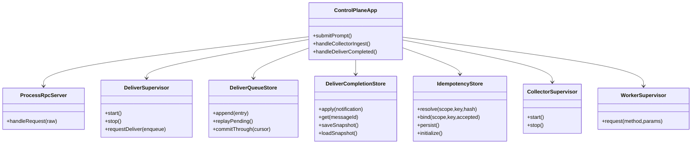
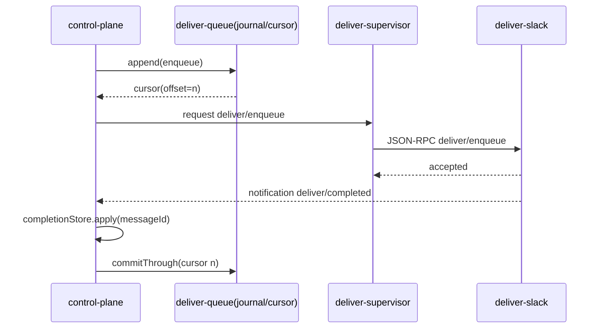

# 260304-s01: Phase D 実装計画（queue/recovery hardening）

## 0. Core Principles

- Prototype First: Phase D は「実運用で落ちない最小基盤」を優先し、分散化や高機能DLQは後続へ分離する。
- SOLID: `control-plane`（制御/永続化）と `deliver-slack`（外部送信）を明確に分離し、境界は Process RPC 契約で固定する。
- KISS: まずは単一 deliver 実装、単一 queue、単一 cursor で成立させる。
- YAGNI: マルチdeliver backend、動的優先度制御、再投入UIは今回実装しない。
- DRY: 既存の `JournalStore` / `CursorStore` / supervisor 共通ユーティリティを再利用し、同等機能の重複実装を避ける。

## 1. 概要と目的 Overview and Purpose

- What
  - Phase C までで未完了の運用基盤（deliver 実送信、queue 永続化、idempotency 永続化、restart recovery）を実装する。
  - `deliver/enqueue` を `METHOD_NOT_SUPPORTED` から実装へ移行し、`deliver/completed` 通知を control-plane に反映する。
- Why
  - 現状は queue/recovery が部分実装で、再起動や重複通知時の整合性が保証しきれていない。
  - Phase E（proactive/heartbeat）を安全に進める前提として、D の基盤安定化が必要。
- How
  - `deliver-slack` 子プロセス + Process RPC client/server を追加し、enqueue -> completion までの経路を実装。
  - enqueue inbox / completion store / idempotency を永続化し、再起動時 replay と冪等吸収を統合テストで固定する。

## 2. 仕様と受け入れ条件 Specification and Acceptance Criteria

### 2.1 スコープ Scope

- 今回やること
  - `deliver-slack` 子プロセス実装（最小の Slack 送信アダプタ + stdio Process RPC）
  - `control-plane` の `deliver/enqueue` 実装（accepted 応答、deliver queue append、dispatch）
  - `deliver/completed` 通知の受理と冪等最終状態管理（`completed` 優先）
  - deliver queue 永続化（journal/cursor）と restart replay
  - `/api/commands` idempotency の永続化（再起動後も duplicate/conflict 判定を維持）
  - `collector/ingest` dedupe の永続化（再起動後も canonical messageId を維持）
  - spec/runbook 更新（Phase D 契約、障害対応）
- 成果物
  - 実装: `src/control-plane/process-rpc/*`, `src/deliver-slack/*`, `src/index.ts` ほか
  - 永続化: `state/journal/*`, `state/cursor/*` の追加ストア
  - テスト: unit/contract/integration（deliver + recovery + idempotency）
  - 文書: `doc/spec.md`, `doc/runbook/*`, 本計画
- 制約
  - 単一ホスト前提、at-least-once 配信
  - 外部送信失敗時は retry with backoff（上限あり）
  - 既存 HTTP API 契約を破壊しない

### 2.2 非スコープ Non Scope

- 分散 queue（Kafka/NATS）
- DLQ 再投入 UI
- マルチチャネル deliver backend（Slack以外）
- proactive/heartbeat 本体機能
- exactly-once 保証

### 2.3 ユースケース Use Cases

- 正常系1: run 完了メッセージの deliver enqueue
  - control-plane が `deliver/enqueue` を accepted し、deliver-slack が送信後 `deliver/completed(status=completed)` を通知
- 正常系2: control-plane 再起動後の queue replay
  - restart 後に未完了 enqueue が replay され、重複なく送信完了する
- 正常系3: idempotency 再起動復元
  - `/api/commands` の同一 key 再送が restart 後も duplicate と判定される
- 異常系1: deliver プロセスクラッシュ
  - supervisor が再起動し、未完了 queue を再処理できる
- 異常系2: 重複 completion 通知
  - completion store が duplicate を吸収し、状態を壊さない
- 異常系3: 同一 idempotencyKey + 異payload
  - restart 前後を問わず `INVALID_REQUEST`（409）で拒否する

### 2.4 受け入れ条件 Acceptance Criteria

1. Given `control-plane` と `deliver-slack` が起動している
   When run 終端時に deliver 対象メッセージが生成される
   Then `deliver/enqueue` は `accepted` を返し、最終的に `deliver/completed(status=completed)` が記録される
2. Given 未完了の deliver queue が journal に残っている
   When control-plane が再起動する
   Then queue replay により未完了分のみ再送され、完了後 cursor が進む
3. Given 同一 `messageId` の `deliver/completed` が重複通知される
   When completion store が適用する
   Then 2 回目以降は duplicate 扱いとなり最終状態が不変である
4. Given `/api/commands` に同一 `sessionKey+idempotencyKey+payload` が送信される
   When control-plane を再起動した後に再送する
   Then 既存 `runId` を返し run は重複作成されない
5. Given `/api/commands` に同一 `sessionKey+idempotencyKey` で payload 差分がある
   When 再送する
   Then 409 `INVALID_REQUEST` を返し既存 run 状態を変更しない
6. Given `collector/ingest` の同一 `dedupeKey` が再送される
   When control-plane 再起動後に受信する
   Then canonical `messageId` を返して冪等受理し、重複 run を起動しない
7. Given deliver 子プロセスが異常終了する
   When supervisor が復旧処理を行う
   Then 再起動後に enqueue/notification 経路が再開し、プロセス全体は継続稼働する

### 2.5 既知の制約 Known Limitations

- v1 の deliver retry は固定 backoff（設定可能パラメータ最小）で、動的制御は未対応。
- 外部送信の結果整合は at-least-once であり、下流側の冪等性が前提となる。
- 大量 backlog 時の最適スケジューリング（優先度/公平性）は Phase D では最小実装に留める。

## 3. 前提技術スタック Context and Tech Stack

- Language Framework
  - TypeScript (ESM), Node.js
- Libraries
  - 既存依存を再利用（`tsx`, `chrome-remote-interface`, `@mariozechner/pi-coding-agent`）
- Style Guide
  - ESLint / Prettier / TypeScript strict 準拠
- Runtime Deployment
  - `src/index.ts` が親として `agent-worker-acp` / `collector-slack` / `deliver-slack` を supervision
- Testing
  - Node.js test runner（`node --test`）
  - Unit / Contract / Integration を `tests/` 配下で追加

## 4. インターフェース契約 Interface Contracts

### 4.1 公開APIまたは外部I O一覧

- Process RPC
  - request/response: `collector/ingest`, `deliver/enqueue`
  - notification: `deliver/completed`
- HTTP API
  - `POST /api/commands`（idempotency 永続化の対象）
  - `GET /api/snapshot`, `GET /api/events/stream`
- 永続化
  - `state/journal/control-plane/inbox.jsonl`（collector ingest）
  - `state/cursor/control-plane.inbox.json`
  - `state/journal/control-plane/deliver-queue.jsonl`（新規）
  - `state/cursor/control-plane.deliver-queue.json`（新規）
  - `state/cursor/control-plane.deliver-completion.snapshot.json`（新規）
  - `state/journal/control-plane/idempotency.jsonl`（新規）
  - `state/cursor/control-plane.idempotency.snapshot.json`（新規）
- 外部サービス連携
  - Slack deliver API（`deliver-slack` 経由）

### 4.2 データモデルとスキーマ

- `DeliverEnqueueRequest`
  - `{ messageId, dedupeKey, target, payload, attempt, maxAttempts }`
- `DeliverEnqueueResponse`
  - `{ messageId, status: "accepted", acceptedAt }`
- `DeliverCompletedNotification`
  - `{ messageId, status: "completed"|"failed", finishedAt, error? }`
- `DeliverQueueEntry`（新規）
  - `{ version, enqueuedAt, request, nextAttemptAt, state(pending|inflight|terminal) }`
- `IdempotencyEntry`（新規）
  - `{ scope(command|ingest), key, requestHash, accepted, updatedAt }`
- バリデーション方針
  - Process RPC 境界は `validateProcessRpcRequest/Notification` を必須化
  - 不正 payload は `INVALID_REQUEST` として reject し、run/queue 状態を変更しない

### 4.3 エラーと例外 Error Handling

- エラー分類
  - `INVALID_REQUEST`, `METHOD_NOT_SUPPORTED`, `DOWNSTREAM_ERROR`, `DELIVER_TIMEOUT`, `DELIVER_RETRY_EXHAUSTED`, `JOURNAL_APPEND_FAILED`, `WORKER_CRASHED`
- リトライ方針
  - deliver 送信失敗時は `attempt < maxAttempts` の間だけ再試行
  - backoff は jitter 付き指数（上限あり）
- タイムアウト方針
  - Process RPC request timeout を supervisor で統一管理
  - 外部送信 timeout は deliver プロセス内で明示
- ログ方針と個人情報
  - `messageId`, `dedupeKey`, `runId`, `sessionKey`, `attempt` を構造化ログで出力
  - payload 本文は必要最小限のみ（PII をログへ出しすぎない）

### 4.4 代表的な例 Examples

```json
{
  "jsonrpc": "2.0",
  "id": "del_001",
  "method": "deliver/enqueue",
  "params": {
    "messageId": "msg_001",
    "dedupeKey": "deliver:msg_001",
    "target": "slack",
    "payload": { "text": "done" },
    "attempt": 1,
    "maxAttempts": 3
  }
}
```

```json
{
  "jsonrpc": "2.0",
  "id": "del_001",
  "result": {
    "messageId": "msg_001",
    "status": "accepted",
    "acceptedAt": "2026-03-04T01:00:00.000Z"
  }
}
```

```json
{
  "jsonrpc": "2.0",
  "method": "deliver/completed",
  "params": {
    "messageId": "msg_001",
    "status": "completed",
    "finishedAt": "2026-03-04T01:00:01.100Z"
  }
}
```

## 5. アーキテクチャと設計図 Architecture and Diagrams

### 5.1 図の選択方針

- 複数プロセス（control-plane / worker / collector / deliver）を跨ぐためクラス図を必須とする。
- 非同期経路（enqueue -> completion -> commit）が重要なためシーケンス図を追加する。

### 5.2 クラス図 Class Diagram



### 5.3 その他の図 Optional



## 6. テスト戦略 Test Strategy

### 6.1 テストの種類

- Unit
  - `DeliverQueueStore` の append/replay/commit 単調性
  - `IdempotencyStore` の duplicate/conflict 判定と永続化
  - `DeliverCompletionStore` の completed 優先・duplicate 吸収
- Integration
  - deliver 子プロセス crash/restart 復旧
  - control-plane 再起動後の deliver queue replay
  - `/api/commands` idempotency の restart 跨ぎ挙動
- Contract
  - `deliver/enqueue` / `deliver/completed` request/notification schema
  - エラーコード契約（`INVALID_REQUEST`, `METHOD_NOT_SUPPORTED` など）

### 6.2 カバレッジ対象

- 重要ロジック
  - enqueue 受理 -> completion -> cursor commit
  - idempotency 永続化と再起動復元
- エラー分岐
  - malformed RPC / timeout / downstream failure / retry exhaustion
- 境界条件
  - duplicate completion / out-of-order completion / maxAttempts 到達

## 7. 実装タスクリスト Implementation Plan

### Phase 1 設計と準備

- [x] `Task-D-000` Phase D 契約を `doc/spec.md` 14.5/14.6/14.8 へ追記（deliver queue/recovery の境界を固定）
- [x] `Task-D-001` Process RPC 契約拡張（`deliver/enqueue`, `deliver/completed`）の schema/型を確定
- [x] `Task-D-002` 永続化スキーマ定義（deliver queue / idempotency / completion snapshot）
- [x] `Task-D-003` Mermaid 図更新（spec と本計画を同期）

### Phase 2 機能Aの実装（deliver 経路）

- [x] `Task-DA-RED-001` Test: `deliver/enqueue` 正常/異常の失敗テスト作成
- [x] `Task-DA-RED-002` Test: deliver completion の duplicate/out-of-order 吸収テスト作成
- [x] `Task-DA-GREEN-001` Impl: `ProcessRpcServer` の `deliver/enqueue` 実装（`METHOD_NOT_SUPPORTED` 解除）
- [x] `Task-DA-GREEN-002` Impl: `deliver-slack` 子プロセス + `DeliverSupervisor` 実装
- [x] `Task-DA-GREEN-003` Impl: `DeliverQueueStore`（journal/cursor）実装
- [x] `Task-DA-REFACTOR-001` Refactor: supervisor/queue/completion の責務分離
- [x] `Task-DA-INTEG-001` Integration: enqueue -> completed の縦切り E2E
- [x] `Task-DA-DOCS-001` Docs: deliver 経路と運用手順を `spec` / runbook へ反映

### Phase 3 機能Bの実装（idempotency/recovery hardening）

- [x] `Task-DB-RED-001` Test: `/api/commands` idempotency の restart 跨ぎ duplicate/conflict テスト作成
- [x] `Task-DB-RED-002` Test: `collector/ingest` dedupeKey の restart 跨ぎ canonical 維持テスト作成
- [x] `Task-DB-RED-003` Test: restart 時 queue replay で未完了のみ再処理される失敗テスト作成
- [x] `Task-DB-GREEN-001` Impl: `IdempotencyStore` 永続化（command scope + ingest scope）
- [x] `Task-DB-GREEN-002` Impl: startup replay 統合（deliver queue / idempotency / completion）
- [x] `Task-DB-REFACTOR-001` Refactor: replay 初期化フローの共通化
- [x] `Task-DB-INTEG-001` Integration: crash/restart シナリオ統合テスト
- [x] `Task-DB-CONTRACT-001` Contract: エラー契約（409 conflict など）の固定化

### Phase 4 統合と検証

- [x] `Task-D-VERIFY-001` `pnpm check` 実行
- [x] `Task-D-VERIFY-002` 再起動復旧シナリオ（worker crash / deliver crash / timeout）検証
- [x] `Task-D-VERIFY-003` 重複通知・順序逆転・再送のエッジケース検証
- [x] `Task-D-VERIFY-004` ログ/例外監査（PII混入、エラーコード、タイムアウト記録）
- [x] `Task-D-VERIFY-005` ドキュメント更新（仕様・契約・図・runbook）
- [x] Verification artifact: `doc/plan/artifacts/260305-s01-phase-d-verification-report.md`

## 8. 完了の定義 Definition of Done

### 8.1 機能DoD Functional DoD

- [x] 受け入れ条件がすべて満たされていること
- [x] deliver queue/recovery が再起動を跨いで一貫動作すること
- [x] idempotency と completion の冪等契約が restart 前後で維持されること

### 8.2 品質DoD Quality DoD

- [x] 全てのテストがパスしていること
- [x] Linter Formatter のエラーがないこと
- [x] 不要なデバッグコードが削除されていること
- [x] 主要な変更点がドキュメントに反映されていること

## 9. 懸念事項と未確定事項 Concerns and Questions

- deliver 失敗時の retry backoff パラメータ（上限回数/最大待機）の運用既定値をどこで管理するか。
- `deliver/completed` が長時間遅延した場合の run 状態表示（pending 継続か timeout 失敗確定か）の仕様確定が必要。
- idempotency 永続化データの保持期間（TTL）と compaction タイミングを決める必要がある。
- `deliver-slack` の実送信 API 失敗時に、どの粒度で `error` フィールドを外部公開するか（機密情報マスキング）。
- Phase E 着手前に「deliver 完了通知遅延時の proactive 誤判定」を防ぐ境界（watermark 連携）を確認する必要がある。
