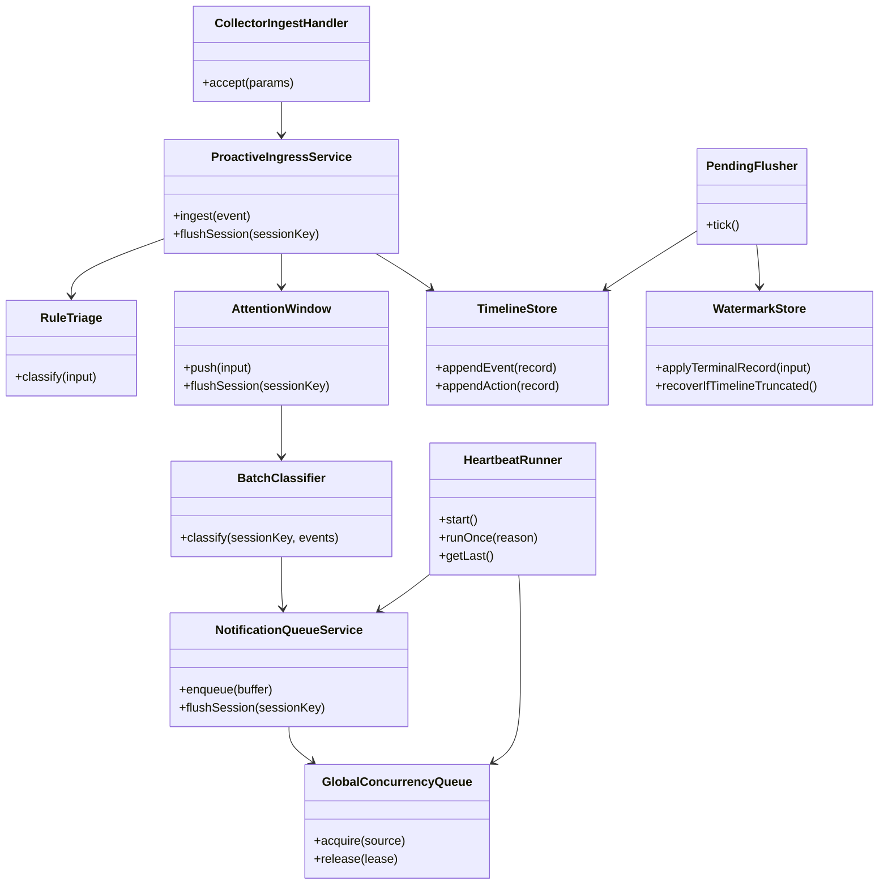
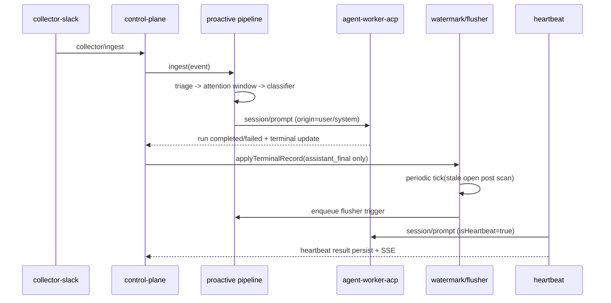

# 260305-s02: Phase E 実装計画（proactive / heartbeat 再導入）

## 0. Core Principles

- Prototype First: Phase E は「自律運用の再稼働」を優先し、分散化や高度な運用 UI は後続へ分離する。
- SOLID: `control-plane` の責務を `ingest` / `proactive routing` / `flusher` / `heartbeat` に分割し、境界は契約型で固定する。
- KISS: v1 は Slack 入力の proactive + `main` セッション heartbeat に限定し、複数 agent への一般化は行わない。
- YAGNI: Route LLM 高度化、DLQ 再投入 UI、マルチホスト制御は今回実装しない。
- DRY: `legacy/impl-20260228` の `proactive/*` と `heartbeat-runner` を責務単位で移植し、同等ロジックの再実装を避ける。

## 1. 概要と目的 Overview and Purpose

- What
  - Phase D までで未導入の proactive routing pipeline と heartbeat runner を ACP 構成へ移植する。
  - `collector/ingest` 受理後の処理を `route triage -> attention window -> batch classifier -> notification queue -> chat dispatch` へ置き換える。
  - timeline/watermark/pending flusher を `control-plane` 内部状態として復元し、stale な未対応投稿の再起動を自動化する。
  - heartbeat 定期実行と手動実行 API（run/last/history）を control-plane API に再導入する。
- Why
  - 現状は Slack イベントが即時 run 起動されるのみで、自律 triage・遅延回収・定期監視が欠落している。
  - 実運用での取りこぼし抑止とノイズ削減には、attention window と fail-closed classifier、watermark 連動 flusher が必要。
  - heartbeat が無いと「未読検知して自律通知する」要件が満たせない。
- How
  - `control-plane` に `proactive` モジュール群を新設し、ingest-handler から pipeline へ委譲する。
  - run 終端（completed/failed/cancelled）時に terminal action を timeline へ記録し、`assistant_final` のみ watermark handled 境界を前進させる。
  - flusher と heartbeat は supervisor と同階層の定周期タスクとして起動し、global concurrency queue で競合制御する。

## 2. 仕様と受け入れ条件 Specification and Acceptance Criteria

### 2.1 スコープ Scope

- 今回やること
  - proactive pipeline 再導入
    - `rule triage`（self drop / DM immediate / mention immediate / channel accumulate）
    - `attention window`（sessionKey 単位 idle/maxWait flush）
    - `batch classifier`（`respond|note|ignore`、fail-closed=`note`）
    - `notification queue` + `global concurrency queue`（`dm/group/channel/flusher/heartbeat` 優先度）
  - ingest 経路統合
    - `CollectorIngestHandler` の `onAccept` 先を immediate dispatch から proactive pipeline へ変更
    - projection は `originSessionKey` を保持し、run は既定 `main` へ dispatch
  - timeline / watermark / pending flusher
    - `<stateDir>/timeline.jsonl` 追記（event + terminal action）
    - `<stateDir>/watermarks.json` 永続化（scan / handled / open）
    - pending flusher の stale 判定・抑制（別人返信検知）・periodic tick
  - heartbeat 再導入
    - 定期 tick、`POST /api/heartbeat/run`、`GET /api/heartbeat/last`、`GET /api/heartbeat/history`
    - `report_heartbeat_status` ツール契約（1 回必須、構造化 payload 検証）
    - heartbeat event の SSE 配信（`event: heartbeat`）
  - 仕様同期
    - `doc/spec.md` 13.2/13.3/14.5/14.6/14.8 の Phase E 契約追記
    - runbook（flusher backlog / heartbeat 運用）追加
- 成果物
  - 実装: `src/control-plane/proactive/*`, `src/control-plane/heartbeat/*`, `src/index.ts`, `src/control-plane/http/*`, `src/assistant/agent-session-factory.ts`
  - 契約: `src/control-plane/contracts/http-api.ts`, `src/contracts/process-rpc/*`（必要差分のみ）
  - テスト: `tests/unit/proactive/*`, `tests/unit/heartbeat/*`, `tests/integration/*`, `tests/contract/http/*`
  - ドキュメント: `doc/spec.md`, `doc/file-paths.md`, `doc/runbook/*`, 本計画
- 制約
  - 単一ホスト / at-least-once 前提を維持
  - Slack source のみ対象（GitHub/git-local は非対象）
  - heartbeat 実行対象は `main` セッション固定（v1）

### 2.2 非スコープ Non Scope

- Route LLM の本格最適化（structured output 強化、モデル切替戦略）
- heartbeat のマルチセッション同時運用
- proactive/deliver の分散キュー（Kafka/NATS）化
- heartbeat 専用 UI ダッシュボードのリッチ化（グラフ、検索フィルタ）
- DLQ 再投入 UI と自動再投入ポリシー

### 2.3 ユースケース Use Cases

- 正常系1: Slack channel post を蓄積して最終的に run 起動
  - `accumulate` イベントが attention window でまとまり、classifier が `respond` を返した場合のみ dispatch される
- 正常系2: DM/mention は即時処理
  - triage が `immediate` を返し、batch classifier を待たず run 起動する
- 正常系3: stale 未対応投稿を flusher が再回収
  - watermark 以降の open post が stale 閾値を超えると `flusher` source として run 起動する
- 正常系4: heartbeat 周期実行で要注意状態を通知
  - heartbeat が `report_heartbeat_status(status=needs_attention, notify=true)` を返し、記録と通知が残る
- 異常系1: classifier timeout/例外
  - fail-closed で `note` にフォールバックし、不要な run 暴発を防ぐ
- 異常系2: timeline truncate
  - flusher tick 開始時に watermark を回復し、offset を 0 へ巻き戻して再走査する

### 2.4 受け入れ条件 Acceptance Criteria

1. Given `collector/ingest` で channel post が連続受理される  
   When attention window idle/maxWait が満了する  
   Then 1 つの dispatch バッチへ集約され、`run/accepted` が 1 回だけ発火する
2. Given DM または mention 投稿が受理される  
   When triage が評価される  
   Then `immediate` 扱いで batch classifier を待たず run 起動される
3. Given batch classifier が timeout/例外/低 confidence となる  
   When pipeline が判定を確定する  
   Then `note` として system event 記録し、run は起動しない
4. Given `assistant_final` terminal action が timeline へ記録される  
   When watermark 更新を行う  
   Then `handled.lastHandledOffset` が前進し、`assistant_aborted|assistant_error` では前進しない
5. Given stale な open post が存在し、別人返信抑制条件に当たらない  
   When pending flusher tick が実行される  
   Then 対象 session が `flusher` source で enqueue される
6. Given heartbeat periodic tick が発火し `report_heartbeat_status` が `needs_attention + notify=true` を返す  
   When run が完了する  
   Then `heartbeat-runs.jsonl` に `schema=adjutant.heartbeat.result.v1` で追記され、`GET /api/heartbeat/last` で取得できる
7. Given `POST /api/heartbeat/run` が呼ばれる  
   When run が成功または失敗する  
   Then HTTP 応答契約と SSE `heartbeat` イベント契約がテストで固定される

### 2.5 既知の制約 Known Limitations

- v1 heartbeat は `main` セッション固定で、thread/session ごとの個別 heartbeat は未対応。
- flusher 判定は timeline 依存のため、外部で timeline を直接編集した場合の整合は保証しない。
- classifier は fail-closed 優先のため、誤って `note` 側に倒れるケース（false negative）を許容する。

## 3. 前提技術スタック Context and Tech Stack

- Language Framework
  - TypeScript (ESM), Node.js
- Libraries
  - 既存 `@mariozechner/pi-coding-agent`
  - 既存 Process RPC / ACP 契約実装
- Style Guide
  - ESLint + Prettier + TypeScript strict を維持
- Runtime Deployment
  - `src/index.ts`（control-plane）に proactive/flusher/heartbeat を統合
  - `agent-worker-acp` は既存 stdio ACP worker を利用
- Testing
  - Node.js test runner (`node --test`)
  - Unit / Integration / Contract を `tests/` 配下へ追加

## 4. インターフェース契約 Interface Contracts

### 4.1 公開APIまたは外部I O一覧

- HTTP API（新規/拡張）
  - `POST /api/heartbeat/run`
  - `GET /api/heartbeat/last`
  - `GET /api/heartbeat/history?limit={n}&cursor={opaque}`
- SSE
  - `GET /api/events/stream` に `event: heartbeat` を追加
- Process RPC
  - `collector/ingest`（既存）: 受理後に proactive pipeline へ投入
- 永続化
  - `<stateDir>/timeline.jsonl`
  - `<stateDir>/watermarks.json`
  - `<stateDir>/heartbeat-runs.jsonl`
  - 既存 `<stateDir>/journal/control-plane/inbox.jsonl` / deliver queue / idempotency

### 4.2 データモデルとスキーマ

- `TimelineRecordV1_5`
  - `schema: "adjutant.timeline.record.v1.5"`
  - `recordType: "event" | "action"`
  - `actionType: "assistant_final" | "assistant_aborted" | "assistant_error"`（action時）
  - `sessionKey`, `uid`, `ts`, `loggedAt` 必須
- `WatermarksV1`
  - `schema: "adjutant.watermarks.v1"`
  - `scan.lastScannedOffset`, `scan.lastGoodOffset`
  - `sessions[sessionKey].handled.lastHandledOffset`
  - `sessions[sessionKey].open.openPostCount`
- `HeartbeatRunResult`
  - `schema: "adjutant.heartbeat.result.v1"`
  - `status: "ran" | "skipped" | "failed"`
  - `event.status: "sent" | "ok-token" | "ok-empty" | "skipped" | "failed"`
- バリデーション方針
  - heartbeat tool result は `report_heartbeat_status` 構造検証を必須化
  - timeline line は schema validation 失敗時に skip + warn
  - API payload は既存 `INVALID_REQUEST` 契約で reject

### 4.3 エラーと例外 Error Handling

- エラー分類
  - `INVALID_REQUEST`, `CLASSIFIER_TIMEOUT`, `CLASSIFIER_INVALID_OUTPUT`, `TIMELINE_APPEND_FAILED`, `WATERMARK_SAVE_FAILED`, `HEARTBEAT_FAILED`
- リトライ方針
  - classifier timeout は再試行せず fail-closed
  - flusher/heartbeat tick は次周期再試行
  - timeline/session 片側失敗は pending/backfill で回復
- タイムアウト方針
  - classifier timeout: `ADJUTANT_ROUTE_LLM_TIMEOUT_MS`
  - heartbeat run timeout: `ADJUTANT_HEARTBEAT_TIMEOUT_MS`（新規）
- ログ方針と個人情報
  - `sessionKey`, `runId`, `dedupeKey`, `source`, `classifierAction`, `heartbeatStatus` を構造化出力
  - 心拍本文や Slack 生 payload の全文出力は debug フラグ時のみ

### 4.4 代表的な例 Examples

```json
{
  "schema": "adjutant.timeline.record.v1.5",
  "recordType": "action",
  "actionType": "assistant_final",
  "sessionKey": "slack:channel:C123:thread:1741160000.000100",
  "uid": "run:run_01:assistant_final",
  "ts": "2026-03-05T10:00:01.000Z",
  "loggedAt": "2026-03-05T10:00:01.003Z"
}
```

```http
POST /api/heartbeat/run
content-type: application/json

{"reason":"manual-check"}
```

```json
{
  "schema": "adjutant.heartbeat.result.v1",
  "status": "ran",
  "event": {
    "status": "sent",
    "reason": "needs attention on thread slack:channel:C123:thread:1741160000.000100"
  },
  "ts": "2026-03-05T10:05:00.000Z"
}
```

### 4.5 `doc/spec.md` 境界契約準拠ルール

- 準拠元
  - `doc/spec.md` 13.2（routing pipeline）
  - `doc/spec.md` 13.3（timeline/watermark/flusher）
  - `doc/spec.md` 14.5/14.6（境界契約と cursor commit）
- commit 規約
  - ingest inbox cursor は run terminal（completed/failed/cancelled）でのみ commit
  - watermark handled は `assistant_final` の timelineOffset でのみ前進
- phase D 既存契約との整合
  - deliver completion が遅延中でも flusher が誤起動しないよう、判定対象を timeline action 境界に限定

## 5. アーキテクチャと設計図 Architecture and Diagrams

### 5.1 図の選択方針

- collector/control-plane/worker を跨ぎ、内部モジュールも多段で分割されるためクラス図を必須化する。
- 非同期連携（ingest, window flush, flusher tick, heartbeat tick）が重要なためシーケンス図を追加する。

### 5.2 クラス図 Class Diagram



### 5.3 その他の図 Optional



## 6. テスト戦略 Test Strategy

### 6.1 テストの種類

- Unit
  - `rule-triage` の route 判定（self/DM/mention/channel）
  - `attention-window` の idle/maxWait flush
  - `batch-classifier` の fail-closed（timeout/invalid/low confidence）
  - `watermark-store` の `assistant_final` のみ handled 前進
  - `heartbeat-runner` の precheck と `report_heartbeat_status` 契約
- Integration
  - ingest -> proactive dispatch -> run terminal -> watermark 更新
  - pending flusher tick による stale session enqueue と suppression
  - heartbeat periodic/manual 実行と `/api/events/stream` heartbeat 配信
- Contract
  - heartbeat API (`run/last/history`) の request/response schema
  - `adjutant.timeline.record.v1.5` / `adjutant.heartbeat.result.v1` の固定

### 6.2 カバレッジ対象

- 重要ロジック
  - triage + attention window + classifier の連携結果
  - terminal action と watermark 境界更新
  - flusher/heartbeat の global queue 競合制御
- エラー分岐
  - classifier timeout、timeline append failure、heartbeat tool call missing
- 境界条件
  - timeline truncate recovery
  - 同一 dedupeKey 再送と proactive 経路の idempotency
  - `requests-in-flight` 中の heartbeat skip + retry

## 7. 実装タスクリスト Implementation Plan

### Phase 1 設計と準備

- [x] `Task-E-000` `doc/spec.md` の Phase E 境界契約（13.2/13.3/14.5/14.6/14.8）を確定
- [x] `Task-E-001` legacy -> ACP 移植マッピング（`proactive/*`, `heartbeat-*`）を artifact 化
- [x] `Task-E-002` proactive / heartbeat の型定義と永続化スキーマを先行追加
- [x] `Task-E-003` Mermaid 図と runbook の骨子を作成

### Phase 2 機能Aの実装（proactive routing pipeline）

- [x] `Task-EA-RED-001` Test: triage + attention window + classifier fail-closed の失敗テスト作成
- [x] `Task-EA-RED-002` Test: ingest 受理後に immediate と accumulate が分岐する統合テスト作成
- [x] `Task-EA-GREEN-001` Impl: `src/control-plane/proactive/*` の core モジュール移植
- [x] `Task-EA-GREEN-002` Impl: ingest-handler から proactive pipeline への接続
- [x] `Task-EA-GREEN-003` Impl: global concurrency queue を dispatch 経路へ統合
- [x] `Task-EA-REFACTOR-001` Refactor: dispatch adapter / queue key 解決の重複除去
- [x] `Task-EA-CONTRACT-001` Contract: classifier action と system event 契約テスト固定

### Phase 3 機能Bの実装（watermark/flusher/heartbeat）

- [x] `Task-EB-RED-001` Test: terminal action での watermark 前進条件（assistant_final のみ）失敗テスト作成
- [x] `Task-EB-RED-002` Test: pending flusher stale 判定・別人返信 suppression の失敗テスト作成
- [x] `Task-EB-RED-003` Test: heartbeat run/last/history API + SSE 契約の失敗テスト作成
- [x] `Task-EB-GREEN-001` Impl: timeline/watermark store と terminal action writer を control-plane へ実装
- [x] `Task-EB-GREEN-002` Impl: pending flusher periodic tick と enqueue 接続
- [x] `Task-EB-GREEN-003` Impl: heartbeat runner + `report_heartbeat_status` ツール契約 + 永続化
- [x] `Task-EB-GREEN-004` Impl: `control-plane-router` に heartbeat API を追加
- [x] `Task-EB-REFACTOR-001` Refactor: scheduler と shutdown 順序（collector/deliver/flusher/heartbeat）を統一
- [x] `Task-EB-INTEG-001` Integration: proactive + flusher + heartbeat の縦断 E2E

### Phase 4 統合と検証

- [x] `Task-E-VERIFY-001` `pnpm check` 実行
- [x] `Task-E-VERIFY-002` collector burst / DM burst / flusher / heartbeat 同時負荷シナリオ検証
- [x] `Task-E-VERIFY-003` timeline truncate・再起動復旧・重複通知のエッジケース検証
- [x] `Task-E-VERIFY-004` ログ/監査確認（PII マスク、error code、heartbeat reason）
- [x] `Task-E-VERIFY-005` ドキュメント更新（spec, file-paths, runbook, roadmap）
- [x] Verification artifact: `doc/plan/artifacts/260305-s02-phase-e-verification-report.md`

## 8. 完了の定義 Definition of Done

### 8.1 機能DoD Functional DoD

- [x] 受け入れ条件 1-7 がすべて満たされている
- [x] proactive pipeline（triage/window/classifier/queue）が collector ingest と統合されている
- [x] watermark/pending flusher/heartbeat が再起動を跨いで一貫動作する

### 8.2 品質DoD Quality DoD

- [x] Unit / Integration / Contract テストが全てパスしている
- [x] `pnpm check` がグリーン
- [x] 追加 API と永続化スキーマが仕様書へ反映されている
- [x] デバッグコードと暫定ログが除去されている

## 9. 懸念事項と未確定事項 Concerns and Questions

- heartbeat 実行対象を `main` 固定とする期間（Phase E で固定か、Phase F で拡張するか）。
- classifier の `note` 判定をどの程度 UI へ露出するか（SSE のみか履歴保存まで行うか）。
- flusher 起動時の prompt 形式（通常 run と同一か、専用 prefix を付与するか）。
- `heartbeat-runs.jsonl` の保持期間と compaction ポリシー（容量上限、日次ローテーション）。
- deliver 遅延時の stale 判定補正を timeline action のみで十分とみなすか（追加の deliver 状態参照が必要か）。
