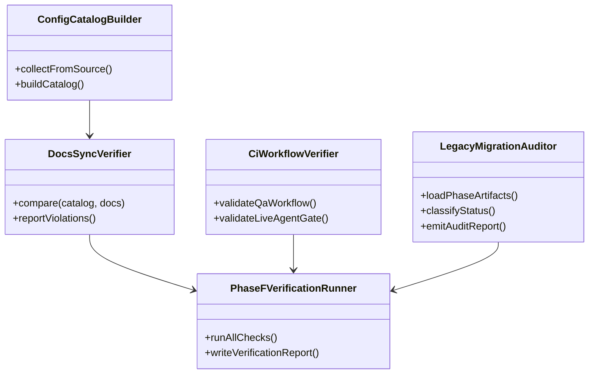
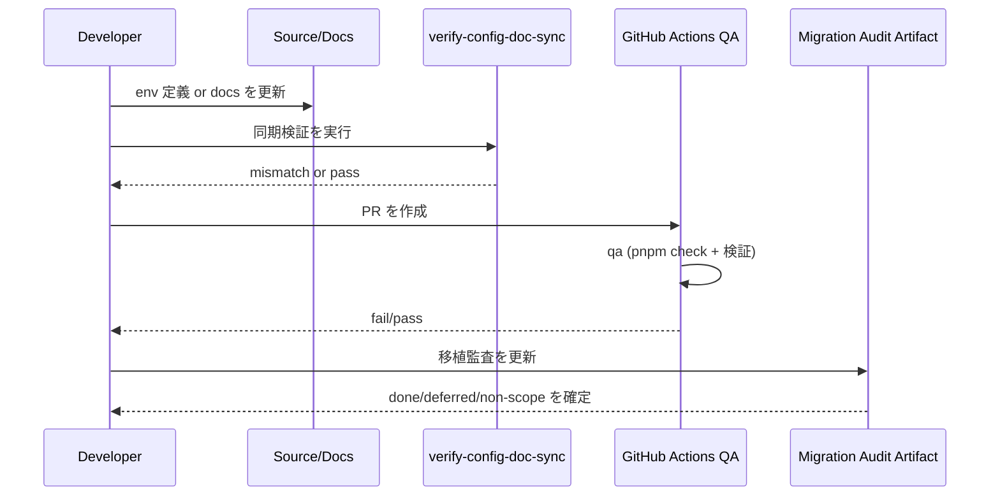

# 260305-s03: Phase F 実装計画（仕上げと安定化）

## 0. Core Principles

- Prototype First: Phase F は新機能追加ではなく「運用継続できる完成形」に収束させる。破壊的変更は避け、必要な移行方針のみ最小で明記する。
- SOLID: 設定管理、ドキュメント同期、CI、移植監査を独立責務として分割し、相互依存を最小化する。
- KISS: 「検証可能な最小セット」を優先し、複雑な自動化基盤は導入しない。
- YAGNI: 分散実行・高度メトリクス基盤・新 UI 追加は行わない。
- DRY: 既存の `doc/spec/README.md` / `README.md` / `doc/file-paths.md` / runbook / verification artifact の重複記述を統制し、同一事実の二重管理を減らす。

## 1. 概要と目的 Overview and Purpose

- What
  - ACP legacy 移植 Phase A-E 完了後の仕上げとして、設定整理、ドキュメント同期、CI 安定化、移植監査を実施する。
  - 運用に必要な手順・契約・検証導線を「人手依存」から「再現可能なチェック」に引き上げる。
- Why
  - 現状は機能実装は揃っている一方で、設定定義の散在・文書間の表記差・CI 手順の揺れ・移植トレーサビリティ不足が残る。
  - 継続開発での回帰抑止には、コードと文書を同時に壊せない仕組みが必要。
- How
  - 設定値の定義源を整理し、docs との差分検出を自動化する。
  - `doc/spec/README.md` と配下詳細仕様 / `README.md` / `doc/file-paths.md` / runbook の境界を整理し、責務と参照関係を固定する。
  - `qa.yml` とローカル `pnpm check` の再現性を揃え、失敗時に原因が追跡可能な CI を構築する。
  - legacy -> ACP の最終移植監査表を作成し、未移植・意図的非スコープを明文化する。

## 2. 仕様と受け入れ条件 Specification and Acceptance Criteria

### 2.1 スコープ Scope

- 今回やること
  - 設定整理
    - `process.env` 参照点の棚卸しと分類（collector/control-plane/worker/deliver/test）
    - 既定値・型・説明の単一参照源（catalog）を定義
    - docs 側（`README.md`, `doc/spec/configuration.md`, `doc/file-paths.md`）との同期検証導線を追加
  - ドキュメント同期
    - API/永続化/運用手順の責務分担を確定
    - runbook（collector backlog, deliver recovery, proactive flusher, heartbeat）の参照導線統一
    - `doc/plan/260228-s03-acp-legacy-migration-roadmap-overview.md` の Phase F 完了導線を更新
  - CI 安定化
    - `qa.yml` の実行順・失敗面の明確化（`qa` 必須、`live-agent` 条件実行）
    - ローカル実行コマンドと CI 実行コマンドの差分最小化
    - docs/config 乖離検知を CI gate へ組み込み
  - 移植監査
    - Phase A-E の mapping artifact を統合し、最終監査表を作成
    - legacy 実装項目を `done / deferred / non-scope` に分類
    - 各項目に根拠（実装ファイル・テスト・仕様章）を紐付け
- 成果物
  - 実装: `scripts/verify-config-doc-sync.ts`（新規）, 必要に応じて `src/runtime/*` または `src/control-plane/*` の設定定義整理
  - CI: `.github/workflows/qa.yml`（必要差分）
  - テスト: `tests/unit/docs-sync/*`, `tests/contract/ci/*`, `tests/integration/phase-f-*`（必要分）
  - ドキュメント:
    - `README.md`
    - `doc/spec/README.md`
    - `doc/file-paths.md`
    - `doc/runbook/*.md`
    - `doc/plan/artifacts/260305-s03-phase-f-migration-audit.md`
    - `doc/plan/artifacts/260305-s03-phase-f-verification-report.md`
- 制約
  - 既存 API 契約（HTTP/SSE/Process RPC）を破壊しない
  - 単一ホスト前提と at-least-once 配信前提を維持する
  - live-agent テストは `OPENAI_API_KEY` 有無による条件実行を維持する

### 2.2 非スコープ Non Scope

- proactive / heartbeat アルゴリズム自体の機能追加
- deliver backend の多重化や分散キュー化
- 本番監視基盤（Prometheus/Grafana）新規導入
- Web UI の新規機能追加
- GitHub / git-local collector の実装

### 2.3 ユースケース Use Cases

- 正常系1: 設定追加時の docs 同期
  - 開発者が新しい環境変数を追加した際、同期検証で docs 未更新が即時検知される
- 正常系2: 新規参加者の起動
  - `README.md` と runbook を見れば、同一の設定名と手順で起動・検証できる
- 正常系3: CI 実行の再現
  - ローカルで `pnpm check` + 追加検証を通した内容が CI でも同様に再現される
- 正常系4: legacy 移植監査
  - 監査表から、各 legacy 責務が ACP 側のどこで成立しているか追跡できる
- 異常系1: docs と実装の乖離
  - 変数名・既定値・保存パスが不一致な場合、検証で fail しマージ前に検出される
- 異常系2: live-agent 環境不足
  - `OPENAI_API_KEY` 未設定時は `live-agent` を skip し、`qa` 失敗とは分離して扱う

### 2.4 受け入れ条件 Acceptance Criteria

1. Given 新しい環境変数を `src/*` に追加し docs を更新していない  
   When config/docs 同期検証を実行する  
   Then `DOC_SYNC_MISMATCH` で失敗し、未同期項目が列挙される
2. Given `README.md` / `doc/spec/configuration.md` / `doc/file-paths.md` が実装と整合している  
   When 同期検証を実行する  
   Then 0 差分で成功し、`pnpm check` と同時実行しても green となる
3. Given Pull Request で `qa.yml` が実行される  
   When `OPENAI_API_KEY` が未設定である  
   Then `qa` job は必須で成功し、`live-agent` は条件 skip される
4. Given `main` への push で `OPENAI_API_KEY` が設定されている  
   When `qa.yml` が実行される  
   Then `qa` 成功後に `live-agent` が実行され、失敗時はジョブ単位で原因が識別できる
5. Given Phase A-E の mapping/report と現行実装を照合する  
   When 移植監査 artifact を生成する  
   Then legacy 対象責務が `done / deferred / non-scope` で分類され、根拠リンクが記載される
6. Given runbook 4 本（collector/deliver/flusher/heartbeat）を確認する  
   When 用語・ファイルパス・エスカレーション条件を照合する  
   Then 仕様用語と矛盾がなく、障害時の一次対応導線が統一される
7. Given Phase F の検証コマンド一式を実行する  
   When 検証結果を記録する  
   Then `260305-s03-phase-f-verification-report.md` にコマンド、結果、残課題が追記される

### 2.5 既知の制約 Known Limitations

- live-agent テストは外部 API と secret に依存するため、完全再現はローカル単独では保証できない。
- docs 同期検証は構造化対象（設定名、既定値、主要パス）を中心とし、自然文の完全一致までは保証しない。
- Slack 実運用を伴う E2E（CDP 実接続）は CI で常時実行しない。

## 3. 前提技術スタック Context and Tech Stack

- Language Framework
  - TypeScript (ESM), Node.js 20 系（CI）
- Libraries
  - 既存 `tsx`, `eslint`, `prettier`, `@mariozechner/pi-coding-agent`
- Style Guide
  - ESLint / Prettier / TypeScript strict 準拠
- Runtime Deployment
  - `src/index.ts`（control-plane）中心の既存構成を維持
  - CI は `.github/workflows/qa.yml` を正本として運用
- Testing
  - Node.js test runner（`node --test`）
  - `pnpm check`（format/typecheck/test）
  - Phase F で追加する docs/CI/監査向け unit/contract/integration

## 4. インターフェース契約 Interface Contracts

### 4.1 公開APIまたは外部I O一覧

- CLI
  - `pnpm check`
  - `pnpm run test:live-agent`
  - `node --import tsx scripts/verify-config-doc-sync.ts`（新規想定）
- CI Workflow
  - `.github/workflows/qa.yml`
  - job: `qa`（必須）, `live-agent`（条件付き）
- ドキュメント I/O
  - `README.md`
  - `doc/spec/README.md`
  - `doc/file-paths.md`
  - `doc/runbook/*.md`
- 監査 artifact
  - `doc/plan/artifacts/260305-s03-phase-f-migration-audit.md`
  - `doc/plan/artifacts/260305-s03-phase-f-verification-report.md`

### 4.2 データモデルとスキーマ

- `ConfigCatalogEntry`（新規）
  - `{ key, defaultValue, type, owner, description, sourceFiles, docRefs }`
- `DocSyncViolation`
  - `{ key, reason: "missing_doc"|"default_mismatch"|"unknown_doc_key", expected, actual, refs }`
- `MigrationAuditRecord`
  - `{ legacyPath, acpPath, status: "done"|"deferred"|"non-scope", evidence: { spec, tests, files } }`
- バリデーション方針
  - key 名は大文字スネークケースを必須
  - 同一 key の重複定義を禁止
  - status は列挙値以外を reject

### 4.3 エラーと例外 Error Handling

- エラー分類
  - `DOC_SYNC_MISMATCH`
  - `MIGRATION_AUDIT_GAP`
  - `CI_PROFILE_MISMATCH`
  - `INVALID_AUDIT_RECORD`
- リトライ方針
  - docs/監査検証はリトライせず即 fail（修正優先）
  - CI 失敗はジョブ単位で再実行可能
- タイムアウト方針
  - 既存 `pnpm run test` の timeout を尊重し、Phase F で追加する検証は短時間で終了する設計とする
- ログ方針と個人情報
  - 検証ログは key 名・ファイルパス・差分内容のみ出力
  - secret 値（`OPENAI_API_KEY`）や生 payload は出力しない

### 4.4 代表的な例 Examples

```json
{
  "key": "ADJUTANT_HEARTBEAT_INTERVAL_MS",
  "reason": "default_mismatch",
  "expected": "300000",
  "actual": "600000",
  "refs": ["src/index.ts:1502", "README.md"]
}
```

```json
{
  "legacyPath": "legacy/impl-20260228/src/proactive/pending-flusher.ts",
  "acpPath": "src/control-plane/proactive/pending-flusher.ts",
  "status": "done",
  "evidence": {
    "spec": ["doc/spec/proactive-routing.md"],
    "tests": ["tests/unit/control-plane/proactive/pending-flusher.test.ts"],
    "files": ["src/control-plane/proactive/pending-flusher.ts"]
  }
}
```

```bash
pnpm run check
node --import tsx scripts/verify-config-doc-sync.ts
node --import tsx --test tests/contract/ci/qa-workflow-contract.test.ts
```

## 5. アーキテクチャと設計図 Architecture and Diagrams

### 5.1 図の選択方針

- 複数責務（設定・docs・CI・監査）を跨いで実施するためクラス図を必須化する。
- 変更検知フロー（開発 -> 検証 -> CI fail/pass）が重要なためシーケンス図を追加する。

### 5.2 クラス図 Class Diagram



### 5.3 その他の図 Optional



## 6. テスト戦略 Test Strategy

### 6.1 テストの種類

- Unit
  - config catalog 収集の key 重複・型判定
  - docs 解析と mismatch 検知
  - migration audit record の status/evidence 検証
- Integration
  - `pnpm check` + docs 同期検証を通した end-to-end 実行
  - runbook / spec / README の参照整合検証
- Contract
  - `qa.yml` の job 依存関係（`needs: qa`）と gate 条件
  - audit artifact の schema 契約

### 6.2 カバレッジ対象

- 重要ロジック
  - env 定義と docs 記述の同期判定
  - migration status の分類ルール
  - CI 実行プロファイル（必須 job と条件 job）
- エラー分岐
  - docs 欠落、既定値不一致、監査根拠欠落
- 境界条件
  - 同一 key の複数定義
  - `OPENAI_API_KEY` あり/なしの CI 分岐
  - 非スコープ項目の監査除外

## 7. 実装タスクリスト Implementation Plan

### Phase 1 設計と準備

- [x] `Task-F-000` Phase F 契約対象の確定（設定キー一覧、doc 責務分担、CI gate 方針）  
       成果物: `doc/plan/artifacts/260305-s03-phase-f-contract-freeze.md`
- [x] `Task-F-001` 既存 env 参照点の棚卸しと分類（collector/control-plane/worker/deliver/test）  
       成果物: `doc/plan/artifacts/260305-s03-phase-f-env-inventory.md`
- [x] `Task-F-002` 移植監査の基礎データ収集（Phase A-E mapping/report/spec/test の参照表作成）  
       成果物: `doc/plan/artifacts/260305-s03-phase-f-migration-audit-source-index.md`
- [x] `Task-F-003` Mermaid 図と artifact 出力フォーマットの確定  
       成果物: `doc/plan/artifacts/260305-s03-phase-f-contract-freeze.md`

### Phase 2 機能Aの実装（設定整理 + docs 同期）

- [x] `Task-FA-RED-001` Test: docs 未更新時に `DOC_SYNC_MISMATCH` で失敗するテスト作成  
       成果物: `tests/unit/docs-sync/config-doc-sync.test.ts`（missing_doc ケース）
- [x] `Task-FA-RED-002` Test: 既定値不一致を検知するテスト作成  
       成果物: `tests/unit/docs-sync/config-doc-sync.test.ts`（default_mismatch ケース）
- [x] `Task-FA-GREEN-001` Impl: config catalog 抽出と docs 同期検証スクリプトを実装  
       成果物: `src/runtime/config-doc-sync.ts`, `scripts/verify-config-doc-sync.ts`, `package.json` (`verify:config-doc-sync`)
- [x] `Task-FA-GREEN-002` Impl: `README.md` / `doc/spec/README.md` / `doc/spec/configuration.md` / `doc/file-paths.md` の同期更新  
       成果物: `README.md`, `doc/spec/README.md`, `doc/spec/configuration.md`, `doc/file-paths.md`
- [x] `Task-FA-REFACTOR-001` Refactor: 設定説明の重複を削減し参照リンクを統一  
       成果物: env 名称の `ADJUTANT_API_*` -> `ADJUTANT_CONTROL_PLANE_*` 整理（README/spec）
- [x] `Task-FA-CONTRACT-001` Contract: 同期検証結果の出力形式を固定  
       成果物: `formatDocSyncViolations` JSON 形式 + `tests/unit/docs-sync/config-doc-sync.test.ts`

### Phase 3 機能Bの実装（CI 安定化 + 移植監査）

- [x] `Task-FB-RED-001` Test: `qa.yml` の必須 job / 条件 job 契約テスト作成  
       成果物: `tests/contract/ci/qa-workflow-contract.test.ts`
- [x] `Task-FB-RED-002` Test: 移植監査で evidence 欠落時に失敗するテスト作成  
       成果物: `tests/contract/ci/migration-audit-contract.test.ts`（missing evidence ケース）
- [x] `Task-FB-GREEN-001` Impl: CI workflow の安定化（実行順・失敗理由の可観測化）  
       成果物: `.github/workflows/qa.yml`（`qa` 内で `verify:config-doc-sync` 実行、`live-agent` は `needs: qa` 維持）
- [x] `Task-FB-GREEN-002` Impl: legacy -> ACP 最終移植監査 artifact を作成  
       成果物: `doc/plan/artifacts/260305-s03-phase-f-migration-audit.md`, `src/runtime/migration-audit.ts`
- [x] `Task-FB-GREEN-003` Impl: runbook（collector/deliver/flusher/heartbeat）の整合更新  
       成果物: `doc/runbook/collector-backlog-monitoring.md`, `doc/runbook/deliver-queue-recovery.md`, `doc/runbook/proactive-flusher-operations.md`, `doc/runbook/heartbeat-operations.md`
- [x] `Task-FB-REFACTOR-001` Refactor: verification コマンド群の整理（ローカル/CI の手順一致）  
       成果物: `package.json`（`verify:config-doc-sync`）, `README.md`（検証コマンド追記）, `.github/workflows/qa.yml`
- [x] `Task-FB-INTEG-001` Integration: docs 同期 + CI 契約 + 移植監査を縦断検証  
       成果物: `tests/integration/phase-f-stabilization.integration.test.ts`

### Phase 4 統合と検証

- [x] `Task-F-VERIFY-001` `pnpm check` 実行  
       実施結果: pass（`ADJUTANT_TEST_NO_DOCKER=1 pnpm run check`、tests: pass=320 / skip=1）
- [x] `Task-F-VERIFY-002` docs 同期検証コマンドを実行し mismatch 0 を確認  
       実施結果: `pnpm run verify:config-doc-sync` => `DOC_SYNC_OK`
- [x] `Task-F-VERIFY-003` CI workflow 契約テストを実行  
       実施結果: `tests/contract/ci/qa-workflow-contract.test.ts` pass
- [x] `Task-F-VERIFY-004` 移植監査 artifact の完了率と未移植項目を確認  
       実施結果: total=12, done=9, deferred=1, non-scope=2
- [x] `Task-F-VERIFY-005` Verification report を作成（コマンド、結果、残課題）  
       成果物: `doc/plan/artifacts/260305-s03-phase-f-verification-report.md`

## 8. 完了の定義 Definition of Done

### 8.1 機能DoD Functional DoD

- [x] 受け入れ条件 1-7 がすべて満たされている
- [x] 設定キーと docs の同期が検証可能になっている
- [x] legacy -> ACP 移植監査表が更新され、未移植の扱いが明確化されている
- [x] runbook 導線が統一され、障害時の一次対応が文書化されている

### 8.2 品質DoD Quality DoD

- [x] Unit / Integration / Contract テストがグリーン
- [x] `pnpm check` がグリーン
- [x] CI（`qa.yml`）で必須経路の失敗が再現可能に特定できる
- [x] 追加ドキュメントと artifact が repo 内で相互参照できる

## 9. 懸念事項と未確定事項 Concerns and Questions

- docs 同期検証の「正本」をどこに置くか（コード起点か docs 起点か）の最終決定が必要。
- `OPENAI_API_KEY` 依存の live-agent を必須品質ゲートにするか、参考指標に留めるかの合意が必要。
- 未実装項目（`doc/spec/feature-catalog.md` の未実装一覧）を `deferred` として固定する粒度をどこまで厳密にするか。
- runbook の監視指標を将来どの運用基盤へ接続するか（現時点は手順書ベース）。
- Docker なしローカル環境では `ADJUTANT_TEST_NO_DOCKER=1` を付与して `pnpm check` を実行する運用が必要。
