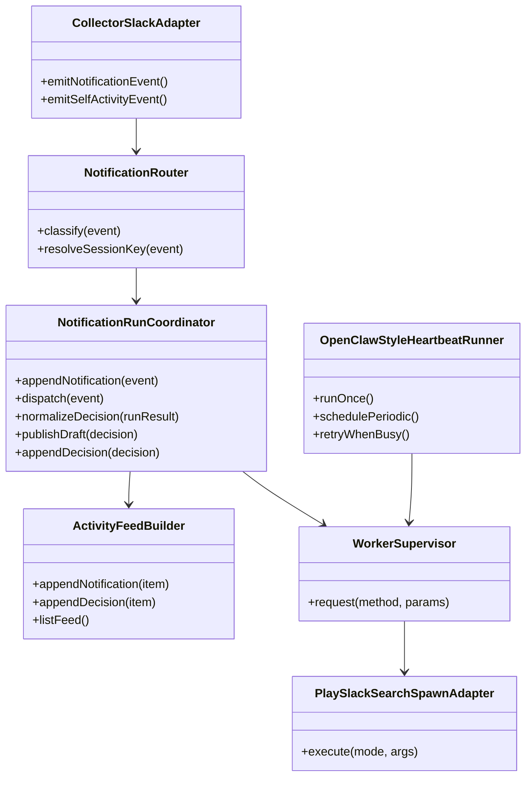
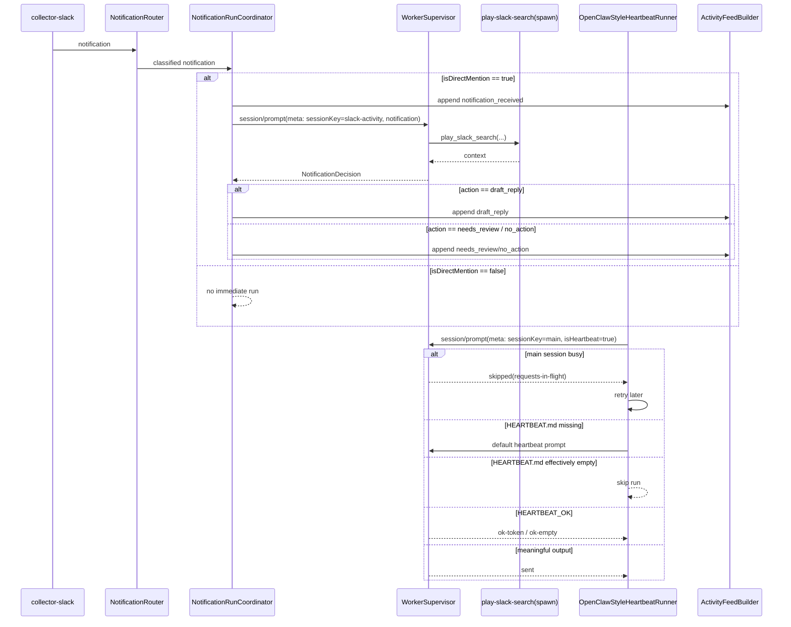

# 260310-s01: Slack Notification Driven Flow 実装計画

## 0. Core Principles

本章の原則は、この計画の全セクションと今後の全実装タスクに共通して適用する。特定箇所だけに限定して適用するものではない。

- Prototype First: 本計画全体で `vendor/openclaw` 寄せの単純な session / transcript モデルを優先し、durable queue / replay / duplicate 吸収は v1 から外す。既存の journal / idempotency 前提とは非互換になり得るため、破壊点は plan と spec に明記する。
- SOLID: 本計画全体で責務分離を優先し、収集、通知分類、AI 実行調停、Slack 検索 adapter、heartbeat、UI view を分離して設計する。単一モジュールへ複数責務を寄せない。
- KISS: 本計画全体で複雑さを増やさず、v1 は「自分宛メンション通知を `slack-activity` で処理し、必要なら `play-slack-search` で文脈取得する」最小構成に絞る。
- YAGNI: 本計画全体で現時点に不要な機能を入れず、Slack 自動送信、thread ごとの Slack session 分離、durable decision store、heartbeat の独自分類器は採用しない。
- DRY: 本計画全体で重複した契約や実装を作らず、heartbeat prompt 契約、busy 時の `skip + retry`、`HEARTBEAT_OK` の扱いは `vendor/openclaw` と同じ mental model を採用し、Slack 読み取りは `play-slack-search` へ集約する。

## 1. 概要と目的 Overview and Purpose

- What
  - Slack からは「自分宛メンション通知」だけを即時 AI 起動トリガーとして扱う。
  - 通知だけでは文脈が不足するため、AI は必要に応じて `play-slack-search` を呼び、`thread / message / search / permalink` のいずれかで周辺文脈を取得する。
  - 将来互換のため、`play-slack-search` は standalone custom tool のまま固定せず、`ToolHub` provider/action 経由へ戻せる構成にする。
  - `self post` と `self reaction` は自分の行動ログとして日次ファイルへ記録するが、AI 即時起動トリガーにはしない。`self reaction` は反応先本文を reaction 時点のスナップショットとして保持する。
  - heartbeat は `main` セッション上の full agent turn として定期実行し、`HEARTBEAT.md` を読み、必要な対応がなければ `HEARTBEAT_OK` で終了する。
  - Slack 通知一覧は `ActivityFeed` として表示するが、これは durable queue や SoT ではなく UI 向けの lightweight unread-like view とし、v1 では既読状態を保持しない。
- Why
  - file journal ベースの replay / idempotency / completion 管理を本格運用するには、rotation・partitioning・整合制御の実装コストが高い。
  - 現段階では、厳密な復旧性よりも OpenClaw 寄せの単純な session/transcript モデルの方が目的に合う。
  - Slack 全量収集や広い proactive pipeline はスコープに対して重すぎる。
  - `vendor/openclaw` は session/transcript 中心の runtime と heartbeat full-turn 契約を採る実装であり、本計画はその単純な実行モデルに寄せる。
- How
  - 通知取得は既存 `collector-slack` の CDP 収集を使うが、処理対象は自分宛メンション通知に限定する。notification 正規化には `threadTs` / `messageTs` / `permalink` を追加収集する。
  - Slack 読み取りは `customTools` 経由の `play-slack-search` だけに絞る。
  - follow-up では `ToolHub` を現行 ACP 構成へ復帰し、`play-slack-search` を provider/action として登録する。
  - AI の結果は `no_action | draft_reply | needs_review` に正規化するが、独立した decision store には保存せず transcript や UI 表示に残す。
  - v1 では Slack 送信口は持たず、返信が必要な場合は draft reply の生成までに留める。
- `play-slack-search` の `spawn adapter` は 3 分 timeout を持ち、timeout 時は run 全体を落とさず `needs_review` に変換する。
  - v1 では `timeout / 非0終了 / invalid JSON` を `needs_review` として扱い、UI には `play_slack_search failed: ...` の summary を表示する。
  - heartbeat は `vendor/openclaw` と同じく main セッションで走る full turn とし、busy 時は割り込まず skip して後で再試行する。`HEARTBEAT_OK` 以外の有意味な応答は main に heartbeat 応答として識別可能な形で残す。

## 2. 仕様と受け入れ条件 Specification and Acceptance Criteria

### 2.1 スコープ Scope

- 今回やること
  - 自分宛メンション通知を即時 AI 起動トリガーとして扱う契約を定義する
  - `self post` / `self reaction` を日次ファイル保存の record-only self activity として扱う方針を定義する
  - Slack 通知専用の `ActivityFeed` を UI view として定義する
  - Slack 通知起点 run の既定 session を `slack-activity` に固定し、`threadTs` / `messageTs` は Slack 参照の anchor として扱う規約を明文化する
  - 現行 notification 正規化契約へ `teamId` / `threadTs` / `messageTs` / `permalink` を追加する調査と調整を計画に含める
  - `play-slack-search` を現行 `customTools` に `spawn adapter` で組み込む
  - AI の結果を `no_action | draft_reply | needs_review(replyText?)` に正規化する
  - `vendor/openclaw` 相当の heartbeat を main セッション上の full agent turn として有効化する
  - 仕様・図・テストを OpenClaw 寄せ前提に整理する
  - follow-up として `ToolHub` 復活と `play-slack-search` の provider/action 化を計画へ含める
- 成果物
  - 実装: `src/collector-slack/*`, `src/control-plane/*`, `src/assistant/*`
  - View: `ActivityFeed`（Slack 通知専用の unread-like view。v1 では既読管理なし）
  - テスト: unit / integration / contract
  - ドキュメント: `doc/spec.md` 必要差分、今回の計画書
- 制約
  - v1 は Slack source のみ対象
  - 即時 AI 起動入力は「自分宛メンション通知」と「手動 user message」のみ
  - DM はメンションがなくても v1 の即時 AI 起動対象にしない
  - `self post` / `self reaction` は記録のみで即時 AI 起動には使わない
  - 現行 notification に不足している `teamId` / `threadTs` / `messageTs` / `permalink` は collector 側の拡張で補う前提とする
  - anchor が解決できない通知は自動送信しない
  - durable replay、idempotency、Slack 送信、exactly-once delivery は v1 の責務にしない
  - heartbeat は main セッション上で動かし、`vendor/openclaw` 相当のシンプルな full turn に寄せる
  - ActivityFeed は専用 AI セッションではなく、Slack 通知専用の read-only view とする

### 2.2 非スコープ Non Scope

- Slack 全メッセージ・reaction・channel post の常時収集
- 他人同士の post / reaction の常時記録
- DM を通知起点の即時 AI run 対象に戻すこと
- `inbox` / `idempotency` / `decision history` / `deliver completion` / `heartbeat result` を durable SoT として持つ設計
- restart 後の replay
- command / ingest duplicate/conflict 吸収
- Slack reply delivery
- exact-once reply delivery
- attention window / batch classifier / pending flusher を使った広い proactive routing
- heartbeat 専用の閾値ベース分類器や score-based review
- session 間の live state 参照
- shared knowledge の高度な統合設計
- 専用の review UI
- ユーザー操作用の独立した Slack Activity 画面スレッド
- GitHub / Jira など他 source の取り込み

### 2.3 ユースケース Use Cases

- 正常系1: 自分宛メンション通知を受けて thread を取得し、返信案を生成する
  - AI が `play-slack-search(mode=thread)` で thread を読み、`draft_reply` を返す
- 正常系2: 自分宛メンション通知を受けるが返信不要と判断する
  - AI が thread を確認し、`no_action` を返す
- 正常系3: 自分宛ではない通知が到着する
  - v1 では即時 run を起動せず、通知起点の処理対象にしない
- 正常系3-補足: DM 通知が到着する
  - v1 では自分宛メンション通知に含めず、即時 run を起動しない
- 正常系4: anchor 不足または文脈不足の通知を受ける
  - 自動返信せず `needs_review(replyText?)` に倒す
- 正常系5: Slack 通知起点の run は `slack-activity` セッションに集約される
  - thread ごとの session 分離は行わず、必要な文脈は毎回 `play-slack-search` で取得する
- 正常系6: 自分が reaction した投稿を後から追跡できる
  - self reaction は record-only の行動ログとして反応先本文つきで保持されるが、即時 AI 起動はしない
- 正常系7: heartbeat が `HEARTBEAT.md` をコンテキストに full agent turn を実行する
- 正常系8: heartbeat 実行時に main セッションが busy である
  - heartbeat は割り込まず `skip + 後再試行` になる
- 正常系9: `HEARTBEAT.md` が存在しない
  - default heartbeat prompt で run は継続する
- 正常系10: `HEARTBEAT.md` が実質空
  - heartbeat run 自体を skip する
- 正常系11: heartbeat が `HEARTBEAT_OK` を返す
  - 追加の表示や送信は発生しない
- 正常系12: user が Slack 通知を新しい順に確認したい
  - notification の全文と AI 判断が 1 つの feed で閲覧できる
- 異常系1: `play-slack-search` が timeout / rate limit / not found になる
  - run は `needs_review` に倒れる
- 異常系2: 同一通知が重複到着する
  - v1 では durable duplicate 吸収は行わず、その場の実行で扱う

### 2.4 受け入れ条件 Acceptance Criteria

1. Given 自分宛メンション通知が到着する  
   When 通知処理が開始される  
   Then 即時 AI run が `slack-activity` セッションで起動する
2. Given 通知に `messageTs` しかない  
   When `play-slack-search(mode=message)` で親 thread を解決する  
   Then 解決成功時は thread anchor を使って文脈取得し、失敗時は `needs_review` に倒れる
3. Given 通知に `threadTs` と `messageTs` がなく `permalink` だけがある  
   When `play-slack-search(mode=permalink)` で anchor 解決を試みる  
   Then 解決成功時は取得した anchor で文脈取得し、失敗時は `needs_review` に倒れる
4. Given AI run が通知処理を開始する  
   When 文脈取得が必要になる  
   Then `play-slack-search` は `spawn adapter + customTools` 経由で呼ばれ、`thread/message/search/permalink` のいずれかの mode で結果を返す
5. Given AI が通知を評価し `draft_reply` または `needs_review(replyText?)` を返す  
   When run が完了する  
   Then replyText と判断理由が transcript または UI 表示から確認でき、Slack 自動送信は行われない
6. Given 自分宛メンションではない通知、self post、または self reaction が観測される  
   When collector が受理する  
   Then それらは record-only または無視として扱われ、即時 AI run は起動しない
7. Given heartbeat の定期時刻に main セッションが空いている  
   When heartbeat が起動する  
   Then `HEARTBEAT.md` または default prompt を使う full agent turn が main セッション上で実行される
8. Given heartbeat の定期実行中に `main` が busy、`HEARTBEAT.md` が実質空、または結果が `HEARTBEAT_OK` である  
   When heartbeat 実行結果を処理する  
   Then それぞれ `skip + 後再試行`、run skip、UI 既定フィルタの契約で扱われる
9. Given heartbeat が `HEARTBEAT_OK` 以外の有意味な出力を返す  
   When heartbeat 実行結果を main 側へ反映する  
   Then main transcript には heartbeat 応答であると識別できる形で表示される

### 2.5 既知の制約 Known Limitations

- 通知設定や Slack 側の仕様に依存するため、通知されない重要会話は即時経路では拾えない。
- 通知 snippet は不完全であり、正確な判断には追加の Slack 読み取りが前提となる。
- `messageTs` しかない通知は thread anchor 解決に追加 fetch が必要になる場合がある。
- `needs_review(replyText?)` を返しても、v1 では専用 review UI は持たない。
- heartbeat は main セッションを再利用するため、有意味な heartbeat turn は main 側の履歴に影響する。
- ActivityFeed は durable audit log ではなく、Slack 通知専用の UI view である。
- restart 後の未処理通知 replay や duplicate 吸収は保証しない。
- collector 側で `threadTs` / `messageTs` / `permalink` を取り切れない通知は `needs_review` に倒すしかない。
- transcript は長期運用で肥大化する可能性があるため、本計画で全セッション共通の日次ファイル切替を実装する。

## 3. 前提技術スタック Context and Tech Stack

- Language Framework
  - TypeScript (ESM), Node.js
- Libraries
  - 既存 `@mariozechner/pi-coding-agent`, `tsx`
  - 現行 `customTools` 連携
  - `play-slack-search`
  - 既存 control-plane / ACP / heartbeat 経路
- Style Guide
  - `AGENTS.md` と repository guidelines に従い、TypeScript ESM / Prettier / ESLint / 既存の命名規約を維持する
- Runtime Deployment
  - `src/index.ts` を起点とする単一 control-plane
  - 通知取得は既存 `collector-slack` を利用
  - heartbeat は既存 control-plane の定期実行基盤を利用し、main セッション上の full agent turn として動かす
- Testing
  - Node.js test runner
  - 既存の unit / integration / contract テスト構成を維持

## 4. インターフェース契約 Interface Contracts

### 4.1 公開APIまたは外部I O一覧

- 外部イベント入力
  - 既存 `collector/ingest`
  - 即時 AI 起動対象は `NormalizedEvent(kind=notification)` のうち自分宛メンション notification のみ
  - `NormalizedEvent(kind=post|reaction)` の self event は record-only
- Tool I/O
  - `play_slack_search(mode, ...)`
  - 論理機能として `thread`, `message`, `search`, `permalink` を提供する
  - follow-up では `tool_hub(provider=\"play-slack-search\", action, args)` を公開面の第一候補とする
- heartbeat I/O
  - `HEARTBEAT.md` が存在すればその内容を heartbeat prompt の workspace context として利用する
  - `HEARTBEAT.md` が存在しなければ default heartbeat prompt を利用する
  - heartbeat 応答が `HEARTBEAT_OK` のみ、または同等の短い ACK の場合は無内容として扱う
  - heartbeat 応答が `HEARTBEAT_OK` 以外の有意味な出力を返した場合は、main transcript に heartbeat 応答として識別可能な形で残す
- HTTP API
  - 既存 `POST /api/commands`
  - 既存 heartbeat run / history API を利用するかは実装時に整理するが、durable history store 前提にはしない
  - `GET /api/activity-feed`
- 設定ファイル
  - `HEARTBEAT.md`
  - heartbeat 関連の既存 env var
- 永続化ストレージ
  - `self post` / `self reaction` は `state/activity/self/YYYY-MM-DD.jsonl` へ日次保存する
  - v1 の標準経路ではそれ以外の dedicated durable SoT を追加しない
- UI View
  - `ActivityFeed`（Slack 通知専用）
- 外部サービス連携
  - Slack Desktop CDP notification source
  - `play-slack-search`

### 4.2 データモデルとスキーマ

- `SlackNotificationEvent`
  - 位置づけ: notification 処理のための軽量 projection
  - 入力: `NormalizedEvent(kind=notification)`
  - `teamId`
  - `channelId`
  - `threadTs?`
  - `messageTs?`
  - `actorId?`
  - `title?`
  - `snippet?`
  - `permalink?`
  - `sessionKey` 既定値は `slack-activity`
  - `isDirectMention: boolean`
  - `mentionTargetUserId?`
  - 写像規約
    - `teamId <- detail.slack.team_id ?? meta.team_id`
    - `channelId <- detail.slack.channel_id`
    - `threadTs <- detail.slack.thread_ts`
    - `messageTs <- detail.slack.message_ts`
    - `actorId <- detail.slack.user`
    - `title <- detail.slack.title`
    - `snippet <- detail.slack.message_text`
    - `permalink <- detail.slack.permalink`
    - `mentionTargetUserId <- detail.slack.mention_target_user_id ?? meta.mention_target_user_id`
    - `isDirectMention <- detail.slack.is_direct_mention === true` を最優先し、存在しない場合は `mentionTargetUserId` が非空であることをもって `true` とみなす
  - 最低条件
    - `channelId` が無い notification は `SlackNotificationEvent` へ昇格させず drop する
    - `isDirectMention !== true` の notification は record-only または無視とし、即時 AI run を起動しない
- `SelfActivityEvent`
  - 位置づけ: self event の lightweight activity view
  - 入力: `NormalizedEvent(kind=post|reaction)` のうち self actor と判定できるもの
  - `teamId`
  - `kind: "post" | "reaction"`
  - `channelId`
  - `threadTs?`
  - `messageTs?`
  - `messageText?` reaction 時点のスナップショット
  - `emoji?`
  - `action?`
  - `sessionKey` 既定値は `slack-activity`
  - 保存先: `state/activity/self/YYYY-MM-DD.jsonl`
  - 保存規約
    - 1 行 1 JSON record で append する
    - `messageText` は reaction 時点のスナップショットとして保存し、後続再取得で上書きしない
    - 保存時刻は event の `logged_at` を優先し、無い場合は collector 側の現在時刻を使う
    - v1 では `ActivityFeed` に混ぜず、将来の追跡用 record-only data として保持する
- `slack-activity` セッション規約
  - `SlackNotificationEvent.isDirectMention === true` の notification だけが即時 AI run 候補になる
  - 即時 AI run 候補は thread/channel ごとに session を分離せず、既定で `slack-activity` セッションへ集約する
  - `threadTs` は thread 文脈取得用の最優先 anchor として扱う
  - `messageTs` しかない場合は `play-slack-search(mode=message)` で親 thread を解決し、成功時は文脈取得に使う
  - `threadTs` と `messageTs` がともに無い場合は `permalink` を fallback anchor 候補として扱い、解決できなければ `needs_review` に倒す
  - `messageTs` から anchor 解決失敗した場合は `needs_review` に倒す
  - `self post` / `self reaction` は `slack-activity` セッションで AI run を起動せず、UI view 用の record-only activity としてのみ扱う
- `PlaySlackSearchRequest`
  - `mode: "thread" | "message" | "search" | "permalink"`
  - `channelId?`
  - `threadTs?`
  - `messageTs?`
  - `permalink?`
  - `query?`
  - `limit?`
  - 実行方式
    - `customTools` から外部コマンド `play-slack-search` を spawn する
    - adapter は stdout の JSON を `PlaySlackSearchResult` として解釈する
    - stderr は構造化ログへ流し、ユーザー向けには生出力しない
    - timeout は 180000ms 固定、timeout / 非0終了 / invalid JSON は `needs_review` へ変換する
- `PlaySlackSearchResult`
  - `mode`
  - `items[]`
  - `nextCursor?`
  - `warnings[]`
  - `items[]`
    - `ts`
    - `threadTs?`
    - `userId?`
    - `text`
    - `permalink?`
- `NotificationDecision`
  - `action: "no_action" | "draft_reply" | "needs_review"`
  - `reason`
  - `replyText?`
  - `reviewNotes?`
  - 正規化規約
    - `draft_reply` は `replyText` 必須
    - `no_action` は `replyText` を持たない
    - `needs_review` は `replyText?` を許容し、`reviewNotes?` で不足情報や失敗理由を補足する
  - UI 投影規約
    - `draft_reply -> ActivityItem.kind=draft_reply`
    - `needs_review -> ActivityItem.kind=needs_review`
    - `no_action -> ActivityItem.kind=no_action`
    - `reason` は `summary` または詳細表示へ渡す
- `ActivityItem`
  - 位置づけ: AI セッションではない read-only UI view
  - `activityId`
  - `ts`
  - `kind: "notification_received" | "draft_reply" | "needs_review" | "no_action" | "note"`
  - `messageText`
  - `title`
  - `summary?`
  - `sessionKey?`
  - `permalink?`
  - `status?`
  - `NotificationDecision.action=no_action` は `ActivityItem.kind=no_action` として投影する
  - 最小 view 契約
    - `notification_received` は受信した Slack 本文全文を `messageText` に保持する
    - `draft_reply` は `messageText` に draft reply 本文、`summary` に判断理由を保持する
    - `needs_review` は `messageText` に元通知本文、`summary` に review 理由を保持する
    - `no_action` は `messageText` に元通知本文、`summary` に no_action 理由を保持する
    - v1 では self activity を `ActivityItem` に投影しない
- `GetActivityFeedResponse`
  - `items: ActivityItem[]`
  - `nextCursor?`
  - `generatedAt`
  - v1 では `GET /api/activity-feed?limit=<n>&cursor=<cursor>` を公開し、新しい順に返す
  - v1 では server-side filter は持たず、UI 側で `kind` による絞り込みを行う

### 4.3 エラーと例外 Error Handling

- エラー分類
  - `INVALID_NOTIFICATION`
  - `SLACK_CONTEXT_NOT_FOUND`
  - `PLAY_SLACK_SEARCH_INVALID_ARGS`
  - `SLACK_TOOL_TIMEOUT`
  - `SLACK_RATE_LIMITED`
  - `INVALID_AI_OUTCOME`
- リトライ方針
  - `play-slack-search` は短い retry を許容するが、上限到達時は `needs_review`
  - heartbeat は main セッション busy 時に `skip + 後再試行` とし、ユーザー会話を優先する
- タイムアウト方針
  - `play-slack-search` の timeout は 180000ms（3分）とする
  - timeout 時は run 全体を落とさず `needs_review` に変換する
- ログ方針と個人情報の扱い
  - `sessionKey`, `decision.action`, `heartbeat run status` を構造化ログ出力する
  - Slack 本文全文や token はログへ出さない
  - `play-slack-search` の stderr / exit code / timeout は構造化ログへ出すが、Slack 本文は redact する

### 4.4 代表的な例 Examples

- 例1: 自分宛メンション通知から draft reply を作る

```json
{
  "channelId": "C123",
  "isDirectMention": true,
  "threadTs": "1741935600.000100",
  "snippet": "@you これ確認できますか？"
}
```

```json
{
  "action": "draft_reply",
  "reason": "依頼内容が明確で返信案を生成できる",
  "replyText": "確認します。必要なら追加情報をください。"
}
```

- 例2: `messageTs` だけの通知を thread 解決する

```json
{
  "mode": "message",
  "channelId": "C123",
  "messageTs": "1741935600.000100"
}
```

```json
{
  "mode": "message",
  "items": [
    {
      "ts": "1741935600.000100",
      "threadTs": "1741935500.000050",
      "text": "@you これ確認できますか？"
    }
  ],
  "warnings": []
}
```

- 例3: heartbeat の no-op 結果

```text
HEARTBEAT_OK
```

```text
UI 既定表示ではフィルタし、slack-activity には表示しない
```

## 5. アーキテクチャと設計図 Architecture and Diagrams

### 5.1 図の選択方針

- OpenClaw 寄せで durable queue を減らすため、図は `notification -> session run -> tool -> draft reply` の単純な流れを表す。
- heartbeat は `main` セッションでの full agent turn として、Slack 通知処理とは別 lane で示す。
- `ActivityFeed` は AI 実行基盤ではなく、Slack 通知専用の UI view であることを明示する。
- `ActivityFeedBuilder` への書き込みは `NotificationRunCoordinator` に集約し、Router は分類と session 決定だけを担う。

### 5.2 クラス図 Class Diagram



### 5.3 シーケンス図 Sequence Diagram



## 6. テスト戦略 Test Strategy

### 6.1 テストの種類

- Unit
  - notification projection と `slack-activity` セッション固定規約
  - `isDirectMention` / `mentionTargetUserId` 判定
  - self post / self reaction が record-only になること
  - self reaction に反応先メッセージ本文が保持されること
  - `ActivityItem` unread-like view 生成
  - `play-slack-search` spawn adapter の mode 別入力 validation
  - permalink fallback anchor 解決
  - `NotificationDecision` 正規化
  - heartbeat が `HEARTBEAT_OK` / empty / meaningful output を正しく分類できること
  - heartbeat が main busy 時に `skip + 後再試行` になること
  - `HEARTBEAT.md` missing / effectively empty の挙動
- Integration
  - notification から AI run 起動までの縦断
  - self event が記録のみで終わる縦断
  - `customTools` 経由で `play-slack-search` が spawn される縦断
  - `draft_reply` 決定までの縦断
  - heartbeat 定期実行から `skip + retry` / `HEARTBEAT_OK` / meaningful output までの縦断
  - ActivityFeed が notification を新しい順に並べ、全文と AI 判断を表示する縦断
- Contract
  - `SlackNotificationEvent` projection 契約
  - `slack-activity` セッション規約
  - `ActivityItem` unread-like view 契約
  - `play-slack-search` spawn adapter の I/O contract
  - `GET /api/activity-feed` 契約

### 6.2 カバレッジ対象

- 重要ロジック
  - 自分宛メンション notification の判定
  - self event の record-only 分岐
  - self reaction の本文スナップショット保持
  - `messageTs` しかない通知の anchor 解決
  - permalink fallback の anchor 解決
  - heartbeat の OpenClaw 互換挙動
- エラー分岐
  - `play-slack-search` timeout
  - rate limit
  - invalid args
  - invalid notification
- 境界条件
  - snippet なし
  - threadTs なし
  - 同一 thread への手動 message 追加
  - 自分宛メンション判定の境界

## 7. 実装タスクリスト Implementation Plan

### Phase 1 設計と準備

- [x] 自分宛メンション notification 判定契約を確定する
- [x] notification 正規化へ `teamId` / `threadTs` / `messageTs` / `permalink` を追加収集する調査結果を反映する
- [x] `SlackNotificationEvent` projection 契約と `slack-activity` セッション規約を確定する
- [x] `SelfActivityEvent` の日次ファイル保存契約と `ActivityItem` の最小 view 契約を確定する
- [x] `ActivityFeed` の unread-like 表示と「既読状態を持たない」契約を確定する
- [x] heartbeat の OpenClaw 寄せに伴う既存 `/api/heartbeat/*` と SSE の互換方針を確定する
- [x] `GET /api/activity-feed` の response 契約を確定する
- [x] `play-slack-search` の `spawn adapter` 契約を確定する
- [x] `NotificationDecision=no_action|draft_reply|needs_review(replyText?)` 契約を確定する
- [x] heartbeat を OpenClaw 互換の `HEARTBEAT.md + HEARTBEAT_OK + skip/retry` 契約に固定する
- [x] spec から replay / idempotency / durable SoT 前提を落とす差分方針を確定する
- [x] transcript 日付切替の影響範囲を調査する
- [x] `src/control-plane/http/chat-history-store.ts` の単一 `chat-history.jsonl` 前提への影響を調査する
- [x] `src/assistant/markdown-summary-batch.ts` の watermark / transcript 増分読込 / truncate-reset 前提への影響を調査する
- [x] transcript path を参照する unit / integration テストの追従箇所を洗い出す
- [x] main transcript へ heartbeat 応答を残す契約と transcript rotate の整合を調査する
- [x] transcript 日付切替の実装タスクを本計画へ分解する

#### Phase 1 調査メモ

- 現行 `SlackNotificationDetail` は [src/core/events.ts](/Users/USER/masahide/git/adjutant/src/core/events.ts) で `channel_id? / channel_name? / notification_type / title? / message_text? / user? / event_ts?` までしか持たず、`teamId` / `threadTs` / `messageTs` / `permalink` は未契約である。
- 現行 fixture でも notification は [source-normalizer-fixtures.json](/Users/USER/masahide/git/adjutant/tests/fixtures/collector-slack/source-normalizer-fixtures.json) の通り `channel_id / notification_type / message_text` が中心で、anchor 情報を前提にしていない。
- 現行 `source-normalizer` は [src/collector-slack/source-normalizer.ts](/Users/USER/masahide/git/adjutant/src/collector-slack/source-normalizer.ts) で raw payload を `NormalizedEvent` として受け取るだけで、notification 向けの追加補完ロジックを持たない。
- 現行の DOM 補完は [src/collector-slack/dom-capture-enrichment.ts](/Users/USER/masahide/git/adjutant/src/collector-slack/dom-capture-enrichment.ts) で reaction の `message_text / channel_id / channel_name` に限定されており、notification の `teamId / threadTs / messageTs / permalink` 取得には使えない。
- 現行 collector の永続化は [src/collector-slack/jsonl-writer.ts](/Users/USER/masahide/git/adjutant/src/collector-slack/jsonl-writer.ts) で normalized event をそのまま日付別 `events.jsonl` に書く設計であり、notification 拡張は `NormalizedEvent.detail.slack` の契約更新と fixture 更新が必要になる。
- 現行 `ingest-projection` は [ingest-projection.ts](/Users/USER/masahide/git/adjutant/src/control-plane/process-rpc/ingest-projection.ts) で `thread_ts` や DM/group 判定から `sessionKey` を分岐解決しており、`slack-activity` 単一セッション前提とは非互換である。
- 現行 heartbeat は [heartbeat-runner.ts](/Users/USER/masahide/git/adjutant/src/control-plane/heartbeat/heartbeat-runner.ts) と [schema.ts](/Users/USER/masahide/git/adjutant/src/control-plane/heartbeat/schema.ts) で `report_heartbeat_status` と `adjutant.heartbeat.result.v1` を前提にしており、OpenClaw 寄せの `HEARTBEAT_OK` 契約へ寄せるには公開 API とテストの整理が必要である。
- 現行 HTTP 公開面には `GET /api/activity-feed` が存在せず、ActivityFeed は新規公開面として追加が必要である。
- legacy notification テストでは `desktop_notification` / `mention_notification` の raw websocket payload に `team` または `team_id`、`channel`、`user_id`、`event_ts`、`title/body/text` が含まれる例が確認できる。
- 実機の `slack-debug.jsonl` 採取では、`team/team_id`、`channel/channel_id`、`event_ts`、`ts`、一部 `thread_ts` が確認できた。一方で `message_ts` / `permalink` / `mention_target_user_id` / `is_direct_mention` は raw field としては確認できていない。

#### Phase 1 調査結果の暫定結論

- notification raw 契約の最初の拡張点は [src/core/events.ts](/Users/USER/masahide/git/adjutant/src/core/events.ts) の `SlackNotificationDetail` であり、collector 側の最小差分として `team_id? / thread_ts? / message_ts? / permalink?` を追加する想定で進める。
- live raw log の観測結果から、notification anchor は `message_ts` raw field を待たず `messageTs <- payload.message_ts ?? payload.ts ?? entry.item.message.ts` で派生する前提に変更する。
- `permalink` は raw field 期待ではなく `workspaceHost + channelId + messageTs` から派生生成する。
- `mention_target_user_id` は raw field 期待ではなく `blocks` または `text` 中の `<@USER_ID>` から抽出する。
- `is_direct_mention` は raw field を最優先しつつ、存在しない場合は `mentionTargetUserIds` と `selfUserIds` から派生判定する。
- ただし現時点で raw payload からこれらを安定取得できる裏付けは無いため、Phase 1 の完了条件は「collector が常に持つ」ことではなく、「どの source でどの項目が取得可能か、取得不能時に `needs_review` へ倒す境界を文書化する」こととする。
- notification の補完経路は現行 reaction 向け DOM 補完を流用せず、CDP payload の調査結果に応じて collector 側の別補完手段を追加するか、raw のまま `needs_review` を許容するかを決める。
- `slack-activity` への単一集約は control-plane 投影側の責務であり、collector raw shape では thread ごとの sessionKey を持たせない。
- spec 差分方針として、v1 の標準経路から `replay / idempotency / durable SoT / exactly-once delivery` を外し、OpenClaw 寄せの `session + transcript + tool fetch` を正とする。
- heartbeat 応答を main transcript に残す契約は transcript rotate の有無に依存せず維持し、rotate 導入後も「有意味な heartbeat 出力はその日の main transcript に heartbeat 応答として残る」ことを不変条件とする。
- transcript 日付切替は本計画に含め、少なくとも `chat-history-store`, `markdown-summary-batch`, transcript path 前提テスト, heartbeat main 表示契約の4点を実装対象として分解する。

#### Phase 1 で確定するべきファイル単位の調査項目

- [x] [src/core/events.ts](/Users/USER/masahide/git/adjutant/src/core/events.ts) の `SlackNotificationDetail` をどう拡張するか整理する
  - `team_id` の raw 取得有無
  - `thread_ts` / `message_ts` / `permalink` の raw 取得有無
  - `notification_type` の扱いと `isDirectMention` への写像
- [x] [src/collector-slack/source-normalizer.ts](/Users/USER/masahide/git/adjutant/src/collector-slack/source-normalizer.ts) と fixture 群で、notification 拡張後の normalized event shape をどう検証するか整理する
- [x] [src/collector-slack/dom-capture-enrichment.ts](/Users/USER/masahide/git/adjutant/src/collector-slack/dom-capture-enrichment.ts) の既存 reaction 補完と分離し、notification には別補完経路が必要かを整理する
- [x] collector debug/raw ログを使って、notification payload から `teamId / threadTs / messageTs / permalink / mention target` をどこまで抽出できるかを確認する
- [x] [src/control-plane/process-rpc/ingest-projection.ts](/Users/USER/masahide/git/adjutant/src/control-plane/process-rpc/ingest-projection.ts) で notification だけ `slack-activity` 固定へ寄せるか、collector 投影を分けるかを確定する
- [x] [src/control-plane/http/control-plane-router.ts](/Users/USER/masahide/git/adjutant/src/control-plane/http/control-plane-router.ts) に `GET /api/activity-feed` を追加する場合の責務境界を整理する
- [x] [src/control-plane/contracts/http-api.ts](/Users/USER/masahide/git/adjutant/src/control-plane/contracts/http-api.ts) に `ActivityFeed` の公開レスポンス型を追加するか、別契約へ切るかを確定する
- [x] [src/control-plane/heartbeat/heartbeat-runner.ts](/Users/USER/masahide/git/adjutant/src/control-plane/heartbeat/heartbeat-runner.ts), [src/control-plane/heartbeat/result-store.ts](/Users/USER/masahide/git/adjutant/src/control-plane/heartbeat/result-store.ts), [src/control-plane/contracts/http-api.ts](/Users/USER/masahide/git/adjutant/src/control-plane/contracts/http-api.ts) のどこまでを v1 から外すか整理する
- [x] [src/assistant/agent-session-factory.ts](/Users/USER/masahide/git/adjutant/src/assistant/agent-session-factory.ts) に残っている heartbeat 専用 tool 注入と `play-slack-search` 追加時の責務分離を整理する

#### ファイル単位の調査結論

- [src/core/events.ts](/Users/USER/masahide/git/adjutant/src/core/events.ts)
  - `SlackNotificationDetail` は後方互換を壊さない optional 拡張で進める。
  - 追加候補は `team_id? / thread_ts? / message_ts? / permalink? / mention_target_user_id? / is_direct_mention?`。
  - `notification_type` は raw 互換のため残し、v1 判定は `is_direct_mention` と `mention_target_user_id` を優先する。
  - legacy notification raw の裏付けがあるのは `team_id` 相当までで、他の anchor 系フィールドは optional 前提を崩さない。
- [src/collector-slack/source-normalizer.ts](/Users/USER/masahide/git/adjutant/src/collector-slack/source-normalizer.ts)
  - notification 専用の補完ロジックは持たせず、拡張後の raw shape をそのまま passthrough する。
  - fixture / test は「optional field が欠けても normalized event として通る」「入っていれば保持される」を見る。
- [src/collector-slack/dom-capture-enrichment.ts](/Users/USER/masahide/git/adjutant/src/collector-slack/dom-capture-enrichment.ts)
  - v1 では reaction 専用補完のままとし、notification 補完責務を持たせない。
  - notification の anchor 補完は別経路か `needs_review` で扱う。
- [src/control-plane/process-rpc/ingest-projection.ts](/Users/USER/masahide/git/adjutant/src/control-plane/process-rpc/ingest-projection.ts)
  - notification は generic な `resolveSlackSessionKey()` に乗せず、v1 の notification-driven flow では `slack-activity` 固定へ寄せる。
  - post / reaction の既存 sessionKey 解決は、旧経路互換のため当面維持してよい。
- [src/control-plane/http/control-plane-router.ts](/Users/USER/masahide/git/adjutant/src/control-plane/http/control-plane-router.ts)
  - `GET /api/activity-feed` は router で公開し、データ組み立ては builder / service 側へ委譲する。
  - router は request validation と response serialization の責務に留める。
- [src/control-plane/contracts/http-api.ts](/Users/USER/masahide/git/adjutant/src/control-plane/contracts/http-api.ts)
  - `ActivityFeed` の公開型は既存 HTTP 契約ファイルへ追加する。
  - 別契約ファイルは切らず、v1 は `ActivityItem` と `GetActivityFeedResponse` をここに置く。
- [src/control-plane/heartbeat/heartbeat-runner.ts](/Users/USER/masahide/git/adjutant/src/control-plane/heartbeat/heartbeat-runner.ts), [src/control-plane/heartbeat/result-store.ts](/Users/USER/masahide/git/adjutant/src/control-plane/heartbeat/result-store.ts), [src/control-plane/contracts/http-api.ts](/Users/USER/masahide/git/adjutant/src/control-plane/contracts/http-api.ts)
  - scheduler / busy skip は既存 runner を再利用しつつ、v1 の新仕様は `main` transcript と `HEARTBEAT_OK` フィルタを正とする。
  - result-store と `/api/heartbeat/*` は段階移行中の互換層として残してよいが、新機能の依存先にはしない。
- [src/assistant/agent-session-factory.ts](/Users/USER/masahide/git/adjutant/src/assistant/agent-session-factory.ts)
  - `play-slack-search` は heartbeat 専用 tool と独立した通常 tool factory として追加する。
  - heartbeat 専用 tool 注入は Phase 5 の OpenClaw 寄せ完了まで暫定維持し、その後削除対象とする。

#### live raw log 採取の結果

- [x] `pnpm rawlog:capture` を使って Slack CDP から debug log を取得できることを確認した
- [x] 自分宛メンション通知と workflow 由来通知を発生させ、`<dataDir>/_debug/slack-debug.jsonl` に raw payload を記録した
- [x] 採取した raw payload から `team_id / event_ts / ts / thread_ts` の有無を確認した
- [x] `message_ts / permalink / mention_target_user_id / is_direct_mention` は raw field としては確認できないため、collector 側では derived field として扱う方針に更新した

#### transcript 日付切替の実装分解

- [x] [src/control-plane/http/chat-history-store.ts](/Users/USER/masahide/git/adjutant/src/control-plane/http/chat-history-store.ts) の単一 `chat-history.jsonl` を日次ファイルへ読む loader / append policy に置き換える
- [x] [src/assistant/markdown-summary-batch.ts](/Users/USER/masahide/git/adjutant/src/assistant/markdown-summary-batch.ts) の watermark key を transcript path 単位から session/day 単位へ拡張する
- [x] transcript path を前提にする unit / integration テストを日次ファイル前提へ更新する
- [x] main transcript に残す heartbeat 応答が日付切替後も UI 上で識別可能であることを確認する

### Phase 2 通知処理と activity view の実装

- [x] Test notification projection と `slack-activity` セッション固定の失敗テストを追加する Red
- [x] Test notification 正規化が `teamId` / `threadTs` / `messageTs` / `permalink` を保持する失敗テストを追加する Red
- [x] Impl notification projection の最小実装を追加する Green
- [x] Test self reaction の本文スナップショット保持に関する失敗テストを追加する Red
- [x] Test self activity の日次ファイル保存に関する失敗テストを追加する Red
- [x] Impl self activity の日次ファイル保存を追加する Green
- [x] Test ActivityFeed の notification 表示に関する失敗テストを追加する Red
- [x] Impl `ActivityItem` view の最小実装を追加する Green
- [x] Impl `GET /api/activity-feed` の最小実装を追加する Green
- [x] Docs ActivityFeed を durable SoT ではなく UI view として更新する
- [x] Refactor transcript を全セッション共通の日次ファイル切替へ移行する
- [x] Test transcript 日次切替に伴う `chat-history-store` / `markdown-summary-batch` / heartbeat main 表示の回帰テストを追加する

### Phase 3 `play-slack-search` spawn adapter 統合

- [x] Test `play-slack-search` の `customTools` 登録と `thread/message/search` mode の失敗テストを追加する Red
- [x] Test `play-slack-search(mode=permalink)` の失敗テストを追加する Red
- [x] Impl `play-slack-search` spawn adapter を `src/assistant/agent-session-factory.ts` 系へ最小実装する Green
- [x] Refactor `play-slack-search` timeout 180000ms と error UX を整理する
- [x] Refactor spawn adapter とエラーマッピングを整理する
- [x] Integration `customTools` 経由で `play-slack-search` が spawn される統合テストを追加する
- [x] Docs tool I/O と contract boundary を更新する

### Phase 3.5 ToolHub 復活と `play-slack-search` 移行

- [ ] Test `tool_hub` の provider catalog / action help / execute の失敗テストを追加する Red
- [ ] Test `play-slack-search` provider が `thread/message/search/permalink` action を公開する失敗テストを追加する Red
- [ ] Test 通知処理 prompt / decision 契約が `tool_hub(provider=play-slack-search, action=..., args=...)` を許容する失敗テストを追加する Red
- [ ] Impl legacy `dynamic-tool` を ACP 現行構成へ最小復帰し、`tool_hub` custom tool を再登録する Green
- [ ] Impl `play-slack-search` を standalone custom tool から ToolHub provider へ移植する Green
- [ ] Refactor `src/assistant/agent-session-factory.ts` の direct tool 登録と ToolHub 登録の責務を整理する
- [ ] Integration `customTools -> tool_hub -> play-slack-search provider -> spawn adapter` の縦断テストを追加する
- [ ] Docs `play_slack_search(mode, ...)` 直呼び前提の記述を `tool_hub(provider/action)` 前提へ更新する

### Phase 4 通知 run と draft reply の実装

- [x] Test `NotificationDecision` 正規化と `draft_reply` / `needs_review` の失敗テストを追加する Red
- [x] Test permalink fallback から `needs_review` へ倒れる失敗テストを追加する Red
- [x] Impl AI run 起動と draft reply 生成の最小実装を行う Green
- [x] Refactor notification run と UI 表示連携を整理する
- [x] Integration 通知 -> thread/permalink 解決 -> decision の統合テストを追加する

### Phase 5 heartbeat の OpenClaw 寄せ実装

- [x] Test `HEARTBEAT.md` missing / effectively empty / `HEARTBEAT_OK` / meaningful output / busy retry の失敗テストを追加する Red
- [x] Test `/api/heartbeat/*` と SSE の互換方針に関する失敗テストを追加する Red
- [x] Impl heartbeat を OpenClaw 互換の main session full turn に寄せる Green
- [x] Impl meaningful heartbeat output を main transcript に heartbeat 応答として表示する Green
- [x] Refactor heartbeat と UI 表示の責務分離を整理する
- [x] Integration heartbeat 定期実行の統合テストを追加する

## 8. Definition of Done

### 8.1 機能DoD Functional DoD

- [x] 自分宛メンション notification で即時 AI run が起動すること
- [x] `play-slack-search` が `customTools` 経由で利用できること
- [ ] `ToolHub` が `customTools` 経由で利用できること
- [ ] `play-slack-search` が `ToolHub` provider/action 経由で利用できること
- [x] self post / self reaction が record-only として扱われること
- [x] self post / self reaction が `state/activity/self/YYYY-MM-DD.jsonl` に日次保存されること
- [x] self reaction が反応先本文スナップショットを保持できること
- [x] 返信が必要なケースで draft reply が生成できること
- [x] heartbeat が OpenClaw 互換の `HEARTBEAT.md + HEARTBEAT_OK + skip/retry` 挙動を示すこと
- [x] `HEARTBEAT_OK` 以外の heartbeat 応答が main transcript で識別可能に表示されること
- [x] ActivityFeed で Slack 通知の unread-like 一覧が表示できること
- [x] transcript が全セッションで日次ファイルへ切り替わり、既存の履歴表示と heartbeat 表示契約を維持すること

### 8.2 品質DoD Quality DoD

- [x] unit / integration / contract テストが追加されていること
- [x] `pnpm check` が通ること
- [x] replay / idempotency / durable SoT 前提の古い記述が plan から除去されていること
- [x] `doc/spec.md` に反映すべき差分が洗い出されていること

## 9. 懸念事項と未確定事項 Concerns and Questions

- `ActivityFeed` は unread-like view として扱うが、v1 では既読状態を保存しない。
- `play-slack-search` の `spawn adapter` は外部コマンド障害の影響を受けるため、timeout は 180000ms に固定する。v1 の UI 表示は `needs_review.summary = play_slack_search failed: ...` とし、追加の文言 polish は後続改善とする。
- `ToolHub` を戻す場合、既存の standalone `play_slack_search` custom tool を残すか、`tool_hub` へ一気に切り替えるかの移行方針を決める必要がある。
- `ToolHub` 復活により、通知処理 prompt、spec の tool 呼び出し例、既存テスト fixture をまとめて更新する必要がある。
- transcript は長期運用で肥大化する可能性がある。v1 の本計画で全セッション共通の日次ファイル切替を実装する。
- heartbeat は OpenClaw 寄せで `main` に残るため、有意味な heartbeat turn が main の履歴へ混ざる点はプロトタイプとして許容する。
- collector が自分宛メンション通知を判定するために必要な情報をどこまで CDP から安定取得できるかは、Phase 1 の調査で確認が必要である。
- transcript 日次切替では少なくとも以下の追従実装が必要である。
  - `src/control-plane/http/chat-history-store.ts` の単一 `chat-history.jsonl` 前提の除去
  - `src/assistant/markdown-summary-batch.ts` の transcript 増分読込 / watermark / truncate-reset 前提の更新
  - `tests/unit/assistant/markdown-summary-batch.test.ts` と `tests/integration/phase-b-memory-sandbox-audit.test.ts` の単一 transcript path 前提の更新
  - main transcript に heartbeat 応答を残す表示契約との整合
  - transcript path / rotate 規約を参照する UI・API・補助ジョブの追従
