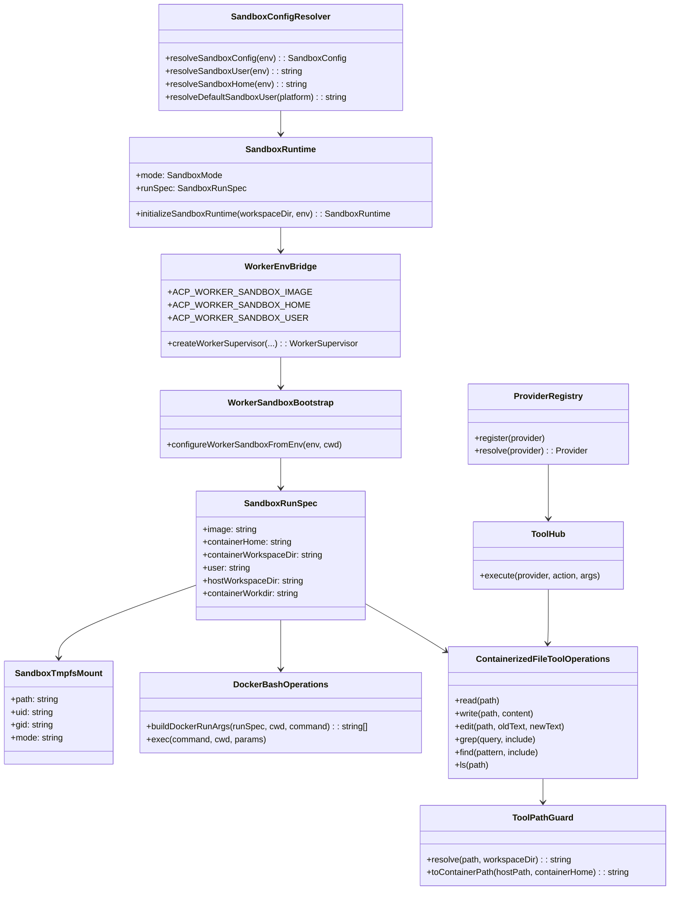
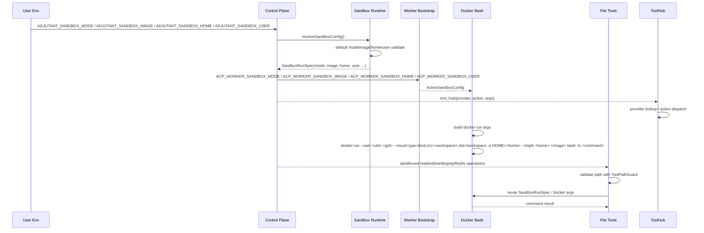

# 260315-s01-sandbox-image-user-config-and-host-uid-alignment

## 0. Core Principles

この章を冒頭に置き、以下の原則が本計画全体および全実装タスクに横断的に適用されることを明記する。
個別論点への局所的な適用説明ではなく、全体方針としてどう守るかを短く記載する。

- Prototype First
  - sandbox の既存契約を壊さず、最短で「任意 image 指定」と「ホスト UID/GID 追従」を成立させる。既存の `ADJUTANT_SANDBOX_IMAGE` 契約は再利用し、必要最小限の新規設定のみ追加する。
- SOLID
  - 設定解決、worker bootstrap、docker 実行引数生成の責務を分離し、UID/GID 解決ロジックを `docker-bash-operations` へ埋め込まず設定境界で扱う。
- KISS
  - ユーザー切替は `docker run --user <uid>:<gid>` を使い、`HOME` は `tmpfs` で与える。entrypoint や `gosu` を挟まず、起動時の責務は docker 引数構築へ寄せる。
- YAGNI
  - rootless Docker 最適化、Windows 固有の SID 連携、OCI runtime ごとの差異吸収までは今回対象外とする。
- DRY
  - sandbox 設定は `src/sandbox/config.ts` と worker 向け env bridge に集約し、README/spec/test も同一契約を参照する。
  - `bash` だけ別経路で扱わず、pi-coding-agent の基本ツール群も同じ `SandboxRunSpec` と path policy を共有する。
  - custom tool 公開面は direct 追加を廃止し、全て `ToolHub` を単一の拡張境界として公開する。

## 1. 概要と目的 Overview and Purpose

- What
  - sandbox Docker image を公開設定として明確化し、ユーザーが任意 image を指定できる契約を固定する。
  - host workspace を container の `/workspace` へ bind mount し、home は別途 `tmpfs` で与える契約へ変更する。
  - sandbox 実行ユーザーを固定 `1000:1000` から、`docker run --user <uid>:<gid>` によりホスト OS の UID/GID に追従できる方式へ変更する。
  - 明示 override 用に `ADJUTANT_SANDBOX_USER` を追加し、未指定時はホスト UID/GID を自動解決する。
  - `ADJUTANT_SANDBOX_MODE` の既定値を sandbox 有効側へ変更し、`pnpm start` のデフォルト動作を spec と一致させる。
  - git 履歴上の `ContainerizedFileToolOperations` / `ToolPathGuard` 相当を現行 ACP 構成へ戻し、`read` / `edit` / `write` / `grep` / `find` / `ls` を `bash` と同様に sandbox で実行する。
  - git 履歴上の `ToolHub` 実装を現行構成へ戻し、全ての custom tool 公開面を `ToolHub` provider/action 経由へ統一する。
  - 既定 sandbox image はツール群だけを持つシンプルな構成にし、hardening は `docker run` 側の `--read-only`, `--tmpfs`, namespace/cgroup 制限で担保する。
- Why
  - ユーザーが `node` / `pnpm` などを含む独自 sandbox image を選べるようにし、用途別の sandbox を組み替えられるようにする。
  - workspace と home を分離することで、read-only rootfs と capability drop を維持したまま、agent に書き込み可能な home を安全に与えられる。
  - bind mount 上に生成されるファイル所有者をホスト側へ寄せ、権限不整合を減らす。
  - 現在の `ADJUTANT_SANDBOX_IMAGE` 既存実装を、ドキュメントとテストを含めて正式契約化する。
  - `doc/spec/configuration.md` と `doc/spec/sandbox.md` と実装のデフォルト不整合を解消し、未設定時も sandbox 前提で起動できる運用へ揃える。
  - default sandbox を有効化しても file tools が host 側に残ると保護境界が不完全なため、標準ツールも含めて sandbox 境界を揃える必要がある。
  - custom tool を個別に `customTools.push(...)` していく現状だと公開契約が散らばるため、sandbox 化と同時に direct custom tool を全廃して拡張境界を戻しておく必要がある。
  - Mac Docker Desktop や Windows WSL2 では一見 root 所有問題が隠れるが、WSL の Linux ネイティブ領域や将来の Linux 実行では露呈するため、最初から一貫した権限モデルに寄せる方が手戻りが少ない。
  - `useradd/chown/gosu` は `--read-only` と `--cap-drop=ALL` と構造的に相性が悪く、`--user + tmpfs home` の方が矛盾なく hardening を保てる。
- How
  - `SandboxRunSpec` に実行ユーザー情報、container home、container workspace、tmpfs 設定を追加し、control-plane から worker へ橋渡しする。
  - `resolveSandboxConfig()` で `ADJUTANT_SANDBOX_HOME` を解決し、home 用 `tmpfs` mount path として扱う。workspace は固定で `/workspace` に mount する。
  - `resolveSandboxConfig()` で `ADJUTANT_SANDBOX_IMAGE` と `ADJUTANT_SANDBOX_USER` を解決し、POSIX では `process.getuid()` / `process.getgid()` を既定値に使って `--user <uid>:<gid>` へ反映する。
  - `resolveSandboxConfig()` で `ADJUTANT_SANDBOX_MODE` 未指定時の既定値を sandbox 有効モードへ変更し、README / spec / tests を同期する。
  - `docker run` には `--pull=never`, `--init`, `--read-only`, `--mount type=bind,src=<workspace>,dst=/workspace`, `--tmpfs /tmp`, `--tmpfs /run`, `--tmpfs <home>`, `--network=none`, `--cap-drop=ALL`, `--security-opt no-new-privileges=true`, `--security-opt seccomp=builtin`, `--ipc=private`, `--cgroupns=private`, `--pids-limit`, `--memory`, `--memory-swap`, `--hostname=sandbox` を付与する。
  - `HOME=<containerHome>` と `--workdir /workspace` を注入し、tmpfs home の所有者は `uid/gid` mount options でホスト user に一致させる。
  - `f43b468` / `eb05767` を主参照元として、現行 `agent-session-factory` と ACP bootstrap に合わせて file tool operations・path restriction・ToolHub 統合を再移植する。
  - `0eb307d` の `ToolHub` 導入差分と `bc60728` の file tool sandbox 差分を補助参照し、責務ごとの差分確認に使う。

## 2. 仕様と受け入れ条件 Specification and Acceptance Criteria

### 2.1 スコープ Scope

- 今回やること
  - `ADJUTANT_SANDBOX_MODE` の既定値を `all` に変更し、未設定時でも sandbox を有効化する。
  - `ADJUTANT_SANDBOX_IMAGE` を公開設定として README / spec / docs-sync 契約に明記する。
  - `ADJUTANT_SANDBOX_HOME` を追加し、既定値を `/home/agent` としたうえで home 用 `tmpfs` mount path として扱う。
  - `ADJUTANT_SANDBOX_USER` を追加し、`uid:gid` 文字列 override を許可する。
  - `ADJUTANT_SANDBOX_USER` 未指定時は、POSIX 環境ではホスト UID/GID を既定解決する。
  - `process.getuid()` / `process.getgid()` が使えない環境では `1000:1000` に fallback する。
  - worker bootstrap と docker 実行引数生成へ user / home 設定を伝播する。
  - host workspace は固定で `/workspace` へ bind mount し、`--workdir /workspace` を使う。
  - `docker run --user <uid>:<gid>` を使い、必要に応じ `ADJUTANT_SANDBOX_USER` override から値を導出する。
  - `docker run` hardening flags を `--pull=never`, `--init`, `--read-only`, `--mount`, `--tmpfs`, `--network=none`, `--cap-drop=ALL`, `--security-opt`, namespace/cgroup 制限に揃える。
  - `read` / `edit` / `write` / `grep` / `find` / `ls` の標準ツール実行を sandbox 化する。
  - workspace 外アクセスを拒否する path guard を、container `/workspace` mount 契約に合わせて復元する。
  - `ToolHub` / `ProviderRegistry` / tool definition 群を現行 `src/assistant/` に復元する。
  - `agent-session-factory` での direct custom tool 登録を全廃し、全 custom tool を `ToolHub` 経由へ移行する。
  - sandbox 対象 custom tool を含む全 custom tool を同じ `ToolHub` 拡張境界で扱う。
  - `agent-session-factory` での標準ツール差し替え方針を現行 SDK 制約込みで再整理する。
  - no-Docker テストとロールバック手順の既定値前提を更新する。
  - unit / contract / integration テストで mode / image / home / user 解決と docker 引数生成を検証する。
  - unit / integration テストで file tool sandbox と path guard を検証する。
  - unit / integration テストで `ToolHub` 登録と provider/action dispatch を検証する。
- 成果物
  - 実装コード: `src/sandbox/*`, `src/agent-worker-acp/sandbox-bootstrap.ts`, `src/index.ts`, `src/assistant/agent-session-factory.ts`, `src/assistant/containerized-file-tool-operations.ts`, `src/assistant/dynamic-tool/*`, 必要に応じた workspace path restriction helper
  - テスト: `tests/unit/sandbox/*`, `tests/unit/agent-worker-acp/*`, `tests/unit/assistant/*`, 必要に応じ `tests/integration/*`
  - ドキュメント: `README.md`, `doc/spec/configuration.md`, `doc/spec/sandbox.md`, docs-sync 関連ファイル
- 制約
  - sandbox 実行方式は現行どおり `docker run --rm` を維持する。
  - Docker daemon / Docker Desktop 依存は維持する。
  - 既定 sandbox image は `bash`, `git`, `curl`, `python3` など必要ツールを持つが、entrypoint や `gosu` を必須にしない。
  - 任意 custom image を使う場合も、`--user <uid>:<gid>`, `HOME=<tmpfs home>`, `--workdir /workspace` で実行できる前提を満たす必要がある。
  - sandbox デフォルト有効化により、Docker 未起動環境では `pnpm start` が fail-closed になる。
  - custom image と整合しない home path は `ADJUTANT_SANDBOX_HOME` で明示指定して合わせる。
  - file tool sandbox 復元は、現 tree に実装が残っていないため git 履歴ベースの再移植として扱う。
  - `ToolHub` 復元は `260310` 計画へ依存させず、この計画内で独立に完結させる。
  - `ToolHub` 移行完了後は、`agent-session-factory` から custom tool を direct 登録する実装を残さない。

### 2.2 非スコープ Non Scope

- Windows のユーザー ID をコンテナ Linux UID/GID へ厳密変換する仕組み
- custom image の中身検証や依存ツールの必須チェック

### 2.3 ユースケース Use Cases

- 正常系1
  - ユーザーが sandbox mode を明示しなくても `pnpm start` で sandbox 初期化が行われる。
- 正常系2
  - ユーザーが `ADJUTANT_SANDBOX_IMAGE=my-sandbox:latest` を指定して起動し、その image で bash が実行される。
- 正常系3
  - ユーザーが `ADJUTANT_SANDBOX_HOME=/home/dev` を指定すると、`HOME=/home/dev` な tmpfs が与えられ、workspace は `/workspace` に mount される。
- 正常系4
  - macOS / Linux で `ADJUTANT_SANDBOX_USER` 未指定のまま起動し、container は `--user <hostUid>:<hostGid>` で実行される。
- 正常系5
  - ユーザーが `ADJUTANT_SANDBOX_USER=501:20` のように明示指定し、自動解決より override が優先される。
- 正常系6
  - sandbox 対象セッションで agent が `read` / `grep` / `find` を実行すると、workspace が `/workspace` として見える状態で sandbox 内実行される。
- 正常系7
  - sandbox 対象セッションで agent が `write` / `edit` を実行すると、生成・更新ファイル所有者がホスト UID/GID に追従する。
- 正常系8
  - `ToolHub` 有効時、agent は全 custom tool を provider/action 経由で呼び出せる。
- 正常系9
  - Mac / WSL / 将来の Linux いずれでも、sandbox 起動時の hardening flags とユーザー生成挙動が同じ契約で動く。
- 異常系1
  - Docker daemon が利用不可の環境で `pnpm start` すると、未設定でも fail-closed で起動失敗する。
- 異常系2
  - `ADJUTANT_SANDBOX_USER=invalid` のような不正値が指定された場合、起動時に契約違反として fail-closed でエラーにする。
- 異常系3
  - POSIX 以外で UID/GID 自動解決不可の場合、sandbox は `1000:1000` fallback で継続し、ドキュメントに制約を明示する。
- 異常系4
  - agent が workspace 外パスを `read` / `write` / `edit` / `grep` / `find` / `ls` で指定した場合、path guard により実行前に拒否される。
- 異常系5
  - 未登録 provider または action を `ToolHub` 経由で呼んだ場合、実行前に契約違反として失敗する。
- 異常系7
  - `agent-session-factory` に direct custom tool 登録が残存している場合、テストで契約違反として検知される。
- 異常系6
  - custom image が `--user`, `HOME`, `/workspace`, tmpfs home 契約を満たさない場合、sandbox 起動は fail-closed で失敗する。

### 2.4 受け入れ条件 Acceptance Criteria

1. Given `ADJUTANT_SANDBOX_MODE` 未指定
   When control-plane を起動する
   Then sandbox mode は `all` として解決され、Docker 初期化が実行される
2. Given Docker daemon が利用不可かつ `ADJUTANT_SANDBOX_MODE` 未指定
   When control-plane を起動する
   Then sandbox unavailable error で fail-closed になり、暗黙に host 実行へ fallback しない
3. Given `ADJUTANT_SANDBOX_IMAGE=my-sandbox:test`
   When control-plane を起動する
   Then worker へ同 image が伝播し、sandbox の `docker run` にその image 名が使われる
4. Given `ADJUTANT_SANDBOX_HOME=/home/dev`
   When sandbox 実行引数を構築する
   Then `HOME=/home/dev` の tmpfs が構築され、host workspace は `/workspace` に bind mount され、`--workdir /workspace` が使われる
5. Given `ADJUTANT_SANDBOX_HOME` 未指定
   When sandbox 設定を解決する
   Then container home は `/home/agent` として解決される
6. Given `ADJUTANT_SANDBOX_USER` 未指定かつ POSIX 環境
   When sandbox 実行引数を構築する
   Then `--user <hostUid>:<hostGid>` が付与され、home tmpfs の uid/gid も同値になる
7. Given `ADJUTANT_SANDBOX_USER=1234:5678`
   When sandbox 実行引数を構築する
   Then 自動解決ではなく `--user 1234:5678` が付与され、home tmpfs の uid/gid も `1234:5678` になる
8. Given `ADJUTANT_SANDBOX_USER=invalid`
   When sandbox 設定を解決する
   Then 起動前に validation error となり、曖昧な fallback を行わない
9. Given `process.getuid()` / `process.getgid()` が利用できない環境
   When `ADJUTANT_SANDBOX_USER` 未指定で sandbox 設定を解決する
   Then `1000:1000` fallback が使われ、README / spec に制約が明記される
10. Given sandbox 対象セッション
    When agent が `read` / `edit` / `write` / `grep` / `find` / `ls` を実行する
    Then それらの実行は host 直実行ではなく sandbox 経由になる
11. Given sandbox 対象セッションで file tool が workspace 外の path を要求する
    When tool 実行を開始する
    Then docker 実行前に path guard が拒否し、workspace 外アクセスを許可しない
12. Given sandbox mode=`non-main`
    When main と spoke の両方で標準ツール一覧を構築する
    Then main は host 側、spoke は `bash` と file tools の両方が sandbox 版になる
13. Given `ToolHub` が有効
    When provider/action 形式の custom tool を呼び出す
    Then `agent-session-factory` からは hub tool だけが公開され、全 custom tool 呼び出しは `ToolHub` 経由で dispatch される
14. Given sandbox container を起動する
    When docker 引数を構築する
    Then `--pull=never`, `--init`, `--read-only`, `--mount type=bind`, `--tmpfs /tmp`, `--tmpfs /run`, `--tmpfs <home>`, `--network=none`, `--cap-drop=ALL`, `--security-opt no-new-privileges=true`, `--security-opt seccomp=builtin`, `--ipc=private`, `--cgroupns=private`, `--pids-limit`, `--memory`, `--memory-swap`, `--hostname=sandbox` が付与される

### 2.5 既知の制約 Known Limitations

- `--user` 方式を採るため、container 内に passwd エントリは存在しない前提で動くツールがあることは許容する。
- custom image 側の既定 home path と `ADJUTANT_SANDBOX_HOME` がズレる場合は、ユーザー側で明示設定が必要になる。
- Windows 系環境ではホストユーザー情報を Linux UID/GID に厳密変換できないため、既定 fallback のまま動作する。
- image の自由差し替えは可能だが、必要バイナリの有無は user responsibility とする。
- Docker なしローカル環境では、テストや開発時に `ADJUTANT_TEST_NO_DOCKER=1` または `ADJUTANT_SANDBOX_MODE=off` を明示する逃げ道が必要になる。
- pi-coding-agent 側の標準ツール構築 API 制約により、tool override 方法は SDK バージョン依存の検証が必要になる。
- home は tmpfs、workspace は bind mount に分離するため、workspace 配下の設定ファイルを home と同一視するツールには注意が必要になる。

## 3. 前提技術スタック Context and Tech Stack

- Language Framework
  - TypeScript 5.x, Node.js 22+, ESM
- Libraries
  - `@mariozechner/pi-coding-agent`
  - Docker CLI
  - git 履歴上の `f43b468` / `eb05767` にある ToolHub + full tool sandbox 統合実装
  - git 履歴上の `0eb307d` ToolHub 導入差分
  - git 履歴上の `bc60728` file tool sandbox 導入差分
- Style Guide
  - 既存の Prettier / ESLint / docs-sync 契約に従う
- Runtime Deployment
  - 単一ホスト上の control-plane + worker + Docker sandbox
- Testing
  - `node:test`
  - 既存の sandbox unit test / integration test

## 4. インターフェース契約 Interface Contracts

### 4.1 公開APIまたは外部I O一覧

- 設定ファイル / 環境変数
  - `ADJUTANT_SANDBOX_MODE` 既定 `all`
  - `ADJUTANT_SANDBOX_IMAGE`
  - `ADJUTANT_SANDBOX_HOME` 新規
  - `ADJUTANT_SANDBOX_USER` 新規
  - worker bridge: `ACP_WORKER_SANDBOX_MODE`, `ACP_WORKER_SANDBOX_IMAGE`, `ACP_WORKER_SANDBOX_HOME`, `ACP_WORKER_SANDBOX_USER`
- Tool I/O
  - sandbox 対象時の基本ツール `bash`, `read`, `edit`, `write`, `grep`, `find`, `ls`
  - いずれも host workspace を `/workspace` に mount した container 上で動作し、`HOME` は `ADJUTANT_SANDBOX_HOME` の tmpfs を使う
  - `tool_hub(provider, action, args)`
  - custom tool 公開面は例外なく `ToolHub` へ集約し、必要な provider が内部で sandbox/host 実行を選択する
- CLI / 実行環境
  - `docker run --rm ... --user <uid>:<gid> --workdir /workspace -e HOME=<containerHome> --mount type=bind,src=<workspace>,dst=/workspace --tmpfs /tmp --tmpfs /run --tmpfs <containerHome>:uid=<uid>,gid=<gid> <image> bash -lc "<command>"`
- ドキュメント同期
  - `README.md`
  - `doc/spec/configuration.md`
  - docs-sync catalog / inventory

### 4.2 データモデルとスキーマ

- `SandboxDockerConfig`
  - `mode: "off" | "non-main" | "all"` は `ADJUTANT_SANDBOX_MODE` 未指定時 `all`
  - `image: string`
  - `home: string` 未指定時 `/home/agent`
  - `user: string`
  - `autoBuildImage: boolean`
  - 既存フィールドは維持
- `SandboxRunSpec`
  - `image: string`
  - `containerHome: string`
  - `containerWorkspaceDir: string`
  - `user: string`
  - `hostWorkspaceDir: string`
  - `containerWorkdir: string`
  - `tmpfsPaths: string[]`
  - `readOnlyRootfs: boolean`
  - 既存フィールドは維持
- `SandboxTmpfsMount`
  - `/tmp`, `/run`, `containerHome` の mount option を保持する
  - `containerHome` の tmpfs は `uid`, `gid`, `mode=700` を持つ
- `ContainerizedFileToolOperations`
  - `read` / `edit` / `write` / `grep` / `find` / `ls` を `SandboxRunSpec` ベースで実行する
  - 入出力の path は `ToolPathGuard` で host workspace 配下に制限する
- `ToolPathGuard`
  - host 側 path を正規化し、workspace 外アクセスや path traversal を拒否する
  - container 側では `/workspace` へ対応する path へ写像する
- `ToolHub`
  - provider/action 形式の custom tool dispatch を担当する
  - provider ごとの実装は `ProviderRegistry` に登録し、`agent-session-factory` では hub tool を 1 つだけ公開する
- バリデーション方針
  - `ADJUTANT_SANDBOX_HOME` は絶対パスを必須とする
  - `ADJUTANT_SANDBOX_USER` は `^[0-9]+:[0-9]+$` のみ許可する
  - 空文字は未指定として扱う
  - 不正文字列は黙って fallback せず error とする

### 4.3 エラーと例外 Error Handling

- エラー分類
- `INVALID_SANDBOX_USER`
  - `SANDBOX_DEFAULT_UNAVAILABLE`
  - `SANDBOX_UNAVAILABLE`
  - `SANDBOX_IMAGE_NOT_FOUND`
  - `SANDBOX_RUNTIME_CONTRACT_MISMATCH`
- リトライ方針
  - user 設定不正はリトライせず即 fail
  - Docker unavailable / image build failure / runtime 契約不一致は既存方針どおり fail-closed
- タイムアウト方針
  - bash 実行 timeout は既存の child process timeout を継続利用する
- ログ方針と個人情報の扱い
  - UID/GID は構造化ログへ出しうるが、username やホームディレクトリなどの個人情報は追加記録しない

### 4.4 代表的な例 Examples

```bash
pnpm start
```

```bash
ADJUTANT_SANDBOX_IMAGE=my-sandbox:latest \
ADJUTANT_SANDBOX_MODE=all \
pnpm start
```

```bash
ADJUTANT_SANDBOX_IMAGE=my-sandbox:node22 \
ADJUTANT_SANDBOX_HOME=/home/dev \
ADJUTANT_SANDBOX_USER=501:20 \
ADJUTANT_SANDBOX_MODE=all \
pnpm start
```

```text
docker run --rm -i \
  --pull=never \
  --init \
  --read-only \
  --user 501:20 \
  --workdir /workspace \
  --mount type=bind,src=/host/workspace,dst=/workspace \
  --tmpfs /tmp:rw,noexec,nosuid,size=256m,mode=1777 \
  --tmpfs /run:rw,noexec,nosuid,size=64m,mode=755 \
  --tmpfs /home/dev:rw,exec,nosuid,size=512m,uid=501,gid=20,mode=700 \
  --network=none \
  --cap-drop=ALL \
  --security-opt no-new-privileges=true \
  --security-opt seccomp=builtin \
  --ipc=private \
  --cgroupns=private \
  --pids-limit=256 \
  --memory=1g \
  --memory-swap=1g \
  --hostname=sandbox \
  -e HOME=/home/dev \
  my-sandbox:node22 \
  bash -lc "pnpm run test"
```

```text
read(path="src/index.ts")
 -> ToolPathGuard で /host/workspace/src/index.ts を検証
 -> docker run ... --mount type=bind,src=/host/workspace,dst=/workspace my-sandbox:node22 \
    cat /workspace/src/index.ts
```

## 5. アーキテクチャと設計図 Architecture and Diagrams

### 5.1 図の選択方針

- sandbox 設定解決、worker 伝播、docker 実行引数生成と複数モジュールを跨ぐためクラス図を必須とする。
- 設定解決から tool 実行までの流れが重要なため、シーケンス図も追加する。

### 5.2 クラス図 Class Diagram



### 5.3 その他の図 Optional



## 6. テスト戦略 Test Strategy

### 6.1 テストの種類

- Unit
  - `resolveSandboxConfig` の default mode=`all`
  - `resolveSandboxConfig` の image / home / user 解決
  - `buildDockerRunArgs` の `--user` / `HOME` / bind mount / tmpfs / hardening flags / image 注入
  - worker bootstrap の env 伝播
  - home tmpfs が uid/gid/mode 付きで構築されること
  - `ContainerizedFileToolOperations` の read / edit / write / grep / find / ls が `SandboxRunSpec` を使うこと
  - `ToolPathGuard` が workspace 外 path と path traversal を reject すること
  - `agent-session-factory` が sandbox mode と memory scope に応じて `bash` と file tools を切り替えること
  - `ToolHub` が provider/action を解決し、未登録 provider を reject すること
  - `agent-session-factory` に direct custom tool 登録が残っていないこと
- Integration
  - `pnpm start` 相当の bootstrap で未設定時も sandbox 初期化が走ること
  - control-plane 起動時に worker env へ `ACP_WORKER_SANDBOX_IMAGE` / `ACP_WORKER_SANDBOX_HOME` / `ACP_WORKER_SANDBOX_USER` が反映されること
  - no-Docker モードでは既存 `ADJUTANT_TEST_NO_DOCKER=1` 契約を維持すること
  - sandbox 対象セッションで `read` / `write` / `edit` / `grep` / `find` / `ls` が sandbox 実行されること
  - `ToolHub` 経由で公開された custom tool が現行 session factory 上で呼び出せること
  - 現行で公開している全 custom tool が `ToolHub` 経由へ移行されていること
  - WSL Linux ネイティブ領域でも sandbox 生成ファイルの所有権がホスト user に一致すること
- Contract
  - docs-sync で `ADJUTANT_SANDBOX_MODE` default=`all` が README / spec と一致すること
  - docs-sync で `ADJUTANT_SANDBOX_HOME` が README / spec と一致すること
  - docs-sync で `ADJUTANT_SANDBOX_USER` が README / spec と一致すること
  - README / spec の `ADJUTANT_SANDBOX_IMAGE` 説明が実装契約と一致すること
  - README / spec の標準ツール sandbox 対象範囲が実装契約と一致すること
  - README / spec の custom tool 公開面が `ToolHub` 契約と一致すること
  - README / spec の runtime hardening 契約が実装と一致すること

### 6.2 カバレッジ対象

- 重要ロジック
  - default mode 解決
  - container home 解決
  - POSIX auto-detect
  - explicit override
  - env bridge
  - tmpfs home の uid/gid/mode 構築
  - file tool path validation
  - host path と container path の写像
  - session scope ごとの tool 差し替え
  - provider/action dispatch
  - direct custom tool 全廃
- エラー分岐
  - invalid `uid:gid`
  - Docker unavailable
  - image not found / auto build failure
  - runtime 契約不一致
  - workspace 外 path
  - unknown provider / unknown action
- 境界条件
  - sandbox mode 未指定
  - sandbox home 未指定 / 絶対パスでない値
  - empty string
  - non-POSIX fallback
  - custom image と既定 image の切り替え
  - root path / `..` を含む path / symlink 解決の扱い
  - Mac / WSL bind mount と WSL Linux ネイティブ領域の差

## 7. 実装タスクリスト Implementation Plan

### Phase 1 設計と準備

- [x] `Task-SBX-DESIGN-001` インターフェース契約の確定  
       成果物: 本計画書の 4 章、`ADJUTANT_SANDBOX_USER` 契約
- [x] `Task-SBX-DESIGN-002` Mermaid 図の作成  
       成果物: 本計画書の 5 章
- [x] `Task-SBX-DESIGN-003` 型定義の更新方針確定  
       対象: `src/sandbox/types.ts`
- [x] `Task-SBX-DESIGN-004` 既存テスト基盤の確認  
       対象: `tests/unit/sandbox/*`, `tests/unit/agent-worker-acp/*`
- [x] `Task-SBX-DESIGN-005` git 履歴上の ToolHub + full tool sandbox 統合設計棚卸し  
       対象: `f43b468`, `eb05767`, `agent-session-factory.ts`, `dynamic-tool/*`, `containerized-file-tool-operations.ts`
- [x] `Task-SBX-DESIGN-006` git 履歴上の責務別差分棚卸し  
       対象: `0eb307d`, `bc60728`, `3073ccde`, 旧 file operations 実装と workspace path restriction 実装

### Phase 2 Image 設定契約の固定

- [x] `Task-SBX-IMG-RED-001` Test: `ADJUTANT_SANDBOX_IMAGE` が config / worker bridge / docker args に反映される失敗テストを追加
- [x] `Task-SBX-IMG-GREEN-001` Impl: 既存 image 契約を docs-sync と worker bridge 含めて明示化
- [x] `Task-SBX-IMG-GREEN-002` Impl: `Dockerfile.sandbox` をツール専用のシンプルな image 契約へ更新し、`/workspace` と `/home/agent` の枠組みを整備
- [x] `Task-SBX-IMG-REFACTOR-001` Refactor: image 関連の説明とテスト重複を削減
- [x] `Task-SBX-IMG-CONTRACT-001` Contract: README / spec / env inventory を同期更新
- [x] `Task-SBX-IMG-DOC-001` Docs: custom image の責務範囲と `--user` / `/workspace` / tmpfs home 契約を明記

### Phase 3 Home Mount 契約の固定

- [x] `Task-SBX-HOME-RED-001` Test: `ADJUTANT_SANDBOX_HOME` が config / worker bridge / docker args に反映される失敗テストを追加
- [x] `Task-SBX-HOME-RED-002` Test: relative path な home 指定を reject する失敗テストを追加
- [x] `Task-SBX-HOME-GREEN-001` Impl: `SandboxDockerConfig` / `SandboxRunSpec` に home を追加
- [x] `Task-SBX-HOME-GREEN-002` Impl: `HOME` は tmpfs, workspace は `/workspace`, `workdir` は `/workspace` に揃える
- [x] `Task-SBX-HOME-GREEN-003` Impl: home tmpfs の uid/gid/mode 構築を docker 引数へ反映する
- [x] `Task-SBX-HOME-REFACTOR-001` Refactor: home/workdir の既定値決定ロジックを整理
- [x] `Task-SBX-HOME-CONTRACT-001` Contract: README / spec / docs-sync / examples を home tmpfs + workspace bind mount 契約へ同期更新

### Phase 4 Default Sandbox 化

- [x] `Task-SBX-MODE-RED-001` Test: `ADJUTANT_SANDBOX_MODE` 未指定時に default=`all` を期待する失敗テストを追加
- [x] `Task-SBX-MODE-RED-002` Test: Docker unavailable で未指定起動が fail-closed になる失敗テストを追加
- [x] `Task-SBX-MODE-GREEN-001` Impl: sandbox mode の既定値を `all` に変更
- [x] `Task-SBX-MODE-GREEN-002` Impl: no-Docker テスト逃げ道と bootstrap の分岐を既定変更に合わせて調整
- [x] `Task-SBX-MODE-REFACTOR-001` Refactor: mode default の説明と helper の重複を削減
- [x] `Task-SBX-MODE-CONTRACT-001` Contract: README / spec / docs-sync / runbook の default mode 記述を同期更新

### Phase 5 Host UID/GID 追従の実装

- [x] `Task-SBX-USER-RED-001` Test: `ADJUTANT_SANDBOX_USER` override の失敗テストを追加
- [x] `Task-SBX-USER-RED-002` Test: POSIX auto-detect と non-POSIX fallback の失敗テストを追加
- [x] `Task-SBX-USER-RED-003` Test: invalid `uid:gid` を reject する失敗テストを追加
- [x] `Task-SBX-USER-GREEN-001` Impl: `SandboxDockerConfig` / `SandboxRunSpec` へ `user` を追加
- [x] `Task-SBX-USER-GREEN-002` Impl: config resolver に user 解決ロジックと validation を追加
- [x] `Task-SBX-USER-GREEN-003` Impl: control-plane から worker への `ACP_WORKER_SANDBOX_USER` 伝播を追加
- [x] `Task-SBX-USER-GREEN-004` Impl: `docker run --user <uid>:<gid>` へ切り替え、tmpfs home の uid/gid も同期させる
- [x] `Task-SBX-USER-REFACTOR-001` Refactor: user 解決ロジックを utility へ抽出し、platform 分岐を局所化
- [x] `Task-SBX-USER-INTEG-001` Integration: worker bootstrap と docker args の end-to-end テストを追加
- [x] `Task-SBX-USER-INTEG-002` Integration: WSL Linux ネイティブ領域相当の bind mount でも所有者が一致することを検証
- [x] `Task-SBX-USER-DOC-001` Docs: 既知制約と fallback を README / spec に追記

### Phase 5.5 Hardening 契約の固定

- [x] `Task-SBX-HARDEN-RED-001` Test: `docker run` に read-only rootfs と security flags が付与される失敗テストを追加
- [x] `Task-SBX-HARDEN-GREEN-001` Impl: `--pull=never`, `--init`, `--read-only`, `--mount`, `--tmpfs /tmp`, `--tmpfs /run`, `--tmpfs <home>`, `--network=none`, `--cap-drop=ALL`, `--security-opt`, `--ipc=private`, `--cgroupns=private`, `--pids-limit`, `--memory`, `--memory-swap`, `--hostname=sandbox` を導入
- [x] `Task-SBX-HARDEN-REFACTOR-001` Refactor: hardening flags 構築を helper 化する
- [x] `Task-SBX-HARDEN-DOC-001` Docs: Mac / WSL / Linux の挙動差と hardening 契約を README / spec に追記

### Phase 6 標準ツール sandbox 復元

- [x] `Task-SBX-TOOLS-RED-001` Test: sandbox 対象セッションで `read` / `edit` / `write` / `grep` / `find` / `ls` が containerized operations を使う失敗テストを追加
- [x] `Task-SBX-TOOLS-RED-002` Test: workspace 外 path を reject する path guard の失敗テストを追加
- [x] `Task-SBX-TOOLS-RED-003` Test: `mode=non-main` で main/spoke の tool 差分を検証する失敗テストを追加
- [x] `Task-SBX-TOOLS-GREEN-001` Impl: `containerized-file-tool-operations` 相当を現行 `src/assistant/` に再導入
- [x] `Task-SBX-TOOLS-GREEN-002` Impl: workspace path restriction ロジックを container `/workspace` 契約に合わせて再導入または内包化
- [x] `Task-SBX-TOOLS-GREEN-003` Impl: `agent-session-factory` と worker bootstrap に file tool sandbox 差し替えを統合
- [x] `Task-SBX-TOOLS-REFACTOR-001` Refactor: `bash` と file tools が同一 `SandboxRunSpec` を共有するよう整理
- [x] `Task-SBX-TOOLS-INTEG-001` Integration: sandbox mode / memory scope ごとの tool 実行経路を end-to-end で検証
- [x] `Task-SBX-TOOLS-DOC-001` Docs: 標準ツール sandbox 対象範囲と path 制約を README / spec に追記

### Phase 7 ToolHub 復元と direct custom tool 全廃

- [x] `Task-SBX-HUB-RED-001` Test: `agent-session-factory` が hub tool 以外の custom tool を公開していると失敗するテストを追加
- [x] `Task-SBX-HUB-RED-002` Test: 未登録 provider/action が `ToolHub` で reject される失敗テストを追加
- [x] `Task-SBX-HUB-RED-003` Test: 現行で公開している全 custom tool が `ToolHub` provider/action へ移行されていることを検証する失敗テストを追加
- [x] `Task-SBX-HUB-GREEN-001` Impl: `ToolHub` / `ProviderRegistry` / tool definition 群を現行 `src/assistant/dynamic-tool/` に復元
- [x] `Task-SBX-HUB-GREEN-002` Impl: `agent-session-factory` の direct custom tool 登録を全廃し、hub tool 1 本へ置き換える
- [x] `Task-SBX-HUB-GREEN-003` Impl: 現行で公開中の全 custom tool を provider/action 実装へ移行する
- [x] `Task-SBX-HUB-GREEN-004` Impl: sandbox 対象 provider が `SandboxRunSpec` と両立するよう接続する
- [x] `Task-SBX-HUB-REFACTOR-001` Refactor: custom tool 公開責務を `ToolHub` に一本化し、direct 登録コードを削除する
- [x] `Task-SBX-HUB-INTEG-001` Integration: `ToolHub` 経由の provider/action 呼び出しが現行 runtime で通ることを検証
- [x] `Task-SBX-HUB-INTEG-002` Integration: hub 移行後に direct custom tool が公開されていないことを検証
- [x] `Task-SBX-HUB-DOC-001` Docs: 全 custom tool 公開面を `ToolHub` 前提に README / spec へ反映

### Phase 8 統合と検証

- [x] `Task-SBX-VERIFY-001` 全体テストの実行  
       例: `pnpm run test`, `pnpm run verify:config-doc-sync`
- [x] `Task-SBX-VERIFY-002` エッジケース確認  
       例: mode 未指定, invalid home, empty user, invalid user, non-POSIX fallback, workspace 外 path
- [x] `Task-SBX-VERIFY-003` ログと例外の確認  
       例: `INVALID_SANDBOX_USER`, Docker unavailable, default sandbox 起動失敗, path guard violation
- [x] `Task-SBX-VERIFY-004` ドキュメント更新完了確認  
       対象: `README.md`, `doc/spec/configuration.md`, `doc/spec/sandbox.md`, docs-sync, runbook

## 8. 完了の定義 Definition of Done

### 8.1 機能DoD Functional DoD

- [x] `ADJUTANT_SANDBOX_MODE` 未指定時に sandbox が既定有効となること
- [x] host workspace が container `/workspace` に mount されること
- [x] `ADJUTANT_SANDBOX_IMAGE` が公開設定として docs / tests /実装で一致していること
- [x] `ADJUTANT_SANDBOX_HOME` が docs / tests / 実装で一致していること
- [x] `ADJUTANT_SANDBOX_USER` 未指定時に POSIX host UID/GID が使われること
- [x] `ADJUTANT_SANDBOX_USER` 指定時に override が優先されること
- [x] invalid user 設定が fail-closed で拒否されること
- [x] `--user <uid>:<gid>` と home tmpfs の uid/gid 同期により権限整合が取れること
- [x] `bash` に加えて `read` / `edit` / `write` / `grep` / `find` / `ls` も sandbox 実行されること
- [x] workspace 外 path が file tools から拒否されること
- [x] custom tool 公開面が direct 登録ではなく `ToolHub` に統一されていること
- [x] `ToolHub` の provider/action dispatch が現行 runtime で動作すること
- [x] `agent-session-factory` に hub tool 以外の custom tool 公開が残っていないこと
- [x] read-only rootfs, tmpfs home, namespace/cgroup 制限を含む security flags が sandbox 実行に適用されること

### 8.2 品質DoD Quality DoD

- [x] 全ての対象テストがパスしていること
- [x] docs-sync mismatch がないこと
- [x] 不要なデバッグコードがないこと
- [x] README と spec に主要変更が反映されていること

## 9. 懸念事項と未確定事項 Concerns and Questions

- `ADJUTANT_SANDBOX_USER` を公開設定にする場合、Windows 環境での説明をどこまで README に載せるかは要判断。
- custom image を許容することで、sandbox image の最低要件として `--user` / `/workspace` / `HOME=<tmpfs home>` 契約を docs にどこまで明文化するか決定が必要。
- sandbox 既定 `all` 化により、Docker を使わないローカル開発者や CI job の標準手順が変わるため、どこまで `ADJUTANT_TEST_NO_DOCKER=1` を残すか判断が必要。
- 主参照元は `f43b468` / `eb05767` とするが、現行 ACP 構成とは runtime 境界が異なるため、単純 cherry-pick ではなく責務単位での再移植が前提になる。
- `containerized-file-tool-operations.ts` と、それに付随していた workspace path restriction 実装は現行 tree に無く、`3073ccde` で削除されているため、単純な cherry-pick ではなく ACP 現行実装へ合わせた再移植または再設計が必要。
- pi-coding-agent の標準ツール override 方法は SDK の内部 API 依存があるため、legacy の実装を戻す際に現行版で成立するか事前確認が必要。
- `ToolHub` は partial 移行ではなく全 custom tool の一括移行を前提とするため、移行漏れを防ぐ inventory と検証テストの設計が重要になる。
- Mac / Docker Desktop の「見かけ上 root 問題が起きにくい」挙動に引きずられず、WSL Linux ネイティブ領域と将来 Linux 実行を主基準にする方針を README / spec で明確にする必要がある。
- WSL2 では workspace を `/mnt/c/...` ではなく Linux filesystem 側へ置く運用を README / spec に明記する必要がある。

---
