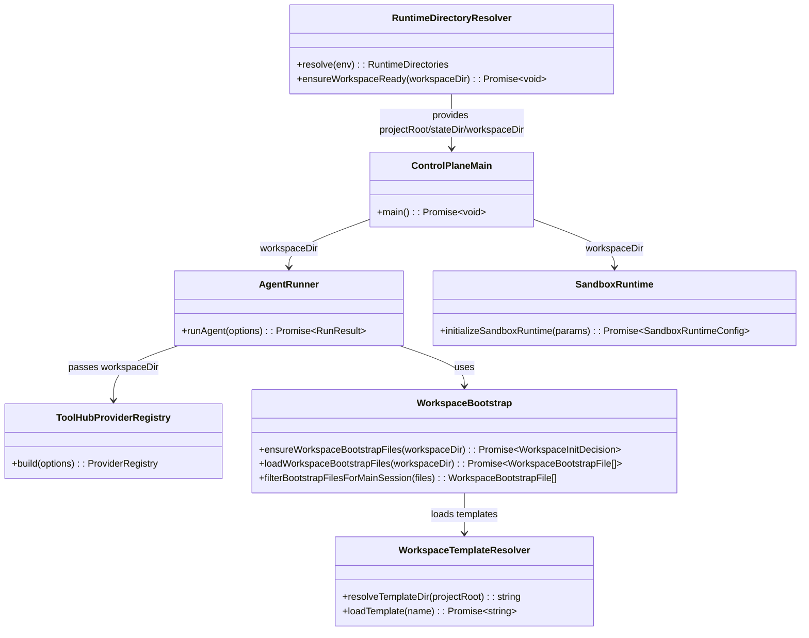
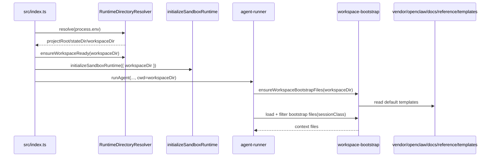

# 260315-s02-adjutant-workspace-dir-alignment

## 0. Core Principles

以下の原則が本計画全体および全実装タスクに横断的に適用されることを明記する。
個別論点への局所的な適用説明ではなく、全体方針としてどう守るかを短く記載する。

- Prototype First: 未リリース前提のため、現行の repo root を assistant workspace とみなす挙動はクリーンブレイクで置き換える。破壊点は `cwd` 利用箇所に限定し、移行不要な形で新契約を優先する。
- SOLID: `projectRoot` と `workspaceDir` の責務を分離し、path 解決・起動設定・assistant 実行時利用を別モジュールへ整理する。
- KISS: `ADJUTANT_WORKSPACE_DIR` の解決規則は単純にし、未指定時は `~/.adjutant/workspace` 相当へ寄せる。
- YAGNI: openclaw 全互換や workspace migration は行わず、現行 ACP/control-plane が必要とする path 契約の復元だけに絞る。
- DRY: workspace path 解決ロジックは一箇所へ集約し、sandbox、ToolHub、memory、bootstrap、summary batch へ同じ値を伝播する。

## 1. 概要と目的 Overview and Purpose

### What

`vendor/openclaw` の `~/.openclaw/workspace` と同様に、Adjutant でも assistant 専用 workspace の既定値を `~/.adjutant/workspace` に戻し、現行 ACP/control-plane 実装全体で repo root ではなく resolved workspace を使うよう揃える。あわせて bootstrap template の読み元を `vendor/openclaw/docs/reference/templates` 準拠に寄せ、現行で実装済みの main session 向け Project Context 注入契約を openclaw 流儀へ明文化する。

### Why

- 現行 `src/index.ts` は `resolveProjectRoot()` をそのまま workspace として使っており、レガシー実装および `README.md` / `doc/spec.md` の契約と不一致。
- assistant の読み書き対象とアプリ実装ルートが混在すると、memory、bootstrap、file tools、sandbox bind mount の境界が曖昧になる。
- `vendor/openclaw` と同じく専用 workspace を持つことで、AI が触るファイルと実装 repo を分離できる。
- 既存の `workspace-bootstrap` 実装を活かしつつ、起動時 fail-fast と初回 bootstrap を自然に接続できる。
- 現行 `workspace-bootstrap.ts` は template 読み元が `assistant/prompts` 固定で、セッション別注入も `main` にしか対応していない。openclaw の `docs/reference/templates` と system prompt 契約に合わせることで、workspace の意味と注入ルールを揃えられる。

### How

- `projectRoot` と `workspaceDir` を分離した runtime path 契約を新設する。
- `ADJUTANT_WORKSPACE_DIR` の未指定時は `<stateDir>/workspace` を既定とし、既定 `stateDir=~/.adjutant` のもとで `~/.adjutant/workspace` に解決する。
- control-plane 起動時に workspace directory の作成・書き込み可否を確認し、assistant 実行時にはその path を bootstrap / ToolHub / memory / sandbox / summary batch に伝播する。
- repo root が必要な箇所は `projectRoot` を使い続け、Vite config やソース探索まで workspace へ誤って寄せないようにする。
- bootstrap seed / 読み込みは `vendor/openclaw/docs/reference/templates` を基準に解決し、front matter 除去を含む template loader を導入する。
- Project Context 注入は現行実装済みの main session に限定して契約化し、`AGENTS.md`, `SOUL.md`, `TOOLS.md`, `IDENTITY.md`, `USER.md`, `HEARTBEAT.md`, `BOOTSTRAP.md`, `MEMORY.md` を扱う。sub-agent 固有の注入ルールは未実装のため今回の計画から除外する。

## 2. 仕様と受け入れ条件 Specification and Acceptance Criteria

### 2.1 スコープ Scope

- `ADJUTANT_WORKSPACE_DIR` の解決ロジックを現行 tree に導入する。
- 未指定時の既定 workspace を `~/.adjutant/workspace` 相当にする。
- `src/index.ts` 起点で `projectRoot` と `workspaceDir` を分離し、assistant 実行系へ `workspaceDir` を明示伝播する。
- workspace の作成・書き込み可否チェックを起動時に fail-fast で行う。
- `workspace-bootstrap` を resolved workspace 前提で利用する。
- bootstrap template の読み元を `vendor/openclaw/docs/reference/templates` 準拠へ切り替える。
- sandbox bind mount、file tools の path restriction、ToolHub provider、memory read/write/search、summary batch を resolved workspace 前提に揃える。
- main session 向け bootstrap/context file allowlist を導入する。
- `README.md` と `doc/spec.md` の path 契約を現行実装と一致させる。

成果物:

- workspace path 解決モジュール
- workspace template resolver と main session bootstrap file filter
- `src/index.ts` の runtime path 初期化更新
- assistant runtime / sandbox / ToolHub / summary batch の `workspaceDir` 伝播修正
- workspace bootstrap / path restriction / session bootstrap filter の回帰テスト
- `README.md`, `doc/spec.md`, 本計画書

制約:

- 後方互換のための migration 処理は入れない。
- repo root を workspace とみなす既存挙動は破壊的に変更する。
- `pnpm run test`, `pnpm run typecheck`, `pnpm run format`, `pnpm run verify:config-doc-sync` を通す。

### 2.2 非スコープ Non Scope

- 既存 repo root 上の memory / bootstrap file を新 workspace へ自動移行する処理
- multi-workspace 切り替え UI
- workspace のリモート同期やバックアップ
- `vendor/openclaw` の auth profile や agent template 管理の全面移植
- `vendor/openclaw` の hook system や extra bootstrap glob 読み込みの全面移植
- sub-agent 固有の Project Context 注入ルール実装
- repo root 自体を sandbox から追加 bind mount する仕組み

### 2.3 ユースケース Use Cases

正常系:

1. env 未指定で `pnpm start` すると `~/.adjutant/workspace` が作成され、assistant はその配下の `AGENTS.md` / `MEMORY.md` / `memory/*.md` を使う。
2. `ADJUTANT_WORKSPACE_DIR=/tmp/custom-workspace` を指定すると、sandbox / ToolHub / memory / bootstrap はその path を使う。
3. 初回 user turn で brand-new workspace の bootstrap file 群が seed される。
4. main session では `AGENTS.md`, `SOUL.md`, `TOOLS.md`, `IDENTITY.md`, `USER.md`, `HEARTBEAT.md`, `BOOTSTRAP.md`, `MEMORY.md` が Project Context に注入される。
5. sandbox 化された `read/edit/write/grep/find/ls/bash` は repo root ではなく resolved workspace を bind mount / 制限境界として使う。

重要な異常系:

1. workspaceDir が作成不可または書き込み不可なら、control-plane 起動時に明示的エラーで停止する。
2. repo root 依存のパスを assistant tool が渡しても、workspace 外アクセスとして拒否される。
3. stateDir を override しても `ADJUTANT_WORKSPACE_DIR` 未指定なら `<stateDir>/workspace` に解決される。
4. template directory が欠けている場合、起動または bootstrap 時に原因が分かる明示エラーで失敗する。

### 2.4 受け入れ条件 Acceptance Criteria

1. Given `ADJUTANT_STATE_DIR` と `ADJUTANT_WORKSPACE_DIR` が未設定 When control-plane を起動 Then resolved workspaceDir は `~/.adjutant/workspace` となり、存在しなければ作成される。
2. Given `ADJUTANT_STATE_DIR=/tmp/adjutant-state` かつ `ADJUTANT_WORKSPACE_DIR` 未設定 When 起動 Then resolved workspaceDir は `/tmp/adjutant-state/workspace` となる。
3. Given `ADJUTANT_WORKSPACE_DIR=/tmp/adjutant-ws` When assistant run が bootstrap context を注入 Then `AGENTS.md` 等は `/tmp/adjutant-ws` 配下を参照・生成する。
4. Given main session When bootstrap context を組み立てる Then `MEMORY.md` が存在すれば Project Context に含まれ、`memory/YYYY-MM-DD.md` は自動注入されない。
5. Given sandbox mode が有効 When `bash` または `read/edit/write/grep/find/ls` を実行 Then bind mount / path restriction の基準は resolved workspaceDir であり、repo root outside path は拒否される。
6. Given summary batch または memory tool を実行 When Markdown や SQLite index を読む/書く Then workspace 参照は resolved workspaceDir、state 参照は resolved stateDir を使う。
7. Given workspaceDir が作成不可または template directory が欠落している When 起動または bootstrap seed を行う Then 例外を投げて処理が中断される。
8. Given `pnpm run test`, `pnpm run typecheck`, `pnpm run verify:config-doc-sync` When 実行 Then すべて成功する。

### 2.5 既知の制約 Known Limitations

- 既存の repo root 配下にある `AGENTS.md` や `memory/*.md` は自動移行しないため、必要なら手動移設が必要。
- `workspace-bootstrap` の seed は assistant 実行時に行うため、起動直後には空の workspace directory だけが先に作られる可能性がある。
- Vite config やアプリコード探索は `projectRoot` のまま維持するため、すべての `cwd` 利用箇所を workspace に寄せるわけではない。
- `vendor/openclaw/docs/reference/templates` は vendor 更新の影響を受けるため、将来の upstream 差分で template 内容が変わる可能性がある。

## 3. 前提技術スタック Context and Tech Stack

- Language/Framework: TypeScript 5.x, Node.js ESM
- Runtime/Deployment: Node.js 22+, control-plane + ACP worker, Docker sandbox
- Libraries: `tsx`, OpenAI Agents SDK, Vite, Node.js `fs/promises`
- Style Guide: repository の ESLint / Prettier 設定に従う
- Testing: `node --import tsx --test`, integration tests under `tests/`, `verify:config-doc-sync`

## 4. インターフェース契約 Interface Contracts

### 4.1 公開APIまたは外部 I/O 一覧

- 環境変数
  - `ADJUTANT_STATE_DIR`
  - `ADJUTANT_WORKSPACE_DIR`
  - `ADJUTANT_SESSION_TRANSCRIPTS_DIR`
  - `ADJUTANT_SUMMARY_BATCH_WATERMARK_PATH`
  - sandbox / worker bridge 関連 env
- filesystem
  - workspace: bootstrap file、memory markdown、sandbox bind mount の対象
  - template source: `vendor/openclaw/docs/reference/templates/*.md`
  - state: transcripts、thread repository、idempotency、watermark、audit log
- 起動導線
  - `src/index.ts`
  - `src/assistant/agent-runner.ts`
  - `src/sandbox/runtime.ts`

### 4.2 データモデルとスキーマ

```ts
export type RuntimeDirectories = {
  projectRoot: string;
  stateDir: string;
  workspaceDir: string;
};

export type WorkspaceResolutionInput = {
  env: NodeJS.ProcessEnv;
  stateDir: string;
  homedirPath?: string;
};
```

解決規則:

- `stateDir`
  - `ADJUTANT_STATE_DIR` があれば絶対化して使用
  - 未指定時は `resolve(homedir(), ".adjutant")`
- `workspaceDir`
  - `ADJUTANT_WORKSPACE_DIR` があれば絶対化して使用
  - 未指定時は `resolve(stateDir, "workspace")`
- `projectRoot`
  - `resolveProjectRoot()` の戻り値を使う
- `templateDir`
  - 既定値は `resolve(projectRoot, "vendor/openclaw/docs/reference/templates")`
- `bootstrap allowlist`
  - `main`: `AGENTS.md`, `SOUL.md`, `TOOLS.md`, `IDENTITY.md`, `USER.md`, `HEARTBEAT.md`, `BOOTSTRAP.md`, optional `MEMORY.md`
  - `memory/YYYY-MM-DD.md` は自動注入しない

バリデーション方針:

- 解決後 path はすべて `resolve()` で絶対化する。
- workspaceDir は `mkdir({ recursive: true })` 後に書き込み確認を行う。
- assistant tool に渡す `workspaceDir` は空文字不可。
- template file 読み込み時は front matter を除去し、欠落時はエラーにする。

### 4.3 エラーと例外 Error Handling

- 起動時
  - workspace 作成失敗: throw して起動中断
  - workspace 書き込み不可: throw して起動中断
- assistant 実行時
  - workspace 外 path: `tool path is not allowed`
  - bootstrap template 読み込み失敗: 既存契約どおり例外
- ログ方針
  - path は必要最小限を出力
  - user content や secret はログに載せない

### 4.4 代表的な例 Examples

例1: デフォルト解決

```bash
unset ADJUTANT_STATE_DIR
unset ADJUTANT_WORKSPACE_DIR
pnpm start
```

```text
projectRoot   = /path/to/repo
stateDir      = /Users/you/.adjutant
workspaceDir  = /Users/you/.adjutant/workspace
```

例2: state だけ override

```bash
ADJUTANT_STATE_DIR=/tmp/adjutant-state pnpm start
```

```text
stateDir      = /tmp/adjutant-state
workspaceDir  = /tmp/adjutant-state/workspace
```

例3: workspace 明示 override

```bash
ADJUTANT_STATE_DIR=/tmp/adjutant-state \
ADJUTANT_WORKSPACE_DIR=/srv/adjutant/workspace \
pnpm start
```

```text
stateDir      = /tmp/adjutant-state
workspaceDir  = /srv/adjutant/workspace
```

例4: main session の Project Context

```text
main      -> AGENTS, SOUL, TOOLS, IDENTITY, USER, HEARTBEAT, BOOTSTRAP, MEMORY(optional)
```

## 5. アーキテクチャと設計図 Architecture and Diagrams

### 5.1 図の選択方針

- path 解決、起動、assistant 実行、sandbox 伝播が複数モジュールに跨るため、クラス図を必須とする。
- `projectRoot` と `workspaceDir` の分岐ポイントを示すため、シーケンス図を追加する。

### 5.2 クラス図 Class Diagram



### 5.3 その他の図 Optional



## 6. テスト戦略 Test Strategy

### 6.1 テストの種類

- Unit
  - workspace path resolver の既定値、override 優先順位、絶対 path 化
  - workspace readiness check の作成成功 / 書き込み失敗
  - template resolver の既定 path、front matter 除去、欠落時エラー
  - main session 向け bootstrap allowlist
  - sandbox runtime が resolved workspaceDir を runSpec に使うこと
- Integration
  - `src/index.ts` 起点で workspaceDir が sandbox / ToolHub / summary batch へ伝播すること
  - assistant run で bootstrap file が new workspace に作成されること
  - main session で Project Context に入るファイル集合が契約どおりであること
  - file tools が workspace 外 path を拒否すること
- Contract
  - `README.md` / `doc/spec.md` と config 実装の docs sync
  - `ADJUTANT_STATE_DIR` と `ADJUTANT_WORKSPACE_DIR` の優先順位維持

### 6.2 カバレッジ対象

- 重要ロジック
  - default workspace resolution
  - projectRoot/workspaceDir 分離
  - template directory resolution
  - main session bootstrap filtering
  - sandbox bind mount 先の切り替え
- エラー分岐
  - mkdir failure
  - write permission failure
  - missing template file
  - workspace outside path rejection
- 境界条件
  - stateDir override のみ
  - workspace override のみ
  - brand-new workspace と既存 workspace

## 7. 実装タスクリスト Implementation Plan

### Phase 1 設計と準備

- [ ] インターフェース契約を確定し、`RuntimeDirectories` と path 解決規則を plan / docs に明記する
- [ ] `projectRoot` と `workspaceDir` の利用箇所を棚卸しし、workspace に寄せるものと projectRoot のまま維持するものを分類する
- [ ] openclaw の `docs/reference/templates` と main session 向け context 注入契約を棚卸しし、Adjutant へ持ち込む差分を確定する
- [ ] Mermaid 図を作成し、path 解決から assistant 実行までの伝播を可視化する
- [ ] 既存テストのうち workspace 前提に依存する箇所を洗い出し、追加対象を確定する

### Phase 2 Workspace Path Resolver 導入

- [ ] Test `ADJUTANT_WORKSPACE_DIR` の default / override / `<stateDir>/workspace` 解決を検証する失敗テストを追加する Red
- [ ] Impl runtime path resolver を追加し、`stateDir`, `workspaceDir`, `projectRoot` を一元解決する Green
- [ ] Refactor `src/index.ts` の直書き path 解決を resolver 経由へ置き換える
- [ ] Integration 起動時 workspace directory 作成と fail-fast を確認する統合テストを追加する
- [ ] Docs `README.md` と `doc/spec.md` の path 契約と起動説明を resolver 契約に合わせて更新する

### Phase 3 Template Loader と Bootstrap Seed 更新

- [ ] Test template loader の既定パス、front matter 除去、欠落時エラーを検証する失敗テストを追加する Red
- [ ] Impl `vendor/openclaw/docs/reference/templates` を読む template resolver を追加し、bootstrap seed を切り替える Green
- [ ] Refactor `assistant/prompts` 依存を削減し、workspace bootstrap 周辺の template 読み込み責務を整理する
- [ ] Integration brand-new workspace で openclaw 準拠 template から bootstrap file が `~/.adjutant/workspace` 側に生成されることを確認する
- [ ] Docs bootstrap template source と初回 seed の説明を更新する

### Phase 4 Assistant Workspace 伝播と Main Context Filter

- [ ] Test `agent-runner`, `ToolHub`, `memory`, `summary batch` が resolved workspaceDir を受け取り、main session 用 bootstrap files を絞る失敗テストを追加する Red
- [ ] Impl assistant 実行系へ repo root ではなく workspaceDir を伝播し、main session の Project Context filter を導入する Green
- [ ] Refactor `cwd` という曖昧な名称を必要に応じて `workspaceDir` / `projectRoot` へ整理する
- [ ] Integration main session で注入ファイル集合が契約どおりであることを確認する
- [ ] Docs bootstrap / memory / summary batch / main session context の記述を workspace 契約に合わせて更新する

### Phase 5 Sandbox と File Tool 境界更新

- [ ] Test sandbox runSpec と file tool path restriction が resolved workspaceDir を使う失敗テストを追加する Red
- [ ] Impl sandbox bind mount、ToolHub provider cwd、workspace path restriction を workspaceDir 基準へ揃える Green
- [ ] Refactor workspace path validation helper を共通責務として整理し、重複を排除する
- [ ] Integration sandbox 有効時に workspace 外 path が拒否され、workspace 内 path は許可されることを確認する
- [ ] Docs sandbox workspace mount の説明と例を更新する

### Phase 6 統合と検証

- [ ] 全体テストの実行
- [ ] エッジケース確認 `ADJUTANT_STATE_DIR` のみ override、`ADJUTANT_WORKSPACE_DIR` 明示 override、書き込み不可 workspace、template 欠落
- [ ] ログと例外の確認 起動時 fail-fast と tool path rejection
- [ ] ドキュメント更新 仕様 契約 図の最終同期

## 8. 完了の定義 Definition of Done

### 8.1 機能DoD Functional DoD

- [ ] 受け入れ条件がすべて満たされていること
- [ ] assistant の既定 workspace が `~/.adjutant/workspace` 相当に変更されていること
- [ ] bootstrap template が `vendor/openclaw/docs/reference/templates` 由来で読み込まれること
- [ ] main session で Project Context 注入ファイルが契約どおりであること
- [ ] sandbox / ToolHub / memory / bootstrap / summary batch が同じ resolved workspaceDir を利用していること
- [ ] 既知の制約が明文化され、repo root からのクリーンブレイクが説明されていること

### 8.2 品質DoD Quality DoD

- [ ] 全てのテストがパスしていること
- [ ] `pnpm run typecheck` と `pnpm run format` と `pnpm run verify:config-doc-sync` が成功すること
- [ ] 不要なデバッグコードが削除されていること
- [ ] `README.md` と `doc/spec.md` と計画書が実装と同期していること

## 9. 懸念事項と未確定事項 Concerns and Questions

- `projectRoot` と `workspaceDir` を分離すると、現在 `cwd` を repo root 前提で使っている箇所を誤って workspace 側へ寄せるリスクがある。特に Vite config、package root、テスト fixture 解決は `projectRoot` のまま維持する必要がある。
- 既存ユーザーが repo root に置いている `AGENTS.md` / `MEMORY.md` / `memory/*.md` は自動移行しないため、初回切替後に assistant の見えるコンテキストが変わる。
- `workspace-bootstrap` は現行でも存在するが、起動時 fail-fast と初回 turn bootstrap の責務分離を崩さないよう設計する必要がある。
- `ADJUTANT_WORKSPACE_DIR` の docs 契約はすでに存在するため、実装差分を埋めるだけで済むが、summary batch や memory index など周辺機能の test fixture が repo root 前提だと更新量が大きくなる可能性がある。
- sub-agent 固有の context 注入ルールは今回の計画から外したため、将来実装時は別 plan で契約を切る必要がある。
- 将来的に repo root を別 mount で read-only 参照したくなる可能性はあるが、今回は非スコープとする。
