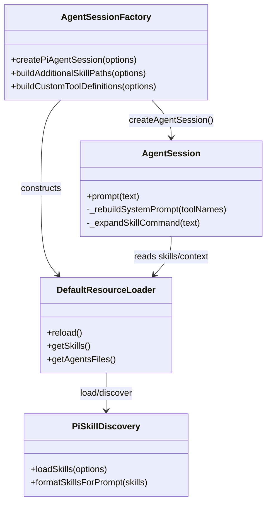
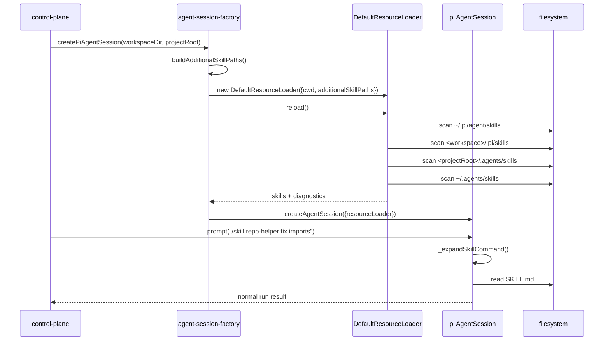

# 260320-s01-adjutant-pi-skills-additional-paths

## 0. Core Principles

以下の原則を本計画全体および全実装タスクに横断適用する。

- Prototype First: `pi-coding-agent` 既存 skills 機能を優先利用し、Adjutant 独自の skills manager や ACP 拡張 API は追加しない。破壊点が出る場合は `createPiAgentSession()` 周辺の初期化経路に限定する。
- SOLID: skills path 解決、`resourceLoader` 構築、診断ログ、session 初期化を分離し、`agent-session-factory` に責務を集中させすぎない。
- KISS: 最小実装は `DefaultResourceLoader` への `additionalSkillPaths` 注入に絞り、skill enable/disable UI や installer は含めない。
- YAGNI: `.agents/skills` 探索と Pi 既存の `/skill:name` 利用を成立させる以上の機能は入れない。
- DRY: skill path の解決規則は 1 箇所に集約し、session 作成時の毎回の組み立てとテストで同じ関数を使う。

## 1. 概要と目的 Overview and Purpose

### What

Adjutant の `pi-coding-agent` 初期化時に `DefaultResourceLoader` を明示構築し、Pi 既定の `~/.pi/agent/skills` / `<workspace>/.pi/skills` に加えて、`projectRoot/.agents/skills` と `~/.agents/skills` を追加探索させる。

### Why

- `pi-coding-agent` には Agent Skills 相当の実装が既にあり、catalog 注入、自動ロード、`/skill:name` 展開まで含まれている。
- Adjutant で独自に skills discovery / catalog / injection を再実装すると重複が大きい。
- ただし Pi の既定探索先は `.pi/skills` 系であり、Agent Skills 標準寄りの `.agents/skills` はそのままだと見えない。
- `additionalSkillPaths` を使えば、ACP や HTTP API を拡張せずに `.agents/skills` を Pi に認識させられる。

### How

- `src/assistant/agent-session-factory.ts` で `SettingsManager.inMemory()` と同時に `DefaultResourceLoader` を生成する。
- `additionalSkillPaths` に `projectRoot/.agents/skills` と `~/.agents/skills` を追加する。
- `createAgentSession()` へ `resourceLoader` を明示注入し、Pi 側既存の skills catalog / `/skill:name` 展開を利用する。
- skill diagnostics は session 初期化時に収集し、警告ログへ出す。
- ACP 境界は変更せず、skills は worker 内の prompt/resource loading 機構として扱う。

## 2. 仕様と受け入れ条件 Specification and Acceptance Criteria

### 2.1 スコープ Scope

- `DefaultResourceLoader` を Adjutant 側で明示構築する。
- `additionalSkillPaths` として以下を解決する。
  - `<projectRoot>/.agents/skills`
  - `~/.agents/skills`
- `createAgentSession()` に `resourceLoader` を渡すよう変更する。
- skill discovery 診断を warning ログとして可視化する。
- unit / integration テストで `.agents/skills` discovery と `/skill:name` 展開の成立を検証する。
- 本計画書と、必要なら skills 運用メモを更新する。

成果物:

- skills path 解決ヘルパー
- `agent-session-factory` の `resourceLoader` 構築処理
- diagnostics logging
- 回帰テスト
- 計画書

制約:

- ACP method や HTTP API 契約は変更しない。
- Pi 既定の `.pi/skills` discovery は壊さない。
- `SettingsManager.inMemory()` は継続利用する。

### 2.2 非スコープ Non Scope

- Adjutant 独自の `SkillsManager` 実装
- `SKILL.md` parser / validator の再実装
- `$skill-name` や mention syntax の独自追加
- skill enable/disable UI
- remote skill install / curated marketplace
- `allowed-tools` や権限昇格の skill 単位 enforcement
- `.agents/skills` への書き出しや scaffold CLI

### 2.3 ユースケース Use Cases

正常系:

1. repo root 配下に `.agents/skills/repo-helper/SKILL.md` がある状態で Adjutant を起動すると、その skill が Pi の system prompt catalog に含まれる。
2. `~/.agents/skills/user-helper/SKILL.md` がある状態で main session を実行すると、その skill が project skill とあわせて利用可能になる。
3. ユーザーが `/skill:repo-helper fix imports` を送ると、Pi が `SKILL.md` を `<skill ...>` ブロックへ展開して prompt に含める。
4. モデルが catalog を見て skill を使うべきと判断した場合、既存の `read` tool で `SKILL.md` を読む前提が成立する。

重要な異常系:

1. `.agents/skills` ディレクトリが存在しなくても session 作成は失敗しない。
2. 不正な `SKILL.md` があっても session 作成全体は継続し、diagnostics に warning が出る。
3. `projectRoot` が未指定の場合は project-level `.agents/skills` 追加探索を行わず、user-level のみで継続する。
4. 同名 skill collision が発生した場合は Pi 既存挙動に従い winner が固定され、warning が残る。

### 2.4 受け入れ条件 Acceptance Criteria

1. Given `projectRoot/.agents/skills/repo-helper/SKILL.md` が存在する When `createPiAgentSession()` を呼ぶ Then Pi resource loader がその path を skill source として解決する。
2. Given `~/.agents/skills/user-helper/SKILL.md` が存在する When session を作成する Then system prompt の skills catalog に `user-helper` が含まれる。
3. Given `.agents/skills` が存在しない When session を作成する Then session 作成は成功し、warning 以外の失敗は発生しない。
4. Given invalid frontmatter を持つ `SKILL.md` が存在する When session を作成する Then skill diagnostics が warning として記録され、プロセスは継続する。
5. Given user message が `/skill:repo-helper fix imports` である When Pi session に prompt を送る Then `<skill name="repo-helper"` を含む expanded text が agent へ送られる。
6. Given ACP `session/prompt` を実行する When skills が有効な session を使う Then ACP contract や `meta` schema の変更なしに run が完了する。
7. Given `pnpm run test` と `pnpm run typecheck` を実行する When 実装完了後に検証する Then 追加したテストを含めて成功する。

### 2.5 既知の制約 Known Limitations

- Pi の明示 skill 起動 syntax は `/skill:name` のままで、`$skill-name` は導入しない。
- catalog 探索対象に `.agents/skills` を足しても、Pi 既定の `.pi/skills` を置き換えるわけではない。
- diagnostics は warning ログ出力までとし、Web UI に一覧表示する機能は持たない。
- `SettingsManager.inMemory()` を使うため、Pi 設定ファイル経由の skill path 永続設定は採用しない。

## 3. 前提技術スタック Context and Tech Stack

- Language/Framework: TypeScript 5.x, Node.js ESM
- Libraries:
  - `@mariozechner/pi-coding-agent`
  - `openai`
  - Node.js `fs/promises`, `path`, `os`
- Style Guide: repository の ESLint / Prettier 設定に従う
- Runtime/Deployment: control-plane + `agent-worker-acp` + `pi-coding-agent` session
- Testing: `node --import tsx --test`, 既存 unit / integration suite

## 4. インターフェース契約 Interface Contracts

### 4.1 公開APIまたは外部 I/O 一覧

- 内部 API
  - `createPiAgentSession(options)` in [`src/assistant/agent-session-factory.ts`](/Users/redacted-user/masahide/git/adjutant/src/assistant/agent-session-factory.ts)
  - `buildAdditionalSkillPaths(...)` 新設想定
- 外部 I/O
  - filesystem:
    - `<projectRoot>/.agents/skills/**/SKILL.md`
    - `~/.agents/skills/**/SKILL.md`
    - Pi 既定の `~/.pi/agent/skills`
    - `<workspaceDir>/.pi/skills`
- ACP
  - `session/new`
  - `session/prompt`
  - 変更なし

### 4.2 データモデルとスキーマ

```ts
export interface BuildAdditionalSkillPathsOptions {
  projectRoot?: string;
  homedirPath?: string;
}

export interface SkillLoaderDiagnosticsSummary {
  warnings: Array<{
    path: string;
    message: string;
  }>;
}
```

解決規則:

- `projectRoot` が与えられた場合のみ `resolve(projectRoot, ".agents/skills")` を追加する。
- `homedir()` から `resolve(homedirPath, ".agents/skills")` を追加する。
- 重複 path は `resolve()` 後に dedupe する。
- path が存在しなくても loader に渡してよい。存在判定は Pi 側 discovery に委譲する。

### 4.3 エラーと例外 Error Handling

- session 初期化
  - `DefaultResourceLoader.reload()` が throw した場合は session 作成失敗
  - skill path 不在は非致命
  - malformed `SKILL.md` は Pi diagnostics warning として扱う
- ログ方針
  - diagnostics の warning を `console.warn` で出す
  - user prompt や skill body はログしない
  - path と warning message のみ記録する
- リトライ方針
  - session 初期化時の skills reload に個別リトライは入れない

### 4.4 代表的な例 Examples

例1: project-level skill を追加探索

```text
projectRoot=/repo
workspaceDir=/Users/me/.adjutant/workspace
additionalSkillPaths:
- /repo/.agents/skills
- /Users/me/.agents/skills
```

例2: 明示 skill 起動

```text
input: /skill:repo-helper fix imports
expanded:
<skill name="repo-helper" location="/repo/.agents/skills/repo-helper/SKILL.md">
References are relative to /repo/.agents/skills/repo-helper.
...
</skill>

fix imports
```

例3: ACP 変更なし

```json
{
  "sessionId": "sess_1",
  "prompt": "/skill:repo-helper fix imports",
  "meta": {
    "sessionKey": "main",
    "memoryScope": "main",
    "origin": "user"
  }
}
```

## 5. アーキテクチャと設計図 Architecture and Diagrams

### 5.1 図の選択方針

- `agent-session-factory`、Pi SDK、resource loader、filesystem discovery が複数モジュールに跨るためクラス図を必須とする。
- prompt 実行時に `/skill:name` がどこで展開されるかを明示するためシーケンス図を追加する。

### 5.2 クラス図 Class Diagram



### 5.3 その他の図 Optional



## 6. テスト戦略 Test Strategy

### 6.1 テストの種類

- Unit
  - skill path 解決ヘルパーの path 合成と dedupe
  - `agent-session-factory` が `DefaultResourceLoader` を構築する条件
  - diagnostics logging の warning 出力
- Integration
  - 実際の temp directory に `.agents/skills/.../SKILL.md` を置いて session 作成し、catalog と `/skill:name` 展開を確認
- Contract
  - ACP `session/prompt` 契約が不変であること
  - 既存 bootstrap / tool hub session 初期化と共存すること

### 6.2 カバレッジ対象

- 追加 skill path の解決
- `projectRoot` 未指定時の分岐
- path 不在時の非致命挙動
- invalid skill warning
- `/skill:name` expanded prompt

## 7. 実装タスクリスト Implementation Plan

### Phase 1 設計と準備

- [x] インターフェース契約の確定 `.agents/skills` path 解決規則と diagnostics 契約を文書化
- [x] Mermaid 図の作成 更新
- [x] `buildAdditionalSkillPaths()` と resource loader 構築の型を定義
- [x] 既存 `pi-coding-agent` skills 利用前提のテストポイントを洗い出す

### Phase 2 skills path 解決の実装

- [x] Test `projectRoot/.agents/skills` と `~/.agents/skills` を組み立てる失敗テストを追加 Red
- [x] Impl path 解決ヘルパーを追加し、dedupe と optional `projectRoot` を実装 Green
- [x] Refactor path 解決ロジックを `agent-session-factory` から分離
- [x] Integration temp dir ベースで path 解決の実パス確認を追加
- [x] Docs 契約と例を更新

### Phase 3 resource loader 統合

- [x] Test `createPiAgentSession()` が `DefaultResourceLoader` を使い `additionalSkillPaths` を渡す失敗テストを追加 Red
- [x] Impl `resourceLoader` を明示構築して `createAgentSession()` へ渡す Green
- [x] Refactor `SettingsManager`, `DefaultResourceLoader`, `createAgentSession` 初期化の責務を整理
- [x] Integration `.agents/skills` 配下の `SKILL.md` が session skills catalog に入るテストを追加
- [x] Docs `pi-coding-agent` 既存機能利用方針を追記

### Phase 4 明示起動と検証

- [x] Test `/skill:name` prompt が skill block に展開される統合テストを追加 Red
- [x] Impl diagnostics warning logging と不足している配線を最小追加 Green
- [x] Refactor warning log 重複や helper 名称を整理
- [x] Integration ACP `session/prompt` 経由でも skills が成立する回帰テストを追加
- [x] Docs 運用上の制約と既知 limitation を更新

### Phase 5 統合と検証

- [x] 全体テストの実行
- [x] エッジケース確認 `projectRoot` 未指定、不正 `SKILL.md`、path 不在
- [x] ログと例外の確認 warning のみで継続するケースと致命失敗ケースを確認
- [x] ドキュメント更新 計画 仕様 契約 図

## 8. 完了の定義 Definition of Done

### 8.1 機能DoD Functional DoD

- [x] `.agents/skills` の project/user 両方が Pi skills discovery に接続されていること
- [x] Pi 既定 skills と共存し、catalog 注入が成立すること
- [x] `/skill:name` が Adjutant 経由でも利用できること
- [x] ACP/HTTP API 契約を変更せずに動作すること

### 8.2 品質DoD Quality DoD

- [x] 追加した unit / integration tests がパスしていること
- [x] `pnpm run typecheck` が成功すること
- [x] warning log の出力内容に過剰なユーザー入力が含まれないこと
- [x] 主要変更点がドキュメントに反映されていること

## 9. 懸念事項と未確定事項 Concerns and Questions

- `adjutant` が実際に参照している `@mariozechner/pi-coding-agent` の npm 配布物に、vendor で確認した skills 実装が完全に含まれている前提で進める。差異がある場合は package lock と実依存の確認が必要。
- Pi 既定の project skill path は `<workspaceDir>/.pi/skills` になるため、repo 内 `.pi/skills` を期待する運用とはずれる。Adjutant では `.agents/skills` を追加探索することで補う。
- diagnostics をどのログ面に出すかは最小では `console.warn` 想定だが、将来は structured log へ寄せる余地がある。
- `/skill:name` は Pi 標準 UX であり、将来的に `$skill-name` など別 syntax を足すかは未決定。

---
