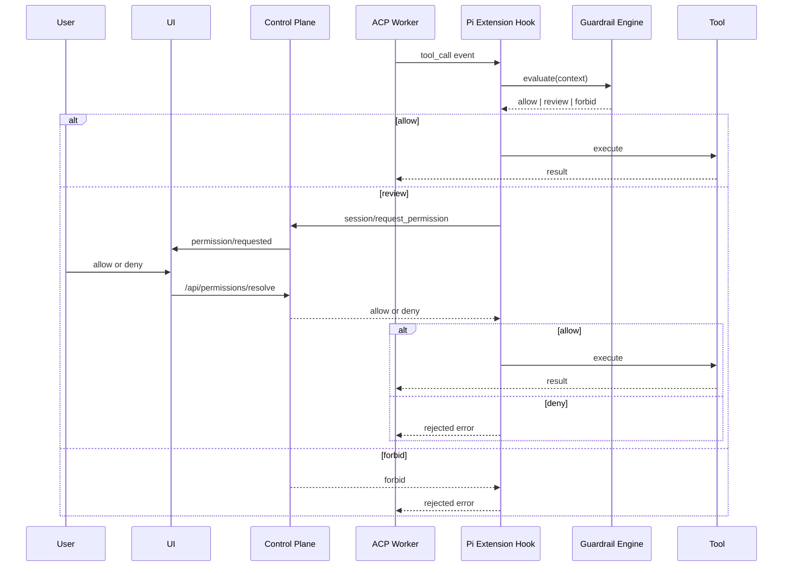

# 260321-s01: Scientist AI ガードレール実装計画

## 0. Core Principles

- Prototype First: 既存の `PermissionGateway` / Web UI pending permission / ACP worker-control-plane 境界を再利用し、最短で安全制御を差し込む。
- Sandbox First: 現状の Pi 実行基盤はすでに sandbox 配下に閉じ込められているため、今回の主眼は「ホスト破壊防止」ではなく「外部作用・越境・承認境界」の制御に置く。
- Rule Based First: 今回は LLM による自動承認やリスクスコア閾値判定を導入せず、決定的なルールベースで `allow / review / forbid` を判定する。
- SOLID: ルール定義、ルール評価、承認待機、Pi 連携、UI 表示を別責務のコンポーネントに分割する。
- KISS: まずは「1 回のツール実行ごとの同期判定」に限定し、永続学習や複雑なポリシー DSL は導入しない。
- DRY: 既存の `session/request_permission` 契約余地、`PermissionGateway`、`runEventBuffer`、`ToolEventBridge` を流用し、同等の pending 管理を二重実装しない。
- Fail Safe: ルール未一致は fail-open にせず、原則 `review` に倒す。

## 1. 概要と目的 Overview and Purpose

### What

- Pi-coding-agent がツール実行を開始する直前に、rule-based guardrail を割り込ませる。
- guardrail はツール実行要求を構造化して評価し、次の 3 パターンへ分岐する。
  - `allow`
    - whitelist に一致する低危険操作のみ自動実行
  - `review`
    - whitelist にない non-read-only 操作
    - 外部ネットワークアクセス
    - 高危険だが明示禁止ではない操作
  - `forbid`
    - 明示 deny のポリシー違反
    - sandbox 逸脱、権限昇格、機密送信などの明確な禁止カテゴリ

### Why

- 現状の Pi-coding-agent はツールを自律的に実行できる一方、実行前の承認境界が弱い。
- ただし、実行は基本的に sandbox 配下に閉じ込め済みであり、ローカル破壊の多くは sandbox により吸収される。
- そのため今回の guardrail は、sandbox で閉じ込めきれない領域を重点的に扱うべきである。
  - 外部ネットワーク
  - `tool_hub` 経由の外部副作用
  - whitelist にない write / exec
  - 明示的なポリシー違反

### How

```text
Pi Agent tool call
  -> pre-tool hook (worker)
  -> local rule engine evaluation
      -> forbid: reject tool call immediately
      -> review: request permission via ACP
      -> allow: execute tool
  -> tool result returned to Pi Agent
  -> existing UI / SSE / audit paths reflect decision
```

## 2. 仕様と受け入れ条件 Specification and Acceptance Criteria

### 2.1 スコープ Scope

- 今回やること
  - Pi tool 実行前フックの追加
  - rule-based guardrail モジュールの追加
  - whitelist / review / deny ルール定義の追加
  - review 判定時に既存 `PermissionGateway` を起動する導線の追加
  - forbid 判定時の即時拒否
  - UI に承認理由とマッチしたルール情報を表示する payload 拡張
  - audit モードと enforce モードの切り替え設計
- 成果物
  - 設計ドキュメント
  - ACP 双方向問い合わせ設計
  - 実装フェーズごとの作業分解
  - テスト観点整理
- 制約
  - Pi 本体の vendor fork は原則避ける
  - 既存の `PermissionGateway` と `/api/permissions/resolve` を活かす
  - 既存の `tool_call` / `tool_call_update` 可視化を壊さない
  - LLM ベースの自動承認は今回のスコープ外とする

### 2.2 非スコープ Non Scope

- LLM による自動承認
- ツール実行ごとのリスクスコア算出
- 複数段の審査 LLM チェーン
- 永続的な allowlist 管理 UI
- 外部署名付きポリシー配布
- 実行後の結果安全性監査の自動学習

### 2.3 ユースケース Use Cases

- 正常系1: workspace 配下の read-only 操作で whitelist に一致するものは自動実行される
- 正常系2: whitelist にない `bash` / `edit` / `write` は UI に承認要求が表示される
- 正常系3: 外部ネットワークアクセスは原則 UI に承認要求が表示される
- 正常系4: 高危険操作でも明示禁止でないものは human review に回る
- 正常系5: ユーザーが承認したツールだけが継続実行される
- 異常系1: deny rule に一致した操作は承認 UI に出さず即拒否される
- 異常系2: run cancel 中に pending approval がある場合、承認待ちは `cancelled` で解決される

### 2.4 受け入れ条件 Acceptance Criteria

1. Given Pi Agent がツール実行を要求する  
   When pre-tool hook が動作する  
   Then 実ツール実行前に rule engine による判定が完了する
2. Given whitelist に一致する read-only 操作である  
   When ルール判定を実行する  
   Then ツールは自動実行される
3. Given whitelist に一致しない non-read-only 操作である  
   When ルール判定を実行する  
   Then `PermissionGateway` が起動し、ユーザー承認待ちになる
4. Given 外部ネットワークアクセスを伴う操作である  
   When ルール判定を実行する  
   Then deny rule に一致しない限り `PermissionGateway` が起動する
5. Given deny rule に一致する操作である  
   When ルール判定を実行する  
   Then ツールは実行されず、Pi Agent には拒否理由が返る
6. Given user が承認要求に対して deny する  
   When tool call が再開される  
   Then 実ツールは実行されず failed tool result として Pi に戻る
7. Given run が cancel される  
   When pending approval が存在する  
   Then pending approval と worker 側待機は `cancelled` で解決される
8. Given UI が pending permission を表示する  
   When rule reason が存在する  
   Then title だけでなく decision と理由が表示される

### 2.5 既知の制約 Known Limitations

- worker-control-plane 間に同期往復を追加するため、ACP 実装が現状より複雑化する
- sandbox があるとはいえ、`tool_hub` や外部通信は別種の副作用を持つため、ルールの初期設計が重要である
- whitelist を粗い粒度で設計すると、意図しない自動実行を招く

## 3. 前提技術スタック Context and Tech Stack

- Language / Framework
  - TypeScript, Node.js, React
- Agent Runtime
  - `@mariozechner/pi-coding-agent`
- Integration Surface
  - `DefaultResourceLoader` extension factories
  - ACP worker <-> control-plane JSON-RPC
  - existing `PermissionGateway`
- UI
  - `@assistant-ui/react`
- Sandbox Premise
  - worker 起動時に sandbox 設定が注入される
  - `bash` と file tools は containerized 実装へ差し替えられる
  - root filesystem は read-only
  - ただし、ネットワークは既定で無効ではなく、`tool_hub` も別経路の副作用面を持つ

### 3.1 設計方針の含意

- guardrail の主眼は「sandbox 内ローカル操作の全面禁止」ではない
- guardrail の主眼は次の承認境界にある
  - whitelist に一致するか
  - read-only か
  - write / exec を伴うか
  - 外部ネットワークアクセスか
  - 明示 deny に一致するか

## 4. インターフェース契約 Interface Contracts

### 4.1 公開 API または外部 I/O 一覧

- Worker -> Control-plane
  - 新規: `session/request_permission` の request/response フローを review 専用で実装する
- Control-plane -> UI / SSE
  - 既存: `permission/requested`
  - 既存: `permission/resolved`
- Tool Event
  - 既存: `tool_call`
  - 既存: `tool_call_update`
- Policy Source
  - 新規: guardrail rules のロードと評価

### 4.2 データモデルとスキーマ

- `GuardrailContext`

```ts
type GuardrailContext = {
  sessionId: string;
  sessionKey: string;
  runId?: string;
  toolCallId: string;
  toolName: string;
  toolKind?: "read" | "write" | "exec" | "network" | "tool_hub";
  rawInput: unknown;
  normalizedInput?: {
    argv?: string[];
    path?: string;
    paths?: string[];
    domain?: string;
    method?: string;
    readOnly?: boolean;
    workspaceOnly?: boolean;
    externalNetwork?: boolean;
  };
  origin?: "user" | "system";
  isHeartbeat?: boolean;
};
```

- `GuardrailDecision`

```ts
type GuardrailDecision =
  | {
      action: "allow";
      reason: string;
      matchedRuleIds: string[];
    }
  | {
      action: "review";
      reason: string;
      matchedRuleIds: string[];
    }
  | {
      action: "forbid";
      reason: string;
      matchedRuleIds: string[];
    };
```

### 4.2.1 ACP 整合方針

- `session/request_permission` は ACP 標準の意味に合わせ、human review が必要な場合にのみ使う
- `allow` と `forbid` は permission request を発行せず、guardrail engine のローカル判定として処理する
- `reason`, `matchedRuleIds`, `decisionSource` などの追加情報は ACP schema の top-level を拡張せず、必要に応じて `_meta` に載せる
- この方針により、`session/request_permission` を「汎用 policy RPC」へ転用しない

- `GuardrailRule`

```ts
type GuardrailRule = {
  id: string;
  description: string;
  decision: "allow" | "review" | "forbid";
  priority?: number;
  match: {
    toolNames?: string[];
    toolKinds?: Array<"read" | "write" | "exec" | "network" | "tool_hub">;
    readOnly?: boolean;
    workspaceOnly?: boolean;
    externalNetwork?: boolean;
    pathGlobs?: string[];
    domainGlobs?: string[];
    commandPrefixes?: string[][];
    methods?: string[];
  };
  reason: string;
  examples?: {
    match?: Array<Record<string, unknown>>;
    notMatch?: Array<Record<string, unknown>>;
  };
};
```

- `PermissionRequestPayload` 拡張案

```ts
type PendingPermission = {
  requestId: string;
  sessionId: string;
  runId?: string;
  toolCallId?: string;
  title: string;
  createdAt: string;
  reason?: string;
  decision?: "review" | "forbid";
  matchedRuleIds?: string[];
  decisionSource?: "guardrail_rules";
};
```

### 4.3 エラーと例外 Error Handling

- `GUARDRAIL_FORBIDDEN`
  - 明示 deny rule により実行不可
- `GUARDRAIL_CANCELLED`
  - run cancel か session cancel により保留解除
- `ACP_PERMISSION_ROUNDTRIP_FAILED`
  - worker-control-plane の同期要求が破綻
- `GUARDRAIL_RULES_INVALID`
  - ルール定義のロードまたは自己検証に失敗

### 4.4 代表的な例 Examples

```json
{
  "action": "allow",
  "reason": "workspace 配下の read-only 操作で allow rule に一致した",
  "matchedRuleIds": ["allow-workspace-read"]
}
```

```json
{
  "action": "review",
  "reason": "whitelist に一致しない write 系操作のため承認が必要",
  "matchedRuleIds": ["review-non-whitelisted-write"]
}
```

```json
{
  "action": "forbid",
  "reason": "deny rule に一致する外部送信であり、明示的ポリシー違反",
  "matchedRuleIds": ["forbid-secret-exfiltration"]
}
```

## 5. アーキテクチャと設計図 Architecture and Diagrams

### 5.1 推奨アーキテクチャ

実装は、Pi 本体の agent loop を直接改造せず、Pi extension の `tool_call` hook を使って pre-tool interception を実現する。
既存の `PermissionGateway` と UI pending permission を利用し、worker と control-plane の間に「review 専用の同期承認問い合わせ」を追加する。
判定ロジックは rule engine へ寄せ、LLM は今回使わない。

### 5.2 コンポーネント構成

- `src/safety/guardrail-types.ts`
  - `GuardrailContext` / `GuardrailRule` / `GuardrailDecision`
- `src/safety/guardrail-rules.ts`
  - 初期 rule set 定義
  - allow / review / forbid を宣言的に記述
- `src/safety/guardrail-matcher.ts`
  - context と rule のマッチング責務
  - `pathGlobs`, `domainGlobs`, `commandPrefixes` を評価
- `src/safety/guardrail-engine.ts`
  - strictest-wins の最終判定責務
  - `forbid > review > allow > default(review)` を実装
- `src/safety/guardrail-normalizer.ts`
  - tool input を構造化し、`toolKind`, `readOnly`, `externalNetwork` などの正規化を行う
- `src/assistant/guardrail-extension.ts`
  - Pi extension factory
  - `tool_call` で control-plane へ問い合わせる
- `src/assistant/pi-skills.ts`
  - `DefaultResourceLoader` へ extension factory を注入する導線
- `src/agent-worker-acp/control-plane-rpc.ts`
  - worker 側の request/response 実装
- `src/agent-worker-acp/stdio-server.ts`
  - control-plane からの応答を扱える双方向 RPC へ拡張
- `src/control-plane/acp/permission-request-handler.ts`
  - `session/request_permission` を処理
  - guardrail engine と `PermissionGateway` のオーケストレーション
- `src/control-plane/acp/permission-gateway.ts`
  - payload 拡張
- `src/control-plane/contracts/http-api.ts`
  - UI に渡す pending permission 情報を拡張
- `src/ui/runtime.ts`
  - pending permission payload の取り回し拡張
- `src/ui/components/assistant-ui/thread.tsx`
  - decision / reason / matched rules 表示

### 5.3 シーケンス図 Sequence Diagram



### 5.4 状態遷移 State Machine

```text
proposed
  -> policy_evaluating
    -> allowed
      -> executing
      -> completed | failed
    -> awaiting_human
      -> allowed
        -> executing
        -> completed | failed
      -> denied
      -> cancelled
    -> forbidden
```

## 6. 既存コードへの差し込みポイント Planned Integration Points

### 6.1 Pi 側フック

- `@mariozechner/pi-coding-agent` には `tool_call` を block できる extension hook がある
- ここを利用すれば、tool 実行前に割り込める
- 直接 vendor の agent loop を書き換えるより保守性が高い

### 6.2 Worker と Control-plane の境界

- 現在の `WorkerSupervisor` は request を control-plane -> worker へ送る一方向呼び出しのみを持つ
- worker -> control-plane の同期 request/response 導線が未実装
- そのため `session/request_permission` は今回の技術的中核になる
- ただし用途は review 専用に限定し、`allow / forbid` 判定そのものは ACP の外で完結させる

### 6.3 既存 PermissionGateway の再利用

- `PermissionGateway` はすでに pending permission 管理と UI event emit を持つ
- 今回は `review` と判定した場合だけ起動する
- `forbid` は UI 承認に出さず、即時拒否する
- これにより ACP の `session/request_permission` の意味論と整合する

### 6.4 UI の変更方針

- 現在の pending permission banner は `title` と `Approve/Deny` だけを表示する
- ここへ `decision`, `reason`, `matchedRuleIds` を加える
- 新しい approval UI を作らず、既存 UI の拡張で済ませる

## 7. ルール設計 Rule Design

### 7.1 基本方針

- ルールは `low / medium / high` ではなく、最終動作を直接表す
  - `allow`
  - `review`
  - `forbid`
- ルール形式は TypeScript の宣言的オブジェクトを採用する
- YAML や独自 DSL は今回は導入しない
- 初期版では rule file をコード同梱し、型安全に管理する

### 7.2 評価順序

- `forbid` に一致したら即拒否
- そうでなく `review` に一致したら human review
- そうでなく `allow` に一致したら自動実行
- どれにも一致しなければ `review`

### 7.3 初期ルールカテゴリ

- `allow`
  - workspace 配下の read-only 操作
  - 明示 allow 済みの安全コマンド
  - 明示 allow 済みの read-only API アクセス
- `review`
  - whitelist にない write / exec
  - 外部ネットワークアクセス
  - `tool_hub` 経由の外部副作用
  - 高危険だが明示禁止ではない操作
- `forbid`
  - 明示 deny のドメインやエンドポイント
  - sandbox escape / 権限昇格相当
  - シークレット送信
  - ポリシー回避を意図した既知カテゴリ

### 7.4 whitelist 粒度

- `toolName` だけで allow しない
- 少なくとも次の粒度で絞る
  - `toolName`
  - `toolKind`
  - `resource scope`
    - path / domain
  - `argument constraints`
    - command prefix / method / read-only 判定

### 7.5 ルール例

```ts
export const GUARDRAIL_RULES: GuardrailRule[] = [
  {
    id: "allow-workspace-read",
    description: "workspace 配下の read-only 操作を許可",
    decision: "allow",
    match: {
      toolKinds: ["read"],
      readOnly: true,
      workspaceOnly: true,
    },
    reason: "workspace 配下の read-only 操作であり副作用がない",
  },
  {
    id: "review-non-whitelisted-write",
    description: "whitelist にない write / exec を承認対象にする",
    decision: "review",
    match: {
      toolKinds: ["write", "exec", "tool_hub"],
    },
    reason: "副作用を持つ操作のため承認が必要",
  },
  {
    id: "review-external-network",
    description: "外部ネットワークアクセスは承認対象",
    decision: "review",
    match: {
      externalNetwork: true,
    },
    reason: "sandbox 外との通信が発生するため承認が必要",
  },
  {
    id: "forbid-denylisted-domain",
    description: "denylist ドメインへの送信は禁止",
    decision: "forbid",
    match: {
      toolKinds: ["network"],
      domainGlobs: ["*.internal.example", "secrets.example.com"],
    },
    reason: "明示 deny のネットワークポリシー違反",
  },
];
```

### 7.6 ルールの自己検証

- 各 rule に `examples.match` / `examples.notMatch` を持てるようにする
- 起動時または test 時にルール自己検証を行う
- 将来のルール変更で意図せぬ allow / review / forbid 反転を防ぐ

## 8. 非同期処理 / Human-in-the-loop 設計方針

### 8.1 待機の責務

- worker 側の pre-tool hook はまずローカルに rule 判定を行う
- `review` の場合だけ Promise を保持し、control-plane からの応答を待つ
- control-plane は `review` 判定時に `PermissionGateway.requestPermission()` を起動し、その Promise を await する
- user からの `/api/permissions/resolve` により Promise が解決される

### 8.2 cancel 時の挙動

- run cancel
  - worker 実行中断
  - pending permission を `cancelled` 解決
  - waiting 中の control-plane RPC を abort
- session cancel
  - session 単位で全 pending permission を解決
  - orphaned wait を残さない

### 8.3 タイムアウト方針

- human review timeout
  - 初期段階では自動 timeout deny を入れず、明示 resolve か cancel に任せる
- worker-control-plane roundtrip timeout
  - 例: 30 秒から 60 秒

### 8.4 設定値 Configuration

- `ADJUTANT_GUARDRAIL_MODE`
  - `off | audit | enforce`
- `ADJUTANT_GUARDRAIL_RULESET`
  - 初期は `default`
- `ADJUTANT_GUARDRAIL_DEFAULT_ACTION`
  - 初期値は `review`

## 9. 実装タスクリスト Implementation Plan

### Phase 1 設計と準備

- [x] `Task-GR-PLAN-001` 契約整理: `allow / review / forbid` の判定方針と ACP 整合を計画書へ反映
- [x] `Task-GR-PLAN-002` 差し込み点整理: Pi `tool_call` hook / worker-control-plane RPC / `PermissionGateway` の統合点を確定
- [x] `Task-GR-PLAN-003` 設定整理: `ADJUTANT_GUARDRAIL_MODE` の導入方針を確定

### Phase 2 Guardrail Engine 実装

- [x] `Task-GR-RED-001` Test: guardrail engine の `allow / review / forbid` 判定テストを追加
- [x] `Task-GR-GREEN-001` Impl: `GuardrailContext` / `GuardrailRule` / `GuardrailDecision` と評価エンジンを実装
- [x] `Task-GR-REF-001` Refactor: rule 正規化と初期ルールセットを sandbox 前提の最小構成へ整理

### Phase 3 ACP Review 統合

- [x] `Task-GR-RED-002` Test: `session/request_permission` の child-originated request 往復テストを追加
- [x] `Task-GR-GREEN-002` Impl: worker -> control-plane の双方向 RPC と review 専用 permission request を実装
- [x] `Task-GR-GREEN-003` Impl: Pi session factory へ guardrail extension を注入し、`review` のときだけ ACP permission を使う
- [x] `Task-GR-REF-002` Refactor: `allow / forbid` はローカル判定、`review` のみ ACP 利用という責務分離へ整理

### Phase 4 UI / 契約 / ドキュメント

- [x] `Task-GR-RED-003` Test: permission payload に `reason` / `ruleId` を含む経路の単体テストを追加
- [x] `Task-GR-GREEN-004` Impl: `PermissionGateway` / HTTP snapshot / UI banner へ `reason` / `ruleId` を反映
- [x] `Task-GR-DOC-001` Docs: `doc/spec/configuration.md` に `ADJUTANT_GUARDRAIL_MODE` を追記

### Phase 5 統合と検証

- [x] `Task-GR-VERIFY-001` `pnpm run typecheck` を通過
- [x] `Task-GR-VERIFY-002` `pnpm run test` を通過
- [x] `Task-GR-VERIFY-003` `pnpm run check` を通過

### Phase 6 拡張タスク

- [ ] `Task-GR-AUDIT-001` Audit モードを実装し、実行制御なしで rule hit を観測できるようにする
- [ ] `Task-GR-TOOLHUB-001` `tool_hub` の provider / action ごとに guardrail ルールを精密化する
- [ ] `Task-GR-PERSIST-001` 永続 whitelist / denylist の保存形式と反映経路を実装する
- [ ] `Task-GR-LLM-001` LLM ベース評価を再導入するための責務分離層と fallback 方針を実装する
- [ ] `Task-GR-TIMEOUT-001` human review / worker-control-plane roundtrip の timeout policy を設計・実装する

## 10. 完了の定義 Definition of Done

### 10.1 機能 DoD Functional DoD

- [x] Pi の `tool_call` 実行前に guardrail が割り込むこと
- [x] `allow` 判定は自動実行されること
- [x] `review` 判定は `session/request_permission` を経由して承認待ちになること
- [x] `forbid` 判定は承認 UI を出さず拒否されること
- [x] UI に承認理由とルール情報が表示されること

### 10.2 品質 DoD Quality DoD

- [x] 追加した unit / integration テストがパスしていること
- [x] `pnpm run check` が成功していること
- [x] 設定ドキュメントが更新され、docs sync が通ること
- [x] ACP 整合として `session/request_permission` を review 専用に限定していること

## 11. 懸念事項と対策 Risks and Mitigations

### 10.1 双方向 ACP 実装の複雑さ

- 懸念
  - 現状の worker は notification を返すだけで、control-plane への同期 request を持たない
- 対策
  - `session/request_permission` を first-class に実装する
  - 将来的に他の worker->control-plane request にも流用できる汎用基盤にする

### 10.2 whitelist の粗さ

- 懸念
  - `toolName` だけの allow は危険
- 対策
  - `toolName + toolKind + scope + argument constraints` の組み合わせで定義する
  - `bash` はコマンド prefix 単位で絞る

### 10.3 `tool_hub` の可視性不足

- 懸念
  - `tool_hub` の内部 action が粗くしか見えないと、安全判定が甘くなる
- 対策
  - 可能な範囲で内部 action, provider, target を guardrail context へ展開する
  - 情報が足りない場合は `review` に倒す

### 10.4 sandbox に対する過信

- 懸念
  - sandbox 配下でも外部通信や外部 API 副作用は止められない
- 対策
  - guardrail は外部作用と越境操作を重点的に扱う
  - ネットワークは allow ではなく review を基本にする

### 10.5 UI の説明不足

- 懸念
  - user がなぜ承認を求められているか分からない
- 対策
  - pending permission に `decision`, `reason`, `matchedRuleIds` を含める
  - 短い人間向け説明文を返す

### 10.6 ルール変更の退行

- 懸念
  - 新しい rule 追加で既存挙動が壊れる
- 対策
  - `examples.match` / `examples.notMatch` による自己検証
  - contract test と fixture test を追加する

## 12. テスト戦略 Test Strategy

### 11.1 Unit Tests

- `guardrail-matcher.ts`
  - `pathGlobs`, `domainGlobs`, `commandPrefixes`
- `guardrail-engine.ts`
  - `forbid > review > allow > default(review)` の評価順
- `guardrail-normalizer.ts`
  - tool input の構造化
- `PermissionGateway`
  - payload 拡張
  - review 解決

### 11.2 Integration Tests

- `review` 判定時にのみ worker から `session/request_permission` を送る
- `review` 判定時に UI pending permission が出る
- `forbid` 判定時に ACP permission request を出さず、UI を介さず拒否される
- allow / deny で worker 側待機が解決する
- cancel で pending permission が片付く

### 11.3 Contract Tests

- ACP request/response 追加契約
- HTTP snapshot / pendingPermissions payload 契約
- SSE `permission/requested` / `permission/resolved` の後方互換

### 11.4 Audit モード検証

- rule hit 分布
- tool 種別別の review 率
- forbid の妥当性レビュー

## 13. 実装順の推奨 Recommended Work Order

1. ACP 双方向 request/response 基盤を追加する
2. `GuardrailContext` / `GuardrailRule` / `GuardrailDecision` を実装する
3. `guardrail-normalizer.ts` / `guardrail-matcher.ts` / `guardrail-engine.ts` を実装する
4. 初期 rule set を `guardrail-rules.ts` に実装する
5. `session/request_permission` の control-plane handler を review 専用で実装する
6. Pi extension hook を session factory 経由で注入する
7. `PermissionGateway` payload と UI を拡張する
8. audit モードでログ収集する
9. enforce モードを有効化する

## 14. Open Questions

- worker -> control-plane の同期問い合わせは、専用実装にするか汎用 RPC request バスにするか
- `tool_hub` 内部 action をどこまで展開して guardrail context に含めるか
- 外部ネットワークを常時 `review` にするか、read-only API の一部を allow するか
- denylist の初期スコープを domain 中心にするか、tool action 中心にするか
- human review の timeout policy を初期から導入するか
- 将来 Scientist AI を「説明補助」または「レビュー補助」に限定して戻すか

## 15. 結論

- 現時点の最有力案は、「Pi extension の `tool_call` pre-hook + ACP 双方向 permission roundtrip + rule-based guardrail + 既存 `PermissionGateway` 再利用」である。
- ACP 整合のため、`session/request_permission` は review 専用に限定し、`allow / forbid` はローカル rule 判定として扱う。
- sandbox 前提の現状実装を踏まえると、guardrail の主眼はローカル破壊防止ではなく、外部作用・越境・承認境界の制御にある。
- 実装は `allow / review / forbid` のルールベースで始めるのが妥当であり、LLM ベース自動承認は将来拡張として保留する。
