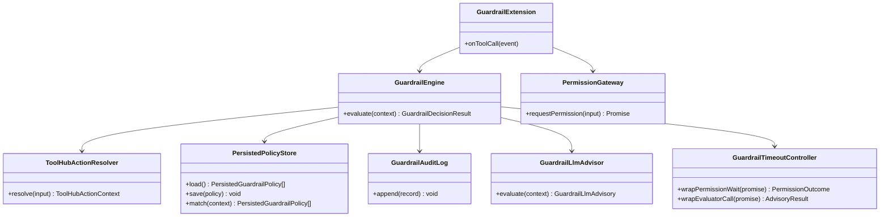
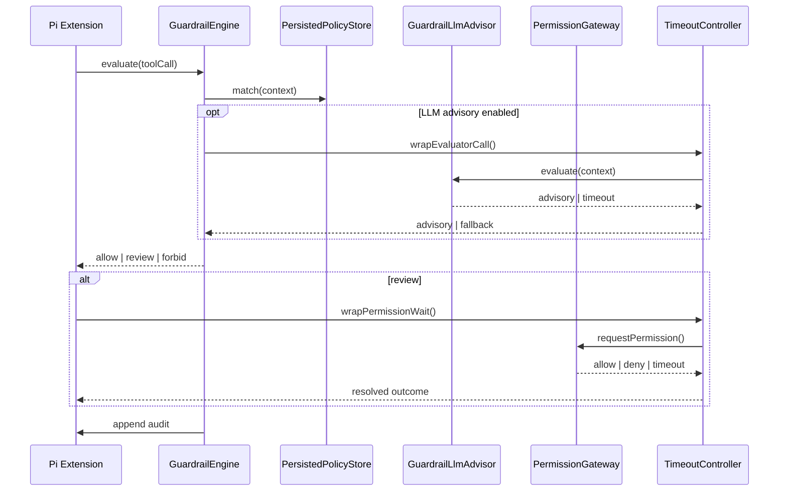
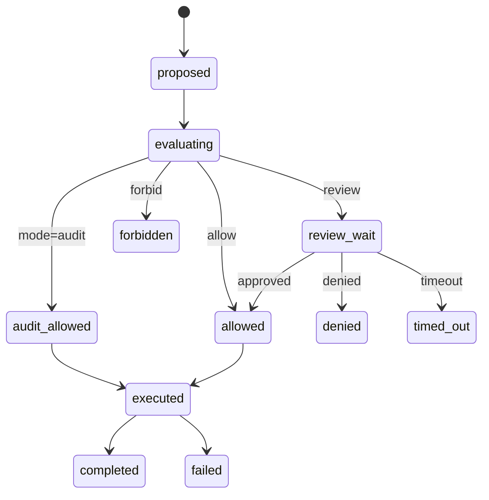

# 260322-s01 Guardrail Phase 2 Extensions

## 0. Core Principles

- Prototype First  
  既存の rule-based guardrail 実装を土台にしつつ、次フェーズで必要な `audit`、`tool_hub` 精密化、永続ポリシー、LLM 評価復帰、timeout policy を段階的に追加する。既存 CI や現行 ACP 契約を壊さないことを優先し、破壊的変更が必要な場合は移行方針を明記する。
- SOLID  
  監査、ルール評価、永続ポリシー、LLM 評価、timeout 管理を別責務として分離する。
- KISS  
  まずは単一ノード内のローカル永続化と単純な timeout policy から始め、分散同期や複雑な承認ワークフローは扱わない。
- YAGNI  
  今回必要な guardrail 拡張に限定し、汎用ポリシー言語や大規模な管理 UI は後回しにする。
- DRY  
  既存の `PermissionGateway`、ACP `session/request_permission`、`tool_hub` メタデータ、現在の guardrail engine を再利用し、同種の判定ロジックを重複実装しない。

## 1. 概要と目的 Overview and Purpose

- What  
  既存の rule-based guardrail に対して、`audit` モード、`tool_hub` action 単位のルール精密化、永続 whitelist / denylist、LLM ベース評価の復帰導線、human review / RPC timeout policy を追加する。
- Why  
  現在の guardrail は `allow / review / forbid` の最小構成としては成立しているが、運用観測、`tool_hub` の安全性、再利用可能な恒久ポリシー、評価補助、待機制御が不足している。実運用へ近づけるにはこの 5 点が次のボトルネックになる。
- How  
  現行の ACP 整合を維持し、`allow / forbid` はローカル rule engine、`review` は `session/request_permission` のままにする。追加機能は guardrail engine 周辺の補助層として差し込み、既存の enforce 経路を大きく変えない。

## 2. 仕様と受け入れ条件 Specification and Acceptance Criteria

### 2.1 スコープ Scope

- 今回やること
  - `ADJUTANT_GUARDRAIL_MODE=off|audit|enforce` のうち `audit` を実装する
  - `tool_hub` の `provider / action / args` を使った action 単位ルール精密化を行う
  - 永続 whitelist / denylist の保存形式とロード反映を実装する
  - LLM ベース評価を将来の強制判定ではなく補助レイヤとして復帰できる構造を実装する
  - human review と worker-control-plane roundtrip の timeout policy を追加する
- 成果物
  - 新規計画書
  - 追加インターフェース契約
  - guardrail 拡張用の設計図
  - TDD ベースの実装タスクリスト
- 制約
  - ACP の意味論を崩さず、`session/request_permission` は review 専用のまま維持する
  - 既存の `allow / review / forbid` の基本判定は壊さない
  - `tool_hub` の discovery 系 (`catalog`, `provider_help`, `action_help`) は read-only 前提を維持する
  - 永続ポリシーはまずローカル state 配下のみを対象とし、複数ノード同期は扱わない

### 2.2 非スコープ Non Scope

- マルチユーザー共有の承認ポリシー配布
- 外部署名付きポリシーパッケージ
- フル機能の管理 UI
- LLM 単独での最終承認
- 実行後結果の自動学習によるルール更新
- 外部 DB 導入を伴う大規模永続化

### 2.3 ユースケース Use Cases

- 正常系1: `audit` モードでは rule hit を記録するが、既存の tool 実行は block しない
- 正常系2: `tool_hub` の `slack/search` と `memory/write` のような action 単位で、異なる guardrail ルールが適用される
- 正常系3: user が `allow always` 相当の永続ポリシーを保存すると、次回以降は review を介さず自動許可される
- 正常系4: denylist に登録された action / domain / command は review を経ず forbid される
- 正常系5: LLM 評価が有効な場合でも、最終判定はルールエンジン側で合成される
- 異常系1: LLM evaluator が timeout / failure しても fail-open せず、既定の rule-based 判定へフォールバックする
- 異常系2: human review timeout に達した場合、契約どおり `deny` または `cancelled` に解決される

### 2.4 受け入れ条件 Acceptance Criteria

1. Given `ADJUTANT_GUARDRAIL_MODE=audit`  
   When tool call が発生する  
   Then guardrail 判定結果は audit に記録されるが、tool 実行自体は既存挙動のまま継続される
2. Given `tool_hub` の `provider` と `action` が判明している  
   When guardrail 判定を実行する  
   Then `tool_hub` 全体ではなく action 単位の rule が適用される
3. Given 永続 whitelist / denylist が保存されている  
   When 新しい run で同一条件の tool call が発生する  
   Then 保存済みポリシーが guardrail 判定へ反映される
4. Given LLM evaluator が有効で応答を返す  
   When rule engine が最終判定を組み立てる  
   Then LLM 出力は補助情報として使われ、最終動作はコード側で確定される
5. Given human review が timeout に達する  
   When waiting 中の permission request を処理する  
   Then 契約した default outcome で request が解決され、worker 側待機が解除される
6. Given worker-control-plane roundtrip が timeout または失敗する  
   When review 用 request を処理する  
   Then fail-open せず、既定の fail-safe outcome が適用される

### 2.5 既知の制約 Known Limitations

- `tool_hub` の action メタデータが粗い provider では、十分な精密化ができず `review` 側に倒れやすい
- 永続ポリシーはローカル保存のため、環境ごとに状態が分離される
- LLM evaluator は外部依存であり、レイテンシと失敗時挙動の設計が必要になる
- `audit` モードでは安全性を高めるのではなく、あくまで観測と閾値調整の材料収集に留まる

## 3. 前提技術スタック Context and Tech Stack

- Language / Framework  
  TypeScript, Node.js, React
- Libraries  
  `@mariozechner/pi-coding-agent`, `@assistant-ui/react`, 既存の OpenAI client
- Style Guide  
  リポジトリ既存の Prettier / TypeScript / Node test 構成に従う
- Runtime / Deployment  
  control-plane + ACP worker の単一プロセス群構成、sandbox 前提
- Testing  
  Node built-in test runner, integration test, contract test, `pnpm run check`

## 4. インターフェース契約 Interface Contracts

### 4.1 公開 API または外部 I/O 一覧

- HTTP API
  - 既存 `/api/permissions/resolve` を timeout 解決と永続ポリシー反映へ拡張する
  - 必要に応じて guardrail policy snapshot API を追加する
- CLI / Env
  - `ADJUTANT_GUARDRAIL_MODE`
  - `ADJUTANT_GUARDRAIL_PERMISSION_TIMEOUT_MS`
  - `ADJUTANT_GUARDRAIL_TIMEOUT_OUTCOME`
  - `ADJUTANT_GUARDRAIL_LLM_ENABLED`
  - `ADJUTANT_GUARDRAIL_LLM_MODEL`
  - `ADJUTANT_GUARDRAIL_LLM_TIMEOUT_MS`
- 永続化ストレージ
  - `stateDir/guardrails/policies.json`
  - `stateDir/guardrails/audit.jsonl`
- 外部サービス連携
  - OpenAI Responses API を使う optional evaluator

### 4.2 データモデルとスキーマ

- 永続ポリシー

```ts
type PersistedGuardrailPolicy = {
  policyId: string;
  scope: "session" | "workspace" | "global";
  match: {
    toolName?: string;
    toolHubProvider?: string;
    toolHubAction?: string;
    domain?: string;
    commandPrefix?: string;
  };
  effect: "allow" | "deny";
  createdAt: string;
  createdBy: "user";
};
```

- audit record

```ts
type GuardrailAuditRecord = {
  ts: string;
  sessionId: string;
  runId?: string;
  toolCallId: string;
  toolName: string;
  decision: "allow" | "review" | "forbid";
  reason: string;
  ruleId?: string;
  policySource: "builtin" | "persisted" | "llm_advisory";
};
```

- LLM advisory

```ts
type GuardrailLlmAdvisory = {
  recommendedDecision: "allow" | "review" | "forbid";
  confidence: number;
  reason: string;
  tags: string[];
};
```

- timeout config

```ts
type GuardrailTimeoutPolicy = {
  permissionTimeoutMs: number;
  permissionTimeoutOutcome: "deny" | "cancelled";
  rpcTimeoutMs: number;
  rpcTimeoutOutcome: "deny" | "review";
};
```

### 4.3 エラーと例外 Error Handling

- エラー分類
  - `GUARDRAIL_POLICY_STORE_INVALID`
  - `GUARDRAIL_POLICY_STORE_WRITE_FAILED`
  - `GUARDRAIL_AUDIT_APPEND_FAILED`
  - `GUARDRAIL_LLM_TIMEOUT`
  - `GUARDRAIL_LLM_UNAVAILABLE`
  - `GUARDRAIL_PERMISSION_TIMEOUT`
- リトライ方針
  - audit append は best-effort、失敗しても実行経路を止めない
  - policy store write は 1 回のみ再試行
  - LLM evaluator は 0 または 1 回の軽い retry に限定
- タイムアウト方針
  - human review timeout は設定値で制御し、結果は `deny` または `cancelled`
  - evaluator timeout は rule-based 判定へフォールバック
- ログ方針と個人情報
  - tool args / network target は必要最小限のみ記録し、機密文字列は全文保存しない

### 4.4 代表的な例 Examples

- 設定例

```env
ADJUTANT_GUARDRAIL_MODE=audit
ADJUTANT_GUARDRAIL_PERMISSION_TIMEOUT_MS=30000
ADJUTANT_GUARDRAIL_TIMEOUT_OUTCOME=deny
ADJUTANT_GUARDRAIL_LLM_ENABLED=1
ADJUTANT_GUARDRAIL_LLM_MODEL=gpt-5-mini
ADJUTANT_GUARDRAIL_LLM_TIMEOUT_MS=3000
```

- 永続ポリシー例

```json
{
  "policyId": "policy_toolhub_memory_write_deny",
  "scope": "workspace",
  "match": {
    "toolName": "tool_hub",
    "toolHubProvider": "memory",
    "toolHubAction": "write"
  },
  "effect": "deny",
  "createdAt": "2026-03-22T10:00:00.000Z",
  "createdBy": "user"
}
```

- audit record 例

```json
{
  "ts": "2026-03-22T10:01:00.000Z",
  "sessionId": "sess_1",
  "runId": "run_1",
  "toolCallId": "tool_1",
  "toolName": "tool_hub",
  "decision": "review",
  "reason": "tool_hub slack/search is not whitelisted",
  "ruleId": "review-toolhub-slack-search",
  "policySource": "builtin"
}
```

## 5. アーキテクチャと設計図 Architecture and Diagrams

### 5.1 図の選択方針

- guardrail engine、policy store、audit log、LLM advisory、timeout controller と複数モジュールを跨ぐためクラス図を必須とする
- 非同期の human review と timeout が重要なためシーケンス図を追加する
- `audit / enforce / timeout resolved` の状態差分が重要なため状態遷移図も追加する

### 5.2 クラス図 Class Diagram



### 5.3 その他の図 Optional

- シーケンス図



- 状態遷移図



## 6. テスト戦略 Test Strategy

### 6.1 テストの種類

- Unit
  - `tool_hub` action 解決
  - 永続ポリシーのマッチング
  - LLM advisory と rule-based 最終判定の合成
  - timeout controller の outcome 解決
- Integration
  - `audit` モードで block せず audit が残る
  - `tool_hub` action 単位の `allow / review / forbid`
  - 永続ポリシー保存後の再起動反映
  - permission timeout による worker 待機解除
- Contract
  - `ADJUTANT_GUARDRAIL_*` の docs sync
  - permission payload / snapshot payload の契約
  - LLM advisory が壊れても既存 enforce 経路が後方互換であること

### 6.2 カバレッジ対象

- 重要ロジック
  - builtin rules と persisted policies の precedence
  - `tool_hub` action 単位の安全分類
  - timeout 時の fail-safe outcome
- エラー分岐
  - policy store 破損
  - audit append failure
  - LLM timeout / malformed output
  - permission timeout
- 境界条件
  - 空の persisted policy
  - unknown `tool_hub` action
  - `audit` モードと `enforce` モードの分岐
  - review timeout と cancel の競合

## 7. 実装タスクリスト Implementation Plan

### Phase 1 設計と準備

- [ ] `Task-GR2-PLAN-001` インターフェース契約を確定し、追加 env / storage / advisory schema を定義する
- [ ] `Task-GR2-PLAN-002` Mermaid 図を作成し、既存 guardrail との差分責務を明文化する
- [ ] `Task-GR2-PLAN-003` 追加型定義 `PersistedGuardrailPolicy` / `GuardrailAuditRecord` / `GuardrailTimeoutPolicy` を作成する
- [ ] `Task-GR2-PLAN-004` 既存テスト基盤で Node test / integration / docs sync が使えることを確認する

### Phase 2 Audit Mode と ToolHub 精密化

- [ ] `Task-GR2-RED-001` Test: `audit` モードで rule hit を記録しつつ block しない失敗テストを追加する
- [ ] `Task-GR2-GREEN-001` Impl: `audit` モードと audit log append を実装する
- [ ] `Task-GR2-RED-002` Test: `tool_hub` provider / action 単位の判定テストを追加する
- [ ] `Task-GR2-GREEN-002` Impl: `tool_hub` action resolver と action 単位ルールを実装する
- [ ] `Task-GR2-REF-001` Refactor: builtin rule と action metadata の重複を整理する
- [ ] `Task-GR2-INT-001` Integration: `audit` モードと `tool_hub` 精密化の統合テストを追加する

### Phase 3 永続 whitelist / denylist

- [ ] `Task-GR2-RED-003` Test: 永続ポリシーの save / load / restart 反映の失敗テストを追加する
- [ ] `Task-GR2-GREEN-003` Impl: `PersistedPolicyStore` と policy precedence を実装する
- [ ] `Task-GR2-REF-002` Refactor: builtin / persisted / temporary policy の評価順を明文化しコードへ固定する
- [ ] `Task-GR2-INT-002` Integration: user 選択が永続ポリシーへ反映される統合テストを追加する
- [ ] `Task-GR2-DOC-001` Docs: 永続ポリシー保存先と制約を追記する

### Phase 4 LLM Advisory と Timeout Policy

- [ ] `Task-GR2-RED-004` Test: LLM advisory timeout / malformed output の失敗テストを追加する
- [ ] `Task-GR2-GREEN-004` Impl: OpenAI Responses API を使う optional advisory client を実装する
- [ ] `Task-GR2-RED-005` Test: permission timeout と RPC timeout の失敗テストを追加する
- [ ] `Task-GR2-GREEN-005` Impl: timeout controller と default outcome 解決を実装する
- [ ] `Task-GR2-REF-003` Refactor: LLM advisory を最終承認から切り離し、rule engine への補助入力へ限定する
- [ ] `Task-GR2-INT-003` Integration: timeout policy と advisory fallback の統合テストを追加する
- [ ] `Task-GR2-DOC-002` Docs: 新しい `ADJUTANT_GUARDRAIL_*` 設定を docs sync 対象へ追加する

### Phase 5 統合と検証

- [ ] `Task-GR2-VERIFY-001` `pnpm run typecheck` を通す
- [ ] `Task-GR2-VERIFY-002` `pnpm run test` を通す
- [ ] `Task-GR2-VERIFY-003` `pnpm run check` を通す
- [ ] `Task-GR2-VERIFY-004` `audit` / `enforce` / timeout / persisted policy のエッジケースを手動確認する

## 8. 完了の定義 Definition of Done

### 8.1 機能 DoD Functional DoD

- [ ] `audit` モードが実装され、実行制御なしで rule hit を観測できること
- [ ] `tool_hub` が action 単位で guardrail 判定できること
- [ ] 永続 whitelist / denylist が再起動後も反映されること
- [ ] LLM advisory が optional に動作し、失敗時は rule-based 判定へ安全にフォールバックすること
- [ ] permission / RPC timeout が契約どおり解決されること

### 8.2 品質 DoD Quality DoD

- [ ] 全てのテストがパスしていること
- [ ] Linter / Formatter のエラーがないこと
- [ ] 不要なデバッグコードが削除されていること
- [ ] 主要な変更点がドキュメントに反映されていること

## 9. 懸念事項と未確定事項 Concerns and Questions

- `tool_hub` provider が action metadata を十分に返さない場合、どこまで `review` 側へ倒すか
- 永続ポリシーのスコープを `workspace` と `global` のどちらまで最初に許可するか
- `allow always` / `deny always` を HTTP API 側でどう明示的に保存するか
- LLM advisory のモデル選定とコスト上限をどこに置くか
- permission timeout の default outcome を `deny` にするか `cancelled` にするか
- audit record にどの程度の rawInput を残すか

---
