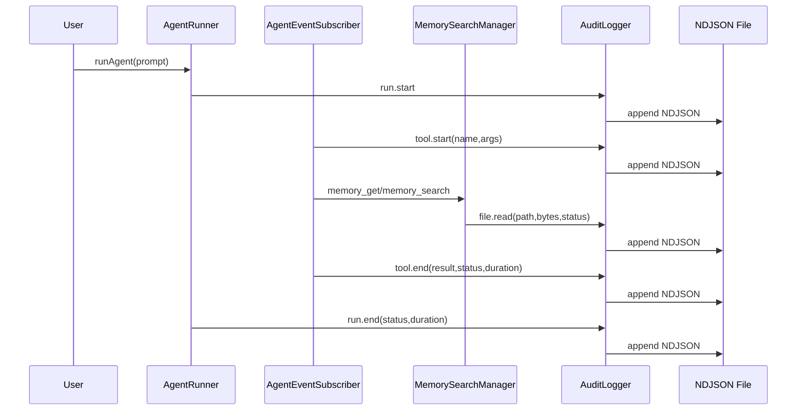

# 260223-s03-agent-audit-ndjson-tracing

## 1. 概要と目的 Overview and Purpose

- What
  AIエージェント実行の監査ログをアプリ層で追加し、以下をNDJSONとして永続化する。
  - どのツールを呼び出したか
  - ツールに渡した入力パラメーター
  - ツールの結果サマリー
  - どのファイルを read/write したか
- Why
  実行追跡性を確保し、デバッグ、障害解析、運用監査、再現性確認を可能にするため。
- How
  `AgentRunner` / `AgentEventSubscriber` / 主要I/Oモジュールにフックを追加し、共通の `AuditLogger` へイベントを集約する。保存形式は1行1イベントのNDJSONとし、機微情報はマスクして出力する。

## 2. 仕様と受け入れ条件 Specification and Acceptance Criteria

### 2.1 スコープ Scope

- 今回やること
  - 監査ログ出力機能を assistant runtime に追加する。
  - NDJSONライターを実装し、append-only で監査イベントを記録する。
  - ツール実行の `start/end` を記録する（ツール名、入力パラメーター、結果サマリー、成否、実行時間）。
  - ファイル read/write を記録する（対象パス、操作種別、バイト数、成否）。
  - 機微情報マスク（例: `token`, `apiKey`, `password`, `authorization`）を実装する。
  - 設定（有効/無効、出力先パス、最大記録サイズ）を runtime config に追加する。
  - 単体テスト・契約テストを追加する。
- 成果物
  - 新規: `src/assistant/audit-logger.ts`（または `src/assistant/audit/*`）
  - 変更: `src/runtime/app-runtime-config.ts`
  - 変更: `src/runtime/runtime-config-loader.ts`
  - 変更: `src/assistant/agent-runner.ts`
  - 変更: `src/assistant/agent-event-subscriber.ts`
  - 変更: `src/assistant/memory-reader.ts`
  - 変更: `src/assistant/memory-writer.ts`
  - 変更: `src/assistant/memory-search/manager.ts`
  - テスト: `tests/assistant/*` の関連ケース追加
- 制約
  - アプリ層のみで実現し、OS層トレース（strace等）は対象外。
  - Prototype First として既存監査基盤との互換維持より、明快な新契約を優先。
  - 実行本体への影響を最小化し、監査ログ失敗でエージェント実行を失敗させない。

### 2.2 非スコープ Non Scope

- 全Node.jsファイルI/Oの自動横取り（グローバルな `fs` monkey patch）。
- ツール結果の全文永続化（巨大/機微なpayloadの全面保存）。
- 監査ログの外部転送（S3/Datadog等）や検索UI。
- 改ざん検知チェーンや署名付き監査証跡。

### 2.3 ユースケース Use Cases

正常系:

1. ユーザーリクエストで `memory_search` が呼ばれた際、`tool.start` と `tool.end` が同一 `runId` で記録される。
2. `memory_get` が `workspace/memory/foo.md` を読んだ際、`file.read` がパスとバイト数付きで記録される。
3. `memory_write` が daily memory を更新した際、`file.write` が対象ファイルと書込サイズ付きで記録される。

重要な異常系:

1. 監査ログファイル書込みに失敗しても、エージェント応答自体は継続する（warn出力のみ）。
2. ツール引数に機密キーが含まれる場合、出力にはマスク済み値のみ残る。
3. ツール結果が大きい場合、規定サイズで切り詰めて `truncated=true` を記録する。

### 2.4 受け入れ条件 Acceptance Criteria

1. Given 監査ログ有効化済み When エージェント実行開始 Then `run.start` がNDJSONに1行追加される。
2. Given ツール呼び出し発生 When `tool_execution_start` を受信 Then ツール名とマスク済み入力パラメーターが保存される。
3. Given ツール呼び出し完了 When `tool_execution_end` を受信 Then 結果サマリー・成否・durationMs が保存される。
4. Given `memory_get` または `memory_search` がファイル読取を実行 When readFile成功 Then `file.read` がパス・bytes・runIdと紐付いて保存される。
5. Given `memory_write` がファイル更新を実行 When append/write成功 Then `file.write` がパス・bytes・runIdと紐付いて保存される。
6. Given 監査ログ書込みで `ENOENT` が発生 When append再試行 Then ディレクトリ再作成後に書込みが成功する。
7. Given `pnpm run check` When 実行 Then format/typecheck/test がすべて成功する。

### 2.5 既知の制約 Known Limitations

- 監査対象は今回フックしたモジュールに限定され、全I/Oを完全網羅しない。
- バイナリ書込みの差分内容は保持せず、サイズとメタデータのみ記録する。
- 監査ログはappend-onlyだが、改ざん耐性（署名/ハッシュチェーン）は未実装。

## 3. 前提技術スタック Context and Tech Stack

- Language Framework
  TypeScript 5.x, Node.js ESM
- Libraries
  既存 `node:fs/promises`, `node:path` を使用。新規依存は原則追加しない。
- Style Guide
  既存 ESLint / Prettier 設定に準拠。
- Runtime Deployment
  Assistant Gateway (`src/assistant/main.ts`) 上で動作。
- Testing
  既存 `node --test` + `tsx` ベース。`pnpm run check` を品質ゲートとする。

## 4. インターフェース契約 Interface Contracts

### 4.1 公開APIまたは外部I O一覧

- 環境変数（新規）
  - `ADJUTANT_AGENT_AUDIT_LOG_ENABLED` (`0|1`, default: `1`)
  - `ADJUTANT_AGENT_AUDIT_LOG_PATH` (default: `<stateDir>/audit/agent-audit.ndjson`)
  - `ADJUTANT_AGENT_AUDIT_MAX_FIELD_CHARS` (default: `4000`)
- 永続化ストレージ（新規）
  - NDJSON: `<stateDir>/audit/agent-audit.ndjson`
- 既存連携ポイント（変更）
  - `runAgent` 呼び出しフロー
  - `AgentEventSubscriber` のツールイベント処理
  - memory系 read/write 処理

### 4.2 データモデルとスキーマ

```ts
type AgentAuditEvent =
  | {
      schema: "adjutant.agent.audit.v1";
      type: "run.start" | "run.end";
      ts: string;
      runId: string;
      sessionKey: string;
      origin?: "user" | "pipeline" | "system";
      modelId?: string;
      status?: "ok" | "aborted" | "error";
      durationMs?: number;
      error?: string;
    }
  | {
      schema: "adjutant.agent.audit.v1";
      type: "tool.start" | "tool.end";
      ts: string;
      runId: string;
      sessionKey: string;
      toolName: string;
      toolCallId?: string;
      args?: unknown; // redact + truncate 済み
      resultSummary?: unknown; // redact + truncate 済み
      status?: "ok" | "error";
      durationMs?: number;
      truncated?: boolean;
    }
  | {
      schema: "adjutant.agent.audit.v1";
      type: "file.read" | "file.write";
      ts: string;
      runId: string;
      sessionKey: string;
      path: string;
      operation: "read" | "write";
      bytes?: number;
      status: "ok" | "error";
      error?: string;
    };
```

バリデーション方針:

- `runId`, `sessionKey`, `type`, `ts` は必須。
- シリアライズ不能値は文字列化して保存。
- 機密キーは再帰的にマスクしてから保存。
- `maxFieldChars` を超える文字列は末尾切り詰めし `truncated=true` を付与。

### 4.3 エラーと例外 Error Handling

- 監査ログ書込み失敗:
  - 本処理に影響させず `console.warn` のみ。
  - `ENOENT` は `mkdir(recursive)` 後に再試行。
- マスク/シリアライズ失敗:
  - 失敗フィールドのみ `"[[unserializable]]"` として置換。
- タイムアウト方針:
  - 明示タイムアウトは設けず、短時間append処理を前提。
- 個人情報/機微情報:
  - キー名ベースのマスクを必須化。
  - payload全文をデフォルト保存しない（サマリー優先）。

### 4.4 代表的な例 Examples

例1: ツール開始イベント

```json
{
  "schema": "adjutant.agent.audit.v1",
  "type": "tool.start",
  "ts": "2026-02-23T12:00:00.000Z",
  "runId": "r1",
  "sessionKey": "main",
  "toolName": "memory_search",
  "args": { "query": "release note", "apiKey": "***" }
}
```

例2: ファイル読取イベント

```json
{
  "schema": "adjutant.agent.audit.v1",
  "type": "file.read",
  "ts": "2026-02-23T12:00:00.150Z",
  "runId": "r1",
  "sessionKey": "main",
  "path": "memory/2026-02-23.md",
  "operation": "read",
  "bytes": 1820,
  "status": "ok"
}
```

例3: 実行終了イベント

```json
{
  "schema": "adjutant.agent.audit.v1",
  "type": "run.end",
  "ts": "2026-02-23T12:00:03.450Z",
  "runId": "r1",
  "sessionKey": "main",
  "status": "ok",
  "durationMs": 3450,
  "modelId": "gpt-5.4-mini"
}
```

## 5. アーキテクチャと設計図 Architecture and Diagrams

### 5.1 図の選択方針

- 複数モジュール（runtime/assistant/memory-search）を跨ぐためクラス図を必須とする。
- 非同期イベントの流れ（tool start/end と file I/O）を明確化するためシーケンス図を追加する。

### 5.2 クラス図 Class Diagram

```mermaid
classDiagram
  class AuditLogger {
    +append(event: AgentAuditEvent) Promise<void>
    +appendSafe(event: AgentAuditEvent) Promise<void>
  }

  class AuditSerializer {
    +redact(value: unknown): unknown
    +truncate(value: unknown, maxChars: number): {value: unknown, truncated: boolean}
  }

  class AgentRunner {
    +runAgent(opts): Promise<AgentRunResult>
  }

  class AgentEventSubscriber {
    +createAgentEventSubscriber(options): AgentEventSubscription
  }

  class AuditedMemoryIO {
    +readMemoryFiles(...)
    +appendDailyMemory(...)
    +updateLongTermMemory(...)
  }

  class MemorySearchManager {
    +readFile(...)
  }

  AgentRunner --> AuditLogger : run.start/run.end
  AgentEventSubscriber --> AuditLogger : tool.start/tool.end
  AuditedMemoryIO --> AuditLogger : file.read/file.write
  MemorySearchManager --> AuditLogger : file.read
  AuditLogger --> AuditSerializer : redact/truncate
```

### 5.3 その他の図 Optional



## 6. テスト戦略 Test Strategy

### 6.1 テストの種類

- Unit
  - `AuditSerializer` のマスク・truncate・非シリアライズ値処理。
  - `AuditLogger` の `ENOENT` 再試行と失敗時非致命挙動。
  - `AgentEventSubscriber` の tool start/end 監査イベント生成。
- Integration
  - `runAgent` 実行で `run.start` -> `tool.*` -> `run.end` がNDJSONに出ること。
  - `memory_write` 実行で `file.write` が記録されること。
  - `memory_get` 実行で `file.read` が記録されること。
- Contract
  - NDJSON 1行ごとに `schema/type/ts/runId/sessionKey` 必須。
  - 機密キーが `***` に置換されること。

### 6.2 カバレッジ対象

- 重要ロジック
  - イベント整形、マスク、サイズ制限、append再試行。
- エラー分岐
  - `ENOENT`、JSONシリアライズ失敗、監査書込み失敗時のwarn。
- 境界条件
  - 空引数、巨大payload、unknown型、silent turn。

## 7. 実装タスクリスト Implementation Plan

### Phase 1 設計と準備

- [x] 要件と仕様の確定 受け入れ条件の確定
- [x] インターフェース契約の確定 スキーマと例の追加
- [x] Mermaid図の作成 更新
- [x] インターフェース 型定義の作成
- [x] テスト基盤の確認（`tests/assistant` 既存流儀に合わせる）

### Phase 2 ツール監査ログの実装

- [x] Test `AgentEventSubscriber` の失敗するテストを作成（tool.start/tool.end未出力を再現）Red
- [x] Impl `agent-event-subscriber` に監査ロガー連携を追加しテストを通す Green
- [x] Refactor ツールイベント整形とマスク処理を `AuditSerializer` へ集約
- [x] Integration `runAgent` 経由で `run.start/tool.start/tool.end/run.end` 出力の統合テスト追加
- [x] Docs 契約と例を更新

### Phase 3 ファイルI/O監査ログの実装

- [x] Test `memory-reader` / `memory-writer` / `memory-search manager` の失敗するテストを追加 Red
- [x] Impl file.read/file.write 監査フックを追加してテストを通す Green
- [x] Refactor I/O監査の共通ヘルパー化（path/bytes/status整形）
- [x] Integration 実ファイルでNDJSON出力を確認する統合テストを追加
- [x] Docs 制約と運用手順（有効化env・保存先）を更新

### Phase 4 統合と検証

- [x] 全体テストの実行（`pnpm run check`）
- [x] エッジケースの動作確認（巨大params、機密キー、書込み失敗）
- [x] ログと例外の確認（監査失敗時に本処理継続するか）
- [x] ドキュメント更新（仕様 契約 図）

## 8. 完了の定義 Definition of Done

### 8.1 機能DoD Functional DoD

- [x] 受け入れ条件がすべて満たされていること
- [x] 既知の制約が明文化され、想定通りであること
- [x] 契約例に対してNDJSON出力が期待通りであること

### 8.2 品質DoD Quality DoD

- [x] 全てのテストがパスしていること
- [x] Linter Formatterのエラーがないこと
- [x] 不要なデバッグコードが削除されていること
- [x] 主要な変更点がドキュメントに反映されていること

## 9. 懸念事項と未確定事項 Concerns and Questions

- デフォルト有効化（`enabled=1`）が望ましいか。運用負荷を考えると初期は有効で妥当だが、必要なら `0` を既定値に切替可能。
- 監査ログの保存期間とローテーション方針は未定（サイズ肥大化リスクあり）。
- `file.read/write` の対象範囲は今回「主要assistantモジュール」に限定。全I/Oの完全網羅は将来拡張。
- ツール結果の保存粒度（全文/サマリー）は機微性とのトレードオフがあるため、初期はサマリー中心で運用する。
