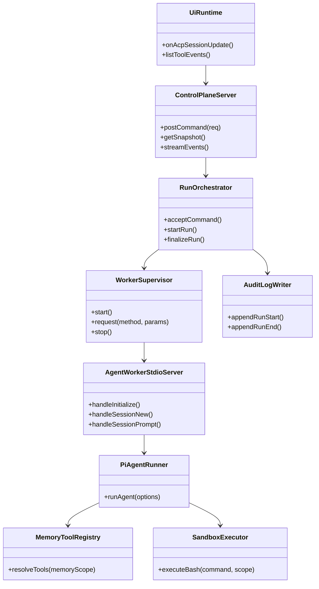
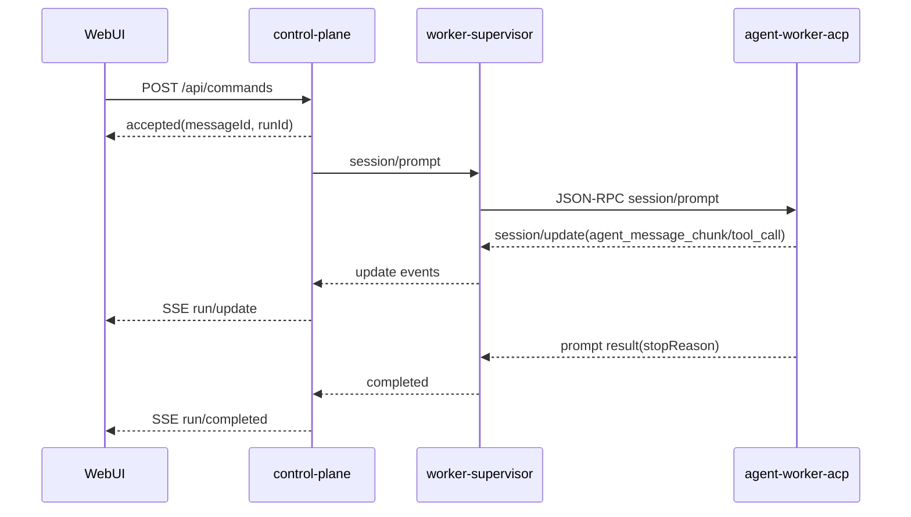

# 260228-s04: Phase A/B 実装計画（pi-coding-agent + WebUI + memory/audit/sandbox）

## 0. Core Principles

- Prototype First: まず WebUI から `pi-coding-agent` と対話できる導線を最短で成立させる。後方互換より現行 ACP 構成での成立性を優先する。
- Legacy Migration First: Phase A/B は新規スクラッチではなく、`legacy/impl-20260228` の実装を責務単位で移植することを前提とする。
- SOLID: `control-plane` / `agent-worker-acp` / `ui` の責務境界を固定し、I/O 契約を型で分離する。
- KISS: Phase A/B に必要な API とイベントだけを実装し、collector/proactive は後続フェーズへ分離する。
- YAGNI: Slack 本移植、高度な運用自動化、分散実行は今回入れない。
- DRY: 既存 `src/contracts/*` と `src/runtime/*` を再利用し、重複スキーマや独自 JSON-RPC 実装を増やさない。

## 1. 概要と目的 Overview and Purpose

- What
  - Phase A: `session/prompt` を `pi-coding-agent` 実実装へ接続し、WebUI から run 実行と `accepted -> update -> completed` を確認できるようにする。
  - Phase B: `memory_search` / `memory_get`（`memoryScope=main`）と `memory_write`（`memoryWriteEnabled=true`）、markdown summary batch、agent audit、docker sandbox、workspace bootstrap、pre-compaction memory flush を再導入する。
  - 上記は `legacy/impl-20260228` に存在する同等機能を、ACP 分離後構成へ移植して成立させる。
- Why
  - 開発速度を落とす最大ボトルネックは「対話不能な実装」であるため、先に対話導線を完成させる。
  - 次にツール利用可能性（memory/sandbox）と運用可観測性（audit）を入れることで、実運用に近い検証が可能になる。
- How
  - `src/index.ts` を control-plane の唯一の listen エントリポイントとし、HTTP/SSE API と run 管理を起動する。
  - `src/index.ts` で worker supervisor を起動し、worker entry は `src/agent-worker-acp/stdio-server.ts` を利用する。
  - `agent-worker-acp` で `runAgent` スタブを廃止し `@mariozechner/pi-coding-agent` へ委譲。
  - `ui` は SSE を購読し run 状態・tool event・audit を表示。
  - memory/sandbox/bootstrap/compaction は既存 legacy 実装を責務単位で移植する。
  - 移植単位は「機能契約 + テストケース + 実装」の 3 点セットで揃え、差分は `doc/spec/README.md` 配下の詳細仕様に同期する。

## 2. 仕様と受け入れ条件 Specification and Acceptance Criteria

### 2.1 スコープ Scope

- 今回やること
  - Phase A
    - `control-plane` HTTP API: `POST /api/commands`, `GET /api/snapshot`, `GET /api/events/stream`
    - worker supervisor と ACP セッション管理の統合
    - `session/load` を用いたセッション復帰導線（capability 有効時）
    - `session/prompt` の `pi-coding-agent` 実接続（スタブ廃止）
    - `session/update` の `tool_call` / `tool_call_update` を WebUI 表示・履歴保存へ連携
    - WebUI リロード時に、保存済みツール使用履歴を復元表示
    - WebUI 最小対話画面（入力、ストリーム表示、run 状態、エラー表示）
  - Phase B
    - `memory_search` / `memory_get`（`memoryScope=main`）と `memory_write`（`memoryWriteEnabled=true`）のツール実装
    - markdown summary batch（session transcript -> Markdown memory 要約反映 + watermark）
    - docker sandbox 実行 (`ADJUTANT_SANDBOX_MODE=non-main|all`)
    - agent audit ログ記録と UI 参照
    - workspace bootstrap / BOOTSTRAP context 注入
    - pre-compaction memory flush + context compaction 連動
- 成果物
  - 実装コード（`src/control-plane/*`, `src/assistant/*`, `src/ui/*`, `src/agent-worker-acp/*`）
  - 単体/契約/統合テスト
  - `doc/spec/README.md` 配下の実装済み項目同期
  - legacy 移植マッピング（移植元ファイルと移植先責務の対応表）
- 制約
  - 単一ホスト、at-least-once 前提
  - FS capability は v1 非スコープ（無効固定）
  - Phase A/B では collector-slack 本移植を行わない
  - 移植元は `legacy/impl-20260228/src` を正とし、同等機能の契約を維持したうえで現行構成へ再配置する
  - ACP/Process RPC/HTTP の境界契約は `doc/spec/acp-architecture.md` を正として実装する
  - `session/list` は unstable method のため、既定無効・feature flag 有効時のみ提供する

### 2.2 非スコープ Non Scope

- collector-slack 本移植（Slack CDP 接続、SlackAdapter、DOM capture など）
- proactive / heartbeat の再導入
- DLQ UI、分散キュー（Kafka/NATS）、マルチホスト運用
- terminal gateway の追加プロトコル拡張
- collector/deliver の実プロセス起動を伴う Process RPC E2E（Phase A/B では型/契約テストのみ）

### 2.3 ユースケース Use Cases

- 正常系1: WebUI ユーザーがメッセージ送信し、run が完了する
  - API が `accepted` を返し、SSE で `session/update` が流れ、最終 `completed` が表示される
- 正常系2: `memoryScope=main` セッションで memory search/get を実行する
  - `memory_search` / `memory_get` が利用可能で結果が返る
- 正常系2-b: `memoryWriteEnabled=true` の run で memory write を実行する
  - `memory_write` が利用可能で日次/長期 memory へ反映される
- 正常系3: `memoryScope!=main` セッションで sandbox 実行する
  - `ADJUTANT_SANDBOX_MODE=non-main|all` に応じて Docker 経由で bash が実行される
- 正常系5: markdown summary batch が session transcript を反映する
  - watermark を進めつつ日次/長期 memory への要約追記が行われる
- 正常系4: WebUI をリロードしてもツール履歴が残る
  - 初期取得 (`GET /api/snapshot`) で過去 run のツールイベントが復元される
- 異常系1: worker がクラッシュする
  - supervisor が再起動し、run は `failed` として確定される
- 異常系2: `memoryScope!=main` セッションで memory search/get を呼ぶ
  - ツールは未登録で呼び出せず、`UNSUPPORTED_CAPABILITY` 相当の失敗として扱われる

### 2.4 受け入れ条件 Acceptance Criteria

1. Given WebUI が起動済み and worker が正常
   When ユーザーが `POST /api/commands` で prompt を送る
   Then `accepted` 応答後に SSE で更新が流れ、最終状態が `completed` になる
2. Given worker が異常終了
   When run 実行中に supervisor がクラッシュを検知する
   Then run は `failed` で確定し、再起動ログと失敗理由が記録される
3. Given 既存 `sessionId` と `session/load` capability が有効
   When control-plane が復帰処理を実行する
   Then worker は既存 session を再利用し、run 継続時に新規 `session/new` を必須としない
4. Given `memoryScope=main`
   When agent が memory search/get を必要とする
   Then `memory_search` / `memory_get` が利用可能で、結果が tool event として観測できる
5. Given `memoryScope!=main`
   When `memory_search` / `memory_get` を要求する prompt を実行する
   Then `memory_search` / `memory_get` は利用不可のままで、run 全体はクラッシュしない
6. Given `memoryWriteEnabled=true`
   When agent が `memory_write` を必要とする
   Then `memory_write` が利用可能で、日次/長期 memory への反映が行われる
7. Given `memoryWriteEnabled=false`
   When agent が `memory_write` を要求する prompt を実行する
   Then `memory_write` は未登録のままで、run 全体はクラッシュしない
8. Given sandbox mode が `non-main`
   When `memoryScope!=main` セッションで bash ツールを実行する
   Then Docker コンテナ内で実行され、許可された範囲の結果が返る
9. Given long context で compaction 閾値近傍
   When run を実行する
   Then pre-compaction memory flush が先行し、compaction 後も run が継続できる
10. Given `OPENAI_API_KEY` など必要設定が有効
    When `session/prompt` を実行する
    Then `src/assistant/agent-runner.ts` のスタブ応答ではなく、`pi-coding-agent` の実応答が `session/update` と最終 `stopReason` で返る
11. Given run 中にツール呼び出しが発生する
    When worker が `session/update` (`tool_call`, `tool_call_update`) を通知する
    Then WebUI でリアルタイム表示され、run 履歴として再取得可能な形で保存される
12. Given 過去 run にツール使用履歴が保存済み
    When WebUI をリロードして初期データを再取得する
    Then 過去 run のツール使用履歴が一覧表示される
13. Given summary batch の実行対象 transcript が存在する
    When batch service を 1 回実行する
    Then Markdown memory への追記と watermark 更新が成功し、次回実行で重複追記しない

### 2.5 既知の制約 Known Limitations

- Phase A/B 完了時点では Slack 由来イベントの本番取り込みは未対応。
- memory 検索品質は埋め込みモデルと `sqlite-vec` 可用性に依存する。
- `ADJUTANT_SANDBOX_MODE=non-main|all` で Docker 初期化に失敗した場合は fail-closed（起動失敗）となる。

## 3. 前提技術スタック Context and Tech Stack

- Language Framework
  - TypeScript (ESM), Node.js ランタイム
  - React (`src/ui`) + Vite
- Libraries
  - `@mariozechner/pi-coding-agent`
  - `@assistant-ui/react`
  - `sqlite-vec`
- Style Guide
  - ESLint + Prettier（既存設定準拠）
- Runtime Deployment
  - 単一ホストのローカル実行
  - worker は stdio JSON-RPC で `control-plane` と接続
- Testing
  - Node.js built-in test runner (`node --test` via `tsx`)
  - Unit / Contract / Integration を `tests/` で維持

## 4. インターフェース契約 Interface Contracts

### 4.1 公開APIまたは外部I O一覧

- HTTP API (`control-plane`)
  - `POST /api/commands`
  - `GET /api/snapshot`（run 一覧・tool event 履歴を含む）
  - `GET /api/events/stream` (SSE)
- ACP (`control-plane` <-> `agent-worker-acp`)
  - `initialize`, `session/new`, `session/prompt`, `session/cancel`, `session/update`
  - `authenticate`（stable optional。既存実装維持）
  - `session/load`（stable optional。`ACP_ENABLE_LOAD_SESSION=1` で有効）
  - `session/list`（unstable optional。`enableUnstableSessionMethods=true` のときのみ有効）
- 設定
  - `ADJUTANT_SANDBOX_MODE`
  - `ADJUTANT_MEMORY_SEARCH_*`
  - `ACP_ENABLE_LOAD_SESSION`
  - `ADJUTANT_MARKDOWN_SUMMARY_BATCH_*`
- 永続化
  - journal/cursor ファイル（tool event 履歴の正本を含む）
  - audit ログ（運用監査用途。履歴復元の正本ではない）
  - memory index (`<stateDir>/memory/<agentId>.sqlite`)
- 外部サービス
  - OpenAI API（memory embedding / agent モデル）
  - Docker daemon（sandbox）
  - `@mariozechner/pi-coding-agent` SDK（agent 実行ランタイム）

### 4.2 データモデルとスキーマ

- CommandRequest (HTTP)
  - `{ sessionKey: string; message: string; runId?: string; idempotencyKey?: string }`
- AcceptedResponse (HTTP)
  - `{ messageId: string; status: "accepted"; acceptedAt: string; runId: string }`
- StreamEvent (SSE)
  - `run/accepted | run/update | run/completed | run/failed | permission/requested | permission/resolved`
- StreamEvent 命名規約
  - Phase A/B では ACP 内部型に合わせて `/` 区切りを固定採用する（例: `permission/requested`）
  - SSE 側で別記法への変換は行わない（internal/external を同一命名に統一）
- SnapshotResponse (HTTP)
  - `{ runs: RunSummary[]; toolEventsByRun: Record<string, ToolEventRecord[]>; pendingPermissions: PermissionSummary[] }`
- RunSummary (HTTP)
  - `{ runId: string; sessionKey: string; sessionId?: string; status: "accepted"|"running"|"completed"|"failed"|"cancelled"; acceptedAt: string; startedAt?: string; finishedAt?: string; stopReason?: string; errorCode?: string; errorMessage?: string }`
- PermissionSummary (HTTP)
  - `{ requestId: string; sessionId: string; runId?: string; toolCallId?: string; title: string; requestedAt: string }`
- SessionRecoveryState (internal)
  - `{ sessionKey: string; sessionId: string; lastRunId?: string; updatedAt: string }`
  - `session/new` 直後は `lastRunId` 未設定を許容し、最初の terminal run 確定時に更新する
- SessionScopeState (internal)
  - `{ sessionKey: string; memoryScope: "main" | "spoke" }`
  - `memoryScope` は session metadata から解決し、tool gating/sandbox 判定は `sessionKey` ではなく `memoryScope` を正として行う
- ToolEventRecord (internal)
  - `{ runId: string; sessionId: string; toolCallId: string; status: "pending"|"in_progress"|"completed"|"failed"; title?: string; kind?: string; updatedAt: string }`
- RunTerminalRecord (internal)
  - `{ runId, sessionKey, actionType: "assistant_final"|"assistant_aborted"|"assistant_error", ts, reason? }`
- Memory tool registration rule
  - `memoryScope === "main"` のときのみ `memory_search`/`memory_get` を custom tools に追加
  - `memory_write` は legacy 互換の `memoryWriteEnabled` 判定（run context）で有効化し、無効時は tool event を監査対象から除外する
- pendingPermissions のデータソース
  - 正本は `PermissionGateway` (`listPending`) とし、`GET /api/snapshot` は gateway から都度構築する
  - `PermissionRegistry` の `createdAt` は API 応答で `requestedAt` へ正規化して返す（フィールド名差異は control-plane で吸収）
  - `UiRuntime.pendingPermissionById` は SSE 即時反映用の投影であり、リロード時は snapshot 値で再同期する

### 4.3 エラーと例外 Error Handling

- エラー分類
  - `INVALID_REQUEST`, `UNSUPPORTED_CAPABILITY`, `ACP_PROTOCOL_ERROR`, `JOURNAL_APPEND_FAILED`, `WORKER_TIMEOUT`, `WORKER_CRASHED`, `DOWNSTREAM_ERROR`, `INVALID_RECORD`
- リトライ方針
  - worker crash は supervisor が指数バックオフで再起動（上限あり）
  - HTTP リクエスト自体の自動再試行は行わない（idempotencyKey で重複吸収）
- タイムアウト方針
  - `session/prompt` は run timeout を設定し、超過時 `failed` へ遷移
- sandbox 障害方針（`doc/spec/sandbox.md` 準拠）
  - `ADJUTANT_SANDBOX_MODE=non-main|all` で Docker 初期化不可の場合は fail-closed で起動を中断する
  - sandbox 実行時エラーは当該 tool call を失敗として返し、ホスト実行へフォールバックしない
  - `ADJUTANT_SANDBOX_MODE=off` のときのみ従来のホスト実行を許可する
- ログ方針と個人情報
  - 構造化ログで `runId/sessionKey/messageId` を必須出力
  - prompt 生文・機微情報は audit でマスク方針を適用
- run 終端冪等
  - `RunTerminalRecord` は `runId` 主キーで冪等更新し、`completed` を `failed` より優先する
  - 優先規則は `src/control-plane/deliver-completion-store.ts` と同系統を採用するが、責務混在を避けるため実体ストアは分離する

### 4.4 pi-coding-agent 統合契約

- 実装対象（必須）
  - `src/assistant/agent-runner.ts` をスタブから実ランナーへ置換
  - `legacy/impl-20260228/src/assistant/agent-session-factory.ts` をベースに、最小構成で移植
- セッション初期化契約
  - `AuthStorage` / `ModelRegistry` / `SettingsManager.inMemory()` を構成
  - `createAgentSession()` で `cwd`, model, tools を設定
  - 失敗時は `DOWNSTREAM_ERROR` として run を `failed` 確定
- ストリーミング契約
  - モデル出力テキストは `callbacks.onTextDelta` -> `session/update(agent_message_chunk)` へ変換
  - ツール開始/終了は `callbacks.onToolCall` -> `tool_call` / `tool_call_update` へ変換
  - 最終応答は `AgentRunResult.stopReason` を返し `normalizeStopReason()` で ACP 準拠値に正規化
- キャンセル契約
  - `session/cancel` 受信時は `AbortController` + session dispose で prompt 実行を中断
  - 中断時の最終 `stopReason` は `cancelled`
- セッション復帰契約
  - control-plane は `sessionKey -> sessionId` を保持し、再接続時に `session/load` を優先利用する
  - `session/load` 不可（capability 無効/未対応）時は `session/new` へフォールバックする
  - `session/list` は運用補助 API とし、unstable gate 有効時のみ利用する
  - 永続化の正本は `<stateDir>/journal/control-plane/session-recovery.jsonl`（append-only）とし、`SessionRecoveryState` の upsert イベントを追記する
  - 起動高速化のため `<stateDir>/cursor/control-plane.session-recovery.snapshot.json` を materialized snapshot として保持し、起動時は `snapshot -> journal replay` 順で再構築する
  - 更新タイミングは `session/new` 成功時・`session/load` 成功時・run terminal（`completed|failed|cancelled`）確定時とする
  - `session/new` / `session/load` 時点では `lastRunId` を更新せず、既知の run がある場合のみ維持する
  - 破損時復旧は「最終有効 JSONL 行まで truncate + snapshot 再生成」を行い、復旧不能時は空マップで起動して `session/new` フォールバックを許可する
  - 上記は `doc/spec/storage.md`（journal/cursor/冪等）に合わせ、cursor commit を terminal 確定後に限定する
- ツール通知契約 (`session/update`)
  - `tool_call` / `tool_call_update` を `ToolEventBridge` で集約し、run 単位で重複排除する
  - WebUI 表示と永続履歴に同一レコードを利用し、正本は journal（`tool-events`）へ append する
  - audit には運用監査目的で mirror するが、`GET /api/snapshot` の復元元には使わない
  - `GET /api/snapshot` で最新状態を再構築できるよう、tool event 履歴を run 単位で返却する
- ツール登録契約（Phase B）
  - `memoryScope === \"main\"` のときのみ `memory_search` / `memory_get` を custom tools に追加
  - `memory_write` は `memoryWriteEnabled=true` の run のみ登録し、write 実体は daily/long-term Markdown へ反映する
  - sandbox mode が有効で対象セッションのとき、`bash` ツールを Docker 実行へ差し替える
  - sandbox 初期化は `control-plane` 起動時に実施し（Docker daemon 確認 / image 確保 / container 確保）、worker には実行設定を注入する
- markdown summary batch 契約（Phase B）
  - `legacy/impl-20260228/src/assistant/markdown-summary-batch.ts` を移植し、session transcript を source に watermark ベースで増分処理する
  - checkpoint は `<stateDir>/agents/<agentId>/summary-batch-watermark.json` を正本とする
  - batch 実行は idempotent（同一 offset の重複追記なし）であることを要件化する
- 最低限の設定契約
  - 必須: `OPENAI_API_KEY`（利用モデル要件に従う）
  - 任意: `ADJUTANT_MODEL`, `ADJUTANT_MEMORY_SEARCH_*`, `ADJUTANT_SANDBOX_MODE`
  - pre-compaction 閾値の初期値は `doc/spec/configuration.md` の既定値を採用（`ADJUTANT_COMPACTION_RESERVE_TOKENS_FLOOR=20000`, `ADJUTANT_MEMORY_FLUSH_SOFT_THRESHOLD_TOKENS=4000`）
- 移植元参照（実装根拠）
  - session factory: `legacy/impl-20260228/src/assistant/agent-session-factory.ts`
  - 実行フロー: `legacy/impl-20260228/src/assistant/agent-runner.ts`
  - compaction: `legacy/impl-20260228/src/assistant/compaction-runtime.ts`
  - summary batch: `legacy/impl-20260228/src/assistant/markdown-summary-batch.ts`

### 4.5 代表的な例 Examples

```bash
curl -sS -X POST http://127.0.0.1:3100/api/commands \
  -H 'content-type: application/json' \
  -d '{"sessionKey":"main","message":"hello"}'
```

```json
{
  "messageId": "msg_001",
  "status": "accepted",
  "acceptedAt": "2026-02-28T10:00:00.000Z",
  "runId": "session:main:run:1"
}
```

```bash
curl -N http://127.0.0.1:3100/api/events/stream
```

```text
event: run/update
data: {"runId":"session:main:run:1","delta":"hello"}
```

### 4.6 詳細仕様準拠ルール

- 準拠元
  - `doc/spec/acp-architecture.md` 境界契約
  - `doc/spec/acp-architecture.md` Capability Gate 相当の worker 境界 / method 方針
  - `doc/spec/acp-architecture.md` エラー分類と回復
- ACP（control-plane <-> worker）
  - Baseline は `initialize`, `session/new`, `session/prompt`, `session/cancel`, `session/update` を必須実装とする
  - optional stable の `authenticate` は既存実装を維持し、互換性を崩さない
  - optional stable の `session/load` は Phase A で実装対象とする
  - optional unstable の `session/list` は既定無効で、feature flag 有効時のみ許可する
- Process RPC / HTTP
  - `collector/ingest`, `deliver/enqueue`, `deliver/completed` と `POST /api/commands`, `GET /api/snapshot`, `GET /api/events/stream` の契約を維持する
  - Phase A/B では Process RPC は「型/スキーマ/contract test」のみを担保し、collector/deliver 実プロセスの起動経路 E2E は対象外とする
- エラー契約
  - `UNSUPPORTED_CAPABILITY`, `ACP_PROTOCOL_ERROR`, `JOURNAL_APPEND_FAILED`, `WORKER_TIMEOUT`, `WORKER_CRASHED`, `DOWNSTREAM_ERROR`, `INVALID_RECORD` を識別可能な形で返す
  - worker 異常終了時は supervisor 再起動と構造化ログ記録を必須とする
- 検証方針
  - vendor ACP schema と `doc/spec/acp-architecture.md` 境界契約の双方に対して contract test を実施し、差分を検知する

## 5. アーキテクチャと設計図 Architecture and Diagrams

### 5.1 図の選択方針

- 本計画は `control-plane` / `worker` / `ui` / 外部I/O を跨ぐためクラス図を必須とする。
- 非同期更新（SSE, ACP）が主要なのでシーケンス図を併記する。
- プロセス境界の基準図は `doc/spec/system-overview.md` を正とする（[システム構成図](../../spec/system-overview.md)）。

### 5.2 クラス図 Class Diagram



### 5.3 その他の図 Optional



### 5.4 起動導線と責務配置 Runtime Bootstrap

- `src/index.ts`（control-plane entry）
  - `main()` で `ControlPlaneServer` を生成し `listen` を開始する唯一の入口
  - 起動時に `WorkerSupervisor.start()`、`UiRuntime`、`PermissionGateway`、journal/cursor ストアを初期化
  - `web-ui` は同一プロセスで配信する（`/` を control-plane でホストし、HTTP/SSE API と同居）
  - shutdown hook（SIGINT/SIGTERM）で supervisor stop と flush を実行
- `src/agent-worker-acp/stdio-server.ts`（worker entry）
  - ACP stdio server のみ起動し、HTTP listen は持たない
  - `initialize/session/*` を処理し、`session/update` を通知
- 配置方針
  - HTTP/SSE ルーティングは `src/control-plane/http/*`
  - worker 起動/監視は `src/control-plane/worker-supervisor/*`
  - 起動配線は `src/control-plane/bootstrap/*` に集約し、`src/index.ts` は composition root のみ担当

## 6. テスト戦略 Test Strategy

### 6.1 テストの種類

- Unit
  - run state machine、memory tool gating、sandbox mode 判定、audit writer
- Integration
  - HTTP API <-> worker supervisor <-> ACP stdio
  - WebUI runtime の SSE 追従
  - sandbox 実行経路（Docker 可用時）
- Contract
  - ACP schema validation
  - Process RPC validation
  - HTTP request/response schema
  - `doc/spec/acp-architecture.md` 準拠テスト（baseline methods, capability gate, error taxonomy）

### 6.2 カバレッジ対象

- 重要ロジック
  - `accepted -> update -> completed|failed` の状態遷移
  - `memoryScope=main` 条件での `memory_search` / `memory_get` 有効化
  - `memoryWriteEnabled=true` 条件での `memory_write` 有効化
  - summary batch の watermark 進行と重複追記防止
- エラー分岐
  - worker timeout / crash / protocol mismatch
  - sandbox unavailable
- 境界条件
  - 空入力、重複 idempotencyKey、run cancel、長文 prompt

### 6.3 実 API 依存テストと WebUI テスト粒度

- 実 API 依存（`OPENAI_API_KEY` 必須）テスト方針
  - `pnpm check` では外部 API 非依存テストのみ実行し、`OPENAI_API_KEY` 必須テストは既定 skip とする
  - 実 API 検証は `pnpm run test:live-agent`（別ジョブ）で実行し、CI では secret 設定済み job のみ有効化する
  - 通常統合テストは runner mock/stub で `session/update` と `stopReason` 契約を検証し、ライブ接続の不安定性を分離する
- WebUI テスト粒度
  - 必須: `UiRuntime` の統合テスト（SSE event ingest, snapshot hydrate, pendingPermissions 再同期）
  - 必須: React コンポーネントの最小 smoke test（送信、ツール履歴、pending permission 表示）を RTL で追加
  - 任意: 見た目回帰（visual regression）は Phase A/B のスコープ外

## 7. 実装タスクリスト Implementation Plan

### Stage 1 設計と準備

- [x] `Task-AB-000` legacy 移植マッピング表の作成（保存先: `doc/plan/artifacts/260228-s04-legacy-mapping.md`、形式: `移植元|移植先|契約ID|差分|テストID|状態` テーブル、完了条件: Phase A/B 対象責務を 100% 網羅）
- [x] `Task-AB-001` インターフェース契約の確定（HTTP/SSE/ACP 境界、エラーコード、run 状態、イベント命名規約）
- [x] `Task-AB-002` Mermaid 図を `doc/spec/system-overview.md` と本計画に同期
- [x] `Task-AB-003` 型定義の追加（`src/control-plane/contracts/*.ts` 予定）
- [x] `Task-AB-004` テスト基盤確認（`tests/integration`, `tests/contract`, `tests/unit` の雛形更新）
- [x] `Task-AB-005` `doc/spec/acp-architecture.md` を実装チェックリスト化（必須/任意/非スコープ）
- [x] `Task-AB-006` 実 API 依存テストの CI 実行方針を確定（default job では skip、secret job で live 実行）
- [x] `Task-AB-007` `package.json` に `test:live-agent` スクリプトを追加し、`OPENAI_API_KEY` 未設定時は skip で終了する実行ラッパを整備

### Stage 2 機能Aの実装（pi-coding-agent + WebUI 対話）

- [x] `Task-A-RED-000` Test: `src/index.ts` 起動で HTTP listen と worker supervisor 起動が同時に成立する失敗テスト作成
- [x] `Task-A-RED-001` Test: `POST /api/commands` -> `accepted` -> SSE 更新 -> `completed` の失敗テスト作成
- [x] `Task-A-RED-002` Test: `runAgent` が prompt エコーではなく外部ランナー呼び出しになることを失敗テストで固定
- [x] `Task-A-RED-003` Test: `session/load` 利用時に既存 session を復帰できることの失敗テスト作成
- [x] `Task-A-RED-004` Test: `session/update` の `tool_call` / `tool_call_update` が UI 表示・履歴へ反映される失敗テスト作成
- [x] `Task-A-RED-005` Test: WebUI リロード後に `GET /api/snapshot` から過去ツール履歴を復元表示できる失敗テスト作成
- [x] `Task-A-RED-006` Test: session recovery 永続化（journal/snapshot/replay）と破損復旧の失敗テスト作成
- [x] `Task-A-RED-007` Test: `pendingPermissions` が `PermissionGateway` 正本から snapshot 復元される失敗テスト作成
- [x] `Task-A-GREEN-000` Impl: `src/index.ts` を control-plane composition root として実装（listen + supervisor 起動 + shutdown hook）
- [x] `Task-A-GREEN-001` Impl: `control-plane` API サーバーと run orchestrator 最小実装
- [x] `Task-A-GREEN-002` Impl: `PiAgentSessionFactory`（仮名）を追加し `createAgentSession` 初期化を実装
- [x] `Task-A-GREEN-003` Impl: `src/assistant/agent-runner.ts` を `pi-coding-agent` 実接続へ置換（stream/cancel/stopReason）
- [x] `Task-A-GREEN-004` Impl: `sessionKey -> sessionId` 永続化（journal + snapshot）と `session/load` 復帰フローを実装
- [x] `Task-A-GREEN-005` Impl: `src/ui` に最小対話画面（送信、更新表示、完了状態、ツール通知）を実装
- [x] `Task-A-GREEN-006` Impl: `GET /api/snapshot` に `toolEventsByRun` を実装し、UI 初期化時に履歴を hydrate
- [x] `Task-A-GREEN-007` Impl: `GET /api/snapshot.pendingPermissions` を `PermissionGateway.listPending()` から構築
- [x] `Task-A-REFACTOR-001` Refactor: run 状態管理、エラー整形、イベント配信の責務分離
- [x] `Task-A-INTEG-001` Integration: worker crash/timeout の回復テストを追加
- [x] `Task-A-INTEG-002` Integration: mock runner で `session/prompt` 実行時の `agent_message_chunk` と最終 `stopReason` を検証
- [x] `Task-A-INTEG-003` Integration: `session/load` 復帰と `tool_call` 履歴再取得を検証
- [x] `Task-A-INTEG-004` Integration: ページリロード相当の再初期化で過去ツール履歴が表示されることを検証
- [x] `Task-A-INTEG-005` Integration: WebUI コンポーネント smoke test（RTL）で送信・ツール履歴・pending permission 表示を検証
- [x] `Task-A-CONTRACT-001` Contract: baseline ACP methods と capability gate が `doc/spec/acp-architecture.md` と一致することを検証
- [x] `Task-A-CONTRACT-002` Contract: SSE `StreamEvent` 名が ACP 命名規約（`/` 区切り）と完全一致することを検証
- [x] `Task-A-CONTRACT-003` Contract: Process RPC は schema/型適合のみ検証し、collector/deliver 実経路 E2E を含めないことを固定
- [x] `Task-A-DOCS-001` Docs: API/SSE 例と `pi-coding-agent` 必須設定を `doc/spec/assistant-runtime.md` / `doc/spec/acp-architecture.md` / `doc/spec/configuration.md` に反映

### Stage 3 機能Bの実装（memory/audit/sandbox + bootstrap/compaction）

- [x] `Task-B-RED-001` Test: `memoryScope=main` のみ `memory_search`/`memory_get` が有効である失敗テスト作成
- [x] `Task-B-RED-002` Test: `memory_get` の path-guard（allowlist/workspace 内/symlink 拒否）の失敗テスト作成
- [x] `Task-B-RED-007` Test: `memory_write` の有効/無効条件（`memoryWriteEnabled`）と Markdown 反映の失敗テスト作成
- [x] `Task-B-RED-003` Test: `ADJUTANT_SANDBOX_MODE=off|non-main|all` の分岐と fail-closed 動作の失敗テスト作成
- [x] `Task-B-RED-004` Test: agent audit（run/tool）記録と API 参照の失敗テスト作成
- [x] `Task-B-RED-005` Test: workspace bootstrap / BOOTSTRAP context 注入条件の失敗テスト作成
- [x] `Task-B-RED-006` Test: pre-compaction memory flush + context compaction 連動の失敗テスト作成
- [x] `Task-B-RED-008` Test: markdown summary batch の watermark 増分処理と重複回避の失敗テスト作成
- [x] `Task-B-GREEN-001` Impl: memory ツール登録（`memoryScope` 基準）と sqlite index 接続
- [x] `Task-B-GREEN-006` Impl: `memory_get` path-guard（allowlist + workspace 内 + symlink 拒否）実装
- [x] `Task-B-GREEN-007` Impl: `memory_write` ツールと daily/long-term Markdown 更新処理を移植
- [x] `Task-B-GREEN-002` Impl: sandbox executor と `ADJUTANT_SANDBOX_MODE` 連携
- [x] `Task-B-GREEN-003` Impl: agent audit 記録と UI 参照 API
- [x] `Task-B-GREEN-004` Impl: workspace bootstrap / BOOTSTRAP context 注入
- [x] `Task-B-GREEN-005` Impl: pre-compaction memory flush + context compaction 連動（初期閾値は spec 既定値）
- [x] `Task-B-GREEN-008` Impl: markdown summary batch service（runOnce + watermark 保存 + transcript 増分読込）を移植
- [x] `Task-B-REFACTOR-001` Refactor: Phase B 機能の cross-cutting concern（設定、ログ、例外処理）統合
- [x] `Task-B-INTEG-001` Integration: memory/sandbox/audit 一連シナリオ E2E
- [x] `Task-B-INTEG-002` Integration: `memory_get` path traversal/symlink 攻撃が拒否されることを検証
- [x] `Task-B-INTEG-003` Integration: `memory_write` -> summary batch -> memory_search の一連反映を検証
- [x] `Task-B-DOCS-001` Docs: `doc/spec/feature-catalog.md` の現在実装済み項目を更新

### Stage 4 統合と検証

- [x] `Task-AB-VERIFY-001` `pnpm check` 実行
- [x] `Task-AB-VERIFY-002` エッジケース検証（キャンセル、重複 idempotencyKey、long context）
- [x] `Task-AB-VERIFY-003` ログ/例外確認（timeout、worker crash、sandbox unavailable）
- [x] `Task-AB-VERIFY-004` `doc/spec/acp-architecture.md` との差分がないことを contract テストで確認
- [x] `Task-AB-VERIFY-006` `Task-AB-007` で追加した `pnpm run test:live-agent` を `OPENAI_API_KEY` あり環境で実行し、結果を別レポートに記録
- [x] `Task-AB-VERIFY-005` ドキュメント更新（仕様、契約、図）

## 8. 完了の定義 Definition of Done

### 8.1 機能DoD Functional DoD

- [x] 受け入れ条件がすべて満たされていること
- [x] 既知の制約が明文化され、想定通りであること
- [x] 契約の例に対して期待通りの結果が得られること

### 8.2 品質DoD Quality DoD

- [x] 全てのテストがパスしていること
- [x] Linter Formatter のエラーがないこと
- [x] 不要なデバッグコードが削除されていること
- [x] 主要な変更点がドキュメントに反映されていること
- [x] `doc/spec/acp-architecture.md` に対する境界契約テストがグリーンであること

## 9. 懸念事項と未確定事項 Concerns and Questions

- `pi-coding-agent` のモデル/認証設定の標準値（環境変数の正式セット）
- live test 用 secret を管理する CI 運用（rotation、実行頻度、失敗時通知）

## 10. リスクとロールバック方針 Risks and Rollback

- 主要リスク
  - run 受理後に worker が不安定化し、`accepted` のみ残る中途半端状態が増える
  - `session/load` 導入で session 復帰情報が破損し、既存 session を再利用できなくなる
  - Phase B で memory/sandbox/summary batch の副作用が増え、障害切り分けが難化する
- ロールバック原則
  - すべて feature flag で段階有効化し、障害時はフラグで即時切り戻す
  - 永続データは append-only + cursor 管理を維持し、破損時は snapshot 再構築で復旧する
  - ACP 境界契約違反時は worker/Process RPC 拡張を止め、baseline method のみで運用継続する
- 具体的な切り戻し手順
  - Phase A: `session/load` を無効化し `session/new` 固定へ戻す（`ACP_ENABLE_LOAD_SESSION=0`）
  - Phase B(memory): `memory_write`/summary batch を無効化し read/search のみ維持
  - Phase B(sandbox): `ADJUTANT_SANDBOX_MODE=off` へ戻してホスト実行に切り替える
  - UI: snapshot hydrate で問題が出た場合は SSE リアルタイム表示のみで暫定運用する
