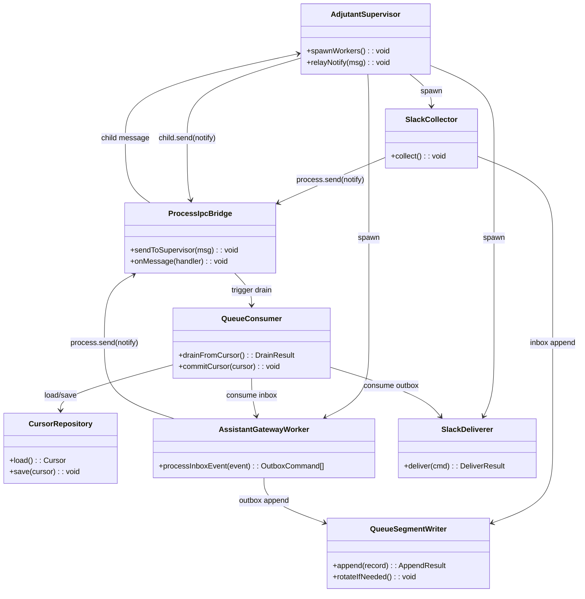
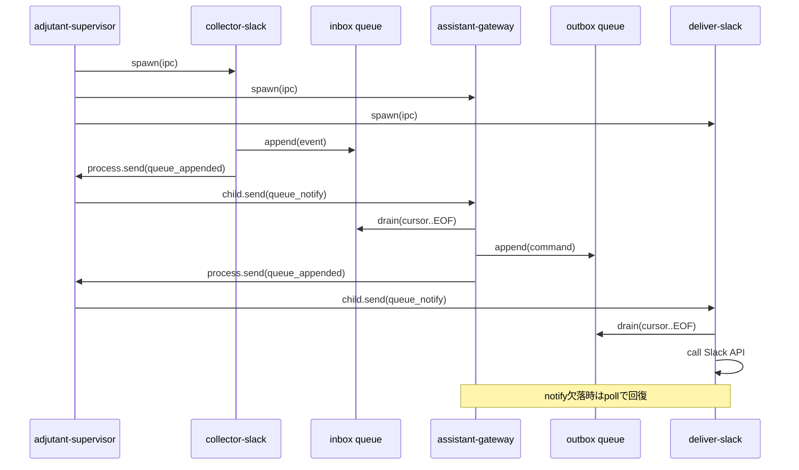

# 260228-s01: file queue + IPC 通知基盤の導入（Slack縦切り）

## 関連ドキュメント

- 仕様ドラフト: `doc/spec-vnext-draft.md`

## 1. 概要と目的 Overview and Purpose

- What  
  既存の統合実装を、`collector -> inbox(queue) -> assistant-gateway -> outbox(queue) -> deliverer` の責務分離構成へ段階移行する。初回は Slack 入出力のみ対象にし、Queue 正本（JSONL）と IPC 通知（低遅延ヒント）の最小実装を導入する。

- Why  
  現状は単一プロセスに責務が集中しており、障害分離・拡張性（GitHub/Jira追加）・観測性の面でボトルネックがある。  
  ファイルキューを正本化することで再起動耐性を確保し、IPC 通知で遅延を抑えて運用性を維持する。

- How  
  API/UI は `assistant-gateway` に残しつつ、内部を Queue 契約で分離する。  
  `inbox/outbox/cursor` を共通基盤として追加し、`adjutant-supervisor` 配下に既存 Slack 処理を以下に再配置する。
  1. `collector-slack`（CDP受信 -> inbox追記）
  2. `assistant-gateway`（inbox消費 -> routing/agent -> outbox追記）
  3. `deliver-slack`（outbox消費 -> Slack送信）

## 2. 仕様と受け入れ条件 Specification and Acceptance Criteria

実装と設計のブレを防ぐため、この章を最初に確定させる。

### 2.1 スコープ Scope

- 今回やること
  - Queue 基盤（segment writer, consumer, cursor repository）の実装
  - IPC 通知基盤（`child_process.spawn/fork` の `ipc` チャネル）の実装
  - `inbox` と `outbox` の最小スキーマ導入
  - `adjutant-supervisor`（親）から worker 子プロセスを起動し、通知中継する仕組みの実装
  - Slack の縦切り移行（collector/gateway/deliverer）
  - outbox 生成までを必須、deliver 実送信は feature flag で任意有効化
  - `assistant-gateway` の API 境界（commands/snapshot/events）維持
  - 起動スクリプトの追加（複数プロセス起動）
  - テスト追加（unit/integration/contract）
- 成果物
  - 新規: `src/queue/*`, `src/ipc/*`, `src/collector/slack/*`, `src/deliver/slack/*`
  - 更新: `src/assistant/main.ts`, `src/assistant/api-server.ts`, `src/runtime/*`, `package.json`, `doc/spec-vnext-draft.md`
  - 新規 plan/doc: 本ドキュメント
- 制約
  - Prototype First 方針で後方互換性は最小限
  - 既存 API パスは維持（UI破壊回避）
  - ローテーションはサイズ条件のみ（時間条件は導入しない）

### 2.2 非スコープ Non Scope

- 今回やらないこと
  - GitHub/Jira collector/deliverer 実装
  - 分散キュー（Kafka/NATS）移行
  - exactly-once 保証
  - API サーバーの別プロセス化
  - time-based rotation
  - Slack deliver transport の統一（webhook / Web API の一本化）
- 将来検討だが今回除外すること
  - Queue メトリクスの可視化ダッシュボード
  - DLQ 再投入 UI
  - セグメント圧縮/TTL 最適化

### 2.3 ユースケース Use Cases

1. 正常系: Slack で新規メッセージ受信  
   collector が inbox へ append 後 IPC notify、gateway が即時消費し outbox を作成し、deliverer 有効時は Slack へ投稿する。
2. 正常系: notify が欠落  
   deliverer/gateway は定期 poll で新規セグメントを検出し、処理を継続する。
3. 異常系: deliverer の外部 API 一時失敗  
   outbox レコードの `attempt` を増加し `notBefore` 以降に再試行する。
4. 異常系: プロセス再起動  
   cursor（segment + offset）から再開し、未処理行のみ再実行する。
5. 異常系: JSONL 末尾破損  
   起動時 recovery で末尾破損を切り詰め、処理を継続する。

### 2.4 受け入れ条件 Acceptance Criteria

1. Given `collector-slack` が inbox へ書き込む  
   When append が成功する  
   Then 同一イベントの IPC notify が送信される

2. Given `assistant-gateway` が通知を受信する  
   When inbox に未処理レコードが存在する  
   Then cursor から EOF まで消費し outbox を生成する

3. Given IPC notify が一切来ない  
   When poll interval 経過後に未処理レコードがある  
   Then gateway/deliverer は処理を継続できる

4. Given `deliver-slack` が有効化され、5xx/timeout を受ける  
   When `maxAttempts` 未満  
   Then backoff 後に再試行し、超過時は DLQ へ移送する

5. Given プロセスを再起動する  
   When cursor が既に保存されている  
   Then 既読イベントの再送は発生せず、未読のみ処理される

6. Given `pnpm run check` を実行する  
   When 本変更が適用済み  
   Then format/typecheck/test がすべてパスする

### 2.5 既知の制約 Known Limitations

- at-least-once なので重複は理論上発生し得る（dedupeKey 前提）
- notify はヒントであり、遅延ゼロは保証しない
- outbox の順序保証は queue 単位。target 跨ぎの厳密順序は保証しない
- 初期は単一ホスト運用を前提（親子プロセスの `ipc` チャネル）
- 初期フェーズでは deliver 実送信はデフォルト無効とし、outbox 生成を先行する

## 3. 前提技術スタック Context and Tech Stack

- Language Framework  
  TypeScript 5.x, Node.js ESM
- Libraries  
  既存 `chrome-remote-interface`, `openai`, `@mariozechner/pi-coding-agent` を継続利用。  
  Queue/IPC は Node 標準（`fs`, `child_process`）を優先。
- Style Guide  
  既存 ESLint/Prettier/tsconfig に準拠
- Runtime Deployment  
  ローカル単一ホスト実行（Windows/macOS/Linux）
- Testing  
  Node test runner（既存 `tests/**/*.test.ts`）

## 4. インターフェース契約 Interface Contracts

### 4.1 公開APIまたは外部I O一覧

- HTTP API
  - `POST /api/commands`（send_message, abort, heartbeat_run）
  - `GET /api/snapshot`
  - `GET /api/events/stream`
- CLI
  - `adjutant-supervisor`
  - `collector-slack`
  - `assistant-gateway`
  - `deliver-slack`
  - `scripts/up.sh`（プロセス一括起動）
- 設定ファイル
  - queue path, poll interval, retry 設定
- 永続化ストレージ
  - `state/queue/inbox/*`, `state/queue/outbox/*`, `state/queue/dlq/*`
  - `state/cursor/*.json`
- 外部サービス連携
  - Slack CDP（collector）
  - Slack post API/webhook（deliverer, optional enable）

### 4.2 データモデルとスキーマ

- InboxEvent

```json
{
  "id": "evt_xxx",
  "source": "slack",
  "kind": "post|reaction|notification",
  "occurredAt": "2026-02-28T01:23:45.000Z",
  "loggedAt": "2026-02-28T01:23:45.120Z",
  "dedupeKey": "slack:C123@1730000000.123",
  "payload": {}
}
```

- OutboxCommand

```json
{
  "id": "cmd_xxx",
  "target": "slack",
  "action": "post_message",
  "args": {},
  "dedupeKey": "slack:post:C123:threadTs:hash",
  "attempt": 0,
  "maxAttempts": 5,
  "notBefore": "2026-02-28T01:24:00.000Z"
}
```

- Cursor

```json
{
  "segment": "20260228T012000Z-0001.jsonl",
  "offset": 1048576
}
```

- IpcNotifyMessage

```json
{
  "queue": "inbox/slack",
  "segment": "20260228T012000Z-0001.open.jsonl",
  "hintOffset": 1048576
}
```

- バリデーション方針
  - 境界入力は zod ではなく軽量 runtime validation を実装
  - 必須キー欠落時は `INVALID_RECORD` として skip + warn

### 4.3 エラーと例外 Error Handling

- エラー分類
  - `INVALID_RECORD`（不正行）
  - `TRANSIENT_IO`（一時I/O失敗）
  - `PERMANENT_IO`（恒久失敗）
  - `DOWNSTREAM_ERROR`（Slack API系）
- リトライ方針
  - producer append は短リトライ（最大2回）
  - deliverer は `attempt/notBefore/maxAttempts` で再試行
  - retryable な HTTP ステータスは `429` と `500-599` を初期値とする
- タイムアウト方針
  - IPC notify 待機と poll fallback のタイムアウトを設定
  - downstream API timeout 明示
- ログ方針と個人情報の扱い
  - `stderr` に構造化ログ出力
  - 初期は payload の自動マスクを行わず、必要時に導入する

### 4.4 代表的な例 Examples

- 例1: queue 追記後 notify

```bash
echo '{"id":"evt_1","source":"slack","kind":"post","occurredAt":"...","loggedAt":"...","dedupeKey":"slack:C1@1","payload":{}}' \
  | collector-slack --outbox state/queue/inbox/slack
```

- 例2: gateway 消費

```bash
assistant-gateway \
  --inbox state/queue/inbox/slack \
  --outbox state/queue/outbox \
  --cursor state/cursor/assistant-gateway.inbox-slack.json
```

- 例3: supervisor 起動（親子 IPC 有効）

```bash
adjutant-supervisor \
  --collector "collector-slack --outbox state/queue/inbox/slack" \
  --gateway "assistant-gateway --inbox state/queue/inbox/slack --outbox state/queue/outbox --cursor state/cursor/assistant-gateway.inbox-slack.json" \
  --deliver "deliver-slack --inbox state/queue/outbox --cursor state/cursor/deliver-slack.outbox.json"
```

- 例4: notify payload

```json
{
  "type": "queue_appended",
  "queue": "outbox",
  "segment": "20260228T012500Z-0001.open.jsonl",
  "hintOffset": 2048
}
```

## 5. アーキテクチャと設計図 Architecture and Diagrams

### 5.1 図の選択方針

- 複数モジュールと外部I/Oを跨ぐため、クラス図を必須とする
- 非同期通知とフォールバックpollを扱うため、シーケンス図を追加する

### 5.2 クラス図 Class Diagram



### 5.3 その他の図 Optional



## 6. テスト戦略 Test Strategy

### 6.1 テストの種類

- Unit
  - `QueueSegmentWriter`: append/rotate/recovery
  - `QueueConsumer`: cursor commit 条件、skip/continue
  - `ProcessIpcBridge` と `adjutant-supervisor`: notify 送受信・中継
  - `AssistantGatewayWorker`: event -> command 変換
- Integration
  - collector -> inbox -> gateway -> outbox -> deliver の単一ホスト結合
  - notify 欠落時の poll 回復
  - 再起動後の cursor 再開
- Contract
  - InboxEvent/OutboxCommand スキーマの互換テスト
  - API（commands/snapshot/events）の後方互換テスト

### 6.2 カバレッジ対象

- 重要ロジック
  - append atomicity, cursor atomic save, notify 後 drain
- エラー分岐
  - JSON 破損行、IPC unavailable、Slack API timeout
- 境界条件
  - rotate 閾値直前/直後、attempt 上限、空セグメント

## 7. 実装タスクリスト Implementation Plan

TDDサイクルに基づきタスクを定義します。完了時にチェックボックスを [x] に更新してください。  
各タスクには可能な限り成果物 対象ファイル または Task ID を記載する。

### Phase 1 設計と準備

- [ ] 要件と仕様の確定 受け入れ条件の確定（本 plan + `doc/spec-vnext-draft.md`）
- [ ] インターフェース契約の確定 スキーマと例の追加（`src/queue/contracts.ts`）
- [ ] Mermaid図の作成 更新（本 plan）
- [ ] インターフェース 型定義の作成（`src/queue/types.ts`, `src/ipc/types.ts`）
- [ ] テスト基盤の確認 例 テストランナー モックユーティリティ

### Phase 2 Queue 基盤の実装

- [ ] Test Queue writer/consumer/cursor の失敗するテストケースを作成 Red
- [ ] Impl テストを通過させるための最小限の実装 Green
- [ ] Refactor 可読性向上 重複排除 リファクタリング
- [ ] Integration JSONL recovery と rotate の統合テストを追加
- [ ] Docs Queue 契約と制約を更新

### Phase 3 IPC 通知と gateway 連携

- [ ] Test IPC notify 受信トリガと poll fallback の失敗するテストケースを作成 Red
- [ ] Impl gateway worker が inbox 消費で outbox 生成する最小実装 Green
- [ ] Refactor メッセージ型とエラーハンドリングの重複排除
- [ ] Integration collector->gateway 結合テスト追加
- [ ] Docs `adjutant-supervisor` の再起動と子復旧手順を更新

### Phase 4 deliverer 統合と検証

- [ ] Optional Test deliver retry/DLQ の失敗するテストケースを作成 Red
- [ ] Optional Impl Slack deliverer の最小実装 Green
- [ ] Optional Refactor ログ整備と設定キー整理
- [ ] Optional Integration end-to-end（Slack擬似）テスト追加
- [ ] Docs 起動手順と移行ノート更新

## 8. 完了の定義 Definition of Done

機能完了と品質完了を分けて定義する。

### 8.1 機能DoD Functional DoD

- [ ] 受け入れ条件がすべて満たされていること
- [ ] 既知の制約が明文化され、想定通りであること
- [ ] 契約の例に対して期待通りの結果が得られること

### 8.2 品質DoD Quality DoD

- [ ] 全てのテストがパスしていること
- [ ] Linter Formatterのエラーがないこと
- [ ] 不要なデバッグコードが削除されていること
- [ ] 主要な変更点がドキュメントに反映されていること

## 9. 懸念事項と未確定事項 Concerns and Questions

### 9.1 決定済み（コメント反映）

- IPC は `child_process` の `ipc` チャネルで統一する（Windows/macOS/Linux）
- retryable 判定の初期値は HTTP `429` と `500-599` とする
- queue GC の実行主体は `assistant-gateway` とする
- 既存 `pnpm start` と `pnpm run assistant` の相互運用期間は設けず、完全切り替え前提で進める
- Slack deliver transport の統一は保留し、初期は webhook / Web API の両方を残す
- queue payload のマスク処理は初期導入せず、必要に応じて追加する

### 9.2 未確定事項（要判断）

- `adjutant-supervisor` を必須構成にするか（単体起動モードを残すか）
- deliver 実送信を有効化するタイミング（Phase 4 をいつ着手するか）
- queue GC の実行周期と削除しきい値（retention, ack 条件）
- payload マスク導入のトリガ条件（監査要件、事故対応基準）
