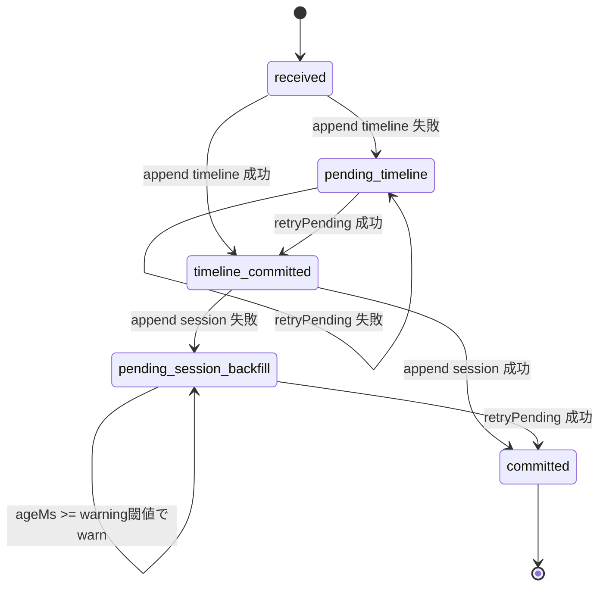
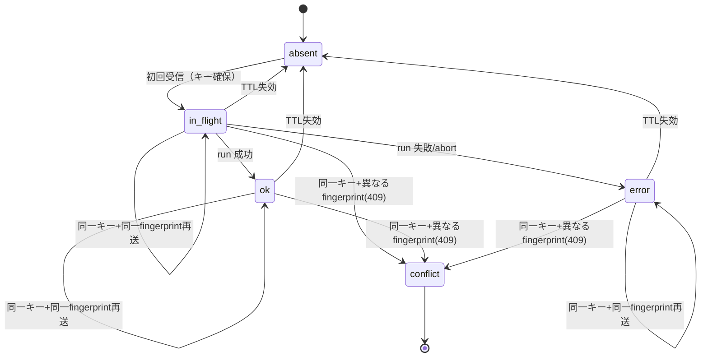
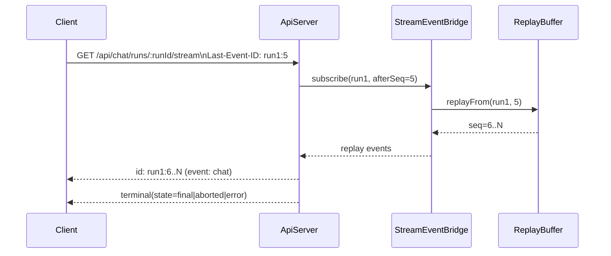
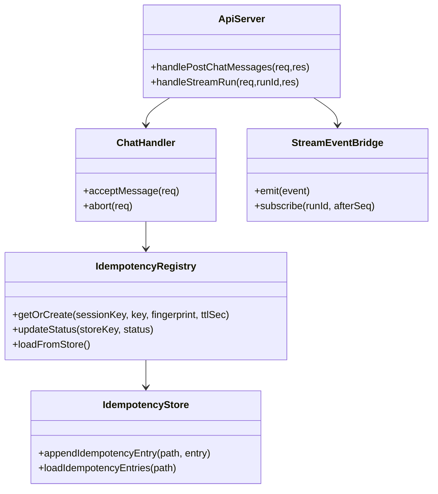

# Adjutant 統合仕様書 v1.0

この文書は、Adjutant の現行実装（Slack イベント収集パイプライン + プロアクティブ AI アシスタント + チャネルプラグインゲートウェイ）の全体像を 1 つに統合した仕様書である。

旧文書との対応:

- `doc/spec.md` v0.2 → 本書 §2〜§6（収集パイプライン）
- `doc/mvp-proactive-assistant-requirements.md` → 本書 §7〜§11（AI アシスタント基盤）
- `doc/ext-plan.md` v2 → 本書 §12〜§15（プロアクティブゲートウェイ）
- `doc/slack-proactive.md` → 本書 §12, §15（Slack 連動仕様）

---

## 1. 目的

Adjutant は Slack Desktop の CDP（Chrome DevTools Protocol）イベントをリアルタイム収集し、正規化した `NormalizedEvent` を JSONL に追記保存する。さらに、保存されたイベントを AI エージェントが継続的に読み込み、ユーザーとの対話（チャット UI）や自律的な状況監視（Heartbeat / Fast Path）を行うプロアクティブ AI アシスタントシステムである。

主要な 3 つの機能層:

1. **Slack イベント収集** — CDP 経由で Slack Desktop の通信を傍受し、正規化・永続化する
2. **AI アシスタント基盤** — pi-coding-agent SDK でセッション管理、ストリーミング対話、メモリを提供する
3. **プロアクティブゲートウェイ** — 受信イベントの即時判定（Fast Path）と定期巡回（Slow Path / Heartbeat）で、AI が自律的に対応する

---

## 2. 実行アーキテクチャ

### 2.1 単一プロセス構成

`pnpm run assistant` で以下を同一プロセス内に起動する。

```
┌─────────────────────────────────────────────────────────────────────┐
│  AssistantGateway (src/assistant/main.ts)                          │
│                                                                     │
│  ┌──────────────────┐  ┌──────────────────┐  ┌──────────────────┐  │
│  │  ChannelManager  │  │  API Server      │  │  Vite Dev Server │  │
│  │  + PluginRegistry│  │  (:3100)         │  │  (:5173)         │  │
│  └────────┬─────────┘  └────────┬─────────┘  └──────────────────┘  │
│           │                      │                                   │
│  ┌────────▼─────────┐  ┌────────▼─────────┐  ┌──────────────────┐  │
│  │  SlackChannel     │  │  ChatHandler     │  │  HeartbeatRunner │  │
│  │  Plugin           │  │  + CommandQueue  │  │  (setInterval)   │  │
│  └────────┬─────────┘  └────────┬─────────┘  └────────┬─────────┘  │
│           │                      │                      │           │
│  ┌────────▼──────────────────────▼──────────────────────▼────────┐  │
│  │  ChannelNotificationPipeline                                  │  │
│  │  (TriggerFilter + Debounce + NotificationQueue + Dispatch)    │  │
│  └────────┬──────────────────────────────────────────────────────┘  │
│           │                                                         │
│  ┌────────▼─────────┐  ┌──────────────────┐                       │
│  │  DualWrite        │  │  SystemEvent     │                       │
│  │  Coordinator      │  │  Queue           │                       │
│  └────────┬─────────┘  └──────────────────┘                       │
│           │                                                         │
│  ┌────────▼─────────┐                                              │
│  │  JsonlWriter      │                                              │
│  └──────────────────┘                                              │
└─────────────────────────────────────────────────────────────────────┘
```

- CDP 接続障害は API サーバー / Web UI へ伝播させない
- CDP 再接続中も Heartbeat（Slow Path）は継続実行する
- graceful shutdown 順序は `CDP停止 → 通知キュー flush → API停止`

### 2.2 起動モード

| コマンド             | 用途                                   |
| -------------------- | -------------------------------------- |
| `pnpm run assistant` | 統合起動（収集 + AI + API + UI）       |
| `pnpm start`         | 収集プロセスのみ（検証用途として残置） |
| `pnpm dev`           | CDP 利用可否確認後に `pnpm start`      |
| `pnpm run serve`     | `dist/backend/index.js` 運用モード起動 |

### 2.3 起動と再接続

- エントリポイントは `src/assistant/main.ts`（統合）/ `src/index.ts`（収集のみ）
- `resolveEndpoint()` は以下優先順位で CDP 接続先を解決する
  1. `CDP_ENDPOINT_FILE`（既定 `.adjutant/cdp-endpoint.json`）
  2. `CDP_HOST` / `CDP_PORT`
  3. 既定値 `127.0.0.1:9222`
- セッション切断時は再接続ループへ移行する
  - リトライ待機: `full jitter = random(0, min(cap, base * 2^(attempt-1)))`
  - 既定値: `base=1000ms`, `cap=10000ms`
- `SIGINT` / `SIGTERM` で adapter/client/debug UI を停止して終了する

---

## 3. データモデル

### 3.1 NormalizedEvent（共通スキーマ）

型定義は `src/core/events.ts` に従う。

```ts
{
  schema: "adjutant.event.v1.1";
  uid: string;
  source: "slack" | "github" | "git-local";
  kind: string;
  action?: string;
  actor?: string;
  subject?: string;
  ts: string;              // ISO8601
  logged_at?: string;      // ISO8601
  meta?: Record<string, unknown>;
  detail?: {
    slack: SlackPostDetail | SlackReactionDetail | SlackNotificationDetail
  } | {
    github: Record<string, unknown>
  } | {
    git_local: Record<string, unknown>
  };
}
```

### 3.2 Slack detail

- **post**: `channel_id`, `channel_name`, `message_ts`, `text`, `blocks`, `thread_ts`
- **reaction**: `channel_id`, `channel_name`, `message_ts`, `emoji`, `user`, `message_text`
- **notification**: `channel_id`, `channel_name`, `notification_type`, `title`, `message_text`, `user`, `event_ts`

`kind` フィールドでイベント種別を判別する（`detail.slack` に `type` フィールドは付与しない）。

### 3.3 UID 規則

| 種別         | パターン                                                             |
| ------------ | -------------------------------------------------------------------- |
| post         | `slack:{channel_id}@{message_ts}`                                    |
| reaction     | `slack:{channel_id}@{message_ts}:{emoji}:{action}:{actorId}`         |
| notification | `slack:{channel_id}@{event_ts or now}:{notification_type}:{actorId}` |

同一 `uid` はメモリ上で重複排除し、同一プロセス内での重複書き込みを防ぐ。

### 3.4 AI コンテキスト窓

```ts
type AiContextWindow = {
  schema: "adjutant.ai.context.v1";
  builtAt: string;
  sessionId: string;
  sessionKey: string;
  range: { from: string; to: string };
  events: Array<{
    uid: string;
    ts: string;
    kind: string;
    actor?: string;
    text?: string;
    channelId?: string;
    threadTs?: string;
  }>;
  systemEvents: Array<{ ts: number; text: string }>;
  memory: {
    longTerm: string | null;
    daily: string | null;
    yesterday: string | null;
  };
  truncated: boolean;
};
```

### 3.5 セッション識別子

- **`sessionKey`**: 実行ルーティングと排他制御のキー。CommandQueue と SystemEventQueue は `sessionKey` 単位で扱う
- **`sessionId`**: 会話履歴（トランスクリプト）を指す永続 ID。`sessionKey → sessionId` は 1:N で遷移しうる
- **`runId`**: 1 回の実行（1 リクエスト）を識別する ID

### 3.6 ストリーミングイベント

```ts
type StreamEvent = {
  runId: string;
  sessionKey: string;
  seq: number;
  state: "delta" | "final" | "aborted" | "error";
  message?: unknown;
  errorMessage?: string;
  usage?: unknown;
  stopReason?: string;
};
```

- `seq` は公開 SSE イベント列に対して `runId` ごとに `1..N` の連番で再採番する
- 公開 SSE の各イベントは `id="<runId>:<seq>"` を持つ（`Last-Event-ID` 再開に使用）
- `state=final|aborted|error` が run の終端イベントとなる
- 同一 `runId` で終端イベントは 1 回のみ送信する

### 3.7 セッショントランスクリプト

```ts
type SessionTranscriptEvent = {
  schema: "adjutant.session.event.v1";
  sessionId: string;
  sessionKey: string;
  runId: string;
  ts: string;
  type: "user_message" | "assistant_message" | "tool_call" | "tool_result" | "system_event";
  payload: Record<string, unknown>;
};
```

### 3.8 Heartbeat 実行結果

```ts
type HeartbeatRunResult =
  | { status: "ran"; durationMs: number }
  | { status: "skipped"; reason: string }
  | { status: "failed"; reason: string };

type HeartbeatEventPayload = {
  ts: number;
  status: "sent" | "ok-empty" | "ok-token" | "skipped" | "failed";
  reason?: string;
  preview?: string;
  durationMs?: number;
  indicatorType?: "ok" | "alert" | "error";
};
```

### 3.9 SystemEvent

```ts
type SystemEvent = {
  text: string;
  ts: number; // epoch ms
};
```

### 3.10 統合タイムラインレコード

`memory/timeline.jsonl` に追記されるレコード。Heartbeat 逆走査判定のデータソースとなる。

- `recordType`: `"event"` | `"action"`
- `role`: `"user"` | `"assistant"` | `"tool"`
- `kind`: `"post"` | `"reaction"` | `"notification"` | ...
- `uid`: NormalizedEvent の UID
- `ts`: タイムスタンプ

---

## 4. Slack イベント収集パイプライン

### 4.1 パイプライン概要

```
CDP endpoint (Slack Desktop)
    ↓
src/runtime/slackConnection.ts    ← CDP 接続・再接続管理
    ↓
src/slack/adapter.ts              ← Fetch インターセプト / WebSocket フレーム処理 / 重複排除
    ↓
src/slack/normalize.ts            ← イベント正規化 (post / reaction / notification)
    ↓
src/pipeline/slackIngestor.ts     ← パイプライン統合
    ↓
src/io/jsonlWriter.ts             ← data/YYYY/MM/DD/slack/events.jsonl へ追記保存
```

### 4.2 Fetch インターセプト

`Fetch.enable()` は以下 URL を Request ステージで監視する。

- `*://*.slack.com/api/chat.postMessage*`
- `*://*.slack.com/api/reactions.*`

処理内容:

- POST body を解析して `normalizeSlackMessage` / `normalizeSlackReaction` へ渡す
- `reactions.*` では DOM キャプチャ結果が取得できれば `message_text` を補完する

### 4.3 WebSocket フレーム

`webSocketFrameReceived` で受信した payload を解釈し、次を実施する。

- message 系イベントから本文キャッシュ更新
- 通知候補を抽出して `kind=notification` イベントを生成

### 4.4 Response hook

`responseReceived` で次を実施する。

- `Network.getResponseBody` により API 応答の本文情報を補完
- `conversations.view` 応答からチャンネル名キャッシュ更新
- `/cache/{team}/users/list` 応答からユーザー名キャッシュ更新

### 4.5 DOM キャプチャ

- `DomCaptureService` は `Runtime.evaluate` で候補 DOM を探索する
- タイムスタンプ一致候補を複数 selector で探索し、本文/チャンネル情報を抽出する
- リトライ遅延: `0ms, 100ms, 200ms, 300ms`
- 無効化: `ADJUTANT_DISABLE_DOM_CAPTURE=1|true`
- `/api/reactions.*` の送信を契機に動くため、他ユーザー由来の受信通知だけでは発火しない
- メッセージが可視 DOM に存在しない場合は本文補完できない

### 4.6 `kind=post` の inbound/outbound 識別

- `kind=post` はチャネル受信イベントに限定する（WebSocket フレーム由来の message / app_mention）
- `chat.postMessage` など outbound 送信由来データは `kind=post` として扱わない
- outbound 系を正規化する場合は別 kind（例: `outbound_post`）へ分離し、Fast Path 実行トリガー対象外とする

---

## 5. 保存仕様

### 5.1 JSONL イベント

```
<dataDir>/YYYY/MM/DD/slack/events.jsonl
```

- 1 行 1 JSON、追記専用
- `logged_at` が未設定なら `JsonlWriter` が現在時刻で補完
- `logged_at` を基準に日付ディレクトリを決定
- append 失敗時は最大 2 回リトライ（`ENOENT` は mkdir 後に再試行）

### 5.2 名称キャッシュ

```
<dataDir>/_cache/slack/channel-names-by-team/<team_id>.json
<dataDir>/_cache/slack/user-names-by-team/<team_id>.json
```

- team ごとに分割保存
- 起動時にロードし、収集中に差分更新
- user cache (`adjutant.slack.user-cache.v2`) は `real_name`, `profile.display_name`, `profile.email`, `profile.first_name`, `profile.last_name`, `profile.image_original` を保持

### 5.3 統合タイムライン

```
<workspaceDir>/memory/timeline.jsonl
```

- 全チャネル・全セッションのイベントを時系列で集約する 1 ファイル
- DualWriteCoordinator が timeline と session JSONL へ同時書き込みする
- Heartbeat 巡回判定（Slow Path）のデータソース
- 書き込み順は timeline を先行し、失敗時は `pending-timeline` として run/pending 判定を停止する

### 5.4 セッション JSONL

```
<workspaceDir>/memory/sessions/<sessionKey>.jsonl
```

- `user_message` / `assistant_message` / `tool_call` / `tool_result` / `system_event` を追記保存
- 各行は `sessionId`, `sessionKey`, `runId`, `type`, `ts` を必須とする
- session 側書き込み失敗時は `pending-session-backfill` に退避し、run/pending は継続する
- retry は `uid` 単位で idempotent に再実行する

### 5.5 メモリファイル

- 長期メモリ: `<workspaceDir>/MEMORY.md`
- 日次メモ: `<workspaceDir>/memory/YYYY-MM-DD.md`
- main セッションのみがロード可能（spoke セッションでは常時 skip）

### 5.6 ペルソナファイル

- `<workspaceDir>/SOUL.md` — 応答言語・トーン・優先度判断方針を記述
- 未存在時はデフォルト方針（日本語・簡潔）で動作

### 5.7 Heartbeat 指示ファイル

- `<workspaceDir>/HEARTBEAT.md` — Heartbeat 実行時の追加指示
- 実質空（見出し/空行のみ）の場合はモデル呼び出しなしでスキップ

### 5.8 CDP 生イベントログ（任意）

`ADJUTANT_CDP_EVENT_LOG=1` の場合:

```
<dataDir>/_debug/cdp-events.jsonl
```

- `schema=adjutant.cdp.event.v1`
- `method`, `params`, `session_id`, `host`, `port`, `slack_url` を保持

### 5.9 DualWrite の状態遷移（`events.jsonl` / `timeline.jsonl` / `memory/sessions/*.jsonl`）

`uid` ごとの永続化状態は以下で管理する。現実装では append 成功を `committed` 判定に使い、`fdatasync` 相当は将来拡張とする。



- `pending-timeline`: run/pending 判定を停止する（判定ソースである timeline が欠損するため）
- `pending-session-backfill`: run/pending 判定は継続するが、Heartbeat は該当 `uid` を見つけた場合に起動見送りする
- `retryPending()` は `timeline` を先に回収し、その後 `session` を回収する順序を必須とする

### 5.10 起動時復旧手順（JSONL）

復旧対象:

- `<dataDir>/YYYY/MM/DD/slack/events.jsonl`
- `<workspaceDir>/memory/timeline.jsonl`
- `<workspaceDir>/memory/sessions/<sessionKey>.jsonl`
- `<workspaceDir>/memory/idempotency.jsonl`

復旧アルゴリズム（MUST）:

1. 先頭から走査し、各行について `UTF-8 decode` / `JSON parse` を行う
2. `checksum` フィールドがある行は、`checksum` を除いた canonical JSON で再計算し一致確認する
3. 最初の不正位置を `badOffset` とする（`partial-tail` / `invalid-json` / `checksum-mismatch`）
4. `badOffset` がある場合はその位置まで truncate する
5. truncate 結果を `repaired=true` として記録し、処理を継続する

補足:

- `checksum` 未導入の旧行は parse のみで受理する（後方互換）
- truncate により除去された末尾は「未コミット断片」とみなし、再送で回復する

### 5.11 復旧時の判定コード（内部）

| code                | レベル | 意味                            | 後続動作                       |
| ------------------- | ------ | ------------------------------- | ------------------------------ |
| `RECOVERY_OK`       | info   | 不整合なし                      | 通常起動                       |
| `partial-tail`      | warn   | 末尾不完全行を検出した          | 当該位置まで truncate          |
| `invalid-json`      | warn   | 不正 JSON 行を検出した          | 当該位置まで truncate          |
| `checksum-mismatch` | warn   | checksum 不一致行を検出した     | 当該位置まで truncate          |
| `RECOVERY_IO_ERROR` | error  | read/truncate の I/O に失敗した | 対象ファイルをスキップして継続 |

---

## 6. 名称キャッシュ

- `SlackNameCacheRepository` がチャンネル名・ユーザー名を team 単位で管理する
- 起動時にファイルからロードし、CDP イベントから差分更新する
- `conversations.view` → チャンネル名、`users/list` → ユーザー名

---

## 7. AI アシスタント基盤

### 7.1 概要

```
data/YYYY/MM/DD/slack/events.jsonl
    ↓
src/assistant/event-reader.ts          ← JSONL イベント読み込み
src/assistant/system-event-queue.ts    ← 外部トリガ FIFO キュー
src/assistant/memory-reader.ts         ← MEMORY.md / memory/YYYY-MM-DD.md 読み込み
src/assistant/memory-search/*          ← memory_search / memory_get（SQLite FTS5 + vec0）
    ↓
src/assistant/context-builder.ts       ← AI 向けプロンプト組み立て
    ↓
src/assistant/command-queue.ts         ← main + session レーン排他制御
src/assistant/chat-handler.ts          ← チャット受理・冪等判定・パイプライン統合
    ↓
src/assistant/agent-runner.ts          ← pi-coding-agent SDK 実行
    ↓
src/assistant/api-server.ts            ← HTTP API + SSE ストリーミング（:3100）
    ↓
src/ui/                                ← @assistant-ui/react ベース Web UI（Vite :5173）
```

### 7.2 セッション実行基盤（pi-coding-agent SDK）

実行フローは OpenClaw 準拠:

1. セッションファイルの排他ロック取得
2. セッションファイル修復/事前準備後に `SessionManager` を開く
3. `SettingsManager` を生成
4. `createAgentSession` で実行セッションを構築
5. 購読層でイベントを受信し、SSE イベントへ整形
6. 実行終了時に `flush/dispose` とロック解放

例外時も 6 の後処理を `finally` 相当で必須とする。

### 7.3 セッション排他とキュー直列化

- 同一 `sessionKey` では同時に 1 ランのみ実行する
- 実行レーンは `sessionKey` 単位で分離し、別セッション間でコンテキストや SystemEvent が混線しない
- 実行中に追加入力が来た場合は同一レーン待ち行列に積み、現行ラン完了後に FIFO で処理する
- `command-queue` は lane ごとの `maxConcurrent` と `clearLane` API を持つ

### 7.4 実行失敗時の回復

- 一時的失敗（通信/HTTP 系）は 1 回のみ再試行する
- コンテキスト超過時はイベント/履歴入力を新しい順に切り詰めて再試行する
- モデル利用不可時は失敗を返す
- 失敗後もセッションファイル破損を検知/修復できる設計とする

### 7.5 コンテキスト組み立て

`context-builder.ts` が以下を統合してプロンプトを組み立てる:

- **直近 Slack イベント窓**: 時間窓（例: 直近 30 分）＋件数上限（例: 最新 200 件）
- **SystemEvent キュー**: `sessionKey` 単位のエフェメラル FIFO から drain
- **メモリ**: `MEMORY.md` と当日・前日の日次メモ（main セッションのみ）
- **ペルソナ**: `SOUL.md`
- **セッショントランスクリプト**: 直近窓を文脈復元に利用

会話履歴の復元は `SessionManager.buildSessionContext()` が担い、ChatHandler はシステムイベントの 1 ターン注入とユーザーメッセージ受け渡しのみを行う（責務分離）。

### 7.6 冪等性

- `POST /api/chat/messages` は `Idempotency-Key` ヘッダを正式入力とする
- 互換入力として body の `clientMessageId` と `idempotencyKey` も受理し、実キーは `Idempotency-Key ?? clientMessageId ?? idempotencyKey` とする
- `(sessionKey, idempotencyKey)` が同一で、かつ payload fingerprint が一致する場合は TTL（既定 300 秒）内で既存 `runId` を返す
- 同一キーで payload fingerprint が不一致な再送は `409 IDEMPOTENCY_PAYLOAD_MISMATCH` を返す
- 冪等レジストリは永続化し、再起動後も TTL 内再送に対して同一結果を返せることを必須とする
- 永続ストア破損時は `ADJUTANT_IDEMPOTENCY_STORE_FAILURE_MODE` に従い、`open` は破損行を無視して継続、`closed` は起動失敗とする

### 7.7 冪等レジストリ状態遷移



- 同一キーで fingerprint 不一致の場合は `409 IDEMPOTENCY_PAYLOAD_MISMATCH` を返す
- 永続レジストリは JSONL に append し、起動時に TTL 内レコードを再ロードする

---

## 8. Heartbeat（Slow Path）

### 8.1 基本契約

- 定期実行間隔の既定値は `30m`（`ADJUTANT_HEARTBEAT_INTERVAL_MS`）
- Heartbeat プロンプト既定: `Read HEARTBEAT.md if it exists ... If nothing needs attention, reply HEARTBEAT_OK.`
- 実行時の送信 Body 末尾に `Current time: <formattedTime> (<userTimezone>)` を 1 行注入する
- 実行結果は `HeartbeatRunResult`（`ran` / `skipped` / `failed`）で記録する
- `GET /api/heartbeat/last` で直近状態を取得可能

### 8.2 統合タイムライン逆走査判定

1. `memory/timeline.jsonl` を末尾から逆走査する
2. 最初の `role="assistant"` / `role="tool"` / `recordType="action"` を「最新の対応境界」とし、走査を打ち切る
3. 対象区間（末尾〜対応境界）に `recordType="event" && role="user" && kind="post"` かつ `now - ts >= heartbeatStaleMs` を満たす行が 1 件以上あれば「未対応」と判定
4. 該当 `uid` が `pending-session-backfill` に存在する場合は文脈欠落を避けるため起動見送り（次周期で再評価）
5. `reaction/notification` のみで `post` が存在しない場合は既対応として静音終了

### 8.3 通知抑制ルール

- 返信が `HEARTBEAT_OK` のみ、または端に含まれる短文 ACK の場合は通知を抑制
- `ackMaxChars`（既定 300）以下の残文は無通知扱い
- 24 時間以内に同一本文の Heartbeat 通知が再生成された場合は `duplicate` として送信を抑制
- 抑制時も `HeartbeatRunResult.status: "ran"` を維持し、イベントログ側に `ok-token` / `ok-empty` / `duplicate` を記録

### 8.4 スキップ条件

- `HEARTBEAT.md` が実質空（見出し/空行のみ）→ `skipped`
- 実行レーンに未処理実行がある → `requests-in-flight` として `skipped`、1 秒後再試行
- `showOk` / `showAlerts` / `useIndicator` がすべて `false` → 実行しない
- `activeHours` 設定時、時間外 → `quiet-hours` として `skipped`

### 8.5 遅延対応アクション

未対応と判定された場合:

1. `session.lock` を取得してメインエージェントを自律起動
2. 直近の未対応メッセージ群（連続 `user` ロール）を読み込み再評価
3. 要対応事案が見つかった場合は時間差を踏まえた文脈で対応
4. assistant レコードを統合タイムラインへ追記（次回 heartbeat で自然にスキップ）

---

## 9. プロアクティブゲートウェイ（Fast Path）

### 9.1 チャネルプラグイン構成

```ts
type ChannelIngestionPlugin = {
  id: string;
  startAccount: (ctx: ChannelGatewayContext) => Promise<unknown>;
  stopAccount?: (ctx: ChannelGatewayContext) => Promise<void>;
};

type ChannelGatewayContext = {
  accountId: string;
  runtime: RuntimeEnv;
  abortSignal: AbortSignal;
  emit: (input: ChannelNotificationInput) => Promise<void>;
  getStatus: () => ChannelAccountSnapshot;
  setStatus: (next: ChannelAccountSnapshot) => void;
};

type ChannelNotificationInput = {
  event: NormalizedEvent;
  accountId: string;
  channelId: string;
};
```

- `PluginRegistry` がチャネル plugin を登録・管理する
- `ChannelManager` が account 単位で `startAccount/stopAccount` を呼び出し、`running/lastError/lastInboundAt` を保持する
- 新規チャネル追加は plugin 追加で行い、ルーター/キュー本体にチャネル固有分岐を持ち込まない
- 初期チャネルは Slack plugin（`src/proactive/slack-channel-plugin.ts`）

### 9.2 処理フロー（固定順序）

```
NormalizedEvent（from SlackPlugin.emit()）
    ↓
1. ChannelNotificationPipeline.enqueue()
    ↓
2. extractChannelId / extractThreadTs
    ↓
3. resolveThreadSessionKeys() → sessionKey 解決
    ↓
4. DualWriteCoordinator.appendEvent()
   ├→ memory/timeline.jsonl（統合タイムライン）
   └→ memory/sessions/<sessionKey>.jsonl（セッション JSONL）
    ↓
5. TriggerFilter.decide() → RouteDecision 生成
   ├→ PrimaryClassifier（デフォルト "run"）
   └→ SecondaryClassifier（Route LLM、optional）
    ↓
6. RouteDecision に基づくルーティング
   ├→ run:     debounce → notification-queue → DispatchAdapter → ChatHandler.acceptMessage()
   ├→ pending: JSONL 上の履歴として保持（次回 run 時に一括回収）
   ├→ system:  system-event-queue へ投入
   └→ drop:    破棄（self-message 等）
```

### 9.3 ルーティング判定（RouteDecision）

```ts
type RouteDecision = {
  run: boolean;
  pending: boolean;
  system: boolean;
  drop: boolean;
  reason: string;
};
```

制約:

- `drop=true` は他フラグと排他
- `run=true` と `pending=true` は同時に許可しない
- `run` と `system` は独立フラグで併用可

#### 9.3.1 イベント種別ルーティング表

| event kind                   | 条件                  | run         | pending     | system | 備考                   |
| ---------------------------- | --------------------- | ----------- | ----------- | ------ | ---------------------- |
| `post`                       | 受信由来 かつ 非 self | router 判定 | router 判定 | no     | run/pending は排他     |
| `reaction`                   | 非 self               | router 判定 | router 判定 | yes    | run は軽量トリガー文   |
| `notification`               | 非 self               | router 判定 | router 判定 | yes    | run は軽量トリガー文   |
| `post/reaction/notification` | self                  | no          | no          | no     | 完全無視（ループ防止） |
| `post`                       | self 判定不可         | no          | no          | no     | fail-safe で drop      |
| `reaction/notification`      | self 判定不可         | no          | no          | yes    | system-only + warn     |

### 9.4 self-message 判定

解決順:

1. `selfUserIdByAccount[accountId]`（起動時に解決）
2. `ADJUTANT_SLACK_SELF_USER_ID`（単一運用向けフォールバック）
3. 未解決時は fail-safe（上記ルーティング表参照）

### 9.5 軽量 LLM 一次判定（Route LLM）

- `TriggerFilter` は `secondaryClassifier`（Route LLM）を受け取れる設計
- Route LLM は OpenAI を採用し、`run/pending` を判定する
- タイムアウト（既定 `1000ms`）時は一次判定へフォールバック
- 出力契約: `{ outcome: "run" | "pending", confidence?: number, reason?: string }`
- 契約外値・不正 JSON・例外時はすべて deterministic 判定へフォールバック
- 監査ログは本文を含めず、`uid/eventKind/model/outcome/durationMs/fallback reason` を記録
- `maxConcurrentRouteLlm` 既定値は `1`（逐次評価）

### 9.6 デバウンスとキュー

```ts
type NotificationQueueConfig = {
  cap: number; // default 20
  debounceMs: number; // default 1000
  dropPolicy: "summarize" | "old" | "new"; // default summarize
  maxDispatchChars: number; // default 4000
  maxEventUidsPerDispatch: number; // default 50
};
```

- cap/drop 判定はデバウンス flush 後に実施する
- flush された結合メッセージは 1 キューエントリとして扱う
- `dropPolicy=summarize` は LLM 要約を使わず、テンプレート合成で summary system event を 1 件注入する

### 9.7 Dispatch 変換

```ts
type ChatDispatchRequest = {
  message: string;
  sessionKey: string;
  idempotencyKey: string;
  eventUids: string[];
  uidOverflowCount?: number;
  messageTruncated?: boolean;
  originalCharCount?: number;
  dispatchedCharCount?: number;
  accountId: string;
};
```

- `post`: デバウンス結合後テキストを使用
- `reaction`: 軽量トリガー文（例: `[Slack trigger] New reaction events were observed in this session.`）
- `notification`: 軽量トリガー文（詳細は system event 側）
- `idempotencyKey`: `sha256(sessionKey + "\n" + sorted(eventUids).join("\n"))`
- `message` は `maxDispatchChars` を上限とし、超過時は切り詰め + `messageTruncated=true` を付与

### 9.8 sessionKey マッピング規則（Slack）

| channel type       | sessionKey                           |
| ------------------ | ------------------------------------ |
| `D*`（DM）         | `slack:{channelId}`                  |
| `G*`（group/mpim） | `slack:group:{channelId}`            |
| `C*`（channel）    | `slack:channel:{channelId}`          |
| thread reply       | `{baseSessionKey}:thread:{threadTs}` |

accountId 解決順:

1. `ADJUTANT_SLACK_ACCOUNT_ID`
2. `"default"`

### 9.9 contextKey 生成規則（重複抑止）

| 種別         | パターン                                                                           |
| ------------ | ---------------------------------------------------------------------------------- |
| post         | `slack:message:{channel_id}:{message_ts}`                                          |
| reaction     | `slack:reaction:{channel_id}:{message_ts}:{emoji}:{action}:{actor_id or actor}`    |
| notification | `slack:notification:{channel_id or unknown}:{notification_type}:{event_ts or uid}` |

### 9.10 DualWriteCoordinator

- `appendEvent(uid, timelineRecord, sessionRecord)` で timeline と session に同時書き込み
- 状態: `committed` / `pending-timeline` / `pending-session-backfill`
- `retryPending()` で失敗レコードを再試行
- `listPendingSessionBackfillUids()` を Heartbeat 判定で使用

### 9.11 ペンディングの一括回収

ルーターが `run` を返した場合:

1. `session.lock` を取得してメインエージェントを起動
2. セッション JSONL の直近履歴をコンテキストとして読み込む
3. `pending` として保留されていた直前の未対応メッセージ群も含めて処理
4. システムプロンプトに「未回答の質問や未完了タスクが残っている場合は今回ターンでまとめて回収すること」を明示

---

## 10. SystemEventQueue

- `sessionKey` 単位のインメモリ FIFO キュー（永続化しない）
- enqueue 入力は `sessionKey` 必須、キュー格納要素は `text/ts(epoch ms)`
- `contextKey` は enqueue オプションとして受け取り、連続重複抑制に使用（`SystemEvent` 本体には格納しない）
- 連続重複（同一 `text`）は enqueue しない
- キュー上限 20 件、超過時は古いイベントから破棄
- 注入後は drain して二重注入を防ぐ

---

## 11. Web UI（assistant-ui）

### 11.1 構成

- `@assistant-ui/react` ベースのチャット UI
- Vite dev server（既定 `:5173`）
- カスタム Runtime + SSE 接続方式

### 11.2 機能

- ユーザー入力とストリーミング応答表示
- Heartbeat 状態インジケータ（`GET /api/heartbeat/last` を 3 秒間隔ポーリング）
- 接続状態/実行状態インジケータ
- UI の終端判定は `state=final|aborted|error` を正とする

---

## 12. バックエンド API

### 12.1 エンドポイント一覧

| メソッド | パス                           | 入力                                                                                                   | 出力                                     |
| -------- | ------------------------------ | ------------------------------------------------------------------------------------------------------ | ---------------------------------------- |
| `POST`   | `/api/chat/messages`           | Header: `Idempotency-Key`（任意） / Body: `{ message, sessionKey, idempotencyKey?, clientMessageId? }` | `{ runId, status }`                      |
| `POST`   | `/api/chat/abort`              | Body: `{ sessionKey, runId? }`                                                                         | `{ ok, aborted, runIds }`                |
| `GET`    | `/api/chat/runs/:runId/stream` | Header: `Last-Event-ID`（任意, `<runId>:<seq>`）                                                       | SSE (`event: chat`, `id: <runId>:<seq>`) |
| `GET`    | `/api/chat/history`            | Query: `sessionKey`                                                                                    | `{ sessionKey, sessionId, messages }`    |
| `POST`   | `/api/heartbeat/run`           | Body: `{ reason? }`                                                                                    | `HeartbeatRunResult`                     |
| `GET`    | `/api/events/stream`           | なし                                                                                                   | SSE (`event: heartbeat`)                 |
| `GET`    | `/api/heartbeat/last`          | なし                                                                                                   | `HeartbeatEventPayload \| null`          |

### 12.2 冪等キー解決規則

`POST /api/chat/messages` の実効冪等キーは次の優先順で解決する。

1. Header `Idempotency-Key`
2. Body `clientMessageId`
3. Body `idempotencyKey`

どれも無い場合は `400 INVALID_REQUEST` を返す。

移行方針:

- 新規クライアントは `Idempotency-Key` ヘッダ利用を推奨する
- 既存クライアントは body `idempotencyKey` を継続利用できる（互換受理）
- body `clientMessageId` は legacy 互換として当面受理する

### 12.3 インターフェース契約（スキーマと例）

`POST /api/chat/messages` 例:

```bash
curl -sS -X POST http://127.0.0.1:3100/api/chat/messages \
  -H 'Content-Type: application/json' \
  -H 'Idempotency-Key: msg-20260221-001' \
  -d '{"sessionKey":"main","message":"hello","clientMessageId":"legacy-001"}'
```

成功レスポンス:

```json
{
  "runId": "msg-20260221-001",
  "status": "started"
}
```

SSE 例:

```text
id: msg-20260221-001:1
event: chat
data: {"runId":"msg-20260221-001","sessionKey":"main","seq":1,"state":"delta","message":{...}}
```

### 12.4 SSE 再接続契約（`Last-Event-ID`）

- サーバーは各 SSE イベントに `id: <runId>:<seq>` を付与する
- クライアント再接続時は `Last-Event-ID` を送信し、サーバーはその次の `seq` から再送する
- 再送元は `runId` ごとのリングバッファ（短期保持）とし、バッファ外の `Last-Event-ID` は `409 LAST_EVENT_ID_EXPIRED` を返す
- 終端判定は `state=final|aborted|error` を用いる

SSE 再接続シーケンス:



### 12.5 エラーコード表（API）

エラーレスポンス形式:

```json
{
  "error": "human readable",
  "code": "STRING_CODE",
  "retryable": false,
  "details": {}
}
```

| endpoint                           | HTTP  | code                           | 意味                                    | クライアント動作     |
| ---------------------------------- | ----- | ------------------------------ | --------------------------------------- | -------------------- |
| `POST /api/chat/messages`          | `400` | `INVALID_JSON`                 | JSON 解析失敗                           | リクエスト修正       |
| `POST /api/chat/messages`          | `400` | `INVALID_REQUEST`              | 必須項目不足/形式不正                   | リクエスト修正       |
| `POST /api/chat/messages`          | `409` | `IDEMPOTENCY_PAYLOAD_MISMATCH` | 同一キーで payload fingerprint が不一致 | キーを変えて再送     |
| `GET /api/chat/runs/:runId/stream` | `400` | `INVALID_REQUEST`              | `Last-Event-ID` 形式不正 / runId 不一致 | ヘッダ修正           |
| `GET /api/chat/runs/:runId/stream` | `409` | `LAST_EVENT_ID_EXPIRED`        | 再送可能範囲外                          | 履歴再取得して再同期 |
| `POST /api/heartbeat/run`          | `501` | `INVALID_REQUEST`              | Heartbeat 未設定                        | 機能設定を確認       |
| `*`                                | `500` | `INTERNAL_ERROR`               | 想定外エラー                            | 再試行し継続時は調査 |

### 12.6 API/SSE クラス図



---

## 13. MEMORY 権限分離

- main セッション: `MEMORY.md` / `memory/*.md` のロード許可
- spoke セッション（channel/group/DM の個別セッション）: `MEMORY.md` / `memory/*.md` のロード禁止
- `runAgent` 実行時に `memoryScope` を評価し、spoke では memory 解決処理を常に skip する
- プライバシー保護のため、グループ/パブリックチャンネルのセッションで個人メモリを露出させない
- `memory_search` / `memory_get` は main セッションの customTools としてのみ登録する
- `memory_search` は `MEMORY.md` / `memory/**/*.md` を SQLite ハイブリッド検索（FTS5 + sqlite-vec）する
- `memory_get` は path allowlist（`MEMORY.md`, `memory/*.md`）+ symlink 拒否 + `.md` 限定で安全に行単位取得する
- `sqlite-vec` ロード失敗時は fail-fast（`index_unavailable`）で機能無効化する

### 13.1 Pre-Compaction Memory Flush / Context Compaction

- `runAgent` は main セッションで通常 prompt 実行前に `getContextUsage()` を参照し、閾値超過時のみ pre-compaction memory flush turn を実行する。
- flush 判定式は `threshold = contextWindow - reserveTokensFloor - softThresholdTokens`。
- 同一 compaction cycle では `memoryFlushCompactionCount === compactionCount` をガードとして flush を最大 1 回に制限する。
- flush turn は silent 実行され、flush 中の text delta / tool result はユーザー応答へ含めない。
- `context_overflow` では `session.compact()` を優先し、compaction 後に同一 prompt を 1 回再試行する（`compact()` 不可時のみ縮約 fallback）。
- `sessions.json` は以下のメタデータを保持する。
  - `compactionCount?: number`
  - `memoryFlushAt?: string`
  - `memoryFlushCompactionCount?: number`
  - `contextTokens?: number | null`
  - `contextWindowTokens?: number | null`
- spoke / heartbeat / workspace read-only の場合は pre-compaction memory flush を実行しない。

---

## 14. 設定

### 14.1 CDP / 収集設定

| 変数                                     | 既定値                              | 用途                      |
| ---------------------------------------- | ----------------------------------- | ------------------------- |
| `CDP_HOST`                               | `127.0.0.1`                         | CDP 接続先ホスト          |
| `CDP_PORT`                               | `9222`                              | CDP 接続先ポート          |
| `CDP_ENDPOINT_FILE`                      | `.adjutant/cdp-endpoint.json`       | 接続先 JSON               |
| `DATA_DIR`                               | `./data`                            | 出力ディレクトリ          |
| `ADJUTANT_TZ`                            | `Asia/Tokyo`                        | タイムゾーン              |
| `ADJUTANT_DISABLE_DOM_CAPTURE`           | `0`                                 | DOM 補完無効化            |
| `ADJUTANT_CDP_EVENT_LOG`                 | `0`                                 | CDP 生イベント JSONL 保存 |
| `ADJUTANT_CDP_EVENT_LOG_PATH`            | `<dataDir>/_debug/cdp-events.jsonl` | CDP ログ出力先            |
| `ADJUTANT_CDP_EVENT_LOG_MAX_PARAM_CHARS` | `0`                                 | params 切り詰め上限       |

### 14.2 AI アシスタント設定

| 変数                                          | 既定値                     | 用途                                    |
| --------------------------------------------- | -------------------------- | --------------------------------------- |
| `ADJUTANT_API_PORT`                           | `3100`                     | API サーバーポート                      |
| `ADJUTANT_API_HOST`                           | `127.0.0.1`                | API サーバーホスト                      |
| `ADJUTANT_DATA_DIR`                           | `data`                     | データディレクトリ                      |
| `ADJUTANT_WORKSPACE_DIR`                      | `$ADJUTANT_DATA_DIR`       | ワークスペースディレクトリ              |
| `ADJUTANT_MODEL`                              | (SDK デフォルト)           | LLM モデル指定（`provider/model` 形式） |
| `ADJUTANT_IDEMPOTENCY_STORE_PATH`             | `memory/idempotency.jsonl` | 冪等レジストリ永続ファイル              |
| `ADJUTANT_IDEMPOTENCY_MAX_ENTRIES`            | `5000`                     | 冪等レジストリ最大保持件数              |
| `ADJUTANT_IDEMPOTENCY_STORE_FAILURE_MODE`     | `open`                     | ストア破損時の方針（`open`/`closed`）   |
| `ADJUTANT_SSE_REPLAY_BUFFER_SIZE`             | `512`                      | run ごとの SSE 再送バッファ上限         |
| `ADJUTANT_SSE_REPLAY_MAX_AGE_MS`              | `300000`                   | 完了 run の SSE 保持期間                |
| `ADJUTANT_VITE_PORT`                          | `5173`                     | Vite dev server ポート                  |
| `PI_CACHE_RETENTION`                          | `long`                     | プロンプトキャッシュ保持期間            |
| `ADJUTANT_COMPACTION_ENABLED`                 | `true`                     | overflow 回復で compaction 優先を有効化 |
| `ADJUTANT_COMPACTION_RESERVE_TOKENS_FLOOR`    | `20000`                    | pre-flush 判定の reserve floor          |
| `ADJUTANT_MEMORY_FLUSH_ENABLED`               | `true`                     | pre-compaction memory flush の有効化    |
| `ADJUTANT_MEMORY_FLUSH_SOFT_THRESHOLD_TOKENS` | `4000`                     | pre-flush soft threshold                |
| `ADJUTANT_MEMORY_FLUSH_PROMPT`                | 既定 prompt                | flush turn の user prompt               |
| `ADJUTANT_MEMORY_FLUSH_SYSTEM_PROMPT`         | 既定 system prompt         | flush turn の system prompt             |

### 14.3 Heartbeat 設定

| 変数                                    | 既定値                  | 用途                             |
| --------------------------------------- | ----------------------- | -------------------------------- |
| `ADJUTANT_HEARTBEAT_INTERVAL_MS`        | `1800000`（30 分）      | Heartbeat 間隔                   |
| `ADJUTANT_HEARTBEAT_STALE_MS`           | `900000`（15 分）       | Staleness 判定時間               |
| `ADJUTANT_TIMELINE_PATH`                | `memory/timeline.jsonl` | タイムラインパス                 |
| `ADJUTANT_DUAL_WRITE_RETRY_INTERVAL_MS` | `5000`                  | Dual-write retryPending 実行間隔 |

### 14.4 Route LLM 設定

| 変数                                | 既定値 | 用途               |
| ----------------------------------- | ------ | ------------------ |
| `ADJUTANT_ROUTE_LLM_ENABLED`        | `0`    | Route LLM 有効化   |
| `ADJUTANT_ROUTE_LLM_MODEL`          | -      | Route LLM モデル名 |
| `ADJUTANT_ROUTE_LLM_TIMEOUT_MS`     | `1000` | タイムアウト       |
| `ADJUTANT_ROUTE_LLM_MAX_CONCURRENT` | `1`    | 最大並列実行数     |
| `OPENAI_API_KEY`                    | -      | OpenAI API キー    |

### 14.5 Slack プラグイン設定

| 変数                           | 既定値      | 用途                           |
| ------------------------------ | ----------- | ------------------------------ |
| `ADJUTANT_SLACK_ACCOUNT_ID`    | `"default"` | Slack アカウント ID            |
| `ADJUTANT_SLACK_SELF_USER_ID`  | -           | Self-message 判定用ユーザー ID |
| `ADJUTANT_SLACK_RETRY_BASE_MS` | `1000`      | Slack プラグイン再接続 base    |
| `ADJUTANT_SLACK_RETRY_MAX_MS`  | `10000`     | Slack プラグイン再接続 cap     |

### 14.6 デバッグ設定

| 変数                     | 既定値 | 用途                         |
| ------------------------ | ------ | ---------------------------- |
| `ADJUTANT_DEBUG`         | -      | Slack デバッグトピック有効化 |
| `ADJUTANT_DEBUG_UI`      | `0`    | Debug UI サーバ起動          |
| `ADJUTANT_DEBUG_UI_PORT` | `8787` | Debug UI ポート              |

`ADJUTANT_DEBUG` の主な値: `slack`, `slack:verbose`, `slack:domprobe`, `slack:network`, `slack:fetch`, `slack:fetch:hook`, `slack:runtime`

### 14.7 Memory Search 設定

| 変数                                     | 既定値                     | 用途                                  |
| ---------------------------------------- | -------------------------- | ------------------------------------- |
| `ADJUTANT_MEMORY_SEARCH_ENABLED`         | `true`                     | memory_search / memory_get 有効化     |
| `ADJUTANT_MEMORY_SEARCH_MODEL`           | `text-embedding-3-small`   | 埋め込みモデル                        |
| `ADJUTANT_MEMORY_SEARCH_MAX_RESULTS`     | `5`                        | 検索件数上限                          |
| `ADJUTANT_MEMORY_SEARCH_MIN_SCORE`       | `0`                        | 最低スコア                            |
| `ADJUTANT_MEMORY_SEARCH_VECTOR_ENABLED`  | `true`                     | ベクター検索有効化（必須前提）        |
| `ADJUTANT_MEMORY_SEARCH_SQLITE_VEC_PATH` | `""`                       | sqlite-vec 拡張パス（空時は既定探索） |
| `ADJUTANT_MEMORY_SEARCH_DB_PATH`         | `memory/index/main.sqlite` | メモリ索引 DB パス                    |

---

## 15. ソースマップ

### 15.1 ディレクトリ構成

```
src/
├── index.ts                        # 収集プロセスエントリポイント
├── core/                           # コア型・インターフェース
│   ├── events.ts                   #   NormalizedEvent 型定義
│   ├── adapter.ts                  #   IngestionAdapter インターフェース
│   └── validateEvent.ts            #   検証関数
├── slack/                          # Slack アダプタ群
│   ├── adapter.ts                  #   メイン Slack アダプタ
│   ├── normalize.ts                #   イベント正規化
│   ├── domCaptureService.ts        #   DOM キャプチャ
│   ├── responseBodyReader.ts       #   レスポンスボディ読み取り
│   ├── nameCacheRepository.ts      #   チャンネル/ユーザー名キャッシュ
│   └── ...
├── runtime/                        # ランタイム設定
│   ├── config.ts                   #   設定解決
│   └── slackConnection.ts          #   CDP 接続・再接続
├── pipeline/                       # パイプライン
│   └── slackIngestor.ts            #   Slack 取り込みパイプライン
├── io/                             # 出力処理
│   ├── jsonlWriter.ts              #   JSONL 書き込み
│   ├── cdpEventFileLogger.ts       #   CDP イベントログ
│   └── rawFetchEventFileLogger.ts  #   Fetch ログ
├── assistant/                      # AI アシスタント基盤
│   ├── main.ts                     #   統合エントリポイント（Gateway）
│   ├── api-server.ts               #   HTTP API + SSE
│   ├── chat-handler.ts             #   チャット受理・冪等判定
│   ├── agent-runner.ts             #   pi-coding-agent SDK 実行
│   ├── heartbeat-runner.ts         #   Heartbeat 実行
│   ├── command-queue.ts            #   コマンドキュー（レーン制御）
│   ├── context-builder.ts          #   AI プロンプト組み立て
│   ├── event-reader.ts             #   JSONL イベント読み込み
│   ├── memory-reader.ts            #   メモリ読み込み
│   ├── memory-writer.ts            #   メモリ書き込み
│   ├── memory-search/              #   memory_search / memory_get サブシステム
│   ├── transcript-reader.ts        #   トランスクリプト読み込み
│   ├── system-event-queue.ts       #   SystemEvent キュー
│   ├── stream-event-bridge.ts      #   SSE イベントブリッジ
│   ├── idempotency-registry.ts     #   冪等性管理
│   └── ...
├── proactive/                      # プロアクティブゲートウェイ
│   ├── channel-manager.ts          #   チャネルランタイム管理
│   ├── channel-plugin.ts           #   プラグインインターフェース
│   ├── plugin-registry.ts          #   プラグインレジストリ
│   ├── slack-channel-plugin.ts     #   Slack CDP 接続プラグイン
│   ├── channel-notification-pipeline.ts  #   イベント→チャット変換
│   ├── trigger-filter.ts           #   イベント判定フィルター
│   ├── route-decision.ts           #   ルーティング判定表
│   ├── route-llm-classifier.ts     #   Route LLM 分類器
│   ├── session-route-resolver.ts   #   sessionKey 解決
│   ├── dispatch-adapter.ts         #   イベント→メッセージ変換
│   ├── dual-write-coordinator.ts   #   Timeline/Session 二重追記
│   └── heartbeat-scanner.ts        #   Heartbeat 判定（タイムライン逆走査）
├── debug/                          # デバッグ
│   └── debugUi.ts                  #   SSE ベースのデバッグサーバー
└── ui/                             # Web UI（React + Vite）
    ├── App.tsx                     #   ルートコンポーネント
    ├── main.tsx                    #   UI エントリ
    ├── components/
    │   ├── Thread.tsx              #   スレッド表示
    │   └── HeartbeatIndicator.tsx  #   Heartbeat インジケータ
    └── ...
```

---

## 16. 既知の制約

1. CDP 依存のため Slack クライアント実装変更の影響を受けやすい
2. 永続 dedup が無効な構成では `uid` 重複排除がプロセス内のみとなり、再起動をまたぐ厳密排除は保証されない
3. 永続層は JSONL のみで、高速検索・集計機能は未提供
4. JSONL 直接読み込みのため、大量データ時は読み込みコストが増える
5. Heartbeat は誤検知で不要通知を出す可能性がある
6. 実行中ランへの割り込み（steer）は未対応で、追加入力は待ち行列処理のみ
7. 通知キューはインメモリのみで永続化しない
8. Heartbeat の「放置判定」閾値のセッション別可変設定は未実装
9. `pending` 一括回収時の最大コンテキスト長（トークン/文字）の切り詰め方針は未確定

---

## 17. 未実装（将来拡張候補）

1. GitHub / git-local アダプタ追加
2. JSONL 索引化（SQLite / ベクトル DB）でコンテキスト抽出高速化
3. 重要イベント分類器（ルール + LLM）による Heartbeat 誤通知削減
4. マルチチャネル（Telegram/Discord 等）の本番接続
5. ユーザーごとの通知ポリシー/静穏時間設定
6. Cron/Webhook/PubSub 連携によるマルチトリガー起動
7. モデルカスケード（軽量モデル判定 + 上位モデル昇格）の本格実装
8. Hook 拡張点（`before_agent_start` / `agent_end`）
9. 実行中ランへの steer、action 承認 API、run 状態追跡 API
10. session transcript を memory_search 索引へ統合
11. 通知キューの永続化（DB/WAL）
12. `message` / `sessions_send` ツールによるクロスセッション介入の本実装
13. 日次 Markdown 要約バッチ
