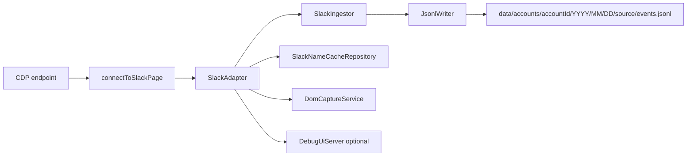
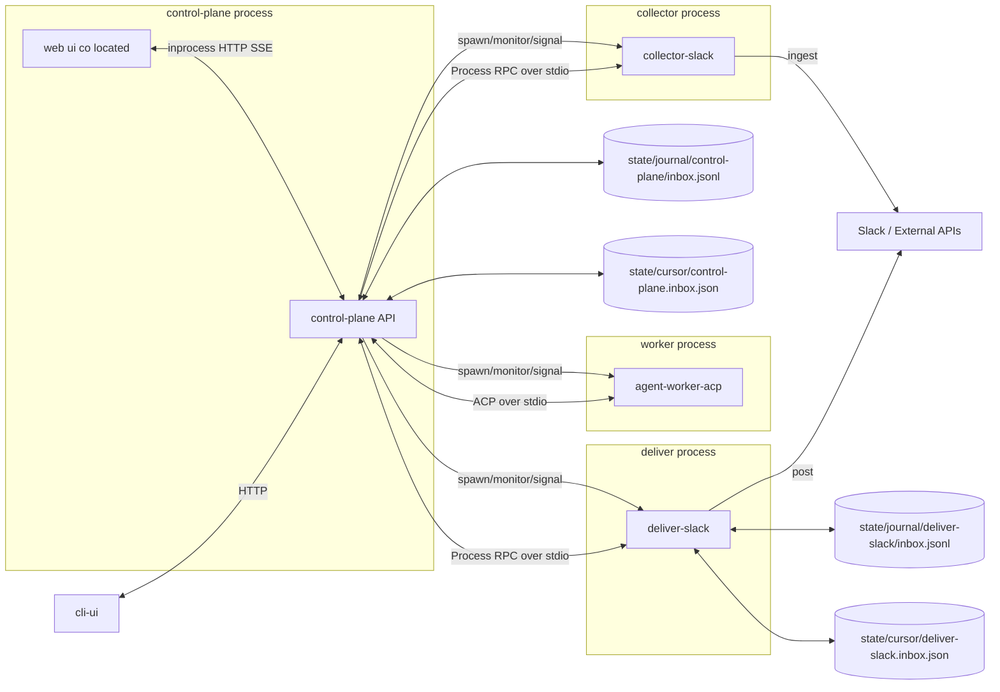
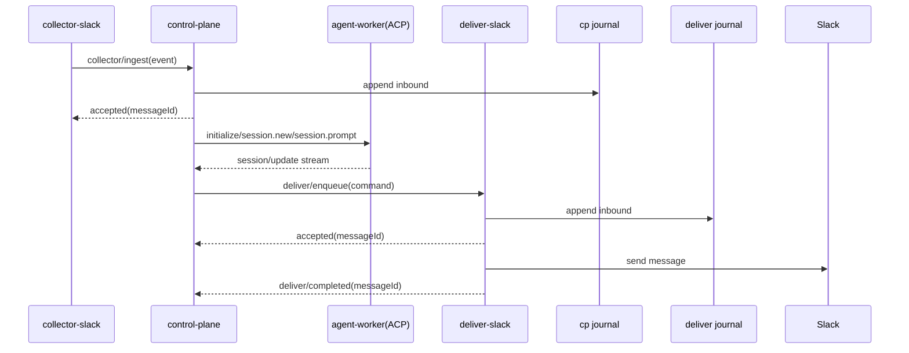
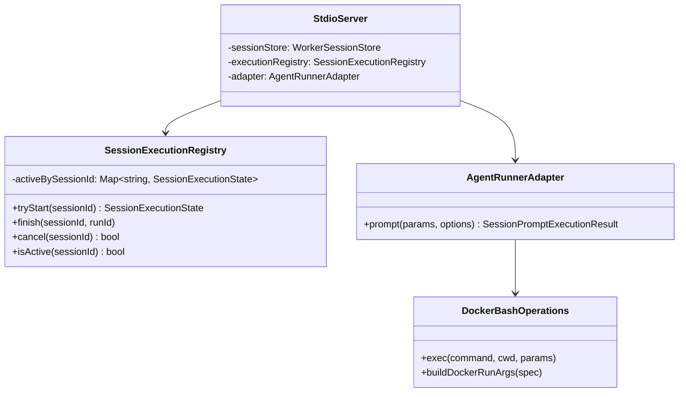

# Adjutant 仕様書 v0.4

この文書は、`src/` の現行実装に対応した統合仕様書である（旧 `doc/spec-unified.md` を統合）。
なお、ACP 分離アーキテクチャに関する最新の全体仕様は本書 14 章を優先する。

## 1. 目的

Adjutant は Slack Desktop の CDP イベントを収集し、`NormalizedEvent` 形式で JSONL に追記保存する。
加えて `pnpm start`（control-plane 起動）では、プロアクティブ通知ルーティング・Heartbeat・エージェント実行・メモリ検索を提供する。
主目的は「後段で再利用しやすいイベント基盤 + 運用可能な AI アシスタント基盤」の整備である。

### 1.1 基本原則

- 永続データの正本はファイルとして保存する（File First）。
- イベント/メッセージデータの正本は JSONL とする。
- エージェントが保持する記憶情報の正本は Markdown とする。
- SQLite は正本ではなく、検索性能のためのインデックス専用ストアとして扱う。
- インデックス更新は非同期で実行し、正本ファイル保存を先行する。
- 障害時は正本ファイルから再インデックスできる設計を前提にする。

## 2. 実装スコープ

### 2.1 レガシー実装済み

- Slack CDP 接続 (`connectToSlackPage`)
- Slack 収集アダプタ (`SlackAdapter`)
  - `Fetch.requestPaused` から `chat.postMessage` / `reactions.*` を抽出
  - `Network.webSocketFrameReceived` から一部通知を抽出
  - `Network.responseReceived` で本文・名前解決キャッシュを補完
- リアクション時 DOM キャプチャ (`DomCaptureService`)
- イベント重複排除（同一プロセス内 `uid` ベース）
- JSONL 追記保存 (`JsonlWriter`)
- Debug UI (SSE) (`DebugUiServer`)
- Slack 名称キャッシュ (`SlackNameCacheRepository`)
- Assistant UI 本体（`src/ui/*`）
- Assistant 用検索インデックス（SQLite + sqlite-vec, `<stateDir>/memory/<agentId>.sqlite`）
- Proactive routing pipeline v1.5（rule triage / attention window / batch classifier / global concurrency queue）
- Timeline v1.5 (`<stateDir>/timeline.jsonl`) と sessionKey 必須化
- Pending Flusher + Watermark store (`<stateDir>/watermarks.json`)
- Agent 終端レコード（`assistant_final` / `assistant_aborted` / `assistant_error`）
- ラン終端状態の内部確定（終端レコードを復旧・冪等吸収・後段制御の基準として利用）
- bash ツールの Docker サンドボックス実行（`ADJUTANT_SANDBOX_MODE=non-main|all`）
- 初回実行リチュアル（workspace bootstrap / BOOTSTRAP context 注入）
- Pre-compaction memory flush + context compaction 連動制御
- `memory_search` / `memory_get`（main セッション限定）と `memory_write`（`memoryWriteEnabled` run 限定）

### 2.2 現在実装済み（`src/`）

- ACP / Process RPC のメソッド定義と型・バリデータ（`src/contracts/*`）
- ACP vendor schema meta の読み込みと envelope 検証（`schema-version.ts`, `schema-validator.ts`）
- agent-worker ACP stdio サーバー（`initialize`, `authenticate`, `session/new`, `session/prompt`, `session/cancel`, `session/load`）
- `session/load` の capability gate（`ACP_ENABLE_LOAD_SESSION=1` のときのみ有効）
- Worker のインメモリ session store（`WorkerSessionStore`）
- sessionId/sessionKey/runId のレジストリ管理（`SessionRegistry`, `SessionBridge`）
- `runAgent` 呼び出しを `session/update` 通知へ中継する adapter（`AgentRunnerAdapter`）
- tool call イベントの ACP 形式マッピング（`tool_call` / `tool_call_update`）
- stopReason の ACP 正規化（`normalizeStopReason`）
- worker supervisor（子プロセス spawn、JSON-RPC request/timeout、クラッシュ時再起動）
- ACP capability matrix（unstable gate / FS capability v1 無効固定）
- permission request/resolve/cancel の registry + gateway
- run 単位の tool event bridge（重複判定付き）
- control-plane HTTP/SSE API（`POST /api/commands`, `GET /api/snapshot`, `GET /api/events/stream`）
- `POST /api/commands` の idempotency 重複吸収（同一 `sessionKey+idempotencyKey+message` は同一 `runId` を再返却）
- `POST /api/commands` の idempotency 競合検知（同一 key で payload 差分時は `409 INVALID_REQUEST`）
- control-plane 同居 WebUI の最小画面配信（`GET /`）
- session recovery（`sessionKey -> sessionId`）の journal/snapshot/replay 永続化
- `deliver/completed` の冪等最終状態ストア（completed 優先）
- JSONL journal append/drain、cursor load/commit、journal compaction
- UI runtime の pending permission 管理と tool event 参照
- AuditDetailTab 向け view model 生成（ツールイベント表示用）
- Assistant runner は `OPENAI_API_KEY` 有効時に `pi-coding-agent` 実接続、未設定時は echo fallback
- `PiAgentSessionFactory` による `createAgentSession` 初期化（`AuthStorage`/`ModelRegistry`/`SettingsManager.inMemory()`）
- workspace bootstrap / BOOTSTRAP context 注入（`origin=user` かつ `sessionKey=main` / `memoryScope=main`）
- pre-compaction memory flush（閾値判定）と context overflow 時の `session.compact()` 再試行
- compaction メタデータの永続化（`<stateDir>/worker/sessions.json`）
- markdown summary batch service（`runOnce`, watermark 保存, transcript 増分読込）
- `memory_write` ツール（`memoryWriteEnabled=true` の run 限定）
- sandbox 実行設定の session factory 連携（`ADJUTANT_SANDBOX_MODE=off|non-main|all`）
- Phase B 統合テスト（memory/sandbox/audit、path traversal/symlink 拒否、memory_write->summary->memory_search）

### 2.3 未実装

- GitHub / git-local の収集
- `POLICY_ROUTING.json` の実ルーティング適用（将来実装: priority/quiet-hours/cooldown の反映）
- 通知キューの永続化（現状はインメモリ）
- 実行中ランへの steer / action 承認 / run 状態追跡 API
- session transcript の `memory_search` 索引統合
- Heartbeat 誤通知削減のための専用重要イベント分類器
- マルチチャネル本番接続（Slack 以外）
- `src/assistant/main.ts` の役割整理（ACP 標準では `src/agent-worker-acp/stdio-server.ts` が worker entry）

### 2.4 保存基盤（部分実装）

- 永続データの正本はファイル保存
- イベント/メッセージデータは JSONL を正本として保存
- エージェント記憶は Markdown を正本として保存（設計方針）
- SQLite は Assistant の memory search 用インデックスとして利用
- Slack 収集イベントを SQLite に正本保存する方式は採用しない

## 3. 収集ランタイム実行アーキテクチャ（legacy/単体参照）

本章は legacy の単体収集ランタイムを説明する参照仕様である。ACP 分離後の標準構成は 14 章を正とする。



### 3.1 起動と再接続

- legacy 単体収集モードでは `src/index.ts` を起点に CDP 収集を開始する。
- ACP 標準構成では `src/index.ts` は control-plane のエントリポイントとして利用し、収集は `collector-slack` 子プロセスへ分離する。
- 起動時に既存 JSONL を走査し、破損末尾が見つかったファイルは当該オフセットまで truncate してから収集を開始する（`listJsonlFiles` → `recoverJsonlFiles`）。
- `resolveEndpoint()` は以下優先順位で接続先を解決する。
  1. `CDP_ENDPOINT_FILE`（既定 `.adjutant/cdp-endpoint.json`）
  2. `CDP_HOST` / `CDP_PORT`
  3. 既定値 `127.0.0.1:9222`
- セッション切断時は再接続ループへ移行する。
  - リトライ待機: `computeFullJitterDelayMs()` による指数バックオフ + フルジッタ
  - 基本式: `maxDelay = min(10000, 1000 * 2^(attempt - 1))`、`delay = floor(random() * maxDelay)`
  - `attempt` は最小 1（初回再接続時も 1）
- `SIGINT` / `SIGTERM` で adapter/client/debug UI を停止して終了する。

## 4. データモデル

型定義は `src/core/events.ts` に従う。

### 4.1 共通スキーマ

```ts
{
  schema: "adjutant.event.v1.1";
  uid: string;
  source: "slack" | "github" | "git-local";
  kind: string;
  action?: string;
  actor?: string;
  subject?: string;
  ts: string;
  logged_at?: string;
  meta?: Record<string, unknown>;
  detail?: { slack: SlackDetail } | { github: Record<string, unknown> } | { git_local: Record<string, unknown> };
}
```

### 4.2 Slack detail の実体

`SlackDetail` は union だが、現実装では主に以下キーを利用する。

- post
  - `channel_id`, `channel_name`, `message_ts`, `text`, `blocks`, `thread_ts`
- reaction
  - `channel_id`, `channel_name`, `message_ts`, `emoji`, `user`, `message_text`
- notification
  - `channel_id`, `channel_name`, `notification_type`, `title`, `message_text`, `user`, `event_ts`

注記:

- 現実装の `detail.slack` には `type` フィールドを付与していない。
- `kind` でイベント種別を判別する。
- 本文フィールド契約は `post -> detail.slack.text`、`reaction|notification -> detail.slack.message_text` を正とする。

### 4.3 UID 方針

- post: `slack:{channel_id}@{message_ts}`
- reaction: `slack:{channel_id}@{message_ts}:{emoji}:{action}:{actorId}`
- notification: `slack:{channel_id}@{event_ts or now}:{notification_type}:{actorId}`

`SlackAdapter` は同一 `uid` をメモリ上で去重し、同一プロセス内での重複書き込みを防ぐ。

## 5. Slack 収集仕様

### 5.1 Fetch interception

`Fetch.enable()` は以下 URL を Request ステージで監視する。

- `*://*.slack.com/api/chat.postMessage*`
- `*://*.slack.com/api/reactions.*`

処理内容:

- POST body を解析して `normalizeSlackMessage` / `normalizeSlackReaction` へ渡す。
- `reactions.*` では DOM キャプチャ結果が取得できれば `message_text` を補完する。

### 5.2 WebSocket frame

`webSocketFrameReceived` で受信した payload を解釈し、次を実施する。

- message 系イベントから本文キャッシュ更新
- 通知候補を抽出して `kind=notification` イベントを生成

### 5.3 Response hook

`responseReceived` で次を実施する。

- `Network.getResponseBody` により API 応答の本文情報を補完
- `conversations.view` 応答からチャンネル名キャッシュ更新
- `/cache/{team}/users/list` 応答からユーザー名キャッシュ更新

## 6. DOM キャプチャ

- `DomCaptureService` は `Runtime.evaluate` で候補 DOM を探索する。
- タイムスタンプ一致候補を複数 selector で探索し、本文/チャンネル情報を抽出する。
- リトライ遅延: `0ms, 100ms, 200ms, 300ms`
- 無効化: `ADJUTANT_DISABLE_DOM_CAPTURE=1|true`

制約:

- `/api/reactions.*` の送信を契機に動くため、他ユーザー由来の受信通知だけでは発火しない。
- メッセージが可視 DOM に存在しない場合は本文補完できない。

## 7. 保存仕様

### 7.1 JSONL

出力先:

```text
<dataDir>/accounts/<account_id>/YYYY/MM/DD/<source>/events.jsonl
```

- 1 行 1 JSON
- `logged_at` が未設定なら `JsonlWriter` が現在時刻で補完
- `meta.account_id` が未設定なら `default` を補完
- `logged_at` を基準に日付ディレクトリを決定
- 書き込み時に `checksum` フィールド（sha256 ベース 16 文字）を付与
- append 失敗時は最大 2 回リトライ（`ENOENT` は mkdir 後に再試行）

### 7.2 名称キャッシュ

```text
<dataDir>/accounts/<account_id>/_cache/slack/channel-names-by-team/<team_id>.json
<dataDir>/accounts/<account_id>/_cache/slack/user-names-by-team/<team_id>.json
```

- team ごとに分割保存
- 起動時にロードし、収集中に差分更新
- user cache (`adjutant.slack.user-cache.v2`) の `users` は次を保持する
  - `real_name`
  - `profile.display_name`
  - `profile.email`
  - `profile.first_name`
  - `profile.last_name`
  - `profile.image_original`

### 7.3 CDP 生イベントログ（任意）

`ADJUTANT_CDP_EVENT_LOG=1` の場合、次へ JSONL 追記する。

```text
<dataDir>/_debug/cdp-events.jsonl
```

- `schema=adjutant.cdp.event.v1`
- `method`, `params`, `session_id`, `host`, `port`, `slack_url` を保持
- `ADJUTANT_CDP_EVENT_LOG_MAX_PARAM_CHARS` で `params` の最大文字数を制限可能

### 7.4 Raw Fetch ログ（任意）

`ADJUTANT_RAW_FETCH_LOG=1` の場合、次へ JSONL 追記する。

```text
<dataDir>/_debug/raw-fetch.jsonl
```

- `schema=adjutant.raw-fetch.event.v1`
- `kind=raw_fetch`
- `source`, `at`, `payload`, `logged_at` を保持
- `ADJUTANT_RAW_FETCH_LOG_MAX_PAYLOAD_CHARS` が 0 より大きい場合、`payload` は文字数上限を超えると `_truncated` 付き preview に切り詰める

## 8. 設定

### 8.1 収集ランタイム

| 変数                                       | 既定値                              | 用途                                |
| ------------------------------------------ | ----------------------------------- | ----------------------------------- |
| `CDP_HOST`                                 | `127.0.0.1`                         | CDP 接続先ホスト                    |
| `CDP_PORT`                                 | `9222`                              | CDP 接続先ポート                    |
| `CDP_ENDPOINT_FILE`                        | `.adjutant/cdp-endpoint.json`       | 接続先 JSON の読み込み元            |
| `DATA_DIR`                                 | `<stateDir>/data`                   | 出力ディレクトリ                    |
| `ADJUTANT_SLACK_ACCOUNT_ID`                | `default`                           | Slack 保存先 account_id             |
| `ADJUTANT_TZ`                              | `Asia/Tokyo`                        | イベント時刻整形タイムゾーン        |
| `ADJUTANT_DEBUG`                           | -                                   | Slack デバッグトピック有効化        |
| `ADJUTANT_DISABLE_DOM_CAPTURE`             | `0`                                 | DOM 補完無効化                      |
| `ADJUTANT_DEBUG_UI`                        | `0`                                 | Debug UI サーバ起動                 |
| `ADJUTANT_DEBUG_UI_PORT`                   | `8787`                              | Debug UI ポート                     |
| `ADJUTANT_CDP_EVENT_LOG`                   | `0`                                 | CDP 生イベントを JSONL 保存         |
| `ADJUTANT_CDP_EVENT_LOG_PATH`              | `<dataDir>/_debug/cdp-events.jsonl` | CDP 生イベント出力先                |
| `ADJUTANT_CDP_EVENT_LOG_MAX_PARAM_CHARS`   | `0`                                 | params 切り詰め上限 (`0` は無制限)  |
| `ADJUTANT_RAW_FETCH_LOG`                   | `0`                                 | Raw Fetch イベントを JSONL 保存     |
| `ADJUTANT_RAW_FETCH_LOG_PATH`              | `<dataDir>/_debug/raw-fetch.jsonl`  | Raw Fetch イベント出力先            |
| `ADJUTANT_RAW_FETCH_LOG_MAX_PAYLOAD_CHARS` | `0`                                 | payload 切り詰め上限 (`0` は無制限) |
| `CDP_WAIT_ATTEMPTS`                        | `10` (script)                       | CDP 起動待ち試行回数                |
| `CDP_WAIT_DELAY`                           | `1` (script, sec)                   | CDP 起動待ち間隔                    |

`ADJUTANT_DEBUG` の主な値:

- `slack`
- `slack:verbose`
- `slack:domprobe`
- `slack:network`
- `slack:fetch`
- `slack:fetch:hook`
- `slack:runtime`

### 8.2 Assistant / Proactive

| 変数                                          | 既定値                                | 用途                                            |
| --------------------------------------------- | ------------------------------------- | ----------------------------------------------- |
| `ADJUTANT_ROUTING_IDLE_MS`                    | `1000`                                | channel attention-window idle                   |
| `ADJUTANT_ROUTING_MAX_WAIT_MS`                | `30000`                               | channel attention-window max wait               |
| `ADJUTANT_ROUTING_DM_IDLE_MS`                 | `200`                                 | DM attention-window idle                        |
| `ADJUTANT_ROUTING_DM_MAX_WAIT_MS`             | `1000`                                | DM attention-window max wait                    |
| `ADJUTANT_ROUTING_CONFIDENCE_THRESHOLD`       | `0.7`                                 | batch classifier confidence 閾値                |
| `ADJUTANT_ROUTE_LLM_ENABLED`                  | `false`                               | secondary classifier（Route LLM）有効化         |
| `ADJUTANT_ROUTE_LLM_MODEL`                    | `gpt-5-mini`                          | Route LLM モデル                                |
| `ADJUTANT_ROUTE_LLM_TIMEOUT_MS`               | `1000`                                | Route LLM / batch classifier timeout            |
| `ADJUTANT_ROUTE_LLM_MAX_CONCURRENT`           | `1`                                   | Route LLM 同時実行上限                          |
| `ADJUTANT_AGENT_AUDIT_LOG_ENABLED`            | `true`                                | エージェント監査ログ（NDJSON）有効化            |
| `ADJUTANT_AGENT_AUDIT_LOG_PATH`               | `<stateDir>/audit/agent-audit.ndjson` | エージェント監査ログ保存先                      |
| `ADJUTANT_AGENT_AUDIT_MAX_FIELD_CHARS`        | `4000`                                | 監査ログのフィールド切り詰め上限                |
| `ADJUTANT_GLOBAL_MAX_CONCURRENT`              | `3`                                   | global queue 基本同時実行上限                   |
| `ADJUTANT_GLOBAL_DM_BURST_SLOT`               | `1`                                   | DM burst slot                                   |
| `ADJUTANT_GLOBAL_MAX_RUNNING_DM`              | `3`                                   | DM 同時実行上限                                 |
| `ADJUTANT_GLOBAL_STARVATION_MS`               | `120000`                              | starvation 昇格閾値                             |
| `ADJUTANT_FLUSHER_INTERVAL_MS`                | `300000`                              | Pending Flusher 周期                            |
| `ADJUTANT_FLUSHER_STALE_MS`                   | `900000`                              | stale open post 判定閾値                        |
| `ADJUTANT_COMPACTION_ENABLED`                 | `true`                                | overflow 時 compaction 優先                     |
| `ADJUTANT_MEMORY_FLUSH_ENABLED`               | `true`                                | pre-compaction flush 有効化                     |
| `ADJUTANT_COMPACTION_RESERVE_TOKENS_FLOOR`    | `20000`                               | flush 閾値計算の reserve                        |
| `ADJUTANT_MEMORY_FLUSH_SOFT_THRESHOLD_TOKENS` | `4000`                                | flush 閾値計算の soft threshold                 |
| `ADJUTANT_MEMORY_FLUSH_PROMPT`                | 組み込み既定文                        | flush turn の user prompt                       |
| `ADJUTANT_MEMORY_FLUSH_SYSTEM_PROMPT`         | 組み込み既定文                        | flush turn の system prompt                     |
| `ADJUTANT_MEMORY_SEARCH_ENABLED`              | `true`                                | memory_search/memory_get 有効化                 |
| `ADJUTANT_MEMORY_SEARCH_DB_PATH`              | `<stateDir>/memory/<agentId>.sqlite`  | メモリ検索インデックス DB                       |
| `ADJUTANT_MEMORY_SEARCH_MODEL`                | `text-embedding-3-small`              | 埋め込みモデル                                  |
| `ADJUTANT_MEMORY_SEARCH_MAX_RESULTS`          | `5`                                   | 検索結果上限                                    |
| `ADJUTANT_MEMORY_SEARCH_MIN_SCORE`            | `0`                                   | 最低スコア                                      |
| `ADJUTANT_MEMORY_SEARCH_VECTOR_ENABLED`       | `true`                                | vector 検索有効化                               |
| `ADJUTANT_MEMORY_SEARCH_SQLITE_VEC_PATH`      | `""`                                  | sqlite-vec 拡張パス                             |
| `ADJUTANT_MEMORY_SEARCH_CHUNK_CHARS`          | `1600`                                | chunk 文字数                                    |
| `ADJUTANT_MEMORY_SEARCH_CHUNK_OVERLAP_CHARS`  | `320`                                 | chunk overlap                                   |
| `ADJUTANT_MEMORY_SEARCH_SNIPPET_MAX_CHARS`    | `700`                                 | snippet 文字数上限                              |
| `ADJUTANT_MEMORY_SEARCH_CANDIDATE_MULTIPLIER` | `3`                                   | 候補拡張倍率                                    |
| `ADJUTANT_MEMORY_SEARCH_VECTOR_WEIGHT`        | `0.7`                                 | hybrid score の vector 重み                     |
| `ADJUTANT_MEMORY_SEARCH_TEXT_WEIGHT`          | `0.3`                                 | hybrid score の text 重み                       |
| `ADJUTANT_SANDBOX_MODE`                       | `all`                                 | bash sandbox mode（`off` / `non-main` / `all`） |
| `ADJUTANT_SANDBOX_IMAGE`                      | `adjutant-sandbox:trixie-slim`        | sandbox Docker image                            |
| `ADJUTANT_SANDBOX_AUTO_BUILD_IMAGE`           | `true`                                | 未存在時に sandbox image を自動 build する      |
| `ADJUTANT_SANDBOX_ENV_ALLOWLIST`              | `LANG,LC_ALL,TERM,TZ`                 | sandbox に引き渡す環境変数 allowlist            |
| `ADJUTANT_SANDBOX_WORKDIR`                    | `/workspace`                          | コンテナ内作業ディレクトリ                      |
| `ADJUTANT_SANDBOX_NETWORK`                    | 未設定（bridge）                      | Docker network（例: `none`）                    |
| `ADJUTANT_SANDBOX_MEMORY`                     | 未設定                                | Docker memory limit（例: `1g`）                 |
| `ADJUTANT_SANDBOX_PIDS_LIMIT`                 | `256`                                 | Docker pids limit                               |

## 9. 実行コマンド

- `pnpm start`: `src/index.ts`（control-plane エントリポイント）を起動（`web-ui` 同居、worker は supervisor が子プロセス起動）
- `node --import tsx src/agent-worker-acp/stdio-server.ts`: 開発/デバッグ用に worker（ACP stdio）を単体起動
- `pnpm run sandbox:build`: sandbox 用 Docker イメージをビルド
- `pnpm dev`: `ensureSlackWithCdp` 実行後に `pnpm start`
- `pnpm run serve`: `dist/backend/index.js` を起動（事前に `pnpm run build:backend`）

## 10. 既知の制約

- CDP 依存のため Slack クライアント実装変更の影響を受けやすい。
- `uid` 去重はプロセス内のみで、再起動をまたぐ厳密な重複排除は未実装。
- 永続層はファイル保存（現行は JSONL）中心で、検索は補助インデックスに依存する。
- `POLICY_ROUTING.json` は将来実装予定（現行ランタイムでは未使用）。

## 11. ロードマップ（設計メモ）

- GitHub / git-local アダプタ追加
- cross-source 集計のための検索インデックス強化（SQLite）

## 12. ファイルファースト保存原則（設計）

この章は保存設計の原則を示す。

- 正本データはファイルとして保存する（File First）。
- イベント/メッセージデータの正本は JSONL とする。
- エージェント記憶データの正本は Markdown とする。
- SQLite は検索インデックス専用の派生ストアとして扱う。
- 書き込み順序は「正本ファイル保存を先行」し、その後に非同期で SQLite インデックスを更新する。
- 一貫性モデルは Eventual Consistency とし、検索結果の反映遅延を許容する。
- 障害時の復旧は正本ファイル（JSONL/Markdown）からの再インデックスを基本とする（SQLite は再生成可能なキャッシュ）。
- バックアップ/移行の基準は正本ファイル群とし、SQLite は必須バックアップ対象から分離可能とする。

### 12.1 非同期インデックス更新フロー（想定）

1. イベントまたは記憶データを正本ファイル（JSONL または Markdown）へ append/update する。
2. append 成功後にインデックス更新ジョブをキューへ投入する。
3. ワーカーが正本ファイル差分を読み取り、SQLite の FTS/補助テーブルを更新する。
4. 更新失敗時はジョブを再試行し、必要に応じて日次または全量リビルドを実行する。

### 12.2 設計上の制約

- SQLite 側のスキーマは検索最適化のための冗長化を許容する。
- 重複更新に耐えるため、インデックス更新は冪等に設計する。
- 正本ファイル（JSONL/Markdown）と SQLite の不整合検知のため、最終インデックス時刻や対象ファイルハッシュを保持する。

## 13. Assistant / Proactive 実装仕様

### 13.1 ランタイム責務（legacy と ACP の対応）

- legacy 統合ランタイムでは `legacy/impl-20260228/src/assistant/main.ts` が API / UI / channel manager / heartbeat / pending flusher を単一プロセスで起動する。
- ACP 標準構成（14章優先）では `src/index.ts` が control-plane 統合エントリポイントとなり、worker entry は `src/agent-worker-acp/stdio-server.ts` を正とする。
- `src/assistant/main.ts` は legacy 互換のスタブであり、標準起動導線（`pnpm start`）では使用しない。
- 起動時に `<stateDir>/timeline.jsonl`、`<stateDir>/idempotency.jsonl`、`<stateDir>/agents/<agentId>/sessions/*.jsonl`、`DATA_DIR` 配下 JSONL を `recoverJsonlFiles` で復旧する。
- proactive 経路は dual-write で `<stateDir>/timeline.jsonl` と `<stateDir>/agents/<agentId>/sessions/<sessionKey>.jsonl` の両方へ追記する。
- `ADJUTANT_AGENT_AUDIT_LOG_ENABLED=1` の場合、`<stateDir>/audit/agent-audit.ndjson`（または `ADJUTANT_AGENT_AUDIT_LOG_PATH`）へ `run.start/run.end`・`tool.start/tool.end`・`file.read/file.write` を追記する。
- 監査ログは append-only NDJSON。`token`/`apiKey`/`password`/`authorization` 等の機微キーはマスクし、長大フィールドは `ADJUTANT_AGENT_AUDIT_MAX_FIELD_CHARS` で切り詰める。
- 非文字列フィールドが切り詰め対象の場合は `{ "_truncated": true, "originalType": "...", "preview": "..." }` 形式で保持する。
- `ADJUTANT_MARKDOWN_SUMMARY_BATCH_ENABLED=1` の場合、要約バッチが定期実行される。
  - 入力: `<stateDir>/agents/<agentId>/sessions/*.jsonl`
  - 抽出: `user/assistant` のみ、`/` で始まる command 行を除外、filter 後 slice（既定 15）
  - 出力: `memory/YYYY-MM-DD.md` へ append
  - checkpoint: `<stateDir>/agents/<agentId>/summary-batch-watermark.json`
  - checkpoint `sessions` のキーは絶対パスではなく相対安定キー（`state:<relpath>`）を使う
  - `maxSessions` 上限時は `lastProcessedTs` が古いもの（未処理含む）を優先し、固定ファイル飢餓を防ぐ
  - transcript が truncate/rotate で縮小した場合は `previousOffset > fileSize` を検知して offset を 0 に戻し再走査する
  - 日付グループ追記が途中で失敗した場合は、成功済みグループ分の offset まで watermark を前進させ重複追記を抑止する
  - JSONL 最終行が改行なしでも 1 行として解析する
  - バッチ実行は単一 in-flight（実行中 tick は skip）で重複実行を防ぐ

### 13.2 ルーティングパイプライン v1.5

- pipeline は `rule triage` -> `attention window` -> `batch classifier` -> `notification queue` -> `chat dispatch` の順で処理する。
- sessionKey は Slack channel/thread から解決する。
  - channel: `slack:channel:<channelId>`
  - group/im: `slack:group:<channelId>` / `slack:<channelId>`
  - thread: `:thread:<threadTs>` を付与
- `rule triage`:
  - self 投稿は drop
  - DM は immediate
  - mention は immediate
  - channel post は accumulate
- `attention window` は sessionKey 単位でバッファし、idle または maxWait で flush する。
- 既定値:
  - channel: `idle=1000ms`, `maxWait=30000ms`
  - DM: `idle=200ms`, `maxWait=1000ms`
- `batch classifier` は `respond|note|ignore` を返す。タイムアウト/例外/低 confidence は fail-closed で `note` として扱う。
- dispatch は既定で `runTarget=main` へ送信し、元セッションは `originSessionKey` で保持する。
- global queue は `dm/group/channel/flusher/heartbeat` の source 優先度で同時実行を制御し、DM burst slot と starvation 昇格を持つ。

### 13.3 Timeline v1.5 / Watermark / Pending Flusher

- `TimelineRecordV1_5` は `schema=adjutant.timeline.record.v1.5`、`sessionKey`、`ts`、`loggedAt` を必須とする。
- action record の `actionType` は `assistant_final|assistant_aborted|assistant_error`。
- terminal action は `DualWriteCoordinator.appendAssistant()` で timeline/session へ dual-write し、timeline 成功時は `timelineOffset` を返す。
- `onTerminalRecord` は `status != pending-timeline` かつ `timelineOffset` がある場合に `watermarkStore.applyTerminalRecord(sessionKey, actionType, offset)` を呼ぶ。
- `pending-timeline` または offset 未取得時は watermark を更新せず warning を記録する。
- `assistant_final` のみ handled 境界として扱い、`aborted/error` では境界を進めない。
- Pending Flusher は `<stateDir>/timeline.jsonl` を byte offset で差分走査し、sessionKey 別に open post を集計する。
- stale 判定は `loggedAt` と `ADJUTANT_FLUSHER_STALE_MS`（既定 900000ms）で行う。
- 別人返信（oldest actor と異なる actor）を検出した session は抑制して起動しない。
- tick 後は `watermarks.scan.lastGoodOffset` に `lastScannedOffset` を揃えて保存し、prune を実行する。
- timeline truncate 復旧で `lastScannedOffset > fileSize` の場合、offset と session 状態を 0 / 空へリセットする。

### 13.4 初回実行リチュアル（BOOTSTRAP 注入）

- `origin=user` の実行前に workspace bootstrap を保証する。
- 初期化で `AGENTS.md`, `SOUL.md`, `TOOLS.md`, `IDENTITY.md`, `USER.md`, `HEARTBEAT.md` を不足時のみ作成する。
- brand-new workspace の場合のみ `BOOTSTRAP.md` を作成する。
- prompt 注入条件:
  - `origin=user`
  - `isHeartbeat=false`
  - `sessionKey=main`
  - `memoryScope=main`
- 注入対象は bootstrap 7 ファイル + 存在時のみ `MEMORY.md` / `memory.md`。
- `BOOTSTRAP.md` が missing のときは context へ含めない（削除後に自然停止）。
- 各ファイルは既定 20000 文字で head/tail トリミング（70% / 20%）される。

### 13.5 Pre-compaction Memory Flush / Context Compaction

- pre-flush 判定は `session.getContextUsage()` を使い、しきい値 `contextWindow - reserveFloor - softThreshold` を超えた場合のみ実行する。
- pre-flush 実行条件:
  - memory flush enabled
  - main scope
  - non-heartbeat
  - workspace writable
  - 同一 compaction cycle で未実行（`memoryFlushCompactionCount !== compactionCount`）
- flush turn は silent で実行し、失敗時は warning のみで本処理を継続する。
- `context_overflow` は `session.compact()` を優先し、失敗時のみ prompt trim fallback を使う。
- `sessions.json` には `compactionCount`, `memoryFlushAt`, `memoryFlushCompactionCount`, `contextTokens`, `contextWindowTokens` を保存する。

### 13.6 SQLite Hybrid Memory Search / Memory Write（Local File First）

- `memory_search` / `memory_get` は `memoryScope=main` のセッションでのみ custom tool として登録する。
- `memory_write` は `memoryWriteEnabled=true` の run で custom tool として登録する。
- `memoryWriteEnabled=false` の run では `memory_write` を登録せず、`memory_write` の tool event は監査対象から除外する。
- `memory_write` の入力は `{ content: string; scope?: "daily" | "long-term" }`。
- `scope=daily` は `memory/YYYY-MM-DD.md` へ追記し、`scope=long-term` は `MEMORY.md` を更新する。
- source of truth はローカル Markdown（`MEMORY.md` と `memory/**/*.md`）。
- index DB の既定値は `<stateDir>/memory/<agentId>.sqlite`。
- 検索は FTS5(BM25) と sqlite-vec のハイブリッドスコアで返す。
- 埋め込み取得失敗時は BM25 のみで継続し、`fallback` を返す。
- `memory_get` は allowlist（`MEMORY.md`, `memory/*.md`）+ workspace 内 + symlink 拒否で path を検証する。
- 例外は throw せず、`disabled/error` を含む tool 契約レスポンスへ正規化する。

### 13.7 Bash Sandbox（Docker）

- `ADJUTANT_SANDBOX_MODE=all`（既定）では heartbeat を除く全セッションの bash 実行をコンテナ化。
- `ADJUTANT_SANDBOX_MODE=non-main` では `memoryScope=main` 以外（spoke）の bash 実行のみをコンテナ化。
- `ADJUTANT_SANDBOX_MODE=off` では従来どおりホスト実行。
- 起動時（ACP 標準: `src/index.ts`、legacy 統合: `legacy/impl-20260228/src/assistant/main.ts`）は以下順で fail-safe 初期化する。
  1. Docker daemon 可用性確認（不可なら起動中断）
  2. sandbox image 存在確認（未存在時は `ADJUTANT_SANDBOX_AUTO_BUILD_IMAGE=true` なら自動 build）
  3. `configureSandbox()` へ per-tool 実行 spec を注入
- bash 実行は `docker run --rm -i -w <mappedCwd> ... <image> bash -lc "<command>"` を使用し、tool 呼び出し単位でコンテナを作成・終了時削除する。
- 常駐コンテナは保持しないため、並行セッション時も tool 実行は独立コンテナとして分離される。
- sandbox イメージには `bash` / `git` / `curl` / `jq` / `rg`（ripgrep）を同梱する。

## 14. ACP 分離アーキテクチャ（s02 基準）

この章は旧 s02 計画の全体像を `spec.md` 向けに統合したものである。  
本章と他章に差分がある場合は、本章を優先する。

### 14.1 目的と方針

- AI 実行部を `agent-worker-acp` として分離し、`control-plane` と ACP（JSON-RPC over stdio）で接続する。
- `collector` / `deliver` は Process RPC（JSON-RPC over stdio）で `control-plane` と接続する。
- 各プロセスは受信メッセージを処理前に inbound journal（JSONL）へ追記し、同期 `accepted` と非同期 `completed|failed` を分離する。
- v1 は単一ホスト前提、at-least-once 前提、重複は dedupe と冪等更新で吸収する。

### 14.2 プロセス構成

- `control-plane`: 親プロセス。API 提供、ジョブ制御、worker/collector/deliver の起動監視、capability gate、journal/cursor 管理、`web-ui` の同居ホスティング
- `agent-worker-acp`: 子プロセス。ACP サーバーとして `initialize/session/*` を処理し `session/update` を通知
- `collector-slack`: 子プロセス。Slack 由来イベントを `collector/ingest` で control-plane へ送信
- `deliver-slack`: 子プロセス。`deliver/enqueue` を受けて外部送信し `deliver/completed` を通知
- `web-ui`: `control-plane` 同一プロセス内で配信される UI（HTTP/SSE 経由で API を利用）
- `cli`: control-plane API（HTTP）に接続する外部クライアント
- 開発時は Vite dev server を別プロセスで起動してもよいが、本番/標準起動は同居を正とする
- 実装補足（Phase C）
  - collector 側 supervision は `CollectorSupervisor`（`src/control-plane/process-rpc/collector-supervisor.ts`）で実装し、spawn/monitor/restart/request-timeout を担う。
  - worker 側 supervision（`WorkerSupervisor`）と collector 側 supervision は `src/control-plane/supervisor/stdio-supervisor-utils.ts` を共有し、stdio 行分割と再起動判定ロジックを共通化する。

### 14.3 プロセス接続連携図



### 14.4 代表シーケンス（accepted/completed 分離）



#### Worker 実行制御クラス図



### 14.5 境界契約

- ACP（control-plane <-> worker）
  - baseline: `initialize`, `session/new`, `session/prompt`, `session/cancel`, `session/update`
  - optional stable: `authenticate`, `session/load`, `session/set_mode`, `session/set_config_option`
  - optional stable は実装任意（phase/プロセスごとに採否を決定）。未採用時は capability 不在として `UNSUPPORTED_CAPABILITY` を返却する。
  - optional unstable: `session/list`, `session/resume`, `session/fork`, `session/set_model`（feature flag 有効時のみ）
  - 実行制約: 異なる `sessionId` の `session/prompt` は並行実行可能、同一 `sessionId` の同時 `session/prompt` は `SESSION_BUSY` を返却
- Process RPC（control-plane <-> collector/deliver）
  - request/response: `collector/ingest`, `deliver/enqueue`（同期 `accepted`）
  - notification: `deliver/completed`（非同期、at-least-once）
- HTTP API（control-plane）
  - `POST /api/commands`
  - `GET /api/snapshot`
  - `GET /api/events/stream`
  - `GET /api/chat/runs/:runId/stream` (`event: chat`)
    - `ChatStreamEvent` は後方互換の optional 拡張として
      `toolCallId` / `toolName` / `toolStatus` / `toolInput` / `toolOutput` / `toolError` を持つ
  - `GET /api/threads/:threadId/snapshot`
    - `toolEventsByRun[runId][]` は optional で `rawInput` / `rawOutput` / `error` を含む
  - `POST /api/commands` は `idempotencyKey` を受け付け、同一 payload 再送時は run を再作成せず既存 `runId` を返す
  - 同一 `idempotencyKey` で payload が異なる場合は `409 INVALID_REQUEST` を返す

#### API/SSE 例

```bash
curl -sS -X POST http://127.0.0.1:3100/api/commands \
  -H 'content-type: application/json' \
  -d '{"sessionKey":"main","message":"hello"}'
```

```json
{
  "messageId": "msg_xxx",
  "status": "accepted",
  "acceptedAt": "2026-02-28T10:00:00.000Z",
  "runId": "session:sess_xxx:run:1"
}
```

```bash
curl -N http://127.0.0.1:3100/api/events/stream
```

```text
event: run/update
data: {"runId":"session:sess_xxx:run:1","update":{"sessionUpdate":"agent_message_chunk","content":{"type":"text","text":"hello"}}}
```

#### `pi-coding-agent` 必須設定（Phase A）

- `OPENAI_API_KEY`: 必須（未設定時は runner が echo fallback に切り替わる）
- `ADJUTANT_MODEL`: 任意（`provider/model` 形式、例: `openai/gpt-4.1`）

### 14.6 Journal / Cursor / 冪等規約

- 各プロセスは自プロセス所有 inbox の cursor のみ commit する。
- cursor commit は `completed|failed` など最終状態確定後に行い、`accepted` 時点では進めない。
- `collector/ingest` の受理レコードは `state/journal/control-plane/inbox.jsonl` に append し、対応 cursor は `state/cursor/control-plane.inbox.json` を使用する。
- control-plane は起動時に `control-plane.inbox` cursor 以降の未処理 `collector/ingest` レコードを replay し、run 実行導線へ再投入する。
- `collector/ingest` 起点の cursor commit は run の terminal（`completed|failed|cancelled`）でのみ進め、`accepted` 時点では進めない。
- `collector/ingest` の `payload` は `NormalizedEvent`（`source=slack`）を正本とする。
- `deliver/completed` の冪等更新は `messageId` を主キーとする。
- `completed` と `failed` が競合した場合、`completed` を最終状態として優先する。
- backlog 運用指標は `ingest_backlog_count` と `oldest_ingest_age_seconds` を使用し、しきい値・一次対応は `doc/runbook/collector-backlog-monitoring.md` を正本とする。

### 14.7 Capability Gate 方針

- unstable method は既定無効、`enableUnstableSessionMethods=true` のときのみ許可する。
- FS capability（`fs/read_text_file`, `fs/write_text_file`）は v1 非スコープとして無効固定とする。
- capability 不在時は呼び出しを行わず `UNSUPPORTED_CAPABILITY` を返却する。
- Phase B 機能の段階リリースは `ADJUTANT_PHASE_B_ROLLOUT_SCOPE` で制御する。
  - `main`（既定）: main セッションのみ有効
  - `all`: spoke まで展開

### 14.8 エラー分類と回復

- 代表エラー: `UNSUPPORTED_CAPABILITY`, `ACP_PROTOCOL_ERROR`, `JOURNAL_APPEND_FAILED`, `WORKER_TIMEOUT`, `WORKER_CRASHED`, `DOWNSTREAM_ERROR`, `INVALID_RECORD`, `SESSION_BUSY`
- worker 異常終了時は supervisor が再起動を試行し、構造化ログへ理由を記録する。
- process 再起動時は journal + cursor から未処理のみ再開する。
- collector 側障害（CDP 切断、ingest timeout、backlog 増加）は `doc/runbook/collector-backlog-monitoring.md` の一次対応に従う。
- 運用ロールバック手順は `doc/runbook/phase-b-rollback.md` を正本とする。

### 14.9 v1 制約

- 単一ホスト実行のみ想定
- at-least-once 配信（exactly-once ではない）
- terminal gateway / FS capability は v1 非スコープ
- pre-compaction memory flush は s02 では非スコープだったが、s04 で実装済み
