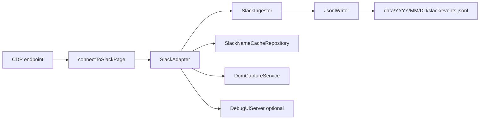

# Adjutant 仕様書 v0.2

この文書は、`src/` の現行実装に対応した仕様を記述する。将来計画は最後に分離して記載する。

## 1. 目的

Adjutant は Slack Desktop の CDP イベントを収集し、`NormalizedEvent` 形式で JSONL に追記保存する。
主目的は「後段で再利用しやすいイベント基盤の整備」であり、要約生成や他ソース統合は現時点では未実装。

## 2. 実装スコープ

### 2.1 実装済み

- Slack CDP 接続 (`connectToSlackPage`)
- Slack 収集アダプタ (`SlackAdapter`)
  - `Fetch.requestPaused` から `chat.postMessage` / `reactions.*` を抽出
  - `Network.webSocketFrameReceived` から一部通知を抽出
  - `Network.responseReceived` で本文・名前解決キャッシュを補完
- リアクション時 DOM キャプチャ (`DomCaptureService`)
- イベント重複排除（同一プロセス内 `uid` ベース）
- JSONL 追記保存 (`JsonlWriter`)
- Debug UI (SSE) (`DebugUiServer`)
- Slack 名称キャッシュ (`SlackNameCacheRepository`)

### 2.2 未実装

- GitHub / git-local の収集
- 日次 Markdown 要約バッチ
- 永続 DB（SQLite 等）
- UI 本体（Debug UI を除く）

## 3. 実行アーキテクチャ



### 3.1 起動と再接続

- エントリポイントは `src/index.ts`。
- `resolveEndpoint()` は以下優先順位で接続先を解決する。
  1. `CDP_ENDPOINT_FILE`（既定 `.adjutant/cdp-endpoint.json`）
  2. `CDP_HOST` / `CDP_PORT`
  3. 既定値 `127.0.0.1:9222`
- セッション切断時は再接続ループへ移行する。
  - リトライ待機: `1000ms * retryCount`
  - 上限: `10000ms`
- `SIGINT` / `SIGTERM` で adapter/client/debug UI を停止して終了する。

## 4. データモデル

型定義は `src/core/events.ts` に従う。

### 4.1 共通スキーマ

```ts
{
  schema: "adjutant.event.v1.1";
  uid: string;
  source: "slack" | "github" | "git-local";
  kind: string;
  action?: string;
  actor?: string;
  subject?: string;
  ts: string;
  logged_at?: string;
  meta?: Record<string, unknown>;
  detail?: { slack: SlackDetail } | { github: Record<string, unknown> } | { git_local: Record<string, unknown> };
}
```

### 4.2 Slack detail の実体

`SlackDetail` は union だが、現実装では主に以下キーを利用する。

- post
  - `channel_id`, `channel_name`, `message_ts`, `text`, `blocks`, `thread_ts`
- reaction
  - `channel_id`, `channel_name`, `message_ts`, `emoji`, `user`, `message_text`
- notification
  - `channel_id`, `channel_name`, `notification_type`, `title`, `message_text`, `user`, `event_ts`

注記:

- 現実装の `detail.slack` には `type` フィールドを付与していない。
- `kind` でイベント種別を判別する。

### 4.3 UID 方針

- post: `slack:{channel_id}@{message_ts}`
- reaction: `slack:{channel_id}@{message_ts}:{emoji}:{action}:{actorId}`
- notification: `slack:{channel_id}@{event_ts or now}:{notification_type}:{actorId}`

`SlackAdapter` は同一 `uid` をメモリ上で去重し、同一プロセス内での重複書き込みを防ぐ。

## 5. Slack 収集仕様

### 5.1 Fetch interception

`Fetch.enable()` は以下 URL を Request ステージで監視する。

- `*://*.slack.com/api/chat.postMessage*`
- `*://*.slack.com/api/reactions.*`

処理内容:

- POST body を解析して `normalizeSlackMessage` / `normalizeSlackReaction` へ渡す。
- `reactions.*` では DOM キャプチャ結果が取得できれば `message_text` を補完する。

### 5.2 WebSocket frame

`webSocketFrameReceived` で受信した payload を解釈し、次を実施する。

- message 系イベントから本文キャッシュ更新
- 通知候補を抽出して `kind=notification` イベントを生成

### 5.3 Response hook

`responseReceived` で次を実施する。

- `Network.getResponseBody` により API 応答の本文情報を補完
- `conversations.view` 応答からチャンネル名キャッシュ更新
- `/cache/{team}/users/list` 応答からユーザー名キャッシュ更新

## 6. DOM キャプチャ

- `DomCaptureService` は `Runtime.evaluate` で候補 DOM を探索する。
- タイムスタンプ一致候補を複数 selector で探索し、本文/チャンネル情報を抽出する。
- リトライ遅延: `0ms, 100ms, 200ms, 300ms`
- 無効化: `ADJUTANT_DISABLE_DOM_CAPTURE=1|true`

制約:

- `/api/reactions.*` の送信を契機に動くため、他ユーザー由来の受信通知だけでは発火しない。
- メッセージが可視 DOM に存在しない場合は本文補完できない。

## 7. 保存仕様

### 7.1 JSONL

出力先:

```text
<dataDir>/YYYY/MM/DD/slack/events.jsonl
```

- 1 行 1 JSON
- `logged_at` が未設定なら `JsonlWriter` が現在時刻で補完
- `logged_at` を基準に日付ディレクトリを決定
- append 失敗時は最大 2 回リトライ（`ENOENT` は mkdir 後に再試行）

### 7.2 名称キャッシュ

```text
<dataDir>/_cache/slack/channel-names-by-team/<team_id>.json
<dataDir>/_cache/slack/user-names-by-team/<team_id>.json
```

- team ごとに分割保存
- 起動時にロードし、収集中に差分更新

## 8. 設定

| 変数                           | 既定値                        | 用途                         |
| ------------------------------ | ----------------------------- | ---------------------------- |
| `CDP_HOST`                     | `127.0.0.1`                   | CDP 接続先ホスト             |
| `CDP_PORT`                     | `9222`                        | CDP 接続先ポート             |
| `CDP_ENDPOINT_FILE`            | `.adjutant/cdp-endpoint.json` | 接続先 JSON の読み込み元     |
| `DATA_DIR`                     | `./data`                      | 出力ディレクトリ             |
| `ADJUTANT_TZ`                  | `Asia/Tokyo`                  | イベント時刻整形タイムゾーン |
| `ADJUTANT_DEBUG`               | -                             | Slack デバッグトピック有効化 |
| `ADJUTANT_DISABLE_DOM_CAPTURE` | `0`                           | DOM 補完無効化               |
| `ADJUTANT_DEBUG_UI`            | `0`                           | Debug UI サーバ起動          |
| `ADJUTANT_DEBUG_UI_PORT`       | `8787`                        | Debug UI ポート              |
| `CDP_WAIT_ATTEMPTS`            | `10` (script)                 | CDP 起動待ち試行回数         |
| `CDP_WAIT_DELAY`               | `1` (script, sec)             | CDP 起動待ち間隔             |

`ADJUTANT_DEBUG` の主な値:

- `slack`
- `slack:verbose`
- `slack:domprobe`
- `slack:network`
- `slack:fetch`
- `slack:fetch:hook`
- `slack:runtime`

## 9. 実行コマンド

- `pnpm start`: 収集プロセスを直接起動
- `pnpm dev`: `ensureSlackWithCdp` 実行後に `pnpm start`
- `pnpm run serve`: `dist/backend/index.js` を起動（事前に `pnpm run build:backend`）

## 10. 既知の制約

- CDP 依存のため Slack クライアント実装変更の影響を受けやすい。
- `uid` 去重はプロセス内のみで、再起動をまたぐ厳密な重複排除は未実装。
- 永続層は JSONL のみで、高速検索・集計機能は未提供。

## 11. ロードマップ（設計メモ）

- GitHub / git-local アダプタ追加
- JSONL から日次 Markdown 要約を生成するバッチ
- cross-source 集計のための二次インデックスまたは DB 導入
