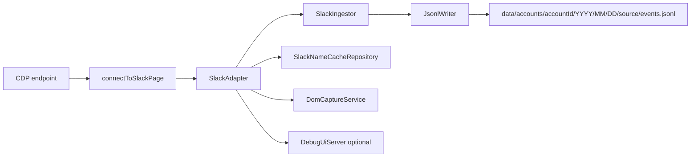
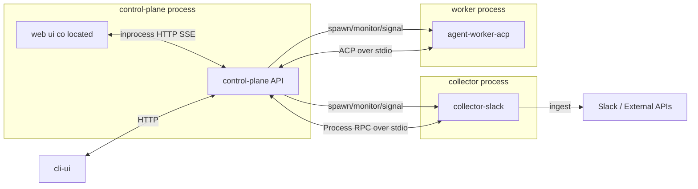
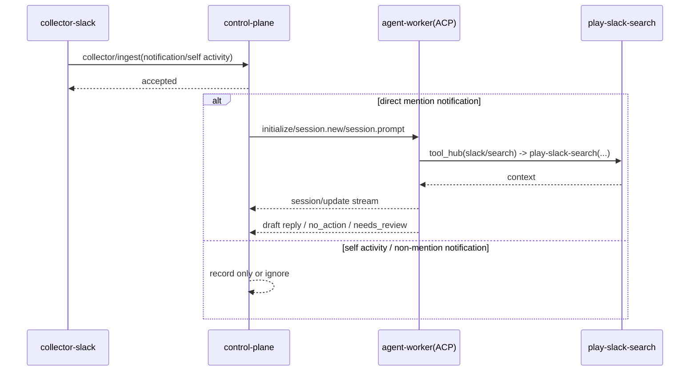
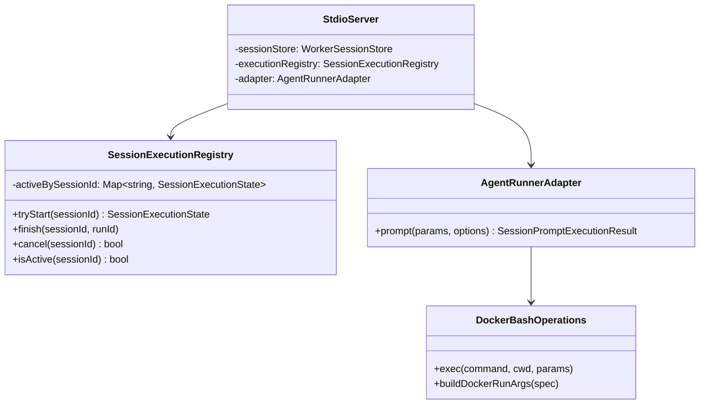

# Adjutant 仕様書 v0.4

この文書は、`src/` の現行実装に対応した統合仕様書である（旧 `doc/spec-unified.md` を統合）。
なお、ACP 分離アーキテクチャに関する最新の全体仕様は本書 14 章を優先する。

## 1. 目的

Adjutant は Slack Desktop の CDP イベントを収集し、`NormalizedEvent` 形式で JSONL に追記保存する。
加えて `pnpm start`（control-plane 起動）では、プロアクティブ通知ルーティング・Heartbeat・エージェント実行・メモリ検索を提供する。
主目的は「後段で再利用しやすいイベント基盤 + 運用可能な AI アシスタント基盤」の整備である。

### 1.1 基本原則

- 永続データの正本はファイルとして保存する（File First）。
- イベント/メッセージデータの正本は JSONL とする。
- エージェントが保持する記憶情報の正本は Markdown とする。
- SQLite は正本ではなく、検索性能のためのインデックス専用ストアとして扱う。
- インデックス更新は非同期で実行し、正本ファイル保存を先行する。
- 障害時は正本ファイルから再インデックスできる設計を前提にする。

## 2. 実装スコープ

- ランタイム entrypoint（`pnpm start`, `pnpm dev`, `pnpm serve`, rawlog scripts, subprocess stdio server）は、リポジトリ直下の `.env` と `.env.local` を自動で読み込む。
- 優先順位は `export 済み env > .env.local > .env` とする。
- 実行時に必要な固有情報は `.env.local` に置く。

### 2.1 レガシー実装済み

- Slack CDP 接続 (`connectToSlackPage`)
- Slack 収集アダプタ (`SlackAdapter`)
  - `Fetch.requestPaused` から `chat.postMessage` / `reactions.*` を抽出
  - `Network.webSocketFrameReceived` から一部通知を抽出
  - `Network.responseReceived` で本文・名前解決キャッシュを補完
- リアクション時 DOM キャプチャ (`DomCaptureService`)
- イベント重複排除（同一プロセス内 `uid` ベース）
- JSONL 追記保存 (`JsonlWriter`)
- Debug UI (SSE) (`DebugUiServer`)
- Slack 名称キャッシュ (`SlackNameCacheRepository`)
- Assistant UI 本体（`src/ui/*`）
- Assistant 用検索インデックス（SQLite + sqlite-vec, `<stateDir>/memory/<agentId>.sqlite`）
- Proactive routing pipeline v1.5（rule triage / attention window / batch classifier / global concurrency queue）
- Timeline v1.5 (`<stateDir>/timeline.jsonl`) と sessionKey 必須化
- Pending Flusher + Watermark store (`<stateDir>/watermarks.json`)
- Agent 終端レコード（`assistant_final` / `assistant_aborted` / `assistant_error`）
- ラン終端状態の内部確定（終端レコードを復旧・冪等吸収・後段制御の基準として利用）
- bash ツールの Docker サンドボックス実行（`ADJUTANT_SANDBOX_MODE=non-main|all`）
- 初回実行リチュアル（workspace bootstrap / BOOTSTRAP context 注入）
- Pre-compaction memory flush + context compaction 連動制御
- `tool_hub`（`memory/search|get|write`, `slack/search` を provider/action で公開）

### 2.2 現在実装済み（`src/`）

- ACP / Process RPC のメソッド定義と型・バリデータ（`src/contracts/*`）
- ACP vendor schema meta の読み込みと envelope 検証（`schema-version.ts`, `schema-validator.ts`）
- agent-worker ACP stdio サーバー（`initialize`, `authenticate`, `session/new`, `session/prompt`, `session/cancel`, `session/load`）
- `session/load` の capability gate（`ACP_ENABLE_LOAD_SESSION=1` のときのみ有効）
- Worker のインメモリ session store（`WorkerSessionStore`）
- sessionId/sessionKey/runId のレジストリ管理（`SessionRegistry`, `SessionBridge`）
- `runAgent` 呼び出しを `session/update` 通知へ中継する adapter（`AgentRunnerAdapter`）
- tool call イベントの ACP 形式マッピング（`tool_call` / `tool_call_update`）
- stopReason の ACP 正規化（`normalizeStopReason`）
- worker supervisor（子プロセス spawn、JSON-RPC request/timeout、クラッシュ時再起動）
- ACP capability matrix（unstable gate / FS capability v1 無効固定）
- permission request/resolve/cancel の registry + gateway
- run 単位の tool event bridge（重複判定付き）
- control-plane HTTP/SSE API（`POST /api/commands`, `GET /api/snapshot`, `GET /api/events/stream`）
- control-plane 同居 WebUI の最小画面配信（`GET /`）
- session recovery（`sessionKey -> sessionId`）の journal/snapshot/replay 永続化
- JSONL journal append/drain、cursor load/commit、journal compaction
- UI runtime の pending permission 管理と tool event 参照
- AuditDetailTab 向け view model 生成（ツールイベント表示用）
- Assistant runner は `OPENAI_API_KEY` 有効時に `pi-coding-agent` 実接続、未設定時は echo fallback
- `PiAgentSessionFactory` による `createAgentSession` 初期化（`AuthStorage`/`ModelRegistry`/`SettingsManager.inMemory()`）
- workspace bootstrap / BOOTSTRAP context 注入（`origin=user` かつ `sessionKey=main` / `memoryScope=main`）
- pre-compaction memory flush（閾値判定）と context overflow 時の `session.compact()` 再試行
- compaction メタデータの永続化（`<stateDir>/worker/sessions.json`）
- markdown summary batch service（`runOnce`, watermark 保存, transcript 増分読込）
- `tool_hub(provider=memory, action=write)`（`memoryWriteEnabled=true` の run 限定）
- sandbox 実行設定の session factory 連携（`ADJUTANT_SANDBOX_MODE=off|non-main|all`）
- Phase B 統合テスト（memory/sandbox/audit、path traversal/symlink 拒否、tool_hub memory/write -> summary -> memory/search）

### 2.3 未実装

- GitHub / git-local の収集
- `POLICY_ROUTING.json` の実ルーティング適用（将来実装: priority/quiet-hours/cooldown の反映）
- 通知キューの永続化（現状はインメモリ）
- 実行中ランへの steer / action 承認 / run 状態追跡 API
- session transcript の `memory_search` 索引統合
- Heartbeat 誤通知削減のための専用重要イベント分類器
- マルチチャネル本番接続（Slack 以外）
- `src/assistant/main.ts` の役割整理（ACP 標準では `src/agent-worker-acp/stdio-server.ts` が worker entry）

### 2.4 保存基盤（部分実装）

- 永続データの正本はファイル保存
- イベント/メッセージデータは JSONL を正本として保存
- エージェント記憶は Markdown を正本として保存（設計方針）
- SQLite は Assistant の memory search 用インデックスとして利用
- Slack 収集イベントを SQLite に正本保存する方式は採用しない

## 3. 収集ランタイム実行アーキテクチャ（legacy/単体参照）

本章は legacy の単体収集ランタイムを説明する参照仕様である。ACP 分離後の標準構成は 14 章を正とする。



### 3.1 起動と再接続

- legacy 単体収集モードでは `src/index.ts` を起点に CDP 収集を開始する。
- ACP 標準構成では `src/index.ts` は control-plane のエントリポイントとして利用し、収集は `collector-slack` 子プロセスへ分離する。
- 起動時に既存 JSONL を走査し、破損末尾が見つかったファイルは当該オフセットまで truncate してから収集を開始する（`listJsonlFiles` → `recoverJsonlFiles`）。
- `resolveEndpoint()` は以下優先順位で接続先を解決する。
  1. `CDP_ENDPOINT_FILE`（既定 `.adjutant/cdp-endpoint.json`）
  2. `CDP_HOST` / `CDP_PORT`
  3. 既定値 `127.0.0.1:9222`
- セッション切断時は再接続ループへ移行する。
  - リトライ待機: `computeFullJitterDelayMs()` による指数バックオフ + フルジッタ
  - 基本式: `maxDelay = min(10000, 1000 * 2^(attempt - 1))`、`delay = floor(random() * maxDelay)`
  - `attempt` は最小 1（初回再接続時も 1）
- `SIGINT` / `SIGTERM` で adapter/client/debug UI を停止して終了する。

## 4. データモデル

型定義は `src/core/events.ts` に従う。

### 4.1 共通スキーマ

```ts
{
  schema: "adjutant.event.v1.1";
  uid: string;
  source: "slack" | "github" | "git-local";
  kind: string;
  action?: string;
  actor?: string;
  subject?: string;
  ts: string;
  logged_at?: string;
  meta?: Record<string, unknown>;
  detail?: { slack: SlackDetail } | { github: Record<string, unknown> } | { git_local: Record<string, unknown> };
}
```

### 4.2 Slack detail の実体

`SlackDetail` は union だが、現実装では主に以下キーを利用する。

- post
  - `channel_id`, `channel_name`, `message_ts`, `text`, `blocks`, `thread_ts`
- reaction
  - `channel_id`, `channel_name`, `message_ts`, `emoji`, `user`, `message_text`
- notification
  - `channel_id`, `channel_name`, `notification_type`, `title`, `message_text`, `user`, `event_ts`

vNext では notification について、collector 調整により以下の optional key を追加収集する前提とする。

- `team_id?`
- `thread_ts?`
- `message_ts?`
- `permalink?`
- `mention_target_user_id?`
- `is_direct_mention?`

派生規約:

- `message_ts` は raw field が無い場合、`ts` または `entry.item.message.ts` から派生してよい。
- `permalink` は raw field を必須とせず、`workspaceHost + channel_id + message_ts` から派生してよい。
- `mention_target_user_id` は raw field を必須とせず、Slack blocks の `user` node または本文中の `<@USER_ID>` から抽出してよい。
- `is_direct_mention` は raw field が無い場合、抽出した mention target と self user id から派生判定してよい。

注記:

- 現実装の `detail.slack` には `type` フィールドを付与していない。
- `kind` でイベント種別を判別する。
- 本文フィールド契約は `post -> detail.slack.text`、`reaction|notification -> detail.slack.message_text` を正とする。

### 4.3 UID 方針

- post: `slack:{channel_id}@{message_ts}`
- reaction: `slack:{channel_id}@{message_ts}:{emoji}:{action}:{actorId}`
- notification: `slack:{channel_id}@{event_ts or now}:{notification_type}:{actorId}`

`SlackAdapter` は同一 `uid` をメモリ上で去重し、同一プロセス内での重複書き込みを防ぐ。

## 5. Slack 収集仕様

### 5.1 Fetch interception

`Fetch.enable()` は以下 URL を Request ステージで監視する。

- `*://*.slack.com/api/chat.postMessage*`
- `*://*.slack.com/api/reactions.*`

処理内容:

- POST body を解析して `normalizeSlackMessage` / `normalizeSlackReaction` へ渡す。
- `reactions.*` では DOM キャプチャ結果が取得できれば `message_text` を補完する。

### 5.2 WebSocket frame

`webSocketFrameReceived` で受信した payload を解釈し、次を実施する。

- message 系イベントから本文キャッシュ更新
- 通知候補を抽出して `kind=notification` イベントを生成

### 5.3 Response hook

`responseReceived` で次を実施する。

- `Network.getResponseBody` により API 応答の本文情報を補完
- `conversations.view` 応答からチャンネル名キャッシュ更新
- `/cache/{team}/users/list` 応答からユーザー名キャッシュ更新

## 6. DOM キャプチャ

- `DomCaptureService` は `Runtime.evaluate` で候補 DOM を探索する。
- タイムスタンプ一致候補を複数 selector で探索し、本文/チャンネル情報を抽出する。
- リトライ遅延: `0ms, 100ms, 200ms, 300ms`
- 無効化: `ADJUTANT_DISABLE_DOM_CAPTURE=1|true`

制約:

- `/api/reactions.*` の送信を契機に動くため、他ユーザー由来の受信通知だけでは発火しない。
- メッセージが可視 DOM に存在しない場合は本文補完できない。

## 7. 保存仕様

### 7.1 JSONL

出力先:

```text
<dataDir>/accounts/<account_id>/YYYY/MM/DD/<source>/events.jsonl
```

- 1 行 1 JSON
- `logged_at` が未設定なら `JsonlWriter` が現在時刻で補完
- `meta.account_id` が未設定なら `default` を補完
- `logged_at` を基準に日付ディレクトリを決定
- 書き込み時に `checksum` フィールド（sha256 ベース 16 文字）を付与
- append 失敗時は最大 2 回リトライ（`ENOENT` は mkdir 後に再試行）

### 7.2 名称キャッシュ

```text
<dataDir>/accounts/<account_id>/_cache/slack/channel-names-by-team/<team_id>.json
<dataDir>/accounts/<account_id>/_cache/slack/user-names-by-team/<team_id>.json
```

- team ごとに分割保存
- 起動時にロードし、収集中に差分更新
- user cache (`adjutant.slack.user-cache.v2`) の `users` は次を保持する
  - `real_name`
  - `profile.display_name`
  - `profile.email`
  - `profile.first_name`
  - `profile.last_name`
  - `profile.image_original`

### 7.3 CDP 生イベントログ（任意）

`ADJUTANT_CDP_EVENT_LOG=1` の場合、次へ JSONL 追記する。

```text
<dataDir>/_debug/cdp-events.jsonl
```

- `schema=adjutant.cdp.event.v1`
- `method`, `params`, `session_id`, `host`, `port`, `slack_url` を保持
- `ADJUTANT_CDP_EVENT_LOG_MAX_PARAM_CHARS` で `params` の最大文字数を制限可能

### 7.4 Raw Fetch ログ（任意）

`ADJUTANT_RAW_FETCH_LOG=1` の場合、次へ JSONL 追記する。

```text
<dataDir>/_debug/raw-fetch.jsonl
```

- `schema=adjutant.raw-fetch.event.v1`
- `kind=raw_fetch`
- `source`, `at`, `payload`, `logged_at` を保持
- `ADJUTANT_RAW_FETCH_LOG_MAX_PAYLOAD_CHARS` が 0 より大きい場合、`payload` は文字数上限を超えると `_truncated` 付き preview に切り詰める。v1 の script 既定値は `"20000"` とする。

## 8. 設定

### 8.1 収集ランタイム

| 変数                                       | 既定値                               | 用途                                  |
| ------------------------------------------ | ------------------------------------ | ------------------------------------- |
| `CDP_HOST`                                 | `127.0.0.1`                          | CDP 接続先ホスト                      |
| `CDP_PORT`                                 | `9222`                               | CDP 接続先ポート                      |
| `CDP_ENDPOINT_FILE`                        | `.adjutant/cdp-endpoint.json`        | 接続先 JSON の読み込み元              |
| `DATA_DIR`                                 | `<stateDir>/data`                    | 出力ディレクトリ                      |
| `ADJUTANT_SLACK_ACCOUNT_ID`                | `default`                            | Slack 保存先 account_id               |
| `ADJUTANT_SLACK_SELF_USER_IDS`             | -                                    | カンマ区切りの self user id 一覧      |
| `ADJUTANT_SLACK_WORKSPACE_HOST`            | -                                    | raw log 解析時の単一 workspace host   |
| `ADJUTANT_SLACK_WORKSPACE_HOSTS`           | -                                    | `teamId=workspaceHost` の CSV         |
| `ADJUTANT_TZ`                              | `Asia/Tokyo`                         | イベント時刻整形タイムゾーン          |
| `ADJUTANT_DEBUG`                           | -                                    | Slack デバッグトピック有効化          |
| `ADJUTANT_DISABLE_DOM_CAPTURE`             | `0`                                  | DOM 補完無効化                        |
| `ADJUTANT_DEBUG_UI`                        | `0`                                  | Debug UI サーバ起動                   |
| `ADJUTANT_DEBUG_UI_PORT`                   | `8787`                               | Debug UI ポート                       |
| `ADJUTANT_CDP_EVENT_LOG`                   | `0`                                  | CDP 生イベントを JSONL 保存           |
| `ADJUTANT_CDP_EVENT_LOG_PATH`              | `<dataDir>/_debug/cdp-events.jsonl`  | CDP 生イベント出力先                  |
| `ADJUTANT_CDP_EVENT_LOG_MAX_PARAM_CHARS`   | `0`                                  | params 切り詰め上限 (`0` は無制限)    |
| `ADJUTANT_RAW_FETCH_LOG`                   | `0`                                  | Raw Fetch イベントを JSONL 保存       |
| `ADJUTANT_RAW_FETCH_LOG_PATH`              | `<dataDir>/_debug/raw-fetch.jsonl`   | Raw Fetch イベント出力先              |
| `ADJUTANT_RAW_LOG_PATH`                    | `<dataDir>/_debug/slack-debug.jsonl` | raw debug capture / analyze 用ログ    |
| `ADJUTANT_RAW_FETCH_LOG_MAX_PAYLOAD_CHARS` | `"20000"`                            | payload 切り詰め上限                  |
| `CDP_WAIT_ATTEMPTS`                        | `10` (script)                        | CDP 起動待ち試行回数                  |
| `CDP_WAIT_DELAY`                           | `1` (script, sec)                    | CDP 起動待ち間隔                      |
| `PLAY_SLACK_SEARCH_SESSION`                | `slack`                              | adapter が使う playwright-cli session |
| `PLAY_SLACK_SEARCH_PROFILE`                | playwright-cli 既定 profile          | adapter が使う browser profile path   |

`ADJUTANT_DEBUG` の主な値:

- `slack`
- `slack:verbose`
- `slack:domprobe`
- `slack:network`
- `slack:fetch`
- `slack:fetch:hook`
- `slack:runtime`

### 8.2 Assistant / Proactive

| 変数                                          | 既定値                                | 用途                                            |
| --------------------------------------------- | ------------------------------------- | ----------------------------------------------- |
| `ADJUTANT_ROUTING_IDLE_MS`                    | `1000`                                | channel attention-window idle                   |
| `ADJUTANT_ROUTING_MAX_WAIT_MS`                | `30000`                               | channel attention-window max wait               |
| `ADJUTANT_ROUTING_DM_IDLE_MS`                 | `200`                                 | DM attention-window idle                        |
| `ADJUTANT_ROUTING_DM_MAX_WAIT_MS`             | `1000`                                | DM attention-window max wait                    |
| `ADJUTANT_ROUTING_CONFIDENCE_THRESHOLD`       | `0.7`                                 | batch classifier confidence 閾値                |
| `ADJUTANT_ROUTE_LLM_ENABLED`                  | `false`                               | secondary classifier（Route LLM）有効化         |
| `ADJUTANT_ROUTE_LLM_MODEL`                    | `gpt-5-mini`                          | Route LLM モデル                                |
| `ADJUTANT_ROUTE_LLM_TIMEOUT_MS`               | `1000`                                | Route LLM / batch classifier timeout            |
| `ADJUTANT_ROUTE_LLM_MAX_CONCURRENT`           | `1`                                   | Route LLM 同時実行上限                          |
| `ADJUTANT_AGENT_AUDIT_LOG_ENABLED`            | `true`                                | エージェント監査ログ（NDJSON）有効化            |
| `ADJUTANT_AGENT_AUDIT_LOG_PATH`               | `<stateDir>/audit/agent-audit.ndjson` | エージェント監査ログ保存先                      |
| `ADJUTANT_AGENT_AUDIT_MAX_FIELD_CHARS`        | `4000`                                | 監査ログのフィールド切り詰め上限                |
| `ADJUTANT_GLOBAL_MAX_CONCURRENT`              | `3`                                   | global queue 基本同時実行上限                   |
| `ADJUTANT_GLOBAL_DM_BURST_SLOT`               | `1`                                   | DM burst slot                                   |
| `ADJUTANT_GLOBAL_MAX_RUNNING_DM`              | `3`                                   | DM 同時実行上限                                 |
| `ADJUTANT_GLOBAL_STARVATION_MS`               | `120000`                              | starvation 昇格閾値                             |
| `ADJUTANT_MARKDOWN_SUMMARY_BATCH_TIMEZONE`    | `UTC`                                 | summary batch の集計タイムゾーン                |
| `ADJUTANT_CONTROL_PLANE_HOST`                 | `127.0.0.1`                           | control-plane API bind host                     |
| `ADJUTANT_CONTROL_PLANE_PORT`                 | `3100`                                | control-plane API bind port                     |
| `ADJUTANT_DELIVER_SLACK_ENABLED`              | `false`                               | deliver-slack child process を起動するか        |
| `ADJUTANT_DELIVER_SLACK_ENTRY`                | `src/deliver-slack/stdio-server.ts`   | deliver-slack entrypoint                        |
| `ADJUTANT_DELIVER_SLACK_AUTO_COMPLETE`        | `true`                                | enqueue 後に completion 通知を自動送信するか    |
| `ADJUTANT_DELIVER_SLACK_COMPLETION_DELAY_MS`  | `5`                                   | 自動 completion 通知までの遅延（ms）            |
| `ADJUTANT_DELIVER_SLACK_SIMULATE_FAILURE`     | `false`                               | 自動 completion を failed 扱いにするか          |
| `ADJUTANT_FLUSHER_ENABLED`                    | `true`                                | Pending Flusher を有効化するか                  |
| `ADJUTANT_FLUSHER_INTERVAL_MS`                | `60000`                               | Pending Flusher 周期                            |
| `ADJUTANT_FLUSHER_STALE_MS`                   | `900000`                              | stale open post 判定閾値                        |
| `ADJUTANT_HEARTBEAT_ENABLED`                  | `true`                                | heartbeat periodic tick を有効化するか          |
| `ADJUTANT_HEARTBEAT_INTERVAL_MS`              | `1800000`                             | heartbeat periodic tick 間隔（ms）              |
| `ADJUTANT_HEARTBEAT_TIMEOUT_MS`               | `30000`                               | heartbeat run timeout（ms）                     |
| `ADJUTANT_HEARTBEAT_FILE_PATH`                | `<cwd>/HEARTBEAT.md`                  | heartbeat prompt 読み込み先                     |
| `ADJUTANT_COMPACTION_ENABLED`                 | `true`                                | overflow 時 compaction 優先                     |
| `ADJUTANT_MEMORY_FLUSH_ENABLED`               | `true`                                | pre-compaction flush 有効化                     |
| `ADJUTANT_COMPACTION_RESERVE_TOKENS_FLOOR`    | `20000`                               | flush 閾値計算の reserve                        |
| `ADJUTANT_MEMORY_FLUSH_SOFT_THRESHOLD_TOKENS` | `4000`                                | flush 閾値計算の soft threshold                 |
| `ADJUTANT_MEMORY_FLUSH_PROMPT`                | 組み込み既定文                        | flush turn の user prompt                       |
| `ADJUTANT_MEMORY_FLUSH_SYSTEM_PROMPT`         | 組み込み既定文                        | flush turn の system prompt                     |
| `ADJUTANT_MEMORY_SEARCH_ENABLED`              | `true`                                | `tool_hub` の memory search/get を有効化        |
| `ADJUTANT_MEMORY_SEARCH_DB_PATH`              | `<stateDir>/memory/<agentId>.sqlite`  | メモリ検索インデックス DB                       |
| `ADJUTANT_MEMORY_SEARCH_MODEL`                | `text-embedding-3-small`              | 埋め込みモデル                                  |
| `ADJUTANT_MEMORY_SEARCH_MAX_RESULTS`          | `5`                                   | 検索結果上限                                    |
| `ADJUTANT_MEMORY_SEARCH_MIN_SCORE`            | `0`                                   | 最低スコア                                      |
| `ADJUTANT_MEMORY_SEARCH_VECTOR_ENABLED`       | `true`                                | vector 検索有効化                               |
| `ADJUTANT_MEMORY_SEARCH_SQLITE_VEC_PATH`      | `""`                                  | sqlite-vec 拡張パス                             |
| `ADJUTANT_MEMORY_SEARCH_CHUNK_CHARS`          | `1600`                                | chunk 文字数                                    |
| `ADJUTANT_MEMORY_SEARCH_CHUNK_OVERLAP_CHARS`  | `320`                                 | chunk overlap                                   |
| `ADJUTANT_MEMORY_SEARCH_SNIPPET_MAX_CHARS`    | `700`                                 | snippet 文字数上限                              |
| `ADJUTANT_MEMORY_SEARCH_CANDIDATE_MULTIPLIER` | `3`                                   | 候補拡張倍率                                    |
| `ADJUTANT_MEMORY_SEARCH_VECTOR_WEIGHT`        | `0.7`                                 | hybrid score の vector 重み                     |
| `ADJUTANT_MEMORY_SEARCH_TEXT_WEIGHT`          | `0.3`                                 | hybrid score の text 重み                       |
| `ADJUTANT_SANDBOX_MODE`                       | `all`                                 | tool sandbox mode（`off` / `non-main` / `all`） |
| `ADJUTANT_SANDBOX_IMAGE`                      | `adjutant-sandbox:trixie-slim`        | sandbox Docker image                            |
| `ADJUTANT_SANDBOX_AUTO_BUILD_IMAGE`           | `true`                                | 未存在時に sandbox image を自動 build する      |
| `ADJUTANT_SANDBOX_HOME`                       | `/home/agent`                         | sandbox 内 `HOME`（tmpfs）                      |
| `ADJUTANT_SANDBOX_USER`                       | `<host uid>:<host gid>` / `1000:1000` | sandbox 実行ユーザー                            |
| `ADJUTANT_SANDBOX_ENV_ALLOWLIST`              | `LANG,LC_ALL,TERM,TZ`                 | sandbox に引き渡す環境変数 allowlist            |
| `ADJUTANT_SANDBOX_WORKDIR`                    | `/workspace`                          | コンテナ内作業ディレクトリ                      |
| `ADJUTANT_SANDBOX_NETWORK`                    | `none`                                | Docker network                                  |
| `ADJUTANT_SANDBOX_MEMORY`                     | 未設定                                | Docker memory limit（例: `1g`）                 |
| `ADJUTANT_SANDBOX_PIDS_LIMIT`                 | `256`                                 | Docker pids limit                               |

## 9. 実行コマンド

- `pnpm start`: `src/index.ts`（control-plane エントリポイント）を起動（`web-ui` 同居、worker は supervisor が子プロセス起動）
- `node --import tsx src/agent-worker-acp/stdio-server.ts`: 開発/デバッグ用に worker（ACP stdio）を単体起動
- `pnpm run sandbox:build`: sandbox 用 Docker イメージをビルド
- `pnpm dev`: `ensureSlackWithCdp` 実行後に `pnpm start`
- `pnpm run serve`: `dist/backend/index.js` を起動（事前に `pnpm run build:backend`）

## 10. 既知の制約

- CDP 依存のため Slack クライアント実装変更の影響を受けやすい。
- `uid` 去重はプロセス内のみで、再起動をまたぐ厳密な重複排除は未実装。
- 永続層はファイル保存（現行は JSONL）中心で、検索は補助インデックスに依存する。
- `POLICY_ROUTING.json` は将来実装予定（現行ランタイムでは未使用）。

## 11. ロードマップ（設計メモ）

- GitHub / git-local アダプタ追加
- cross-source 集計のための検索インデックス強化（SQLite）

## 12. ファイルファースト保存原則（設計）

この章は保存設計の原則を示す。

- 正本データはファイルとして保存する（File First）。
- イベント/メッセージデータの正本は JSONL とする。
- エージェント記憶データの正本は Markdown とする。
- SQLite は検索インデックス専用の派生ストアとして扱う。
- 書き込み順序は「正本ファイル保存を先行」し、その後に非同期で SQLite インデックスを更新する。
- 一貫性モデルは Eventual Consistency とし、検索結果の反映遅延を許容する。
- 障害時の復旧は正本ファイル（JSONL/Markdown）からの再インデックスを基本とする（SQLite は再生成可能なキャッシュ）。
- バックアップ/移行の基準は正本ファイル群とし、SQLite は必須バックアップ対象から分離可能とする。

### 12.1 非同期インデックス更新フロー（想定）

1. イベントまたは記憶データを正本ファイル（JSONL または Markdown）へ append/update する。
2. append 成功後にインデックス更新ジョブをキューへ投入する。
3. ワーカーが正本ファイル差分を読み取り、SQLite の FTS/補助テーブルを更新する。
4. 更新失敗時はジョブを再試行し、必要に応じて日次または全量リビルドを実行する。

### 12.2 設計上の制約

- SQLite 側のスキーマは検索最適化のための冗長化を許容する。
- 重複更新に耐えるため、インデックス更新は冪等に設計する。
- 正本ファイル（JSONL/Markdown）と SQLite の不整合検知のため、最終インデックス時刻や対象ファイルハッシュを保持する。

## 13. Assistant / Proactive 実装仕様

### 13.1 ランタイム責務（legacy と ACP の対応）

- legacy 統合ランタイムでは `legacy/impl-20260228/src/assistant/main.ts` が API / UI / channel manager / heartbeat / pending flusher を単一プロセスで起動する。
- ACP 標準構成（14章優先）では `src/index.ts` が control-plane 統合エントリポイントとなり、worker entry は `src/agent-worker-acp/stdio-server.ts` を正とする。
- `src/assistant/main.ts` は legacy 互換のスタブであり、標準起動導線（`pnpm start`）では使用しない。
- 起動時に `<stateDir>/timeline.jsonl`、`<stateDir>/idempotency.jsonl`、`<stateDir>/agents/<agentId>/sessions/*.jsonl`、`DATA_DIR` 配下 JSONL を `recoverJsonlFiles` で復旧する。
- proactive 経路は dual-write で `<stateDir>/timeline.jsonl` と `<stateDir>/agents/<agentId>/sessions/<sessionKey>.jsonl` の両方へ追記する。
- `ADJUTANT_AGENT_AUDIT_LOG_ENABLED=1` の場合、`<stateDir>/audit/agent-audit.ndjson`（または `ADJUTANT_AGENT_AUDIT_LOG_PATH`）へ `run.start/run.end`・`tool.start/tool.end`・`file.read/file.write` を追記する。
- 監査ログは append-only NDJSON。`token`/`apiKey`/`password`/`authorization` 等の機微キーはマスクし、長大フィールドは `ADJUTANT_AGENT_AUDIT_MAX_FIELD_CHARS` で切り詰める。
- 非文字列フィールドが切り詰め対象の場合は `{ "_truncated": true, "originalType": "...", "preview": "..." }` 形式で保持する。
- `ADJUTANT_MARKDOWN_SUMMARY_BATCH_ENABLED=1` の場合、要約バッチが定期実行される。
  - 入力: `<stateDir>/agents/<agentId>/sessions/*.jsonl`
  - 抽出: `user/assistant` のみ、`/` で始まる command 行を除外、filter 後 slice（既定 15）
  - 出力: `memory/YYYY-MM-DD.md` へ append
  - checkpoint: `<stateDir>/agents/<agentId>/summary-batch-watermark.json`
  - checkpoint `sessions` のキーは絶対パスではなく相対安定キー（`state:<relpath>`）を使う
  - `maxSessions` 上限時は `lastProcessedTs` が古いもの（未処理含む）を優先し、固定ファイル飢餓を防ぐ
  - transcript が truncate/rotate で縮小した場合は `previousOffset > fileSize` を検知して offset を 0 に戻し再走査する
  - 日付グループ追記が途中で失敗した場合は、成功済みグループ分の offset まで watermark を前進させ重複追記を抑止する
  - JSONL 最終行が改行なしでも 1 行として解析する
  - バッチ実行は単一 in-flight（実行中 tick は skip）で重複実行を防ぐ

### 13.2 Notification-Driven 実行方針

- vNext では広い proactive ルーティングパイプラインを標準経路にしない。
- Slack 通知処理は notification-driven を基本とし、即時 AI 起動対象は自分宛メンション通知だけに限定する。
- 自分宛メンション通知のみを即時 AI run 対象とする。
- DM はメンションがなくても v1 の通知起点即時 AI run 対象にしない。
- それ以外の notification は vNext の通知起点処理対象にしない。
- self post / self reaction は自分の行動ログとして扱い、AI 即時起動トリガーにはしない。
- notification 正規化は `teamId` / `threadTs` / `messageTs` / `permalink` を含む shape へ拡張する前提とし、collector 側で必要情報を追加収集する。
- Slack 通知起点 run の既定 session は `slack-activity` とする。
- `threadTs` / `messageTs` は session 分離のためではなく、Slack 上の thread/message 文脈を取得する anchor として扱う。
- `threadTs` がない場合は `messageTs` から親 thread を解決し、失敗時は `needs_review` とする。
- 必要な文脈は保存済み queue から再生するのではなく、`play-slack-search` を通じてその場で取得する。
- 旧 proactive pipeline（attention window / batch classifier / flusher）は legacy 実装として残るが、vNext の標準 notification 経路では前提にしない。

### 13.3 Timeline v1.5 / Watermark / Pending Flusher

- `TimelineRecordV1_5` は `schema=adjutant.timeline.record.v1.5`、`sessionKey`、`ts`、`loggedAt` を必須とする。
- action record の `actionType` は `assistant_final|assistant_aborted|assistant_error`。
- terminal action は `DualWriteCoordinator.appendAssistant()` で timeline/session へ dual-write し、timeline 成功時は `timelineOffset` を返す。
- `onTerminalRecord` は `status != pending-timeline` かつ `timelineOffset` がある場合に `watermarkStore.applyTerminalRecord(sessionKey, actionType, offset)` を呼ぶ。
- `pending-timeline` または offset 未取得時は watermark を更新せず warning を記録する。
- `assistant_final` のみ handled 境界として扱い、`aborted/error` では境界を進めない。
- Pending Flusher は `<stateDir>/timeline.jsonl` を byte offset で差分走査し、sessionKey 別に open post を集計する。
- stale 判定は `loggedAt` と `ADJUTANT_FLUSHER_STALE_MS`（既定 900000ms）で行う。
- 別人返信（oldest actor と異なる actor）を検出した session は抑制して起動しない。
- tick 後は `watermarks.scan.lastGoodOffset` に `lastScannedOffset` を揃えて保存し、prune を実行する。
- timeline truncate 復旧で `lastScannedOffset > fileSize` の場合、offset と session 状態を 0 / 空へリセットする。
- Phase E（2026-03-05）契約固定:
  - schema 型定義は `src/control-plane/proactive/schema.ts` を正本とする。
  - `assistant_final` でのみ `handled.lastHandledOffset` を前進させる。
  - flusher 運用手順の正本は `doc/runbook/proactive-flusher-operations.md` とする。

### 13.4 初回実行リチュアル（BOOTSTRAP 注入）

- `origin=user` の実行前に workspace bootstrap を保証する。
- 初期化で `AGENTS.md`, `SOUL.md`, `TOOLS.md`, `IDENTITY.md`, `USER.md`, `HEARTBEAT.md` を不足時のみ作成する。
- brand-new workspace の場合のみ `BOOTSTRAP.md` を作成する。
- prompt 注入条件:
  - `origin=user`
  - `isHeartbeat=false`
  - `sessionKey=main`
  - `memoryScope=main`
- 注入対象は bootstrap 7 ファイル + 存在時のみ `MEMORY.md` / `memory.md`。
- `BOOTSTRAP.md` が missing のときは context へ含めない（削除後に自然停止）。
- 各ファイルは既定 20000 文字で head/tail トリミング（70% / 20%）される。

### 13.5 Pre-compaction Memory Flush / Context Compaction

- pre-flush 判定は `session.getContextUsage()` を使い、しきい値 `contextWindow - reserveFloor - softThreshold` を超えた場合のみ実行する。
- pre-flush 実行条件:
  - memory flush enabled
  - main scope
  - non-heartbeat
  - workspace writable
  - 同一 compaction cycle で未実行（`memoryFlushCompactionCount !== compactionCount`）
- flush turn は silent で実行し、失敗時は warning のみで本処理を継続する。
- `context_overflow` は `session.compact()` を優先し、失敗時のみ prompt trim fallback を使う。
- `sessions.json` には `compactionCount`, `memoryFlushAt`, `memoryFlushCompactionCount`, `contextTokens`, `contextWindowTokens` を保存する。

### 13.6 SQLite Hybrid Memory Search / Memory Write（Local File First）

- custom tool 公開面は `tool_hub` に統一し、memory 操作は `provider=memory` / `action=search|get|write` で呼び出す。
- `memory/search` / `memory/get` は `memoryScope=main` のセッションでのみ利用可能。
- `memory/write` は `memoryWriteEnabled=true` の run でのみ利用可能。
- `memoryWriteEnabled=false` の run では `memory/write` は provider catalog に出さず、`memory_write` 相当の tool event は監査対象から除外する。
- `memory/write` の入力は `{ content: string; scope?: "daily" | "long-term" }`。
- `scope=daily` は `memory/YYYY-MM-DD.md` へ追記し、`scope=long-term` は `MEMORY.md` を更新する。
- source of truth はローカル Markdown（`MEMORY.md` と `memory/**/*.md`）。
- index DB の既定値は `<stateDir>/memory/<agentId>.sqlite`。
- 検索は FTS5(BM25) と sqlite-vec のハイブリッドスコアで返す。
- 埋め込み取得失敗時は BM25 のみで継続し、`fallback` を返す。
- `memory/get` は allowlist（`MEMORY.md`, `memory/*.md`）+ workspace 内 + symlink 拒否で path を検証する。
- 例外は throw せず、`disabled/error` を含む tool 契約レスポンスへ正規化する。

### 13.7 Tool Sandbox（Docker）

- `ADJUTANT_SANDBOX_MODE=all`（既定）では heartbeat を除く全セッションの `bash` / `read` / `edit` / `write` / `grep` / `find` / `ls` をコンテナ化。
- `ADJUTANT_SANDBOX_MODE=non-main` では `memoryScope=main` 以外（spoke）の同ツール実行のみをコンテナ化。
- `ADJUTANT_SANDBOX_MODE=off` では従来どおりホスト実行。
- 起動時（ACP 標準: `src/index.ts`、legacy 統合: `legacy/impl-20260228/src/assistant/main.ts`）は以下順で fail-safe 初期化する。
  1. Docker daemon 可用性確認（不可なら起動中断）
  2. sandbox image 存在確認（未存在時は `ADJUTANT_SANDBOX_AUTO_BUILD_IMAGE=true` なら自動 build）
  3. `configureSandbox()` へ per-tool 実行 spec を注入
- bash 実行は `docker run --rm -i --pull=never --init --user <uid>:<gid> -e HOME=<home> --workdir <mappedCwd> ... <image> bash -lc "<command>"` を使用し、tool 呼び出し単位でコンテナを作成・終了時削除する。
- file tools も同じ `SandboxRunSpec` を共有し、workspace は `/workspace` へ写像して実行する。
- 常駐コンテナは保持しないため、並行セッション時も tool 実行は独立コンテナとして分離される。
- workspace は `/workspace` へ bind mount し、`HOME=/home/agent` は uid/gid を合わせた tmpfs を割り当てる。
- `ADJUTANT_SANDBOX_USER` 未指定時は POSIX でホスト UID/GID を使い、取得不可環境では `1000:1000` を使う。
- sandbox には `--read-only`, `--network=none`, `--cap-drop=ALL`, `--security-opt no-new-privileges=true`, `--security-opt seccomp=builtin`, `--ipc=private`, `--cgroupns=private`, `--hostname=sandbox` を付与する。
- sandbox イメージには `bash` / `git` / `curl` / `jq` / `python3` / `python3-pip` / `rg`（ripgrep）を同梱する。
- workspace 外 path は file tool 実行前に拒否する。

## 14. ACP 分離アーキテクチャ（s02 基準）

この章は旧 s02 計画の全体像を `spec.md` 向けに統合したものである。  
本章と他章に差分がある場合は、本章を優先する。

### 14.1 目的と方針

- AI 実行部を `agent-worker-acp` として分離し、`control-plane` と ACP（JSON-RPC over stdio）で接続する。
- `collector` は Process RPC（JSON-RPC over stdio）で `control-plane` と接続する。
- vNext の標準経路は OpenClaw 寄せの session/transcript 中心設計とし、durable queue / replay / duplicate 吸収を control-plane の主要責務にしない。
- Slack 通知は ephemeral trigger として扱い、必要な文脈は `tool_hub(provider=slack, action=search)` で都度取得する。
- heartbeat は `main` セッション上の full agent turn とし、`HEARTBEAT.md` / `HEARTBEAT_OK` / busy 時 `skip + retry` の mental model を採用する。

### 14.2 プロセス構成

- `control-plane`: 親プロセス。API 提供、ジョブ制御、worker/collector の起動監視、capability gate、`web-ui` の同居ホスティング
- `agent-worker-acp`: 子プロセス。ACP サーバーとして `initialize/session/*` を処理し `session/update` を通知
- `collector-slack`: 子プロセス。Slack 由来イベントを `collector/ingest` で control-plane へ送信
- `web-ui`: `control-plane` 同一プロセス内で配信される UI（HTTP/SSE 経由で API を利用）
- `cli`: control-plane API（HTTP）に接続する外部クライアント
- 開発時は Vite dev server を別プロセスで起動してもよいが、本番/標準起動は同居を正とする
- 実装補足（Phase C）
  - collector 側 supervision は `CollectorSupervisor`（`src/control-plane/process-rpc/collector-supervisor.ts`）で実装し、spawn/monitor/restart/request-timeout を担う。
  - worker 側 supervision（`WorkerSupervisor`）と collector 側 supervision は `src/control-plane/supervisor/stdio-supervisor-utils.ts` を共有し、stdio 行分割と再起動判定ロジックを共通化する。

### 14.3 プロセス接続連携図



### 14.4 代表シーケンス（notification-driven）



#### Worker 実行制御クラス図



### 14.5 境界契約

- ACP（control-plane <-> worker）
  - baseline: `initialize`, `session/new`, `session/prompt`, `session/cancel`, `session/update`
  - optional stable: `authenticate`, `session/load`, `session/set_mode`, `session/set_config_option`
  - optional stable は実装任意（phase/プロセスごとに採否を決定）。未採用時は capability 不在として `UNSUPPORTED_CAPABILITY` を返却する。
  - optional unstable: `session/list`, `session/resume`, `session/fork`, `session/set_model`（feature flag 有効時のみ）
  - 実行制約: 異なる `sessionId` の `session/prompt` は並行実行可能、同一 `sessionId` の同時 `session/prompt` は `SESSION_BUSY` を返却
- Process RPC（control-plane <-> collector）
  - request/response: `collector/ingest`（同期 `accepted`）
  - 型定義の正本: `src/contracts/process-rpc/method-types.ts`, `src/contracts/process-rpc/rpc-types.ts`
  - 契約テストの正本: `tests/contract/process-rpc/process-rpc-validation.test.ts`
- HTTP API（control-plane）
  - `POST /api/commands`
  - `GET /api/snapshot`
  - `GET /api/events/stream`
  - `GET /api/activity-feed`
  - `POST /api/heartbeat/run`
  - `GET /api/heartbeat/last`
  - `GET /api/heartbeat/history?limit={n}&cursor={opaque}`
  - `GET /api/events/stream` は `event: heartbeat` を含む
  - `GET /api/chat/runs/:runId/stream` (`event: chat`)
    - `ChatStreamEvent` は後方互換の optional 拡張として
      `toolCallId` / `toolName` / `toolStatus` / `toolInput` / `toolOutput` / `toolError` を持つ
  - `GET /api/threads/:threadId/snapshot`
    - `toolEventsByRun[runId][]` は optional で `rawInput` / `rawOutput` / `error` を含む
  - `POST /api/commands` は session 単位の手動入力として扱う
- `GET /api/activity-feed` は `ActivityItem[]` を返す newest-first の unread-like view API とし、v1 では既読状態を保持しない
- heartbeat は OpenClaw 寄せの full agent turn とし、専用 structured tool 呼び出しを必須にしない

#### API/SSE 例

```bash
curl -sS -X POST http://127.0.0.1:3100/api/commands \
  -H 'content-type: application/json' \
  -d '{"sessionKey":"main","message":"hello"}'
```

```json
{
  "messageId": "msg_xxx",
  "status": "accepted",
  "acceptedAt": "2026-02-28T10:00:00.000Z",
  "runId": "session:sess_xxx:run:1"
}
```

```bash
curl -N http://127.0.0.1:3100/api/events/stream
```

```text
event: run/update
data: {"runId":"session:sess_xxx:run:1","update":{"sessionUpdate":"agent_message_chunk","content":{"type":"text","text":"hello"}}}
```

#### `pi-coding-agent` 必須設定（Phase A）

- `OPENAI_API_KEY`: 必須（未設定時は runner が echo fallback に切り替わる）
- `ADJUTANT_MODEL`: 任意（`provider/model` 形式、例: `openai/gpt-4.1`）

### 14.6 Notification / Heartbeat 実行規約

- `collector/ingest` は Slack 通知や self activity の流入点として扱うが、vNext の標準経路では durable replay を前提にしない。
- 自分宛メンション notification のみ即時 AI run を起動する。
- notification projection は `NormalizedEvent(kind=notification)` から `SlackNotificationEvent` を生成し、`detail.slack.is_direct_mention === true` を最優先、無い場合は `detail.slack.mention_target_user_id` または `meta.mention_target_user_id` の有無で direct mention を判定する。
- self activity は record-only とし、即時 AI 起動は行わない。
- self activity は `state/activity/self/YYYY-MM-DD.jsonl` に日次保存する。
- self activity は 1 行 1 JSON record の append-only で保存し、reaction の `messageText` は観測時点のスナップショットとして保持して後続再取得で上書きしない。
- 自分宛メンションではない notification は v1 の通知起点 run 対象にしない。
- notification 正規化は `teamId` / `threadTs` / `messageTs` / `permalink` を追加収集する方向で collector を調整する。collector 調整完了まではいずれも optional を許容し、anchor 解決に必要な情報が不足する場合は `needs_review` へ倒す。
- Slack 通知起点 run は `slack-activity` セッションへ集約する。
- `channelId` を欠く notification は projection せず drop する。
- `threadTs` があればそれを優先して Slack thread 文脈取得の anchor とする。
- `messageTs` しかない場合は `play-slack-search(mode=message)` で親 thread を解決し、失敗時は `needs_review` とする。
- `threadTs` と `messageTs` がともに無い場合は `play-slack-search(mode=permalink)` で permalink から anchor 解決を試み、失敗時は `needs_review` とする。
- AI が必要な文脈を欠く場合は `play-slack-search` を通じてその場で Slack から取得する。
- `play-slack-search` は `thread` / `message` / `search` / `permalink` を提供し、spawn adapter の timeout は 180000ms とする。
- `play-slack-search` は `customTools` から外部コマンド `play-slack-search` を spawn して呼び出し、stdout JSON を結果として解釈する。stderr、非0終了、invalid JSON、timeout は構造化ログへ記録し、通知処理結果は `needs_review` へ倒す。
- v1 では Slack への自動送信は行わず、返信が必要な場合は draft reply の生成までに留める。
- heartbeat は `main` セッション上の full agent turn とする。
- heartbeat prompt の既定は `Read HEARTBEAT.md if it exists (workspace context). Follow it strictly. Do not infer or repeat old tasks from prior chats. If nothing needs attention, reply HEARTBEAT_OK.` とする。
- heartbeat session には heartbeat 専用の structured tool を登録せず、判定はモデルの text 応答を正とする。
- `HEARTBEAT.md` が存在して内容が実質空の場合のみ run 自体を skip する。
- `HEARTBEAT.md` が存在しない場合は default heartbeat prompt のまま run を継続する。
- main セッションが busy の場合、heartbeat は割り込まず `skip + 後再試行` とする。
- heartbeat が `HEARTBEAT_OK` または同等の短い ACK を返した場合、追加の表示や送信は行わず、UI 上も既定でフィルタする。
- heartbeat が `HEARTBEAT_OK` 以外の有意味な出力を返した場合は、main transcript に heartbeat 応答であると識別できる形で残す。
- `ActivityFeed` は AI session ではなく UI view であり、Slack 通知を新しい順に全文つきで確認するための lightweight unread-like surface とする。v1 では既読状態を保持しない。
- `GET /api/activity-feed?limit=<n>&cursor=<cursor>` を v1 の公開面とし、`items: ActivityItem[]`, `nextCursor?`, `generatedAt` を返す。既定は新しい順で、server-side filter は持たない。
- `NotificationDecision` は `no_action | draft_reply | needs_review(replyText?)` に正規化し、`draft_reply -> ActivityItem.kind=draft_reply`, `needs_review -> ActivityItem.kind=needs_review`, `no_action -> ActivityItem.kind=no_action` として UI view に投影する。
- self activity は v1 の `ActivityFeed` には投影しない。
- 既存の `report_heartbeat_status` / `adjutant.heartbeat.result.v1` / `/api/heartbeat/*` / `event: heartbeat` は Phase 5 で OpenClaw 寄せへ移行する。v1 では次の互換方針を取る。
  - 旧 heartbeat API は段階移行が終わるまで暫定維持してよい
  - 新しい heartbeat の正は `main` transcript 上の full turn と `HEARTBEAT_OK` フィルタ契約とする
  - runner は legacy `report_heartbeat_status` payload を読み取れる場合のみ互換 fallback として受理してよい
  - 旧 result-store / SSE heartbeat event への依存は新機能から増やさない
- transcript の日付切替は notification-driven flow の本計画に含める。少なくとも `chat-history-store` / `markdown-summary-batch` / 関連テスト・UI への影響を同一計画内で解消する。

### 14.7 Capability Gate 方針

- unstable method は既定無効、`enableUnstableSessionMethods=true` のときのみ許可する。
- FS capability（`fs/read_text_file`, `fs/write_text_file`）は v1 非スコープとして無効固定とする。
- capability 不在時は呼び出しを行わず `UNSUPPORTED_CAPABILITY` を返却する。
- Phase B 機能の段階リリースは `ADJUTANT_PHASE_B_ROLLOUT_SCOPE` で制御する。
  - `main`（既定）: main セッションのみ有効
  - `all`: spoke まで展開

### 14.8 エラー分類と回復

- 代表エラー: `UNSUPPORTED_CAPABILITY`, `ACP_PROTOCOL_ERROR`, `WORKER_TIMEOUT`, `WORKER_CRASHED`, `DOWNSTREAM_ERROR`, `INVALID_RECORD`, `SESSION_BUSY`, `SLACK_TOOL_TIMEOUT`, `SLACK_RATE_LIMITED`, `HEARTBEAT_FAILED`
- worker 異常終了時は supervisor が再起動を試行し、構造化ログへ理由を記録する。
- process 再起動後の未処理通知 replay や duplicate 吸収は vNext の標準責務にしない。
- collector 側障害（CDP 切断、ingest timeout、backlog 増加）は `doc/runbook/collector-backlog-monitoring.md` の一次対応に従う。
- proactive/flusher 側障害は `doc/runbook/proactive-flusher-operations.md` の一次対応に従う。
- heartbeat 側障害は `doc/runbook/heartbeat-operations.md` の一次対応に従う。
- 運用ロールバック手順は `doc/runbook/phase-b-rollback.md` を正本とする。

### 14.9 v1 制約

- 単一ホスト実行のみ想定
- restart 後の replay、duplicate/conflict 吸収、exactly-once delivery は保証しない
- terminal gateway / FS capability は v1 非スコープ
- pre-compaction memory flush は s02 では非スコープだったが、s04 で実装済み
