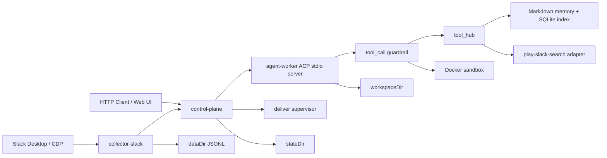

# Adjutant 全体像

## システム構成

Adjutant の現行標準構成は、control-plane を中核に、collector / deliver / agent worker を疎結合に連携させる構成である。

## 主要ディレクトリ責務

- `projectRoot`
  - リポジトリ本体
  - スクリプト、設定、vendor 資材の配置場所
- `stateDir`
  - control-plane / worker の状態保存
  - journal、snapshot、session recovery、thread repository、audit など
- `workspaceDir`
  - assistant の作業領域
  - bootstrap files、memory files、heartbeat prompt、summary batch の対象
- `dataDir`
  - 収集イベントの JSONL 正本

## 代表的な処理フロー

### 1. Slack 収集

- collector が CDP から Slack Desktop イベントを受ける
- 正規化して `NormalizedEvent` 相当の JSON を生成する
- JSONL へ append する
- 必要に応じて control-plane 側の通知判断へつなぐ

### 2. 通知駆動の assistant 実行

- control-plane が通知を受ける
- ルール、attention window、classifier で triage する
- 実行対象なら worker へ run を委譲する
- worker は bootstrap context を加味して agent session を実行する
- tool 実行前には worker 内 guardrail が `allow / review / forbid` を判定する
- `review` の場合だけ control-plane の pending permission と UI に戻す
- tool event と run event は control-plane へ戻され、SSE / audit / UI に反映される

### 3. memory 利用

- `tool_hub` の `memory/search|get|write` を使う
- 正本は `workspaceDir` 配下の Markdown
- SQLite は検索インデックスとして使う
- summary batch や memory write が正本ファイルを更新する

### 4. sandbox 実行

- sandbox 有効時、tool 実行は Docker コンテナ境界へ送られる
- workspace は bind mount される
- home は tmpfs として分離する
- rootfs read-only や capability drop で hardening する

## 現在の主要サブシステム

- 収集
  - Slack collector
  - raw fetch / DOM capture / cache
- 制御
  - control-plane
  - worker supervisor
  - deliver / queue / recovery
- assistant
  - agent runner
  - Pi skills discovery
  - tool_call guardrail
  - bootstrap context
  - compaction
  - heartbeat
- tooling
  - tool hub
  - sandbox
  - memory
  - slack search adapter
- presentation
  - HTTP API
  - SSE
  - co-located Web UI

## 現在の設計上の境界

- control-plane は orchestration と記録の責務を持つ
- worker は agent 実行と tool call の責務を持つ
- guardrail は worker 内で tool 実行前の承認境界を持つ
- tool hub は custom tool を provider / action 契約へ統一する
- sandbox は実行環境の隔離責務を持つ
- memory は正本ファイルと検索インデックスの二層構造を持つ

## 詳細仕様へ進む導線

- [機能一覧](/Users/USER/masahide/git/adjutant/doc/spec/feature-catalog.md)
- [詳細仕様インデックス](/Users/USER/masahide/git/adjutant/doc/spec/detail-index.md)
